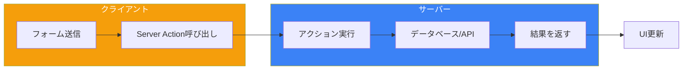

Server Actionsはサーバー上で実行される非同期関数で、フォーム送信とデータ変更を処理するために設計されています。コンポーネントから直接サーバーサイドのコードを呼び出せるため、従来のAPIルートアプローチを簡素化します。

## Server Actionsとは？



| 従来のAPI | Server Actions |
|-----------|----------------|
| APIルートを作成 | `'use server'`で関数を定義 |
| クライアントからfetch | 関数を直接呼び出し |
| CORS/ヘッダーを処理 | 自動処理 |
| 手動エラーハンドリング | Reactと統合 |

## 基本的なServer Action

### インラインアクション

```tsx
// app/page.tsx
export default function Page() {
  async function createUser(formData: FormData) {
    'use server';

    const name = formData.get('name') as string;
    const email = formData.get('email') as string;

    // データベースに挿入
    await db.insert({ name, email });
  }

  return (
    <form action={createUser}>
      <input name="name" placeholder="名前" required />
      <input name="email" type="email" placeholder="メール" required />
      <button type="submit">ユーザー作成</button>
    </form>
  );
}
```

### 別ファイルでのアクション

```tsx
// app/actions.ts
'use server';

import { db } from '@/lib/database';
import { revalidatePath } from 'next/cache';

export async function createUser(formData: FormData) {
  const name = formData.get('name') as string;
  const email = formData.get('email') as string;

  await db.users.create({ name, email });

  // ユーザーページを再検証
  revalidatePath('/users');
}

export async function deleteUser(userId: string) {
  await db.users.delete(userId);
  revalidatePath('/users');
}
```

```tsx
// app/users/page.tsx
import { createUser } from '@/app/actions';

export default function UsersPage() {
  return (
    <form action={createUser}>
      <input name="name" placeholder="名前" required />
      <input name="email" type="email" placeholder="メール" required />
      <button type="submit">ユーザー作成</button>
    </form>
  );
}
```

## 引数の渡し方

### bind()を使用

```tsx
// app/actions.ts
'use server';

export async function updateUser(userId: string, formData: FormData) {
  const name = formData.get('name') as string;
  await db.users.update(userId, { name });
}
```

```tsx
// app/users/[id]/page.tsx
import { updateUser } from '@/app/actions';

export default async function UserPage({
  params,
}: {
  params: Promise<{ id: string }>;
}) {
  const { id } = await params;
  const user = await getUser(id);

  // userIdをアクションにバインド
  const updateUserWithId = updateUser.bind(null, id);

  return (
    <form action={updateUserWithId}>
      <input name="name" defaultValue={user.name} />
      <button type="submit">更新</button>
    </form>
  );
}
```

### 隠しフィールドを使用

```tsx
export default async function UserPage({
  params,
}: {
  params: Promise<{ id: string }>;
}) {
  const { id } = await params;

  async function updateUser(formData: FormData) {
    'use server';
    const userId = formData.get('userId') as string;
    const name = formData.get('name') as string;
    await db.users.update(userId, { name });
  }

  return (
    <form action={updateUser}>
      <input type="hidden" name="userId" value={id} />
      <input name="name" />
      <button type="submit">更新</button>
    </form>
  );
}
```

## useFormStatusでフォーム状態

フォーム送信中のローディング状態を表示：

```tsx
// components/SubmitButton.tsx
'use client';

import { useFormStatus } from 'react-dom';

export function SubmitButton() {
  const { pending } = useFormStatus();

  return (
    <button type="submit" disabled={pending}>
      {pending ? '送信中...' : '送信'}
    </button>
  );
}
```

```tsx
// app/page.tsx
import { createUser } from '@/app/actions';
import { SubmitButton } from '@/components/SubmitButton';

export default function Page() {
  return (
    <form action={createUser}>
      <input name="name" placeholder="名前" required />
      <input name="email" type="email" placeholder="メール" required />
      <SubmitButton />
    </form>
  );
}
```

## useActionStateでアクション状態

アクションの結果とエラーを処理：

```tsx
// app/actions.ts
'use server';

type ActionState = {
  message: string;
  errors?: {
    name?: string[];
    email?: string[];
  };
};

export async function createUser(
  prevState: ActionState,
  formData: FormData
): Promise<ActionState> {
  const name = formData.get('name') as string;
  const email = formData.get('email') as string;

  // バリデーション
  const errors: ActionState['errors'] = {};

  if (!name || name.length < 2) {
    errors.name = ['名前は2文字以上必要です'];
  }

  if (!email || !email.includes('@')) {
    errors.email = ['有効なメールアドレスを入力してください'];
  }

  if (Object.keys(errors).length > 0) {
    return { message: 'バリデーションエラー', errors };
  }

  try {
    await db.users.create({ name, email });
    return { message: 'ユーザーが作成されました' };
  } catch (error) {
    return { message: 'ユーザーの作成に失敗しました' };
  }
}
```

```tsx
// app/page.tsx
'use client';

import { useActionState } from 'react';
import { createUser } from '@/app/actions';
import { SubmitButton } from '@/components/SubmitButton';

const initialState = { message: '', errors: {} };

export default function Page() {
  const [state, formAction] = useActionState(createUser, initialState);

  return (
    <form action={formAction}>
      <div>
        <input name="name" placeholder="名前" />
        {state.errors?.name && (
          <p className="error">{state.errors.name[0]}</p>
        )}
      </div>

      <div>
        <input name="email" type="email" placeholder="メール" />
        {state.errors?.email && (
          <p className="error">{state.errors.email[0]}</p>
        )}
      </div>

      <SubmitButton />

      {state.message && <p>{state.message}</p>}
    </form>
  );
}
```

## useOptimisticで楽観的更新

サーバーレスポンス前にUIを即座に更新：

```tsx
// app/actions.ts
'use server';

import { revalidatePath } from 'next/cache';

export async function addTodo(formData: FormData) {
  const text = formData.get('text') as string;

  // 遅いデータベースをシミュレート
  await new Promise((resolve) => setTimeout(resolve, 1000));

  await db.todos.create({ text, completed: false });
  revalidatePath('/todos');
}
```

```tsx
// app/todos/page.tsx
'use client';

import { useOptimistic } from 'react';
import { addTodo } from '@/app/actions';

type Todo = {
  id: string;
  text: string;
  completed: boolean;
};

export function TodoList({ todos }: { todos: Todo[] }) {
  const [optimisticTodos, addOptimisticTodo] = useOptimistic(
    todos,
    (state, newTodo: Todo) => [...state, newTodo]
  );

  async function handleSubmit(formData: FormData) {
    const text = formData.get('text') as string;

    // 楽観的なTodoを即座に追加
    addOptimisticTodo({
      id: 'temp-' + Date.now(),
      text,
      completed: false,
    });

    // その後サーバーに送信
    await addTodo(formData);
  }

  return (
    <div>
      <form action={handleSubmit}>
        <input name="text" placeholder="新しいTodo" required />
        <button type="submit">追加</button>
      </form>

      <ul>
        {optimisticTodos.map((todo) => (
          <li key={todo.id} style={{ opacity: todo.id.startsWith('temp') ? 0.5 : 1 }}>
            {todo.text}
          </li>
        ))}
      </ul>
    </div>
  );
}
```

## フォーム以外でのアクション

イベントハンドラーからServer Actionsを呼び出す：

```tsx
// app/actions.ts
'use server';

export async function incrementLikes(postId: string) {
  await db.posts.increment(postId, 'likes');
  revalidatePath('/posts');
}
```

```tsx
// components/LikeButton.tsx
'use client';

import { incrementLikes } from '@/app/actions';
import { useTransition } from 'react';

export function LikeButton({ postId }: { postId: string }) {
  const [isPending, startTransition] = useTransition();

  const handleClick = () => {
    startTransition(async () => {
      await incrementLikes(postId);
    });
  };

  return (
    <button onClick={handleClick} disabled={isPending}>
      {isPending ? 'いいね中...' : 'いいね'}
    </button>
  );
}
```

## エラーハンドリング

### Try-Catchパターン

```tsx
// app/actions.ts
'use server';

export async function createPost(formData: FormData) {
  try {
    const title = formData.get('title') as string;
    const content = formData.get('content') as string;

    await db.posts.create({ title, content });

    return { success: true, message: '投稿が作成されました' };
  } catch (error) {
    return { success: false, message: '投稿の作成に失敗しました' };
  }
}
```

### Zodバリデーション

```tsx
// app/actions.ts
'use server';

import { z } from 'zod';

const schema = z.object({
  name: z.string().min(2, '名前は2文字以上必要です'),
  email: z.string().email('無効なメールアドレスです'),
  age: z.coerce.number().min(18, '18歳以上である必要があります'),
});

export async function createUser(prevState: any, formData: FormData) {
  const validatedFields = schema.safeParse({
    name: formData.get('name'),
    email: formData.get('email'),
    age: formData.get('age'),
  });

  if (!validatedFields.success) {
    return {
      errors: validatedFields.error.flatten().fieldErrors,
      message: 'バリデーションエラー',
    };
  }

  const { name, email, age } = validatedFields.data;

  try {
    await db.users.create({ name, email, age });
    return { message: 'ユーザーが作成されました' };
  } catch (error) {
    return { message: 'データベースエラー' };
  }
}
```

## 再検証

### revalidatePath

```tsx
'use server';

import { revalidatePath } from 'next/cache';

export async function createPost(formData: FormData) {
  await db.posts.create({ /* ... */ });

  // 特定のパスを再検証
  revalidatePath('/posts');

  // レイアウトと共に再検証
  revalidatePath('/posts', 'layout');

  // 動的ルートを再検証
  revalidatePath('/posts/[slug]', 'page');
}
```

### revalidateTag

```tsx
'use server';

import { revalidateTag } from 'next/cache';

export async function updateProduct(formData: FormData) {
  await db.products.update({ /* ... */ });

  // このタグを持つすべてのリクエストを再検証
  revalidateTag('products');
}
```

## アクション後のリダイレクト

```tsx
'use server';

import { redirect } from 'next/navigation';

export async function createPost(formData: FormData) {
  const post = await db.posts.create({
    title: formData.get('title') as string,
    content: formData.get('content') as string,
  });

  // 新しい投稿にリダイレクト
  redirect(`/posts/${post.id}`);
}
```

## 完全な例：CRUD操作

```tsx
// app/actions.ts
'use server';

import { revalidatePath } from 'next/cache';
import { redirect } from 'next/navigation';
import { z } from 'zod';

const todoSchema = z.object({
  text: z.string().min(1, 'テキストは必須です'),
});

export async function createTodo(prevState: any, formData: FormData) {
  const validated = todoSchema.safeParse({
    text: formData.get('text'),
  });

  if (!validated.success) {
    return { error: validated.error.flatten().fieldErrors.text?.[0] };
  }

  await db.todos.create({ text: validated.data.text, completed: false });
  revalidatePath('/todos');
  return { success: true };
}

export async function toggleTodo(id: string) {
  const todo = await db.todos.find(id);
  await db.todos.update(id, { completed: !todo.completed });
  revalidatePath('/todos');
}

export async function deleteTodo(id: string) {
  await db.todos.delete(id);
  revalidatePath('/todos');
}
```

```tsx
// app/todos/page.tsx
import { createTodo, toggleTodo, deleteTodo } from '@/app/actions';
import { TodoForm } from '@/components/TodoForm';

export default async function TodosPage() {
  const todos = await db.todos.findAll();

  return (
    <div>
      <h1>Todoリスト</h1>
      <TodoForm action={createTodo} />

      <ul>
        {todos.map((todo) => (
          <li key={todo.id}>
            <form action={toggleTodo.bind(null, todo.id)}>
              <button type="submit">
                {todo.completed ? '✓' : '○'}
              </button>
            </form>
            <span>{todo.text}</span>
            <form action={deleteTodo.bind(null, todo.id)}>
              <button type="submit">削除</button>
            </form>
          </li>
        ))}
      </ul>
    </div>
  );
}
```

## まとめ

| 機能 | 使い方 |
|------|--------|
| `'use server'` | 関数をServer Actionとしてマーク |
| `action={fn}` | フォームのaction属性 |
| `useFormStatus` | フォーム内でpending状態を取得 |
| `useActionState` | アクション状態とエラーを処理 |
| `useOptimistic` | 楽観的UI更新 |
| `revalidatePath` | キャッシュデータを再検証 |
| `redirect` | アクション後にリダイレクト |

重要なポイント：

- Server Actionsはサーバー上で実行され、コンポーネントから直接呼び出せる
- Server Actionsを定義するには`'use server'`ディレクティブを使用
- `useFormStatus`は送信中のローディング状態を提供
- `useActionState`はフォーム状態とバリデーションエラーを管理
- `useOptimistic`はサーバーレスポンス前の即時UI更新を可能に
- キャッシュデータを更新するには`revalidatePath`または`revalidateTag`を使用
- Server Actionsは完了後にユーザーをリダイレクトできる
- 堅牢なバリデーションにはZodと組み合わせる

Server Actionsは別個のAPIルートを不要にすることで、データ変更を簡素化します。

## 参考文献

- [Next.js Server Actions](https://nextjs.org/docs/app/building-your-application/data-fetching/server-actions-and-mutations)
- [React useActionState](https://react.dev/reference/react/useActionState)
- Schwarzmüller, Maximilian. *React Key Concepts - Second Edition*. Packt, 2025.
