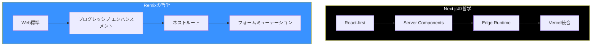

Next.jsとRemixはフルスタックアプリケーション構築のための2つの主要なReactフレームワークです。それぞれの違いを理解することで、プロジェクトに適したツールを選択できます。

## フレームワークの哲学



| 側面 | Next.js | Remix |
|------|---------|-------|
| 哲学 | Reactのイノベーション | Web標準 |
| データフェッチ | Server Components | Loaders |
| ミューテーション | Server Actions | Actions |
| フォーム | プログレッシブ エンハンスメントはオプション | プログレッシブ エンハンスメントがコア |
| デプロイ | Vercel最適化 | プラットフォーム非依存 |

## ルーティング比較

### Next.js App Router

```
app/
├── page.tsx                    # /
├── about/
│   └── page.tsx                # /about
├── blog/
│   ├── page.tsx                # /blog
│   └── [slug]/
│       └── page.tsx            # /blog/:slug
└── (marketing)/
    └── pricing/
        └── page.tsx            # /pricing
```

```tsx
// app/blog/[slug]/page.tsx
export default async function BlogPost({
  params,
}: {
  params: Promise<{ slug: string }>;
}) {
  const { slug } = await params;
  const post = await getPost(slug);

  return <article>{post.content}</article>;
}
```

### Remixルート

```
app/
├── routes/
│   ├── _index.tsx              # /
│   ├── about.tsx               # /about
│   ├── blog._index.tsx         # /blog
│   ├── blog.$slug.tsx          # /blog/:slug
│   └── _marketing.pricing.tsx  # /pricing（レイアウト付き）
└── root.tsx
```

```tsx
// app/routes/blog.$slug.tsx
import { useLoaderData } from '@remix-run/react';
import type { LoaderFunctionArgs } from '@remix-run/node';

export async function loader({ params }: LoaderFunctionArgs) {
  const post = await getPost(params.slug);
  return { post };
}

export default function BlogPost() {
  const { post } = useLoaderData<typeof loader>();

  return <article>{post.content}</article>;
}
```

## データフェッチ

### Next.js: Server Components

```tsx
// app/users/page.tsx
// コンポーネントで直接データフェッチ
export default async function UsersPage() {
  const users = await fetch('https://api.example.com/users').then((r) =>
    r.json()
  );

  return (
    <ul>
      {users.map((user) => (
        <li key={user.id}>{user.name}</li>
      ))}
    </ul>
  );
}
```

### Remix: Loaders

```tsx
// app/routes/users.tsx
import { json } from '@remix-run/node';
import { useLoaderData } from '@remix-run/react';

export async function loader() {
  const users = await fetch('https://api.example.com/users').then((r) =>
    r.json()
  );
  return json({ users });
}

export default function UsersPage() {
  const { users } = useLoaderData<typeof loader>();

  return (
    <ul>
      {users.map((user) => (
        <li key={user.id}>{user.name}</li>
      ))}
    </ul>
  );
}
```

### 主な違い

| 側面 | Next.js | Remix |
|------|---------|-------|
| 場所 | コンポーネント内 | 別のloader関数 |
| 戻り値の型 | コンポーネントのprops | シリアライズされたJSON |
| キャッシュ | 組み込みfetchキャッシュ | 手動ヘッダー |
| 並列 | コンポーネントでPromise.all | ネストルートで自動 |

## フォーム処理

### Next.js: Server Actions

```tsx
// app/actions.ts
'use server';

export async function createUser(formData: FormData) {
  const name = formData.get('name') as string;
  await db.users.create({ name });
  revalidatePath('/users');
}

// app/users/page.tsx
import { createUser } from './actions';

export default function UsersPage() {
  return (
    <form action={createUser}>
      <input name="name" required />
      <button type="submit">作成</button>
    </form>
  );
}
```

### Remix: Actions

```tsx
// app/routes/users.tsx
import { Form, useActionData } from '@remix-run/react';
import type { ActionFunctionArgs } from '@remix-run/node';
import { redirect } from '@remix-run/node';

export async function action({ request }: ActionFunctionArgs) {
  const formData = await request.formData();
  const name = formData.get('name') as string;

  await db.users.create({ name });

  return redirect('/users');
}

export default function UsersPage() {
  return (
    <Form method="post">
      <input name="name" required />
      <button type="submit">作成</button>
    </Form>
  );
}
```

### プログレッシブエンハンスメント

```tsx
// Remix: JavaScriptなしでも動作
<Form method="post">
  <input name="name" />
  <button>送信</button>
</Form>

// Next.js: 完全な機能にはクライアントサイドの強化が必要
'use client';

import { useActionState } from 'react';
import { createUser } from './actions';

export function CreateUserForm() {
  const [state, formAction] = useActionState(createUser, null);

  return (
    <form action={formAction}>
      <input name="name" />
      <button>送信</button>
      {state?.error && <p>{state.error}</p>}
    </form>
  );
}
```

## エラーハンドリング

### Next.js

```tsx
// app/users/error.tsx
'use client';

export default function Error({
  error,
  reset,
}: {
  error: Error;
  reset: () => void;
}) {
  return (
    <div>
      <h2>ユーザーの読み込みエラー</h2>
      <button onClick={reset}>もう一度試す</button>
    </div>
  );
}
```

### Remix

```tsx
// app/routes/users.tsx
import { useRouteError, isRouteErrorResponse } from '@remix-run/react';

export function ErrorBoundary() {
  const error = useRouteError();

  if (isRouteErrorResponse(error)) {
    return (
      <div>
        <h2>{error.status} {error.statusText}</h2>
      </div>
    );
  }

  return (
    <div>
      <h2>ユーザーの読み込みエラー</h2>
    </div>
  );
}
```

## ネストレイアウト

### Next.js

```tsx
// app/dashboard/layout.tsx
export default function DashboardLayout({
  children,
}: {
  children: React.ReactNode;
}) {
  return (
    <div className="dashboard">
      <Sidebar />
      <main>{children}</main>
    </div>
  );
}

// app/dashboard/page.tsx
export default function DashboardPage() {
  return <h1>ダッシュボード</h1>;
}

// app/dashboard/settings/page.tsx
export default function SettingsPage() {
  return <h1>設定</h1>;
}
```

### Remix

```tsx
// app/routes/dashboard.tsx - 親レイアウト
import { Outlet } from '@remix-run/react';

export default function DashboardLayout() {
  return (
    <div className="dashboard">
      <Sidebar />
      <main>
        <Outlet />
      </main>
    </div>
  );
}

// app/routes/dashboard._index.tsx
export default function DashboardPage() {
  return <h1>ダッシュボード</h1>;
}

// app/routes/dashboard.settings.tsx
export default function SettingsPage() {
  return <h1>設定</h1>;
}
```

## ローディング状態

### Next.js

```tsx
// app/dashboard/loading.tsx
export default function Loading() {
  return <Skeleton />;
}

// またはSuspenseで
import { Suspense } from 'react';

export default function Page() {
  return (
    <Suspense fallback={<Skeleton />}>
      <SlowComponent />
    </Suspense>
  );
}
```

### Remix

```tsx
// app/routes/dashboard.tsx
import { useNavigation } from '@remix-run/react';

export default function Dashboard() {
  const navigation = useNavigation();
  const isLoading = navigation.state === 'loading';

  return (
    <div>
      {isLoading && <LoadingSpinner />}
      <Outlet />
    </div>
  );
}
```

## メタタグ / SEO

### Next.js

```tsx
// app/blog/[slug]/page.tsx
import { Metadata } from 'next';

export async function generateMetadata({
  params,
}: {
  params: Promise<{ slug: string }>;
}): Promise<Metadata> {
  const { slug } = await params;
  const post = await getPost(slug);

  return {
    title: post.title,
    description: post.excerpt,
    openGraph: {
      title: post.title,
      images: [post.image],
    },
  };
}
```

### Remix

```tsx
// app/routes/blog.$slug.tsx
import type { MetaFunction } from '@remix-run/node';

export const meta: MetaFunction<typeof loader> = ({ data }) => {
  return [
    { title: data.post.title },
    { name: 'description', content: data.post.excerpt },
    { property: 'og:title', content: data.post.title },
    { property: 'og:image', content: data.post.image },
  ];
};
```

## Next.jsを選ぶべき時

Next.jsが理想的なのは：

- **Vercelデプロイ**: Vercelプラットフォームとの最適な統合
- **React Server Components**: 最先端のReact機能が欲しい
- **画像最適化**: 組み込みの画像処理が必要
- **段階的な導入**: 既存のReactアプリからの移行
- **大規模なエコシステム**: 豊富なプラグインエコシステムが必要
- **静的生成**: 静的サイト要件が重要

```tsx
// Next.jsの強み
import Image from 'next/image';

export default function Gallery() {
  return (
    <div>
      {/* 自動画像最適化 */}
      <Image
        src="/photo.jpg"
        width={800}
        height={600}
        alt="写真"
        placeholder="blur"
      />
    </div>
  );
}
```

## Remixを選ぶべき時

Remixが理想的なのは：

- **プログレッシブエンハンスメント**: フォームはJSなしでも動作する必要がある
- **Web標準**: 標準API（fetch、FormData）を好む
- **プラットフォームの柔軟性**: どこにでもデプロイ（Vercelだけでなく）
- **ネストルーティング**: データを持つ複雑なネストレイアウト
- **エラーハンドリング**: きめ細かなエラー境界
- **楽観的UI**: 組み込みの楽観的更新パターン

```tsx
// Remixの強み: プログレッシブエンハンスメント
import { useFetcher } from '@remix-run/react';

export function LikeButton({ postId }: { postId: string }) {
  const fetcher = useFetcher();
  const isLiking = fetcher.state !== 'idle';

  return (
    <fetcher.Form method="post" action="/like">
      <input type="hidden" name="postId" value={postId} />
      <button disabled={isLiking}>
        {isLiking ? 'いいね中...' : 'いいね'}
      </button>
    </fetcher.Form>
  );
}
```

## 機能比較

| 機能 | Next.js | Remix |
|------|---------|-------|
| Server Components | ✅ ネイティブ | ❌ まだ |
| ストリーミングSSR | ✅ 組み込み | ✅ 組み込み |
| 静的生成 | ✅ 強力 | ⚠️ 限定的 |
| 画像最適化 | ✅ 組み込み | ❌ 外部 |
| Edge Runtime | ✅ ネイティブ | ✅ サポート |
| プログレッシブエンハンスメント | ⚠️ オプション | ✅ コア |
| ネストルートデータ | ✅ パラレルルート | ✅ 自動 |
| プラットフォームロックイン | ⚠️ Vercel最適化 | ✅ 非依存 |

## 移行の考慮事項

### Next.jsからRemixへ

```tsx
// Next.js
export default async function Page() {
  const data = await getData();
  return <div>{data}</div>;
}

// Remix相当
export async function loader() {
  const data = await getData();
  return json({ data });
}

export default function Page() {
  const { data } = useLoaderData<typeof loader>();
  return <div>{data}</div>;
}
```

### RemixからNext.jsへ

```tsx
// Remix
export async function loader() {
  return json({ users: await getUsers() });
}

export default function Users() {
  const { users } = useLoaderData<typeof loader>();
  return <ul>{users.map(u => <li key={u.id}>{u.name}</li>)}</ul>;
}

// Next.js相当
export default async function Users() {
  const users = await getUsers();
  return <ul>{users.map(u => <li key={u.id}>{u.name}</li>)}</ul>;
}
```

## まとめ

| 側面 | Next.js | Remix |
|------|---------|-------|
| 最適な用途 | Vercel、RSC、静的サイト | Web標準、フォーム |
| データフェッチ | コンポーネント内async | Loader関数 |
| ミューテーション | Server Actions | Action関数 |
| 哲学 | Reactのイノベーション | プログレッシブエンハンスメント |
| デプロイ | Vercel最適化 | プラットフォーム非依存 |
| 学習曲線 | 中程度 | 中程度 |

重要なポイント：

- Next.jsはReact Server ComponentsとVercel統合でリード
- Remixはweb標準とプログレッシブエンハンスメントを優先
- 両方がストリーミングSSRとネストレイアウトをサポート
- Next.jsはより良い静的生成と画像最適化を持つ
- Remixはより強力なプログレッシブエンハンスメントとフォーム処理
- Vercelデプロイと最先端のReactにはNext.jsを選択
- プラットフォームの柔軟性とWeb標準重視にはRemixを選択
- 両方とも本番Reactアプリケーションの優れた選択肢

最良の選択はチームの優先事項、デプロイのニーズ、好みの開発パターンによります。

## 参考文献

- [Next.js Documentation](https://nextjs.org/docs)
- [Remix Documentation](https://remix.run/docs)
- Kumar, Tejas. *Fluent React*. O'Reilly, 2024.
- Barklund, Morten. *React in Depth*. Manning, 2024.
