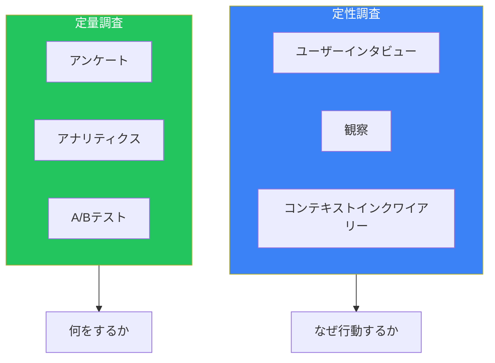
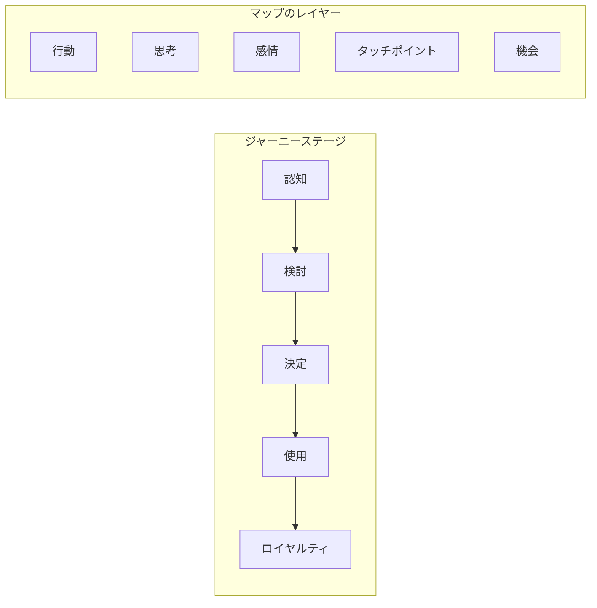
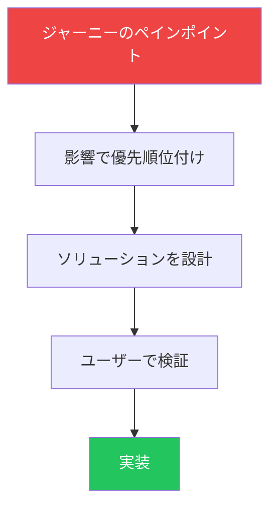

## はじめに

デザイン思考は、他の人の問題を解決することです。これを効果的に行うには、誰のためにデザインしているのか、彼らの体験がどのようなものか、どのような問題を解決したいのかを理解する必要があります。

ペルソナとユーザージャーニーマップは、チームが共感を構築し、ユーザー中心の設計決定を下すのに役立つ基本的なツールです。この記事では、これらのツールを効果的に作成し使用する方法を解説します。

## リサーチを通じてユーザーを理解する

ペルソナやジャーニーマップを作成する前に、リサーチを通じてユーザーを理解する必要があります。

### リサーチの種類



### ユーザーインタビュー

ペルソナを作成するための最も価値あるリサーチは、ユーザーとの直接の会話から得られます。

**インタビュー準備：**

```markdown
## インタビューガイドテンプレート

### 導入（5分）
- お時間をいただいたことへの感謝
- 目的の説明（学習であり、販売ではない）
- 録音の許可を求める

### 背景（10分）
- あなたの役割/日常業務について教えてください
- これをどのくらいやっていますか？
- 現在どのようなツールを使っていますか？

### 体験の深掘り（20分）
- 最後に[関連タスク]をした時のことを教えてください
- 一番大変だったことは何ですか？
- 何があれば楽になりましたか？
- 現在どのようにやっているか見せてください

### ペインポイント（10分）
- [現在のソリューション]で最もイライラすることは？
- 魔法の杖があったら何を変えますか？
- うまくいかなかったことで試したことは？

### まとめ（5分）
- 他に知っておくべきことはありますか？
- 追加の質問があればフォローアップしてもいいですか？
```

**インタビューの主要原則：**
- オープンエンドの質問をする（どのように、何を、なぜ）
- 話すより聞く（80/20ルール）
- 興味深いスレッドを追う
- 仮定ではなく具体的な例を求める

### アフィニティマッピング

インタビュー後、発見をテーマに整理します。

```tsx
function AffinityMap({ notes }) {
  const [groups, setGroups] = useState({});

  // 関連するノートをグループ化
  const addToGroup = (noteId: string, groupName: string) => {
    setGroups(prev => ({
      ...prev,
      [groupName]: [...(prev[groupName] || []), noteId]
    }));
  };

  return (
    <div className="flex gap-4">
      {/* 未グループのノート */}
      <div className="w-64 bg-gray-100 p-4 rounded">
        <h3 className="font-semibold mb-3">未グループのノート</h3>
        {notes.filter(n => !isGrouped(n.id)).map(note => (
          <Note key={note.id} note={note} draggable />
        ))}
      </div>

      {/* テーマグループ */}
      {Object.entries(groups).map(([groupName, noteIds]) => (
        <div key={groupName} className="w-64 bg-blue-50 p-4 rounded">
          <h3 className="font-semibold mb-3">{groupName}</h3>
          {noteIds.map(id => (
            <Note key={id} note={notes.find(n => n.id === id)} />
          ))}
        </div>
      ))}
    </div>
  );
}
```

## ペルソナの作成

ペルソナは、主要なユーザータイプを代表する架空のキャラクターです。チームが「[ペルソナ]ならこれについてどう思うだろう？」と問うことで意思決定を助けます。

### ペルソナの構成要素

```tsx
interface Persona {
  // アイデンティティ
  name: string;
  photo: string;
  quote: string;  // 本質を捉える

  // デモグラフィック
  age: number;
  occupation: string;
  location: string;

  // コンテキスト
  goals: string[];
  frustrations: string[];
  motivations: string[];

  // 行動
  techSavviness: 'low' | 'medium' | 'high';
  preferredChannels: string[];
  typicalDay: string;
}
```

### ペルソナテンプレート

```markdown
## [名前] - [役割/アーキタイプ]

![写真プレースホルダー]

> "[彼らの視点を捉える代表的な引用]"

### 背景
- **年齢:** 34歳
- **職業:** マーケティングマネージャー
- **居住地:** 都市部、リモートワーク
- **家族:** 既婚、子供2人

### ゴール
1. 少ない時間でより多くのことを達成する
2. 経営陣に有能に見られる
3. 手動のレポート作業を減らす

### フラストレーション
1. 連携しないツールが多すぎる
2. シンプルなはずのタスクに何時間も費やす
3. メールに埋もれた重要な更新を見逃す

### モチベーション
- キャリアアップ
- ワークライフバランス
- 良い仕事への評価

### 1日の生活
6:00 - 起床、緊急メッセージの確認
8:00 - ダッシュボードを確認、タスクの優先順位付け
10:00 - 連続ミーティング
12:00 - デスクでメールに追いつきながら昼食
15:00 - ようやく集中作業の時間
17:30 - 仕事終了、翌日のメモを作成
19:00 - 子供の活動、家族の夕食

### テクノロジープロファイル
- **デバイス:** MacBook、iPhone、iPad
- **アプリ:** Slack、Google Suite、Asana、Figma
- **快適さレベル:** 高い - 新しいツールのアーリーアダプター
```

### 良いペルソナ vs 悪いペルソナ

| 良いペルソナ | 悪いペルソナ |
|------------|------------|
| リサーチデータに基づく | 仮定に基づく |
| 具体的で印象的 | 一般的で忘れやすい |
| ゴールとフラストレーションを含む | デモグラフィックのみ |
| 設計決定に使える | マーケティングセグメントだけ |
| 限られた数（3〜5） | 覚えられないほど多い |

### 設計におけるペルソナの使用

```tsx
function DesignDecision({ options, personas }) {
  return (
    <div>
      <h2>設計決定: {options.question}</h2>

      <table className="w-full mt-4">
        <thead>
          <tr>
            <th>オプション</th>
            {personas.map(p => (
              <th key={p.name}>{p.name}</th>
            ))}
          </tr>
        </thead>
        <tbody>
          {options.choices.map(choice => (
            <tr key={choice.id}>
              <td>{choice.description}</td>
              {personas.map(persona => (
                <td key={persona.name}>
                  {/* 各ペルソナがどう反応するか評価 */}
                  <PersonaReaction
                    persona={persona}
                    choice={choice}
                  />
                </td>
              ))}
            </tr>
          ))}
        </tbody>
      </table>
    </div>
  );
}
```

## ユーザージャーニーマッピング

ユーザージャーニーマップは、ユーザーがプロダクトで目標を達成しようとする際の体験を可視化します。

### ジャーニーマップの構造



### ジャーニーマップの作成

```tsx
interface JourneyStage {
  name: string;
  userActions: string[];
  thoughts: string[];
  emotions: 'positive' | 'neutral' | 'negative';
  touchpoints: string[];
  painPoints: string[];
  opportunities: string[];
}

function JourneyMap({ persona, stages }: {
  persona: Persona;
  stages: JourneyStage[];
}) {
  return (
    <div className="overflow-x-auto">
      <div className="min-w-max">
        {/* ヘッダー */}
        <div className="flex border-b pb-4 mb-4">
          <div className="w-32">
            
            <h3 className="font-semibold mt-2">{persona.name}</h3>
          </div>
          <div className="flex-1">
            <h2 className="text-xl font-bold">ジャーニー: {persona.goal}</h2>
          </div>
        </div>

        {/* ステージカラム */}
        <div className="flex">
          {stages.map((stage, index) => (
            <div key={stage.name} className="flex-1 min-w-48 px-4">
              {/* ステージヘッダー */}
              <h3 className="font-semibold text-center py-2 bg-gray-100 rounded">
                {stage.name}
              </h3>

              {/* 行動 */}
              <div className="mt-4">
                <h4 className="text-sm font-medium text-gray-500">行動</h4>
                <ul className="mt-2 space-y-1">
                  {stage.userActions.map((action, i) => (
                    <li key={i} className="text-sm">{action}</li>
                  ))}
                </ul>
              </div>

              {/* 思考 */}
              <div className="mt-4">
                <h4 className="text-sm font-medium text-gray-500">思考</h4>
                <div className="mt-2 p-2 bg-blue-50 rounded text-sm italic">
                  「{stage.thoughts[0]}」
                </div>
              </div>

              {/* 感情インジケーター */}
              <div className="mt-4">
                <h4 className="text-sm font-medium text-gray-500">感情</h4>
                <EmotionIndicator emotion={stage.emotions} />
              </div>

              {/* ペインポイント */}
              <div className="mt-4">
                <h4 className="text-sm font-medium text-gray-500">ペインポイント</h4>
                <ul className="mt-2 space-y-1">
                  {stage.painPoints.map((pain, i) => (
                    <li key={i} className="text-sm text-red-600">• {pain}</li>
                  ))}
                </ul>
              </div>

              {/* 機会 */}
              <div className="mt-4">
                <h4 className="text-sm font-medium text-gray-500">機会</h4>
                <ul className="mt-2 space-y-1">
                  {stage.opportunities.map((opp, i) => (
                    <li key={i} className="text-sm text-green-600">• {opp}</li>
                  ))}
                </ul>
              </div>
            </div>
          ))}
        </div>

        {/* 感情曲線 */}
        <EmotionCurve stages={stages} />
      </div>
    </div>
  );
}

function EmotionIndicator({ emotion }) {
  const config = {
    positive: { icon: '😊', color: 'text-green-500', label: '嬉しい' },
    neutral: { icon: '😐', color: 'text-gray-500', label: '普通' },
    negative: { icon: '😤', color: 'text-red-500', label: 'イライラ' },
  };

  const { icon, color, label } = config[emotion];

  return (
    <div className={`flex items-center gap-2 ${color}`}>
      <span className="text-2xl">{icon}</span>
      <span className="text-sm">{label}</span>
    </div>
  );
}
```

### ジャーニーマップの例

```markdown
## ジャーニー: SaaSツールへの初回サインアップ

### ペルソナ: 佐藤さん、マーケティングマネージャー

### ステージ1: 認知
**行動:** LinkedInで広告を見る、クリックして詳しく見る
**思考:** 「これでレポートの問題が解決するかも」
**感情:** 😐 興味があるが懐疑的
**タッチポイント:** LinkedIn広告、ランディングページ
**ペインポイント:** 広告の約束が良すぎる
**機会:** 明確で誠実なメッセージング

### ステージ2: 評価
**行動:** デモ動画を見る、価格を読む
**思考:** 「良さそうだけど価格に見合う？」
**感情:** 😊 興味あり
**タッチポイント:** デモ動画、価格ページ、レビュー
**ペインポイント:** 価格がわかりにくい
**機会:** より明確な価格階層

### ステージ3: サインアップ
**行動:** アカウント作成、支払い情報入力
**思考:** 「これ時間かからないといいな」
**感情:** 😤 不安
**タッチポイント:** サインアップフォーム、支払いフロー
**ペインポイント:** 必須項目が多すぎる
**機会:** サインアップを簡素化、トライアルを提供

### ステージ4: オンボーディング
**行動:** セットアップウィザードを進める
**思考:** 「どこから始めればいいの？」
**感情:** 😤 圧倒される
**タッチポイント:** ウェルカムメール、セットアップウィザード
**ペインポイント:** オプションが多すぎる、明確な道筋がない
**機会:** ガイド付きの初回体験

### ステージ5: 最初の成功
**行動:** 最初のレポートを作成、チームと共有
**思考:** 「本当にうまくいった！」
**感情:** 😊 達成感
**タッチポイント:** ダッシュボード、エクスポート機能
**ペインポイント:** このステージでは特になし
**機会:** 成功を祝う、次のステップを提案
```

## インサイトから設計へ

### 機会の特定



### 問題ステートメント

ジャーニーのインサイトを実行可能な問題ステートメントに変換：

```markdown
## 問題ステートメントテンプレート

[ペルソナ]は[ユーザーニーズ]する方法が必要です
なぜなら[リサーチからのインサイト]だからです。

## 例

佐藤さん（マーケティングマネージャー）は**連携を素早くセットアップする**方法が必要です
なぜなら**時間が限られており、セットアップに10分以上かかると
イライラする**からです。

## 導出された設計原則

「セットアップは技術的な知識なしで5分以内に完了できるべきである。」
```

### 成功の測定

ソリューションが機能しているかどうかをどう判断するか定義：

```tsx
interface SuccessMetrics {
  // 定量
  taskCompletionRate: number;    // 目標: > 90%
  timeOnTask: number;            // 目標: < 5分
  errorRate: number;             // 目標: < 5%

  // 定性
  satisfactionScore: number;     // 目標: > 4/5
  npsScore: number;              // 目標: > 50
}
```

## まとめ

| ツール | 目的 | 主な成果物 |
|-------|-----|----------|
| ユーザーインタビュー | ユーザーコンテキストを理解 | 生のインサイト、引用 |
| アフィニティマッピング | 発見を整理 | テーマ、パターン |
| ペルソナ | ユーザータイプを代表 | 意思決定の参照 |
| ジャーニーマップ | 体験を可視化 | ペインポイント、機会 |
| 問題ステートメント | 設計努力をフォーカス | 実行可能な設計ブリーフ |

これらのツールの目標は成果物そのものではなく、ユーザーへの真の共感を構築し、彼らの真のニーズに応える決定を下すことです。

## 参考文献

- Conta, Anthony. "The Art and Science of UX Design", Chapters 2-3
- Cooper, Alan. "About Face: The Essentials of Interaction Design"
- Nielsen Norman Group - Journey Mapping
- IDEO - Design Thinking
