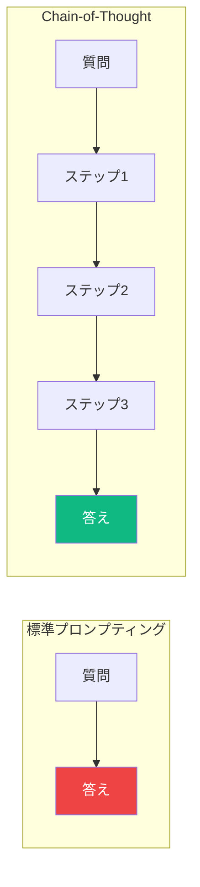
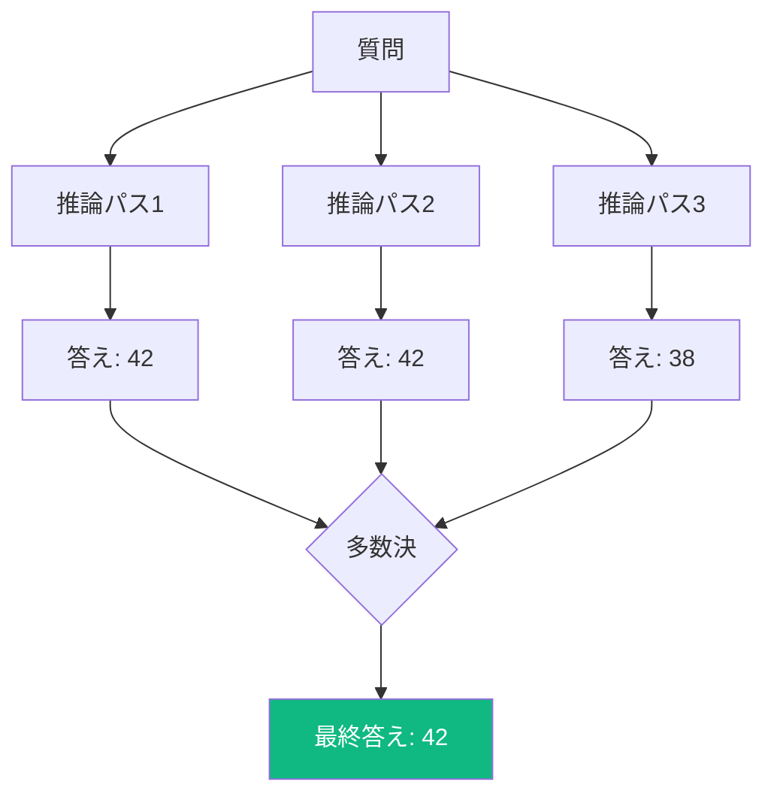
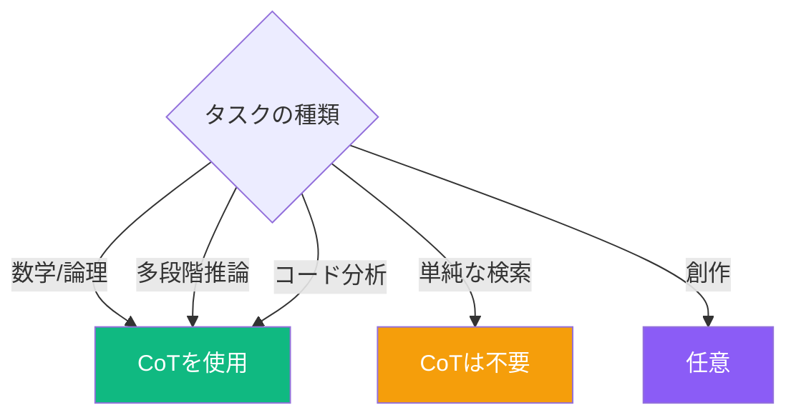

大規模言語モデルは印象的な結果を出せますが、複雑な推論タスクでは苦戦することがあります。Chain-of-Thought（CoT）プロンプティングは、モデルに「声に出して考える」ことを促し、問題をステップバイステップで解くことで推論性能を劇的に向上させる技法です。

## Chain-of-Thoughtプロンプティングとは？

Chain-of-Thoughtプロンプティングは、モデルに答えに直接ジャンプするのではなく、推論プロセスを示すよう求めます。これは人間が複雑な問題を解く方法—小さなステップに分解する—を模倣しています。



### 標準プロンプティング

```
Q: 店には45個のリンゴがあります。17個売り、32個の出荷を受け取りました。
今何個のリンゴがありますか？
A: 60
```

### Chain-of-Thoughtプロンプティング

```
Q: 店には45個のリンゴがあります。17個売り、32個の出荷を受け取りました。
今何個のリンゴがありますか？

ステップバイステップで考えてみましょう：
1. 最初のリンゴ: 45個
2. 17個売った後: 45 - 17 = 28個
3. 32個受け取った後: 28 + 32 = 60個

A: 店には現在60個のリンゴがあります。
```

## なぜ効果があるのか？

Chain-of-Thoughtプロンプティングが機能する理由：

1. **複合エラーを減らす**: 問題を分解することでミスの連鎖を防ぐ
2. **訓練データを活用**: LLMはトレーニング中に多くのステップバイステップの解法を見ている
3. **チェックポイントを提供**: 各ステップを独立して検証できる
4. **複雑さを管理**: 複雑な問題が単純なステップの連続になる

## Chain-of-Thoughtの技法

### 1. Zero-Shot CoT

プロンプトに「ステップバイステップで考えてみましょう」を追加するだけ：

```
Q: 太郎がメアリーの3倍のリンゴを持っていて、メアリーがトムより4個多く、
トムが5個持っている場合、太郎は何個のリンゴを持っていますか？

ステップバイステップで考えてみましょう。
```

出力：
```
ステップバイステップで考えてみましょう。

1. トムは5個のリンゴを持っている（与えられた情報）
2. メアリーはトムより4個多い: 5 + 4 = 9個
3. 太郎はメアリーの3倍: 9 × 3 = 27個

したがって、太郎は27個のリンゴを持っています。
```

### 2. Few-Shot CoT

ステップバイステップの推論を示す例を提供：

```
Q: 電車は時速60キロで2時間走り、その後時速40キロで1時間走りました。
総走行距離は何キロですか？

推論:
- 時速60キロでの距離: 60 × 2 = 120キロ
- 時速40キロでの距離: 40 × 1 = 40キロ
- 総距離: 120 + 40 = 160キロ
答え: 160キロ

Q: 車は時速50キロで3時間走り、その後時速70キロで2時間走りました。
総走行距離は何キロですか？

推論:
```

### 3. Self-Consistency

複数の推論パスを生成し、多数決で答えを決定：



```
この問題を解くための3つの異なるアプローチを生成してください。
各アプローチについて、推論と最終的な答えを示してください。
その後、どの答えが最も正しそうかを判断してください。

問題: [複雑な問題をここに]
```

## 実践的な応用

### コードのデバッグ

```
以下のコードにはバグがあります。どのように実行されるかステップバイステップで
追跡し、問題を特定してください。

```python
def find_average(numbers):
    total = 0
    for i in range(len(numbers)):
        total += numbers[i]
    return total / len(numbers)

result = find_average([])
```

実行を追跡してみましょう：
1. 関数が空のリスト [] で呼び出される
2. total が 0 に初期化される
3. range(len([])) = range(0) なので、ループは実行されない
4. return文: total / len(numbers) = 0 / 0

バグを特定: リストが空の場合にゼロ除算が発生。

解決策: 空の入力に対するチェックを追加。
```

### 複雑な分析

```
このビジネス決定が妥当かどうか分析してください。
影響をステップバイステップで考えてください。

シナリオ: 会社は販売量を増やすために価格を20%下げようとしており、
これにより全体の収益が増加すると期待しています。

ステップバイステップで分析してみましょう：

1. **価格引き下げの影響**: 20%の価格引き下げは、各ユニットが
   以前の収益の80%しかもたらさないことを意味します。

2. **損益分岐点の計算**: 80%の価格で同じ収益を維持するには、
   販売量が増加する必要があります：
   1/0.8 = 1.25、つまり25%の販売量増加が必要。

3. **市場の考慮事項**:
   - 需要は25%以上の販売量増加に十分弾力的か？
   - 競合他社も価格引き下げで対応するか？
   - 生産能力の制約は？

4. **コストへの影響**:
   - 25%多い販売は25%多い変動費を意味
   - 固定費は販売量増加で単価あたり減少

結論: この決定が妥当なのは...
```

### 多段階推論

```
結論が前提から導かれるかどうかを判断してください。
各ステップで推論を示してください。

前提:
1. すべてのプログラマーは少なくとも1つのプログラミング言語を知っている。
2. 一部のプログラマーはデザイナーでもある。
3. デザイナーは誰も金融業界で働いていない。

結論: プログラミング言語を知っている人の中に金融業界で働いていない人がいる。

推論:
ステップ1: 前提2から、プログラマーでありデザイナーでもある人が存在する。

ステップ2: 前提1から、これらのプログラマー兼デザイナーは少なくとも1つの
          プログラミング言語を知っている。

ステップ3: 前提3から、これらのプログラマー兼デザイナーは（デザイナーなので）
          金融業界で働いていない。

ステップ4: したがって、プログラミング言語を知っていて
          （プログラマー兼デザイナー）金融業界で働いていない人が存在する。

結論は妥当です。
```

## Chain-of-Thoughtを使うべき場面



**最適な用途:**
- 数学の文章題
- 論理的推論
- コードのデバッグと分析
- 複雑な意思決定
- 多段階の計画

**あまり有用でない場面:**
- 単純な事実に関する質問
- 構造のない創作タスク
- 答えが明らかなタスク

## 効果的なChain-of-Thoughtのコツ

### 1. フォーマットを明示的に

```
以下のフォーマットでこの問題を解いてください：
- 与えられた情報: [提供された内容をリスト]
- 求めるもの: [何を求める必要があるか]
- ステップ: [番号付きの推論ステップ]
- 答え: [最終的な答え]
```

### 2. 検証を促す

```
解いた後、以下の方法で答えを検証してください：
1. 各計算を確認
2. 答えが妥当かどうかを確認
3. 可能であれば別のアプローチを試す
```

### 3. 不確実性に対処

```
いずれかのステップで不確実な場合：
- 仮定を明確に述べる
- その仮定をした理由を説明
- 異なる仮定が結果をどう変えるか記載
```

## まとめ

| 技法 | 説明 | 最適な用途 |
|------|------|-----------|
| Zero-Shot CoT | 「ステップバイステップで考えましょう」を追加 | 手軽な改善 |
| Few-Shot CoT | 推論の例を提供 | 一貫したフォーマット |
| Self-Consistency | 複数パス + 投票 | 重要な決定 |

Chain-of-Thoughtプロンプティングは、LLMの推論を改善するための最も強力な技法の1つです。ステップバイステップの思考を促すことで、複雑なタスクの精度を劇的に向上させながら、モデルの推論プロセスの透明性も得られます。

## 参考資料

- Wei, Jason, et al. "Chain-of-Thought Prompting Elicits Reasoning in Large Language Models." NeurIPS 2022.
- Phoenix, James and Taylor, Mike. *Prompt Engineering for Generative AI*. O'Reilly Media, 2024.
