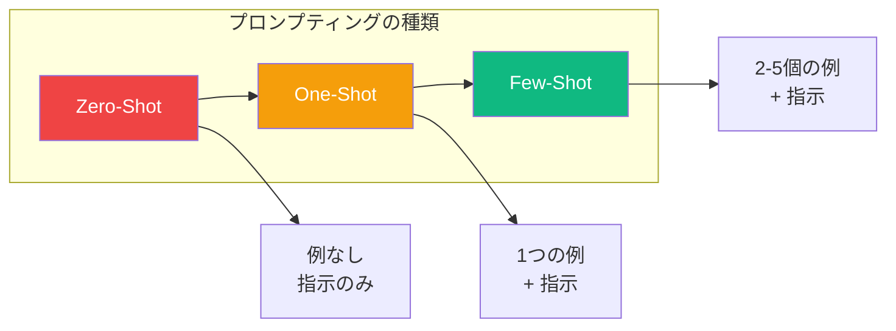
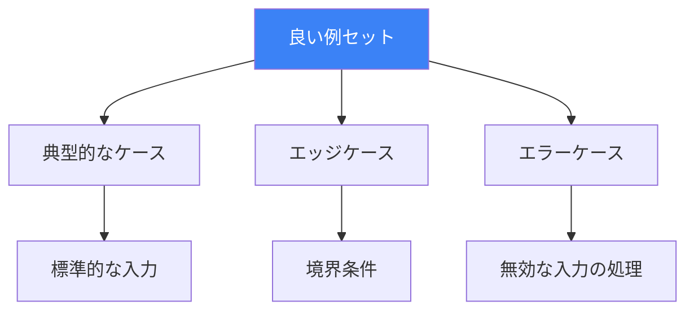
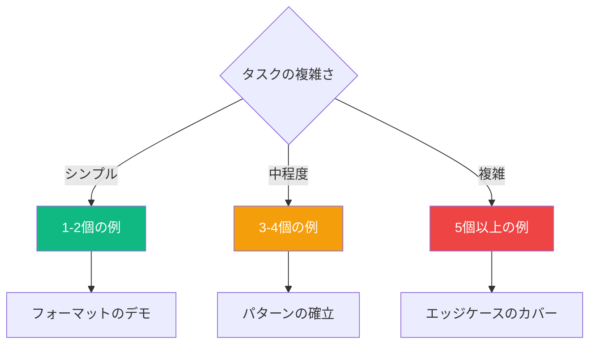

大規模言語モデルを導く最も効果的な方法の1つは、例を通じて示すことです。Few-shot プロンプティングと呼ばれるこの技法は、望ましい動作を説明するだけでなく、実際に示すことができます。この記事では、Zero-shotからFew-shotまでのプロンプティングの範囲を探り、各アプローチをいつ使用すべきかを学びます。

## プロンプティングの種類



## Zero-Shot プロンプティング

Zero-shot プロンプティングは、例を提供せずに指示のみに依存します。最新のLLMはZero-shotタスクで驚くほど優れた能力を発揮します。

```
以下のテキストを「spam」または「not spam」に分類してください：

テキスト: 「おめでとうございます！無料のiPhoneが当選しました。こちらをクリックして受け取ってください。」
分類:
```

**Zero-Shotが有効な場面：**
- シンプルで明確に定義されたタスク
- モデルがトレーニング中に見た一般的なタスク
- フォーマットが明らかな場合

**Zero-Shotが不十分な場面：**
- 曖昧な出力フォーマット
- 主観的またはニュアンスのあるタスク
- ドメイン固有の分類

## One-Shot プロンプティング

One-shot プロンプティングは、期待されるフォーマットと動作を示すために1つの例を提供します。

```
以下の商品説明をJSONオブジェクトに変換してください。

例：
説明: 「青いコットンTシャツ、Mサイズ、2,999円」
JSON: {"color": "青", "material": "コットン", "type": "Tシャツ", "size": "M", "price": 2999}

次を変換してください：
説明: 「赤い革製の財布、ジッパー付き、4,500円」
JSON:
```

1つの例で十分な場合：
- フォーマットのデモンストレーションが必要
- タスクが単純明快
- トークン使用量を最小限に抑えたい

## Few-Shot プロンプティング

Few-shot プロンプティングは、パターンを確立しエッジケースを処理するために複数の例（通常2-5個）を使用します。

### 例：エンティティ抽出

```
以下の文から人物名とその役職を抽出してください。

例1：
文: 「主任研究員の田中博士が調査結果を発表しました。」
出力: {"name": "田中", "role": "主任研究員"}

例2：
文: 「プロジェクトはシニアPMの山田さんが管理しました。」
出力: {"name": "山田", "role": "シニアPM"}

例3：
文: 「CEO の佐藤氏が昨日パートナーシップを発表しました。」
出力: {"name": "佐藤", "role": "CEO"}

次の文から抽出してください：
文: 「テクニカルリードの鈴木さんがアーキテクチャ提案をレビューしました。」
出力:
```

### 例：コード変換

```
PythonコードをJavaScriptに変換してください。

Python:
def greet(name):
    return f"Hello, {name}!"

JavaScript:
function greet(name) {
    return `Hello, ${name}!`;
}

---

Python:
numbers = [1, 2, 3, 4, 5]
doubled = [x * 2 for x in numbers]

JavaScript:
const numbers = [1, 2, 3, 4, 5];
const doubled = numbers.map(x => x * 2);

---

Python:
data = {"name": "Alice", "age": 30}
if "name" in data:
    print(data["name"])

JavaScript:
```

## 効果的な例の設計

### 1. エッジケースをカバー

境界条件を処理する例を含めます：

```
電話番号を (XXX) XXX-XXXX 形式にフォーマットしてください。

例1（標準）：
入力: 0312345678
出力: (03) 1234-5678

例2（ハイフン付き）：
入力: 03-1234-5678
出力: (03) 1234-5678

例3（スペース付き）：
入力: 03 1234 5678
出力: (03) 1234-5678

例4（既にフォーマット済み）：
入力: (03) 1234-5678
出力: (03) 1234-5678

次をフォーマットしてください：
入力: 03.9876.5432
出力:
```

### 2. 多様なシナリオを示す



### 3. 一貫したフォーマットを維持

すべての例は完全に同じ構造に従うべきです：

```
# 良い例：一貫したフォーマット
入力: [データ]
カテゴリ: [結果]

入力: 「この製品大好き！」
カテゴリ: positive

入力: 「最悪の買い物でした。」
カテゴリ: negative

# 悪い例：一貫性のないフォーマット
「この製品大好き！」 -> positive
入力: 「最悪の買い物でした。」
カテゴリ: negative
```

## 高度なFew-Shot技法

### Chain-of-Thought Few-Shot

Few-shotと推論ステップを組み合わせます：

```
数学の問題をステップバイステップで解いてください。

問題: 店には45個のリンゴがあります。午前中に12個売り、
午後に30個の出荷を受け取りました。今何個ありますか？
思考:
1. 45個のリンゴから開始
2. 午前の販売を引く: 45 - 12 = 33
3. 午後の出荷を足す: 33 + 30 = 63
答え: 63個

問題: パン屋は24個のカップケーキを作りました。隣人に8個あげ、
友人が15個持ってきました。何個のカップケーキがありますか？
思考:
1. 24個のカップケーキから開始
2. あげた分を引く: 24 - 8 = 16
3. もらった分を足す: 16 + 15 = 31
答え: 31個

問題: 図書館には156冊の本があります。42冊を寄付し、
助成金で78冊の新しい本を購入しました。今何冊ありますか？
思考:
```

### 動的なFew-Shot選択

本番システムでは、入力に基づいて動的に例を選択します：

```javascript
function selectExamples(input, examplePool, k = 3) {
  // 入力に最も類似した例を見つける
  const similarities = examplePool.map(example => ({
    example,
    similarity: computeSimilarity(input, example.input)
  }));

  // 最も類似度の高いk個の例を返す
  return similarities
    .sort((a, b) => b.similarity - a.similarity)
    .slice(0, k)
    .map(item => item.example);
}
```

## 何個の例が必要か？



| 数 | 最適な用途 |
|----|-----------|
| 1-2 | シンプルなフォーマット変更、明確な変換 |
| 3-4 | パターン認識、一貫したスタイリング |
| 5+ | 複雑な推論、多くのエッジケース |

**注意:** 例が多いほどトークン使用量とコストが増加します。品質目標を達成する最小限の数を見つけましょう。

## よくある落とし穴

### 1. 一貫性のない例

```
# 悪い例：異なるフォーマット
例1: 感情はpositiveです。
例2: negative
例3: 感情: neutral

# 良い例：毎回同じフォーマット
例1: positive
例2: negative
例3: neutral
```

### 2. 偏った例の選択

```
# 悪い例：すべてがpositiveの例
例1: 「素晴らしい製品！」 -> positive
例2: 「大好き！」 -> positive
例3: 「品質が最高！」 -> positive

# 良い例：バランスの取れた例
例1: 「素晴らしい製品！」 -> positive
例2: 「ひどいサービス。」 -> negative
例3: 「まあまあです。」 -> neutral
```

### 3. 複雑すぎる例

例はシンプルに保ち、教えたいパターンに焦点を当てましょう。

## まとめ

| 技法 | 例の数 | 最適なユースケース |
|------|--------|-------------------|
| Zero-Shot | 0 | シンプルで一般的なタスク |
| One-Shot | 1 | フォーマットのデモンストレーション |
| Few-Shot | 2-5 | パターンの確立 |
| Many-Shot | 5+ | 複雑でニュアンスのあるタスク |

Few-shot プロンプティングは、プロンプトエンジニアリングで最も強力な技法の1つです。説明するのではなく示すことで、複雑なタスクやドメイン固有のタスクでも、必要な出力フォーマットとスタイルを正確に生成するようLLMを導くことができます。

## 参考資料

- Phoenix, James and Taylor, Mike. *Prompt Engineering for Generative AI*. O'Reilly Media, 2024.
- Berryman, John and Ziegler, Albert. *Prompt Engineering for LLMs*. O'Reilly Media, 2024.
