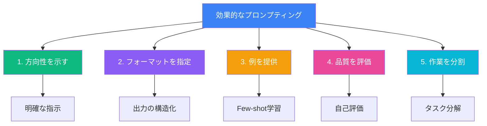
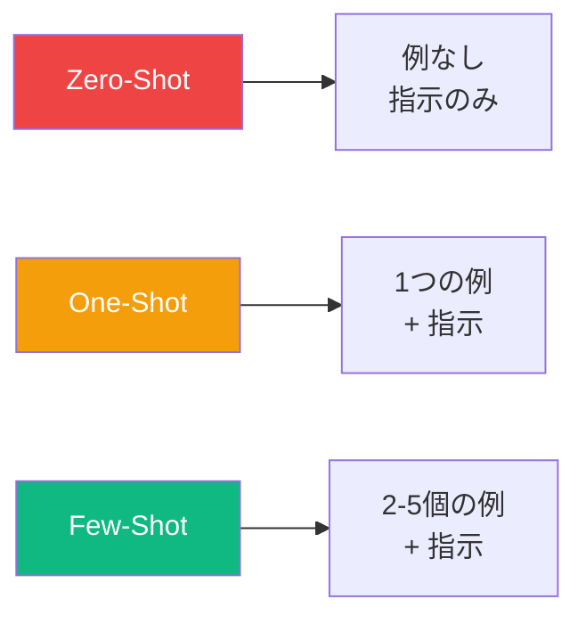
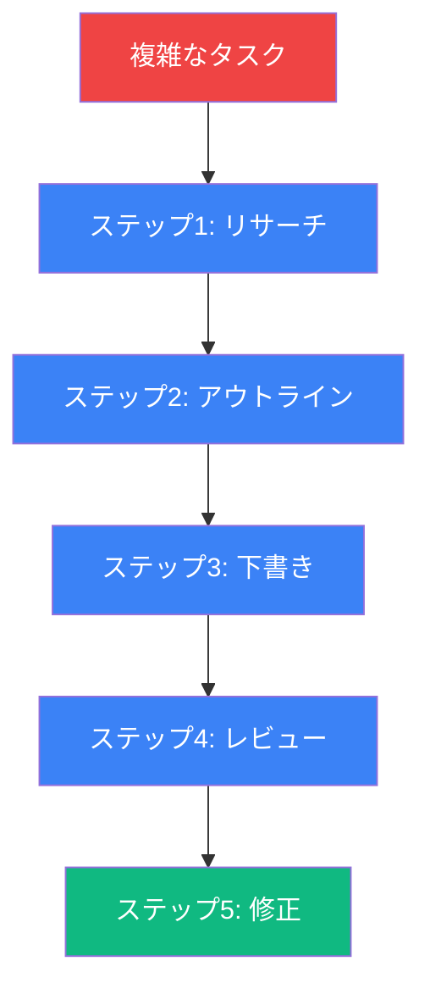

プロンプトエンジニアリングは、大規模言語モデル（LLM）から有用な出力を確実に得るための入力を設計する技術です。GPT-4やClaudeのような最新のAIモデルは単純なプロンプトでも印象的な結果を出せますが、一貫した本番品質の出力が必要な場合は、適切なプロンプト設計への投資が重要になります。

この記事では、効果的なプロンプトエンジニアリングの基礎となる5つの原則を探ります。

## 5つの原則の概要



## 1. 方向性を示す (Give Direction)

最初の原則は、AIに何をしてほしいかについて明確で具体的な指示を提供することです。曖昧なプロンプトは曖昧な結果につながります。

### 悪いプロンプト
```
JavaScriptについて何か書いて。
```

### 良いプロンプト
```
中級開発者向けにJavaScriptのクロージャについて簡潔に説明してください。
クロージャがデータのプライバシーを実現する方法を示す実践的なコード例を
含めてください。技術的だが親しみやすいトーンで書いてください。
```

### 良い方向性の重要な要素

| 要素 | 説明 | 例 |
|------|------|-----|
| タスク | 何をするか | 「説明」「生成」「分析」 |
| 主題 | トピックの焦点 | 「クロージャ」「REST API」 |
| 対象者 | 誰向けか | 「初心者」「シニアエンジニア」 |
| トーン | 文体 | 「技術的」「カジュアル」「フォーマル」 |
| 制約 | 制限事項 | 「200語以内」「専門用語なし」 |

```
あなたはドキュメントを書くシニアソフトウェアエンジニアです。
基本的なプログラミングは理解しているがこの概念は初めてのジュニア開発者に
[トピック]を説明してください。適切な場合はアナロジーを使用してください。
コード例を1つ含めてください。300語以内に収めてください。
```

## 2. フォーマットを指定する (Specify Format)

出力をどのように構造化してほしいかを正確に伝えます。これは特にAI出力をプログラムで使用する場合に重要です。

### 構造化されていない出力
```
人気のJavaScriptフレームワークをいくつか挙げて。
```
出力: 「人気のJavaScriptフレームワークにはReact、Vue、Angularなどがあります...」

### 構造化された出力
```
トップ5のJavaScriptフレームワークを以下のフィールドを持つJSON形式でリストしてください：
- name: フレームワーク名
- type: "library" または "framework"
- useCase: 主なユースケース
- popularity: "high"、"medium"、または "low"
```

出力:
```json
[
  {
    "name": "React",
    "type": "library",
    "useCase": "ユーザーインターフェースの構築",
    "popularity": "high"
  },
  ...
]
```

### 一般的なフォーマット指定

- **JSON/YAML**: プログラムでパースされる構造化データ用
- **Markdown**: ドキュメントやフォーマットされたテキスト用
- **テーブル**: 比較や整理されたデータ用
- **箇条書き**: リストや要点用
- **コードブロック**: 実行可能な例用

## 3. 例を提供する (Provide Examples)

例はAIの動作を導く最も強力な方法の1つです。この技法は「Few-shot プロンプティング」と呼ばれます。



### 例：感情分析

```
以下のレビューの感情を「positive」「negative」「neutral」に分類してください。

例：
レビュー: 「この製品は期待以上でした！」
感情: positive

レビュー: 「ひどい品質で、1日で壊れました。」
感情: negative

レビュー: 「説明通りに動作します。特別なものはありません。」
感情: neutral

次のレビューを分類してください：
レビュー: 「配送は遅かったけど、製品自体は素晴らしいです。」
感情:
```

### 例を使う場面

- タスクのフォーマットが明確でないとき
- 一貫した出力構造が必要なとき
- タスクが主観的な判断を含むとき
- AIの「スタイル」やアプローチを調整したいとき

## 4. 品質を評価する (Evaluate Quality)

プロンプトに自己評価を組み込みます。AIに自身の作業を批評させたり、潜在的な問題を考えさせます。

### 自己批評パターン

```
メールアドレスを検証する関数を生成してください。

コードを生成した後：
1. この関数が見落とす可能性のあるエッジケースをリストアップ
2. コード品質を1-10で評価し、理由を説明
3. 評価が8未満の場合、1つの改善点を提案
```

### 信頼度スコアリング

```
以下の質問に答えてください。回答後、信頼度を1-10で評価し、
不確実な点があれば説明してください。

質問: JavaScriptのArray.sort()の時間計算量は？
```

出力:
```
JavaScriptのArray.sort()は通常Timsortを使用し、以下の計算量になります：
- 最良: O(n)
- 平均: O(n log n)
- 最悪: O(n log n)

信頼度: 7/10
不確実な点: 実際のアルゴリズムはJavaScriptエンジンによって異なる可能性が
あります。V8（Chrome/Node）はTimsortを使用しますが、他のエンジンは
異なるかもしれません。
```

## 5. 作業を分割する (Divide Labor)

複雑なタスクは、より小さく管理しやすいステップに分割すべきです。これによりエラーが減り、出力品質が向上します。



### 例：ブログ記事の生成

以下の代わりに：
```
マイクロサービスについてブログ記事を書いて。
```

マルチステップアプローチを使用：

**ステップ1: アウトラインを生成**
```
マイクロサービスアーキテクチャについての技術ブログ記事のアウトラインを
作成してください。対象読者：モノリスからの移行を検討している開発者。
5-7個の主要セクションを含めてください。
```

**ステップ2: 各セクションを展開**
```
このアウトラインを使用して、「マイクロサービスのメリット」セクションを
書いてください。具体的な例を含め、200語以内に収めてください。
```

**ステップ3: レビューと修正**
```
以下のセクションを技術的正確性と明確さについてレビューしてください。
必要に応じて改善点を提案してください。
```

### タスク分解のメリット

| メリット | 説明 |
|----------|------|
| 品質向上 | 各ステップを個別に最適化できる |
| デバッグが容易 | 問題箇所を特定しやすい |
| 制御性向上 | 個々のステップを必要に応じて調整可能 |
| 一貫した結果 | 出力のばらつきを減らせる |

## すべてをまとめる

5つの原則すべてを使用した包括的なプロンプトの例：

```
# 方向性
あなたは開発者向けのAPIドキュメントを作成する技術ライターです。

# タスク
以下の関数をREST APIリファレンスガイド用にドキュメント化してください。

# フォーマット
以下の構造を使用：
- **説明**: 1文の要約
- **パラメータ**: 名前、型、必須、説明のテーブル
- **戻り値**: 関数が返すもの
- **例**: curlを使用したコード例
- **エラー**: 考えられるエラーレスポンス

# 例
[ドキュメント化された関数の完全な例を含める]

# 品質チェック
生成後、以下を確認：
1. すべてのパラメータがドキュメント化されている
2. 例の構文が正しい
3. エラーケースがカバーされている

# ドキュメント化する関数
[関数の詳細をここに]
```

## まとめ

| 原則 | 重要な質問 | アクション |
|------|-----------|----------|
| 方向性を示す | AIに何をさせるか？ | タスクと制約を具体的に |
| フォーマット指定 | 出力はどう見えるべきか？ | 構造を明示的に定義 |
| 例を提供 | 良いものはどう見えるか？ | 2-5個の例を含める |
| 品質評価 | 出力は十分良いか？ | 自己批評を組み込む |
| 作業を分割 | 分解できるか？ | 複雑なタスクをステップに分割 |

これら5つの原則をマスターすることで、プロンプトエンジニアリングの結果が劇的に向上します。明確な方向性から始め、フォーマット指定を追加し、必要に応じて例を含め、品質チェックを組み込み、複雑なタスクを管理可能な部分に分割しましょう。

## 参考資料

- Phoenix, James and Taylor, Mike. *Prompt Engineering for Generative AI*. O'Reilly Media, 2024.
- [OpenAI プロンプトエンジニアリングガイド](https://platform.openai.com/docs/guides/prompt-engineering)
