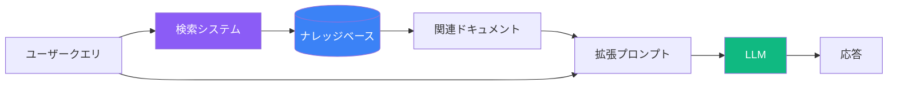
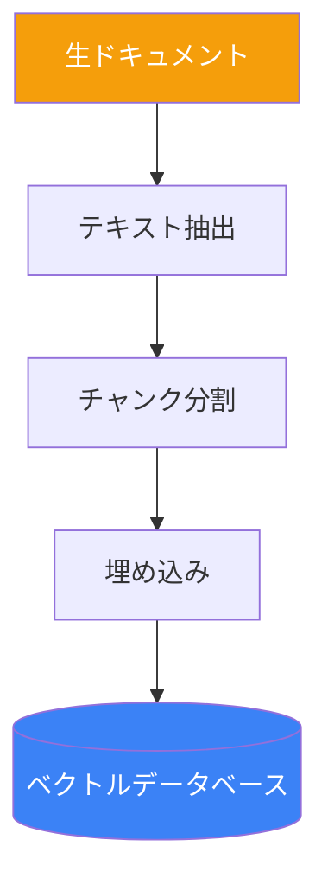
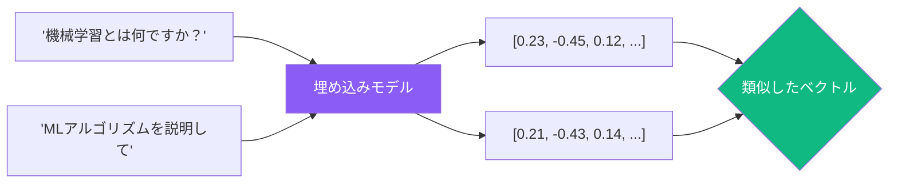
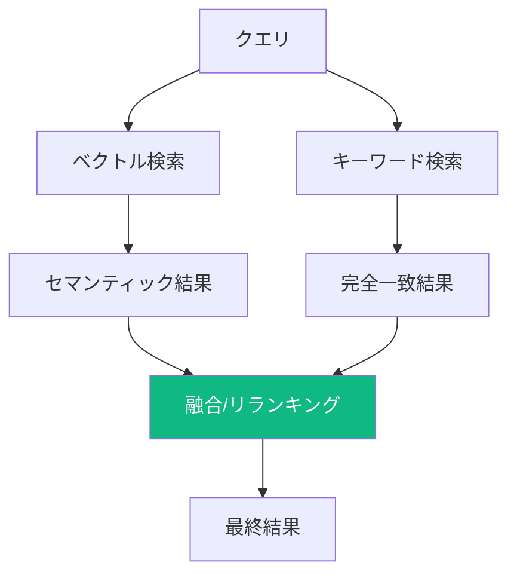

大規模言語モデルには根本的な制限があります：その知識はトレーニング時点で凍結されています。検索拡張生成（RAG：Retrieval-Augmented Generation）は、LLMを外部知識検索と組み合わせることでこれを解決し、最新情報、プライベートドキュメント、または専門データに基づいた正確な応答を可能にします。

## RAGとは？

RAGは、応答を生成する前にナレッジベースから関連情報を検索し、プロンプトに含めるアーキテクチャです。



### RAGなし

```
ユーザー: 当社の返品ポリシーは何ですか？
LLM: 御社の具体的なポリシーにはアクセスできません...
```

### RAGあり

```
[検索されたコンテキスト: 「当社の返品ポリシーでは、購入から30日以内の
返品が可能です。商品は未使用で元のパッケージである必要があります。
デジタル製品はダウンロード後の返金はできません。」]

ユーザー: 当社の返品ポリシーは何ですか？
LLM: 御社のポリシーによると、返品は購入から30日以内に可能です。
商品は未使用で元のパッケージである必要があります。なお、
デジタル製品は一度ダウンロードすると返金できません。
```

## RAGパイプライン

### 1. ドキュメントの取り込み

ドキュメントは処理され、検索可能なチャンクに変換されます：



**チャンク分割戦略:**

| 戦略 | 説明 | 最適な用途 |
|------|------|-----------|
| 固定サイズ | 文字/トークン数で分割 | シンプルなドキュメント |
| 文単位 | 文の境界で分割 | 物語的なテキスト |
| 段落単位 | 段落の区切りで分割 | 構造化ドキュメント |
| セマンティック | トピック/意味で分割 | 複雑なコンテンツ |

### 2. クエリ処理

ユーザーが質問すると：

```javascript
async function processQuery(userQuery) {
  // 1. クエリを埋め込みに変換
  const queryEmbedding = await embedText(userQuery);

  // 2. ベクトルDBで類似チャンクを検索
  const relevantChunks = await vectorDB.search(queryEmbedding, {
    topK: 5,
    threshold: 0.7
  });

  // 3. 拡張プロンプトを構築
  const context = relevantChunks.map(c => c.text).join('\n\n');

  return buildPrompt(context, userQuery);
}
```

### 3. プロンプト構築

検索されたコンテキストとユーザーの質問を組み合わせ：

```
以下のコンテキストを使用して質問に答えてください。
答えがコンテキストにない場合は「その情報は見つかりません」と答えてください。

コンテキスト:
---
{検索されたドキュメント}
---

質問: {ユーザーの質問}

回答:
```

## 埋め込みとベクトル検索

埋め込みはテキストを意味を捉えた数値ベクトルに変換します：



### 類似度測定

| 測定方法 | 説明 | 範囲 |
|----------|------|------|
| コサイン類似度 | ベクトル間の角度 | -1 〜 1 |
| ユークリッド距離 | 直線距離 | 0 〜 ∞ |
| 内積 | 大きさを考慮した類似度 | -∞ 〜 ∞ |

## RAGのベストプラクティス

### 1. チャンクサイズの最適化

```
小さすぎるチャンク:
- コンテキストが失われる
- 検索ノイズが増える
- 情報が不完全

大きすぎるチャンク:
- 関連性が薄まる
- トークン制限の問題
- 処理が遅くなる

最適なサイズ: 200-500トークン（オーバーラップあり）
```

### 2. フィルタリング用メタデータの追加

```javascript
const document = {
  text: "2024年Q3の収益は15%増加しました...",
  metadata: {
    source: "四半期報告書",
    date: "2024-10-01",
    department: "財務",
    confidentiality: "社内"
  }
};

// メタデータでフィルタリング
const results = await vectorDB.search(query, {
  filter: {
    department: "財務",
    date: { $gte: "2024-01-01" }
  }
});
```

### 3. ハイブリッド検索

より良い結果のためにベクトル検索とキーワード検索を組み合わせ：



### 4. コンテキストウィンドウの管理

```javascript
function buildContext(chunks, maxTokens = 3000) {
  let context = [];
  let tokenCount = 0;

  for (const chunk of chunks) {
    const chunkTokens = countTokens(chunk.text);
    if (tokenCount + chunkTokens > maxTokens) break;

    context.push(chunk.text);
    tokenCount += chunkTokens;
  }

  return context.join('\n\n---\n\n');
}
```

## 高度なRAGパターン

### クエリ変換

クエリを再構成して検索を改善：

```
元のクエリ: 「なぜ動かないの？」

変換されたクエリ:
1. 「一般的なエラーとトラブルシューティング手順」
2. 「エラーメッセージとその解決策」
3. 「[製品]のデバッグガイド」
```

### マルチクエリRAG

複数のクエリバリエーションを生成し、結果をマージ：

```javascript
async function multiQueryRAG(originalQuery) {
  // クエリのバリエーションを生成
  const variations = await llm.generate(`
    この質問を3つの異なる方法で表現してください：
    "${originalQuery}"
  `);

  // 各バリエーションで検索
  const allResults = await Promise.all(
    [originalQuery, ...variations].map(q => retrieve(q))
  );

  // 重複除去とリランキング
  return rerank(deduplicate(allResults.flat()));
}
```

### Self-RAG（批評と改善）

LLMに検索品質を評価させる：

```
このコンテキストと質問を見て、まず以下を評価してください：
1. コンテキストは質問に関連していますか？（はい/いいえ）
2. コンテキストには十分な情報がありますか？（はい/いいえ）
3. 情報が古くなっている可能性はありますか？（はい/いいえ）

すべて「はい」の場合、回答を提供してください。
そうでない場合、どの追加情報が必要か説明してください。

コンテキスト: {context}
質問: {question}
```

## 一般的なRAGの課題

### 1. 検索品質

| 問題 | 解決策 |
|------|--------|
| 無関係な結果 | チャンク分割を改善、メタデータフィルタを追加 |
| 情報の欠落 | top-Kを増やす、ハイブリッド検索を使用 |
| 古いコンテンツ | ドキュメントのバージョン管理を実装 |

### 2. ハルシネーション防止

```
提供されたコンテキストのみに基づいて回答してください。
情報がコンテキストにない場合は、次のように応答してください：
「利用可能なドキュメントでこの情報を見つけることができません。」

外部知識を使用したり、仮定を立てたりしないでください。
```

### 3. 引用と帰属

```
回答する際、以下の形式でソースを引用してください：
- インライン引用には [1]、[2] などを使用
- 最後にドキュメント名付きでソースをリスト

コンテキスト:
[1] company_policy.pdf: 「従業員は20日の有給休暇を受け取ります...」
[2] hr_handbook.pdf: 「未使用の有給休暇は繰り越すことができます...」
```

## まとめ

| コンポーネント | 目的 | 重要な考慮事項 |
|---------------|------|---------------|
| チャンク分割 | ドキュメントを検索可能な単位に分割 | サイズとオーバーラップ |
| 埋め込み | テキストをベクトルに変換 | モデル選択 |
| ベクトルDB | 埋め込みを保存・検索 | スケーラビリティ |
| 検索 | 関連コンテキストを見つける | 精度 vs 再現率 |
| プロンプト | コンテキストとクエリを組み合わせ | 明確な指示 |

RAGは、LLMを静的な知識システムから、特定のデータで動作できる動的なツールに変換します。LLMの推論能力と正確な情報検索を組み合わせることで、ドキュメント、カスタマーサポート、リサーチなどの信頼性の高いAIアプリケーションを構築できます。

## 参考資料

- Phoenix, James and Taylor, Mike. *Prompt Engineering for Generative AI*. O'Reilly Media, 2024.
- Lewis, Patrick, et al. "Retrieval-Augmented Generation for Knowledge-Intensive NLP Tasks." NeurIPS 2020.
