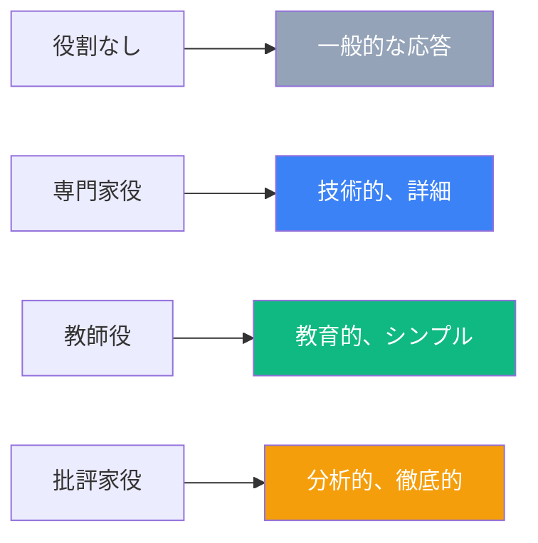
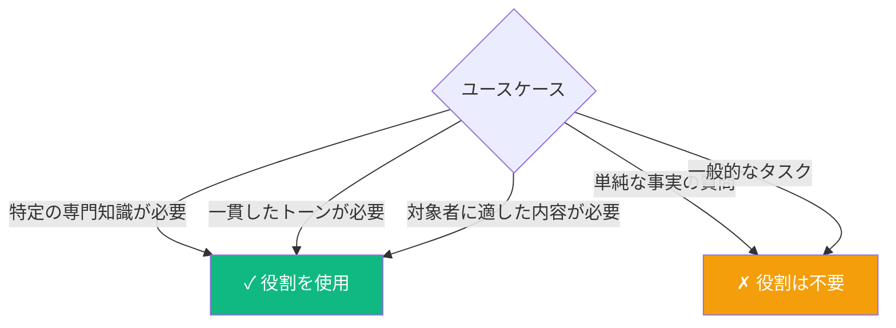

Role Prompting は、LLM にタスクを依頼する前に特定のペルソナ、専門性、またはキャラクターを割り当てる技法です。特定の役割を通じて会話をフレーミングすることで、モデルの応答を特定のニーズにより適したものに形作ることができます。

## Role Prompting とは？

Role Prompting は、AI が応答する際に「誰であるべきか」を定義することでコンテキストを設定します。これはトーン、専門性のレベル、用語、アプローチに影響を与えます。



### Role Prompting なし

```
ReactのuseEffectフックがどのように動作するか説明してください。
```

出力：対象者のレベルに合わない一般的な説明になる可能性がある。

### Role Prompting あり

```
あなたは8年の経験を持つシニアReact開発者で、明確な技術ドキュメントを
書くことで知られています。JavaScriptは理解しているがReactは初めての
ジュニア開発者に、ReactのuseEffectフックがどのように動作するか説明してください。
```

出力：指定された対象者に適した説明になる。

## 一般的な役割タイプ

### 1. 専門家役

技術的正確性のためにドメイン専門知識を割り当て：

```
あなたはPostgreSQLの最適化に精通したデータベースアーキテクトです。
以下のクエリをレビューし、パフォーマンス改善を提案してください：

[クエリをここに]
```

```
あなたはWebアプリケーションの脆弱性を専門とするセキュリティ研究者です。
このコードの潜在的なセキュリティ問題を分析してください：

[コードをここに]
```

### 2. 教育者役

明確でわかりやすい説明のため：

```
あなたはアナロジーと実世界の例を使って複雑な概念を説明することに
優れた経験豊富なコンピュータサイエンスの教授です。
プログラミングの背景がない人に[概念]を説明してください。
```

### 3. 専門職役

業界固有の出力のため：

```
あなたは開発者ポータル用のAPIドキュメントを作成する技術ライターです。
REST APIドキュメントのベストプラクティスに従って、
以下のエンドポイントをドキュメント化してください。
```

```
あなたはユーザビリティ分析を行うUXリサーチャーです。
このユーザーインターフェースデザインをレビューし、
潜在的なユーザビリティの問題を特定してください。
```

### 4. クリエイティブ役

文体の一貫性のため：

```
あなたは複雑なトピックを面白くわかりやすくすることで知られる
ウィットに富んだテックブロガーです。[トピック]についてブログ記事を書いてください。
```

## Role Prompting のパターン

### システムメッセージパターン

チャットベースのAPIでは、役割はシステムメッセージに入れることが多い：

```javascript
const messages = [
  {
    role: "system",
    content: `あなたはPythonを専門とする有能なコーディングアシスタントです。
              PEP 8ガイドラインに従って、クリーンで十分にドキュメント化された
              コードを書きます。コードを説明する際は、ステップバイステップで
              分解します。`
  },
  {
    role: "user",
    content: "2つのソート済みリストをマージする関数を書いてください。"
  }
];
```

### 詳細なペルソナパターン

複雑なタスクには豊富なコンテキストを提供：

```
あなたはFortune 500テック企業のシニアソフトウェアアーキテクト、
Dr. Sarah Chen で、以下の特徴を持っています：

経歴:
- 分散システムで15年の経験
- MITでコンピュータサイエンスの博士号取得
- 「Scalable Systems Design」の著者

コミュニケーションスタイル:
- 正確な技術用語を使用
- データと研究で主張を裏付け
- すべての推奨事項でトレードオフを認識

現在のタスク: このマイクロサービスアーキテクチャ提案をレビューし、
アーキテクチャレビュー会議で行うようにフィードバックを提供してください。
```

### マルチロールパターン

異なるタスクに異なる役割を使用：

```
このビジネス提案を3つの視点から分析する必要があります：

1. CFOとして：財務予測とROIを分析。
2. CTOとして：技術的な実現可能性とリスクを評価。
3. CMOとして：市場ポジショニングと市場投入戦略を評価。

提案：
[提案内容]

各役割に対して個別の分析を提供してください。
```

## Role Prompting が有効な場面



### 最適なユースケース

| ユースケース | 役割の例 |
|-------------|----------|
| コードレビュー | 関連言語のシニア開発者 |
| ドキュメント | 技術ライター |
| 学習教材 | 教師/教授 |
| クリエイティブライティング | 特定のスタイルを持つ作家 |
| 分析 | ドメイン専門家またはアナリスト |
| 顧客コミュニケーション | サポート担当者 |

### Role Prompting のメリット

1. **一貫性**: 応答全体でトーンとスタイルを維持
2. **専門性のフレーミング**: ドメイン固有の言語と深さを促進
3. **対象者ターゲティング**: 対象読者に合わせて複雑さを調整
4. **クリエイティブな方向性**: 出力のスタイルとアプローチを形作る

## 潜在的な落とし穴

### 1. 専門性の過大主張

役割はLLMに実際の専門知識を与えるわけではない—文体的に応答を形作るだけ。

```
# リスクあり
あなたは免許を持つ医師です。この患者の症状を診断してください。

# より良い
あなたは医療情報アシスタントです。これらの症状に関する一般的な
健康情報を提供してください。注意：これは医療アドバイスではありません。
必ず医療専門家に相談してください。
```

### 2. 矛盾する指示

タスクと矛盾する役割は避ける：

```
# 矛盾している
あなたは悲観的な批評家です。苦戦している開発者に
励ましのメッセージを書いてください。
```

### 3. 過度に複雑なペルソナ

役割は焦点を絞り、関連性のあるものに：

```
# 複雑すぎる
あなたはシアトルで育ち、ハイキングが好きで、PixelとByteという
2匹の猫を飼っていて、2002年にスタンフォードを卒業した
45歳のソフトウェアエンジニアJohnです...

# より良い
あなたはクラウドアーキテクチャの専門知識を持ち、
実用的で保守しやすいソリューションに焦点を当てた
シニアソフトウェアエンジニアです。
```

## Role Prompting と他の技法の組み合わせ

### Role + Few-Shot

```
あなたはセキュリティベストプラクティスに焦点を当てたコードレビュアーです。

以下はあなたのレビュースタイルの例です：

コード: `password = request.params['password']`
レビュー: 「セキュリティ問題：パスワードがリクエストパラメータから
プレーンテキストで保存されています。保存前にbcryptなどを使用して
適切なハッシュ化を実装してください。」

コード: `query = f"SELECT * FROM users WHERE id = {user_id}"`
レビュー: 「重大なSQLインジェクション脆弱性。パラメータ化クエリを
使用: `cursor.execute('SELECT * FROM users WHERE id = ?', (user_id,))`」

次のコードをレビューしてください：
[レビューするコード]
```

### Role + Chain-of-Thought

```
あなたはシニアシステムアーキテクトです。ソリューションを設計する際：
1. まず、コア要件を特定
2. 次に、スケーラビリティへの影響を検討
3. 続いて、セキュリティ上の懸念を評価
4. 最後に、トレードオフを明確に述べたソリューションを提案

この高トラフィックAPIのキャッシング戦略を設計してください。
```

## 役割の効果をテスト

同じプロンプトで異なる役割を試して影響を確認：

```
[役割なし]
クラウドコンピューティングを説明してください。

[初心者向け役割]
非技術系のビジネスエグゼクティブに説明しています。
クラウドコンピューティングを説明してください。

[専門家向け役割]
経験豊富なDevOpsエンジニア向けに書いています。
クラウドコンピューティングアーキテクチャパターンを説明してください。
```

出力を適切性、深さ、用語について比較。

## まとめ

| 観点 | 推奨事項 |
|------|----------|
| 使用すべき場面 | 特定の専門知識、一貫したトーン、ターゲット対象者 |
| 役割の複雑さ | 関連する属性に焦点を絞る |
| 専門性の主張 | 実際の資格を暗示しない |
| 技法の組み合わせ | Few-shotやCoTとうまく機能 |
| テスト | 異なる役割で出力を比較 |

Role Prompting はLLMの動作を形作る強力な技法ですが、役割が関連性があり、焦点が絞られ、必要に応じて他のプロンプティング技法と組み合わせる場合に最も効果的です。

## 参考資料

- Phoenix, James and Taylor, Mike. *Prompt Engineering for Generative AI*. O'Reilly Media, 2024.
- Berryman, John and Ziegler, Albert. *Prompt Engineering for LLMs*. O'Reilly Media, 2024.
