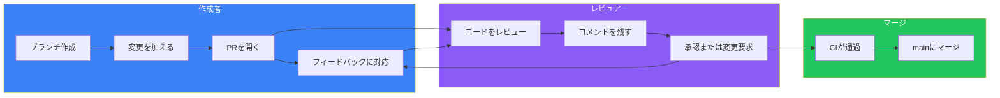
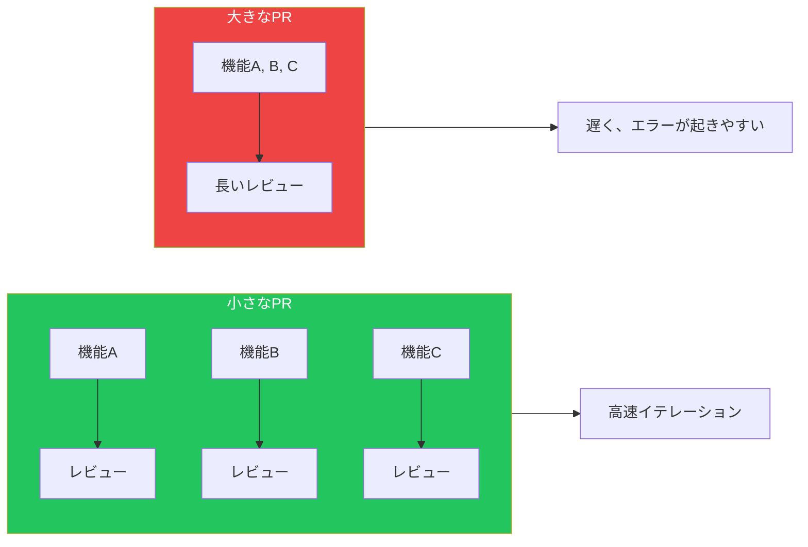
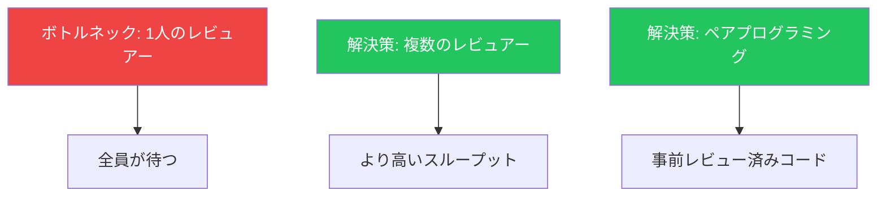

## はじめに

プルリクエストを通じたコードレビューは、ソフトウェア開発における最も価値のあるプラクティスの1つです。バグを見つけ、知識を共有し、コード品質を維持します。しかし、不適切なレビュープラクティスは開発を遅らせ、摩擦を生みます。

この記事では、プルリクエストの作成とレビューの両方に関するベストプラクティスを解説します。

## プルリクエストのプロセス



## 良いプルリクエストの作成

### PRは小さく保つ

| PRサイズ | 変更行数 | レビュー時間 | 品質 |
|---------|---------|------------|------|
| 小 | < 200 | 15-30分 | 高 |
| 中 | 200-400 | 30-60分 | 中 |
| 大 | > 400 | 1時間以上 | 低 |



### 説明的なPRタイトルを書く

```markdown
## 悪いタイトル
- "バグ修正"
- "コード更新"
- "変更"

## 良いタイトル
- "空のパスワードに対するログイン検証を修正"
- "決済ゲートウェイ呼び出しにリトライロジックを追加"
- "ユーザーサービスをリポジトリパターンにリファクタリング"
```

### PR説明のテンプレート

```markdown
## 概要
このPRが何をするかの簡潔な説明。

## 変更内容
- ユーザー設定用の新しいエンドポイントを追加
- Userモデルに設定フィールドを更新
- 設定サービスのユニットテストを追加

## テスト
- [ ] ユニットテスト通過
- [ ] 手動テスト完了
- [ ] E2Eテスト更新

## スクリーンショット（該当する場合）
[UI変更の前後のスクリーンショット]

## 関連Issue
Closes #123
```

### PRテンプレートの設定

```markdown
<!-- .github/PULL_REQUEST_TEMPLATE.md -->
## 説明
<!-- このPRは何をしますか？ -->

## 変更の種類
- [ ] バグ修正
- [ ] 新機能
- [ ] 破壊的変更
- [ ] ドキュメント更新

## チェックリスト
- [ ] 変更をテストしました
- [ ] ドキュメントを更新しました
- [ ] テストを追加しました
- [ ] コードはスタイルガイドラインに従っています

## 関連Issue
<!-- 関連するIssueをリンク -->
```

## CODEOWNERS

ファイルパスに基づいてレビュアーを自動的に割り当て：

```
# .github/CODEOWNERS

# すべてのファイルのデフォルトレビュアー
* @org/developers

# フロントエンドチームがUIコードを担当
/src/components/ @org/frontend-team
/src/styles/ @org/frontend-team
*.tsx @org/frontend-team

# バックエンドチームがAPIを担当
/src/api/ @org/backend-team
/src/services/ @org/backend-team

# DevOpsがインフラを担当
/.github/ @org/devops
/terraform/ @org/devops
Dockerfile @org/devops

# セキュリティチームは認証変更を必ずレビュー
/src/auth/ @org/security-team
/src/middleware/auth* @org/security-team

# 特定ファイルのオーナー
package.json @lead-developer
```

### CODEOWNERSと必須レビュー

リポジトリ設定で構成：

1. 「Require review from Code Owners」を有効化
2. 最小レビュアー数を設定
3. 新しいコミットで古いレビューを却下

## レビューの自動化

### レビュー前の自動チェック

```yaml
# .github/workflows/pr-checks.yml
name: PR Checks

on:
  pull_request:
    types: [opened, synchronize]

jobs:
  lint:
    runs-on: ubuntu-latest
    steps:
      - uses: actions/checkout@v4
      - run: npm ci
      - run: npm run lint

  test:
    runs-on: ubuntu-latest
    steps:
      - uses: actions/checkout@v4
      - run: npm ci
      - run: npm test

  build:
    runs-on: ubuntu-latest
    steps:
      - uses: actions/checkout@v4
      - run: npm ci
      - run: npm run build
```

### レビュアーの自動割り当て

```yaml
# .github/workflows/auto-assign.yml
name: Auto Assign Reviewers

on:
  pull_request:
    types: [opened, ready_for_review]

jobs:
  assign:
    runs-on: ubuntu-latest
    steps:
      - uses: kentaro-m/auto-assign-action@v1
        with:
          configuration-path: '.github/auto-assign.yml'
```

```yaml
# .github/auto-assign.yml
addReviewers: true
addAssignees: author
numberOfReviewers: 2
reviewers:
  - reviewer1
  - reviewer2
  - reviewer3
```

### PRの自動ラベル付け

```yaml
# .github/workflows/labeler.yml
name: Label PRs

on:
  pull_request:
    types: [opened, synchronize]

jobs:
  label:
    runs-on: ubuntu-latest
    steps:
      - uses: actions/labeler@v4
        with:
          repo-token: ${{ secrets.GITHUB_TOKEN }}
```

```yaml
# .github/labeler.yml
frontend:
  - 'src/components/**'
  - '*.tsx'

backend:
  - 'src/api/**'
  - 'src/services/**'

documentation:
  - '*.md'
  - 'docs/**'

tests:
  - '**/*.test.ts'
  - '**/*.spec.ts'
```

## 効果的なレビューの実施

### レビューチェックリスト

```markdown
## コードレビューチェックリスト

### 機能性
- [ ] コードは意図通りに動作するか？
- [ ] エッジケースは処理されているか？
- [ ] エラーハンドリングは適切か？

### コード品質
- [ ] コードは読みやすく整理されているか？
- [ ] 変数/関数名は説明的か？
- [ ] 不必要な複雑さはないか？

### テスト
- [ ] 十分なテストがあるか？
- [ ] テストはエッジケースをカバーしているか？
- [ ] テストは読みやすいか？

### セキュリティ
- [ ] ハードコードされたシークレットはないか？
- [ ] 入力検証は存在するか？
- [ ] SQLインジェクションの脆弱性はないか？

### パフォーマンス
- [ ] 明らかなパフォーマンス問題はないか？
- [ ] データベースクエリは最適化されているか？
- [ ] メモリリークはないか？
```

### コメントの種類

| プレフィックス | 意味 | アクション必要 |
|--------------|------|--------------|
| `blocking:` | マージ前に修正必須 | はい |
| `suggestion:` | この変更を検討 | オプション |
| `question:` | 説明が必要 | 回答する |
| `nitpick:` | 軽微なスタイル問題 | オプション |
| `praise:` | 良い仕事！ | なし |

### 建設的なフィードバックを書く

```markdown
## これの代わりに:
「これは間違っています。」
「なぜこうしたのですか？」
「このコードは混乱します。」

## こう書く:
「Xが発生した場合に問題が起きる可能性があります。そのケースの処理を検討してください。」
「ここの理由が気になります。説明していただけますか？」
「このロジックを追うのが難しかったです。関数に抽出すると分かりやすくなりますか？」
```

### 良い質問をする

```markdown
## 良い質問
- 「このAPI呼び出しが失敗した場合はどうなりますか？」
- 「代わりにXを使うことを検討しましたか？これを簡素化できるかもしれません。」
- 「なぜこれが必要なのか説明するコメントを追加できますか？」

## 避けるべき
- 「なぜ...しなかったのですか？」（非難に聞こえる）
- 「...すべきでした」（上から目線に聞こえる）
```

## レビューへの対応

### 作成者として

```markdown
## 良い対応
- 「良い指摘です！abc123で修正しました。」
- 「Xの理由でこのアプローチを選びました。Yを好む場合は変更します。」
- 「これを明確にするコメントを追加しました。」

## 避けるべきこと
- 防御的になる
- フィードバックを無視する
- コメントに応答せずに変更する
```

### 会話の解決

1. コードまたは議論で**フィードバックに対応**
2. 見たことを確認するために**返信**
3. 完了したら会話を**解決**
4. 変更を要求した場合は**レビュアー**に解決させる

## レビューの効率化

### レビューの時間制限

```markdown
## レビュースケジュール
- 1日の始めにPRをチェック
- 昼食後にPRをチェック
- レビュー用に30分を確保

## 避けるべき
- 常にPRをチェックする（コンテキストスイッチング）
- PRを数日間放置する
```

### レビューの優先順位付け

| 優先度 | 種類 | 応答時間 |
|-------|------|---------|
| 高 | 他の作業をブロック | < 4時間 |
| 中 | 通常の機能 | < 24時間 |
| 低 | ドキュメント、リファクタリング | < 48時間 |

### レビューツールの使用

```yaml
# レビュー用のVS Code設定
{
  "github.pullRequests.showDiff": true,
  "github.pullRequests.diffLayout": "split"
}
```

## レビュー文化の構築

### チームの合意事項

```markdown
## レビューガイドライン

### 期待事項
- すべてのPRは少なくとも1つの承認が必要
- セキュリティに敏感な変更は2つの承認が必要
- 作成者は24時間以内にフィードバックに対応
- レビュアーは24時間以内にフィードバックを提供

### コミュニケーション
- 従来のコメントプレフィックスを使用
- 敬意を持ち建設的に
- 要求ではなく質問をする
- 良い仕事を認める

### 効率
- PRを400行以下に保つ
- 機能にはテストを含める
- レビューを依頼する前にセルフレビュー
```

### レビューのボトルネックを避ける



### レビューの健全性を測定

以下のメトリクスを追跡：

| メトリクス | 目標 | 理由 |
|----------|------|------|
| 最初のレビューまでの時間 | < 4時間 | 迅速なフィードバック |
| マージまでの時間 | < 24時間 | 勢いを維持 |
| レビュー反復回数 | < 3 | 明確な要件 |
| PRサイズ | < 400行 | 品質の高いレビュー |

## まとめ

| 領域 | ベストプラクティス |
|-----|------------------|
| **PRサイズ** | 400行以下に保つ |
| **説明** | テンプレートを使用、理由を説明 |
| **CODEOWNERS** | 専門家を自動割り当て |
| **自動化** | レビュー前にリント、テスト、ラベル |
| **フィードバック** | 建設的に、プレフィックスを使用 |
| **対応** | 両者とも24時間以内 |
| **文化** | 敬意を持ち、学習重視 |

良いコードレビュープラクティスは、コード品質を向上させ、知識を共有し、より強いチームを構築します。

## 参考資料

- Packt - DevOps Unleashed with Git and GitHub, Chapter 4
- O'Reilly - Version Control with Git, Chapter 18
- Google Engineering Practices - Code Review
- GitHub Docs - Pull Request Reviews
