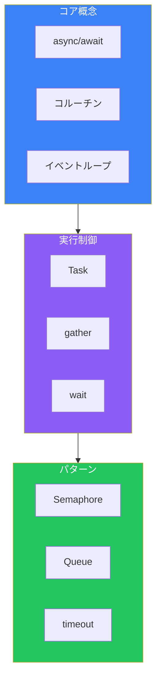

Web APIへのリクエスト、データベースクエリ、ファイルI/O—これらの操作は待ち時間が発生します。asyncioを使えば、その待ち時間を有効活用し、複数の操作を効率的に並行処理できます。

## なぜasyncioなのか

### 同期処理の問題

```python
import time

def fetch_data(url: str) -> str:
    time.sleep(1)  # ネットワーク待ち時間をシミュレート
    return f"Data from {url}"

# 3つのURLを順次取得 = 3秒かかる
urls = ["url1", "url2", "url3"]
for url in urls:
    print(fetch_data(url))
```

### 非同期処理の利点

```python
import asyncio

async def fetch_data(url: str) -> str:
    await asyncio.sleep(1)  # 非同期で待機
    return f"Data from {url}"

async def main():
    urls = ["url1", "url2", "url3"]
    # 3つを並行実行 = 約1秒で完了
    results = await asyncio.gather(
        *[fetch_data(url) for url in urls]
    )
    for result in results:
        print(result)

asyncio.run(main())
```

## コルーチンの基本

### async/await

```python
import asyncio

# async defでコルーチン関数を定義
async def greet(name: str) -> str:
    # awaitで非同期操作を待機
    await asyncio.sleep(0.5)
    return f"Hello, {name}!"

# コルーチンを実行
async def main():
    result = await greet("Python")
    print(result)

# イベントループで実行
asyncio.run(main())
```

### コルーチンオブジェクト

```python
async def example():
    return 42

# コルーチン関数を呼び出すとコルーチンオブジェクトを返す
coro = example()
print(type(coro))  # <class 'coroutine'>

# awaitで結果を取得
async def main():
    result = await example()
    print(result)  # 42
```

## Task: 並行実行の単位

### Taskの作成

```python
import asyncio

async def long_operation(name: str, seconds: int) -> str:
    print(f"{name} started")
    await asyncio.sleep(seconds)
    print(f"{name} finished")
    return f"{name} result"

async def main():
    # Taskを作成（即座にスケジュール）
    task1 = asyncio.create_task(long_operation("Task1", 2))
    task2 = asyncio.create_task(long_operation("Task2", 1))

    # 両方の完了を待つ
    result1 = await task1
    result2 = await task2

    print(f"Results: {result1}, {result2}")

asyncio.run(main())
# 出力:
# Task1 started
# Task2 started
# Task2 finished
# Task1 finished
# Results: Task1 result, Task2 result
```

### Taskのキャンセル

```python
async def cancellable_task():
    try:
        while True:
            print("Working...")
            await asyncio.sleep(1)
    except asyncio.CancelledError:
        print("Task was cancelled")
        raise  # 再送出して正しくキャンセル

async def main():
    task = asyncio.create_task(cancellable_task())

    await asyncio.sleep(3)  # 3秒待機
    task.cancel()  # キャンセル

    try:
        await task
    except asyncio.CancelledError:
        print("Caught cancellation")

asyncio.run(main())
```

## gather: 複数コルーチンの集約

```python
import asyncio

async def fetch(url: str, delay: float) -> dict:
    await asyncio.sleep(delay)
    return {"url": url, "status": 200}

async def main():
    # 複数のコルーチンを並行実行
    results = await asyncio.gather(
        fetch("api/users", 1.0),
        fetch("api/posts", 0.5),
        fetch("api/comments", 0.8),
    )

    for result in results:
        print(result)

asyncio.run(main())
```

### エラーハンドリング

```python
async def might_fail(should_fail: bool):
    await asyncio.sleep(0.1)
    if should_fail:
        raise ValueError("Something went wrong")
    return "Success"

async def main():
    # return_exceptions=Trueで例外も結果として返す
    results = await asyncio.gather(
        might_fail(False),
        might_fail(True),
        might_fail(False),
        return_exceptions=True
    )

    for result in results:
        if isinstance(result, Exception):
            print(f"Error: {result}")
        else:
            print(f"Result: {result}")

asyncio.run(main())
```

## asyncio.wait: より細かい制御

```python
import asyncio

async def task(name: str, delay: float):
    await asyncio.sleep(delay)
    return f"{name} done"

async def main():
    tasks = [
        asyncio.create_task(task("A", 1)),
        asyncio.create_task(task("B", 2)),
        asyncio.create_task(task("C", 0.5)),
    ]

    # 最初の1つが完了するまで待機
    done, pending = await asyncio.wait(
        tasks,
        return_when=asyncio.FIRST_COMPLETED
    )

    for t in done:
        print(f"Completed: {t.result()}")

    print(f"Still pending: {len(pending)}")

    # 残りも待機
    done2, _ = await asyncio.wait(pending)
    for t in done2:
        print(f"Completed: {t.result()}")

asyncio.run(main())
```

## タイムアウト

### wait_for

```python
async def slow_operation():
    await asyncio.sleep(10)
    return "Done"

async def main():
    try:
        result = await asyncio.wait_for(
            slow_operation(),
            timeout=2.0
        )
    except asyncio.TimeoutError:
        print("Operation timed out!")

asyncio.run(main())
```

### timeout（Python 3.11+）

```python
async def main():
    async with asyncio.timeout(2.0):
        await slow_operation()
```

## 非同期コンテキストマネージャ

```python
class AsyncResource:
    async def __aenter__(self):
        print("Acquiring resource")
        await asyncio.sleep(0.1)
        return self

    async def __aexit__(self, exc_type, exc_val, exc_tb):
        print("Releasing resource")
        await asyncio.sleep(0.1)

async def main():
    async with AsyncResource() as resource:
        print("Using resource")

asyncio.run(main())
```

## 非同期イテレータ

```python
class AsyncCounter:
    def __init__(self, max_count: int):
        self.max_count = max_count
        self.count = 0

    def __aiter__(self):
        return self

    async def __anext__(self) -> int:
        if self.count >= self.max_count:
            raise StopAsyncIteration
        await asyncio.sleep(0.1)
        self.count += 1
        return self.count

async def main():
    async for num in AsyncCounter(5):
        print(num)

asyncio.run(main())
```

### 非同期ジェネレータ

```python
async def async_range(start: int, stop: int):
    for i in range(start, stop):
        await asyncio.sleep(0.1)
        yield i

async def main():
    async for num in async_range(1, 5):
        print(num)

asyncio.run(main())
```

## セマフォによる並行数制限

```python
import asyncio

async def fetch_with_limit(
    semaphore: asyncio.Semaphore,
    url: str
) -> str:
    async with semaphore:
        print(f"Fetching {url}")
        await asyncio.sleep(1)
        return f"Result from {url}"

async def main():
    # 同時実行数を3に制限
    semaphore = asyncio.Semaphore(3)

    urls = [f"url{i}" for i in range(10)]
    tasks = [
        fetch_with_limit(semaphore, url)
        for url in urls
    ]

    results = await asyncio.gather(*tasks)
    print(f"Fetched {len(results)} URLs")

asyncio.run(main())
```

## 実践パターン

### HTTP並行リクエスト

```python
import asyncio
import aiohttp

async def fetch_url(
    session: aiohttp.ClientSession,
    url: str
) -> dict:
    async with session.get(url) as response:
        return {
            "url": url,
            "status": response.status,
            "data": await response.text()
        }

async def main():
    urls = [
        "https://api.example.com/users",
        "https://api.example.com/posts",
        "https://api.example.com/comments",
    ]

    async with aiohttp.ClientSession() as session:
        tasks = [fetch_url(session, url) for url in urls]
        results = await asyncio.gather(*tasks)

        for result in results:
            print(f"{result['url']}: {result['status']}")

asyncio.run(main())
```

### プロデューサー・コンシューマー

```python
import asyncio

async def producer(queue: asyncio.Queue, n: int):
    for i in range(n):
        await asyncio.sleep(0.1)
        await queue.put(f"item-{i}")
        print(f"Produced: item-{i}")
    await queue.put(None)  # 終了シグナル

async def consumer(queue: asyncio.Queue, name: str):
    while True:
        item = await queue.get()
        if item is None:
            await queue.put(None)  # 他のコンシューマーに伝播
            break
        print(f"{name} consumed: {item}")
        await asyncio.sleep(0.2)

async def main():
    queue = asyncio.Queue()

    await asyncio.gather(
        producer(queue, 10),
        consumer(queue, "Consumer-1"),
        consumer(queue, "Consumer-2"),
    )

asyncio.run(main())
```

## まとめ

asyncioの主要コンポーネント：



| 関数/クラス | 用途 |
|------------|------|
| `asyncio.run()` | メインエントリーポイント |
| `asyncio.create_task()` | Task作成・スケジュール |
| `asyncio.gather()` | 複数コルーチンを並行実行 |
| `asyncio.wait()` | 完了条件を細かく制御 |
| `asyncio.Semaphore` | 並行数を制限 |
| `asyncio.Queue` | 非同期キュー |

主要な原則：

- **I/Oバウンドに使用**: CPU負荷の高い処理には向かない
- **awaitを忘れない**: コルーチンはawaitしないと実行されない
- **Taskで並行化**: 並行実行したい場合はTaskを作成
- **適切な並行数**: セマフォで同時実行数を制限

asyncioは、I/O待ちの多いアプリケーションのスループットを劇的に向上させます。

## 参考資料

- [asyncio — Asynchronous I/O](https://docs.python.org/3/library/asyncio.html)
- [Python Concurrency with asyncio](https://www.manning.com/books/python-concurrency-with-asyncio)
- [Fluent Python, 2nd Edition - Chapter 21](https://www.oreilly.com/library/view/fluent-python-2nd/9781492056348/)
