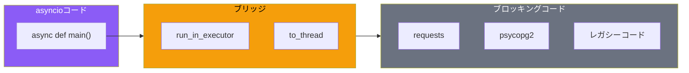

asyncioは強力ですが、すべてのライブラリがasync/awaitに対応しているわけではありません。requests、psycopg2、多くのレガシーコードはブロッキング操作を行います。asyncioとスレッドを組み合わせることで、これらのコードを非同期環境で活用できます。

## なぜ組み合わせが必要か

### ブロッキング操作の問題

```python
import asyncio
import requests  # ブロッキングライブラリ

async def fetch_data():
    # これはイベントループをブロックしてしまう！
    response = requests.get("https://api.example.com/data")
    return response.json()

async def other_task():
    for i in range(5):
        print(f"Working... {i}")
        await asyncio.sleep(0.1)

async def main():
    # other_taskはfetch_dataが完了するまで実行されない
    await asyncio.gather(
        fetch_data(),
        other_task()
    )

asyncio.run(main())
```

イベントループがブロックされると、他のすべてのコルーチンが停止します。

## run_in_executor

ブロッキング操作をスレッドプールで実行：

```python
import asyncio
from concurrent.futures import ThreadPoolExecutor
import requests

def blocking_fetch(url: str) -> dict:
    """ブロッキングなHTTPリクエスト"""
    response = requests.get(url)
    return response.json()

async def async_fetch(url: str) -> dict:
    """ブロッキング操作を非同期化"""
    loop = asyncio.get_event_loop()

    # スレッドプールで実行
    result = await loop.run_in_executor(
        None,  # デフォルトのExecutorを使用
        blocking_fetch,
        url
    )
    return result

async def main():
    urls = [
        "https://api.github.com/users/python",
        "https://api.github.com/users/django",
        "https://api.github.com/users/flask",
    ]

    # 並行実行
    results = await asyncio.gather(
        *[async_fetch(url) for url in urls]
    )

    for result in results:
        print(result.get("login"))

asyncio.run(main())
```

### カスタムExecutor

```python
import asyncio
from concurrent.futures import ThreadPoolExecutor

# スレッド数を制御
executor = ThreadPoolExecutor(max_workers=5)

async def fetch_with_custom_executor(url: str):
    loop = asyncio.get_event_loop()
    return await loop.run_in_executor(
        executor,
        blocking_fetch,
        url
    )

async def main():
    try:
        results = await asyncio.gather(
            *[fetch_with_custom_executor(f"url{i}") for i in range(10)]
        )
    finally:
        executor.shutdown(wait=True)
```

## asyncio.to_thread（Python 3.9+）

より簡潔な構文：

```python
import asyncio
import requests

def blocking_operation(url: str) -> str:
    response = requests.get(url)
    return response.text

async def main():
    # to_threadで簡潔に
    result = await asyncio.to_thread(
        blocking_operation,
        "https://api.github.com"
    )
    print(result[:100])

asyncio.run(main())
```

### 複数の引数

```python
import asyncio
import time

def process_data(data: str, multiplier: int, prefix: str) -> str:
    time.sleep(0.1)  # シミュレート
    return f"{prefix}: {data * multiplier}"

async def main():
    result = await asyncio.to_thread(
        process_data,
        "hello",
        3,
        "Result"
    )
    print(result)  # Result: hellohellohello

asyncio.run(main())
```

## 実践パターン

### データベース操作のラッピング

```python
import asyncio
from concurrent.futures import ThreadPoolExecutor
import psycopg2  # ブロッキングライブラリ
from contextlib import contextmanager

class AsyncDatabase:
    def __init__(self, connection_string: str, max_workers: int = 5):
        self.connection_string = connection_string
        self.executor = ThreadPoolExecutor(max_workers=max_workers)

    @contextmanager
    def _get_connection(self):
        conn = psycopg2.connect(self.connection_string)
        try:
            yield conn
        finally:
            conn.close()

    def _execute_query(self, query: str, params: tuple = None) -> list:
        with self._get_connection() as conn:
            with conn.cursor() as cur:
                cur.execute(query, params)
                return cur.fetchall()

    async def execute(self, query: str, params: tuple = None) -> list:
        loop = asyncio.get_event_loop()
        return await loop.run_in_executor(
            self.executor,
            self._execute_query,
            query,
            params
        )

    async def close(self):
        self.executor.shutdown(wait=True)

# 使用例
async def main():
    db = AsyncDatabase("postgresql://localhost/mydb")

    try:
        users = await db.execute("SELECT * FROM users WHERE active = %s", (True,))
        print(users)
    finally:
        await db.close()
```

### ファイルI/Oのラッピング

```python
import asyncio
from pathlib import Path

def read_file_sync(path: Path) -> str:
    return path.read_text()

def write_file_sync(path: Path, content: str) -> None:
    path.write_text(content)

async def read_file(path: Path) -> str:
    return await asyncio.to_thread(read_file_sync, path)

async def write_file(path: Path, content: str) -> None:
    await asyncio.to_thread(write_file_sync, path, content)

async def process_files():
    files = list(Path(".").glob("*.txt"))

    # 並行読み込み
    contents = await asyncio.gather(
        *[read_file(f) for f in files]
    )

    for file, content in zip(files, contents):
        print(f"{file}: {len(content)} chars")
```

### サードパーティライブラリのラッピング

```python
import asyncio
from functools import partial
import boto3  # AWS SDK（ブロッキング）

class AsyncS3Client:
    def __init__(self):
        self.client = boto3.client('s3')

    async def list_buckets(self) -> list:
        return await asyncio.to_thread(
            self.client.list_buckets
        )

    async def get_object(self, bucket: str, key: str) -> bytes:
        response = await asyncio.to_thread(
            self.client.get_object,
            Bucket=bucket,
            Key=key
        )
        # 注意: responseのBodyも読み込みが必要
        body = await asyncio.to_thread(response['Body'].read)
        return body

    async def put_object(self, bucket: str, key: str, data: bytes) -> dict:
        return await asyncio.to_thread(
            self.client.put_object,
            Bucket=bucket,
            Key=key,
            Body=data
        )
```

## レガシーコードの段階的移行

### Phase 1: ラッパー作成

```python
# legacy_module.py（変更なし）
def fetch_user(user_id: int) -> dict:
    # 既存のブロッキングコード
    pass

def update_user(user_id: int, data: dict) -> bool:
    pass

# async_legacy.py（新規作成）
import asyncio
from . import legacy_module

async def fetch_user(user_id: int) -> dict:
    return await asyncio.to_thread(legacy_module.fetch_user, user_id)

async def update_user(user_id: int, data: dict) -> bool:
    return await asyncio.to_thread(legacy_module.update_user, user_id, data)
```

### Phase 2: 呼び出し側を移行

```python
# 移行前
from legacy_module import fetch_user

def process_users(user_ids):
    for uid in user_ids:
        user = fetch_user(uid)
        print(user)

# 移行後
from async_legacy import fetch_user

async def process_users(user_ids):
    users = await asyncio.gather(
        *[fetch_user(uid) for uid in user_ids]
    )
    for user in users:
        print(user)
```

### Phase 3: 徐々にネイティブasyncに

```python
# 最終的にネイティブasyncに書き換え
import aiohttp

async def fetch_user(user_id: int) -> dict:
    async with aiohttp.ClientSession() as session:
        async with session.get(f"/api/users/{user_id}") as response:
            return await response.json()
```

## 注意点とベストプラクティス

### スレッドセーフティ

```python
import asyncio
import threading

# グローバル状態に注意
shared_data = {"count": 0}
lock = threading.Lock()

def increment():
    with lock:  # スレッドセーフにする
        shared_data["count"] += 1

async def main():
    await asyncio.gather(
        *[asyncio.to_thread(increment) for _ in range(100)]
    )
    print(shared_data["count"])  # 100
```

### Executorのライフサイクル

```python
import asyncio
from concurrent.futures import ThreadPoolExecutor

# 良い例: コンテキストマネージャを使用
async def good_example():
    with ThreadPoolExecutor(max_workers=5) as executor:
        loop = asyncio.get_event_loop()
        result = await loop.run_in_executor(executor, blocking_func)
    return result

# 悪い例: シャットダウンを忘れる
executor = ThreadPoolExecutor()  # グローバル
# ... プログラム終了時にリソースリーク
```

### 過度なスレッド生成を避ける

```python
import asyncio
from concurrent.futures import ThreadPoolExecutor

# 適切なワーカー数を設定
MAX_WORKERS = min(32, (os.cpu_count() or 1) + 4)

executor = ThreadPoolExecutor(max_workers=MAX_WORKERS)

# または、セマフォで制限
semaphore = asyncio.Semaphore(10)

async def limited_blocking_call(func, *args):
    async with semaphore:
        return await asyncio.to_thread(func, *args)
```

## まとめ



| メソッド | 用途 | Python |
|---------|------|--------|
| `run_in_executor` | カスタムExecutor使用 | 3.4+ |
| `to_thread` | シンプルなスレッド実行 | 3.9+ |

主要な原則：

- **ブロッキング操作をスレッドへ**: イベントループをブロックしない
- **適切なワーカー数**: 過度なスレッド生成を避ける
- **段階的に移行**: まずラッパー、次にネイティブasync
- **スレッドセーフティ**: 共有状態にはロックを使用

asyncioとスレッドの組み合わせにより、既存のコードベースを活かしながら非同期の恩恵を受けられます。

## 参考資料

- [asyncio — Asynchronous I/O](https://docs.python.org/3/library/asyncio.html)
- [Python Concurrency with asyncio - Chapter 7](https://www.manning.com/books/python-concurrency-with-asyncio)
- [Fluent Python, 2nd Edition - Chapter 21](https://www.oreilly.com/library/view/fluent-python-2nd/9781492056348/)
