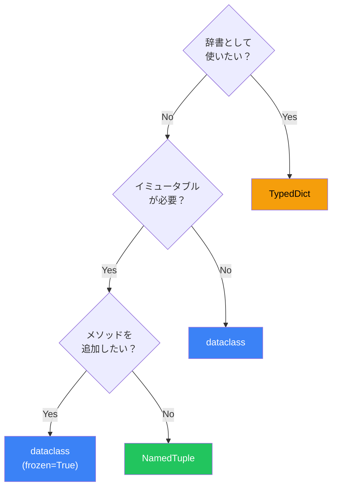

Pythonでデータを保持するクラスを定義する際、`__init__`、`__repr__`、`__eq__`などの定型コードを繰り返し書くのは面倒です。`dataclasses`モジュール（Python 3.7+）は、これらを自動生成し、クラス定義を劇的に簡潔にします。

## 従来のクラス vs dataclass

### 従来のアプローチ

```python
class User:
    def __init__(self, name: str, age: int, email: str):
        self.name = name
        self.age = age
        self.email = email

    def __repr__(self) -> str:
        return f"User(name={self.name!r}, age={self.age!r}, email={self.email!r})"

    def __eq__(self, other: object) -> bool:
        if not isinstance(other, User):
            return NotImplemented
        return (self.name, self.age, self.email) == (other.name, other.age, other.email)

    def __hash__(self) -> int:
        return hash((self.name, self.age, self.email))
```

### dataclassを使用

```python
from dataclasses import dataclass

@dataclass
class User:
    name: str
    age: int
    email: str
```

わずか4行で、`__init__`、`__repr__`、`__eq__`が自動生成されます。

## 基本的な使い方

### デフォルト値

```python
from dataclasses import dataclass

@dataclass
class Config:
    host: str = "localhost"
    port: int = 8080
    debug: bool = False

# 部分的に指定
config = Config(host="api.example.com")
print(config)  # Config(host='api.example.com', port=8080, debug=False)
```

### ミュータブルなデフォルト値

リストや辞書のようなミュータブルなデフォルト値には`field`を使用：

```python
from dataclasses import dataclass, field

@dataclass
class TodoList:
    name: str
    items: list[str] = field(default_factory=list)

# 各インスタンスが独立したリストを持つ
todo1 = TodoList("Work")
todo2 = TodoList("Home")
todo1.items.append("Meeting")
print(todo2.items)  # [] - 影響を受けない
```

## イミュータブルなdataclass

### frozen=True

変更不可能なデータクラスを作成：

```python
from dataclasses import dataclass

@dataclass(frozen=True)
class Point:
    x: float
    y: float

point = Point(1.0, 2.0)
point.x = 3.0  # FrozenInstanceError!

# ハッシュ可能になる（辞書のキーやセットに使用可能）
points = {Point(0, 0), Point(1, 1)}
```

### slots=True（Python 3.10+）

メモリ効率を向上：

```python
@dataclass(slots=True)
class Coordinate:
    x: float
    y: float
    z: float

# __slots__が自動生成され、メモリ使用量が削減
```

## fieldオプション

### よく使うfieldパラメータ

```python
from dataclasses import dataclass, field

@dataclass
class Article:
    title: str
    content: str
    # reprに含めない（長いテキスト向け）
    body: str = field(repr=False)
    # 比較に使用しない
    view_count: int = field(default=0, compare=False)
    # 初期化に含めない（後から設定）
    id: int = field(init=False, default=0)
```

| パラメータ | 説明 | デフォルト |
|-----------|------|-----------|
| `default` | デフォルト値 | - |
| `default_factory` | デフォルト値を生成する関数 | - |
| `repr` | `__repr__`に含めるか | `True` |
| `compare` | 比較に使用するか | `True` |
| `hash` | ハッシュ計算に使用するか | `None` |
| `init` | `__init__`に含めるか | `True` |

## 初期化後の処理

### __post_init__

フィールドの検証や計算フィールドの設定：

```python
from dataclasses import dataclass, field

@dataclass
class Rectangle:
    width: float
    height: float
    area: float = field(init=False)

    def __post_init__(self) -> None:
        if self.width <= 0 or self.height <= 0:
            raise ValueError("Dimensions must be positive")
        self.area = self.width * self.height

rect = Rectangle(3.0, 4.0)
print(rect.area)  # 12.0
```

### InitVar

初期化時のみ使用し、フィールドとして保持しない値：

```python
from dataclasses import dataclass, field, InitVar

@dataclass
class User:
    name: str
    _password: str = field(init=False, repr=False)
    password: InitVar[str]  # __init__の引数だがフィールドではない

    def __post_init__(self, password: str) -> None:
        # パスワードをハッシュ化して保存
        self._password = self._hash_password(password)

    def _hash_password(self, password: str) -> str:
        import hashlib
        return hashlib.sha256(password.encode()).hexdigest()
```

## 継承

```python
from dataclasses import dataclass

@dataclass
class Person:
    name: str
    age: int

@dataclass
class Employee(Person):
    employee_id: str
    department: str

emp = Employee("Alice", 30, "E001", "Engineering")
print(emp)  # Employee(name='Alice', age=30, employee_id='E001', department='Engineering')
```

### 注意: デフォルト値の順序

```python
@dataclass
class Base:
    x: int = 0  # デフォルト値あり

@dataclass
class Derived(Base):
    y: int  # エラー！デフォルト値なしのフィールドが後に来ている

# 正しい方法
@dataclass
class Derived(Base):
    y: int = 0  # デフォルト値を指定
```

## dataclass vs NamedTuple vs TypedDict

### 比較

```python
from dataclasses import dataclass
from typing import NamedTuple, TypedDict

# dataclass - 最も柔軟
@dataclass
class UserDC:
    name: str
    age: int

# NamedTuple - イミュータブル、タプルの機能
class UserNT(NamedTuple):
    name: str
    age: int

# TypedDict - 辞書の型定義
class UserTD(TypedDict):
    name: str
    age: int
```

| 特徴 | dataclass | NamedTuple | TypedDict |
|------|-----------|------------|-----------|
| ミュータブル | 可（frozenで不可） | 不可 | 可 |
| インデックスアクセス | 不可 | 可 | 可 |
| メソッド追加 | 可 | 可 | 不可 |
| JSON互換性 | 変換必要 | 変換必要 | そのまま |
| メモリ効率 | 普通（slotsで向上） | 良い | 普通 |

### 使い分け



## 実践的なパターン

### JSONシリアライズ

```python
from dataclasses import dataclass, asdict, astuple
import json

@dataclass
class Product:
    name: str
    price: float
    stock: int

product = Product("Widget", 29.99, 100)

# 辞書に変換
data = asdict(product)
print(json.dumps(data))  # {"name": "Widget", "price": 29.99, "stock": 100}

# タプルに変換
values = astuple(product)
print(values)  # ('Widget', 29.99, 100)
```

### ファクトリメソッド

```python
from dataclasses import dataclass
from datetime import datetime

@dataclass
class Event:
    name: str
    timestamp: datetime
    source: str

    @classmethod
    def now(cls, name: str, source: str) -> "Event":
        return cls(name, datetime.now(), source)

    @classmethod
    def from_dict(cls, data: dict) -> "Event":
        return cls(
            name=data["name"],
            timestamp=datetime.fromisoformat(data["timestamp"]),
            source=data["source"]
        )

event = Event.now("user_login", "web")
```

### 設定クラス

```python
from dataclasses import dataclass, field
from pathlib import Path
import os

@dataclass
class DatabaseConfig:
    host: str = field(default_factory=lambda: os.getenv("DB_HOST", "localhost"))
    port: int = field(default_factory=lambda: int(os.getenv("DB_PORT", "5432")))
    database: str = field(default_factory=lambda: os.getenv("DB_NAME", "app"))

    @property
    def url(self) -> str:
        return f"postgresql://{self.host}:{self.port}/{self.database}"

config = DatabaseConfig()
print(config.url)
```

## Python 3.10+の新機能

### match文との組み合わせ

```python
from dataclasses import dataclass

@dataclass
class Circle:
    radius: float

@dataclass
class Rectangle:
    width: float
    height: float

def area(shape: Circle | Rectangle) -> float:
    match shape:
        case Circle(radius=r):
            return 3.14159 * r * r
        case Rectangle(width=w, height=h):
            return w * h
```

### kw_only（Python 3.10+）

```python
@dataclass(kw_only=True)
class Config:
    host: str
    port: int
    debug: bool = False

# 位置引数は使えない
config = Config(host="localhost", port=8080)  # OK
config = Config("localhost", 8080)  # エラー
```

## まとめ

dataclassesは、データを保持するクラスの定義を大幅に簡素化します：

| オプション | 効果 |
|-----------|------|
| `frozen=True` | イミュータブル化、ハッシュ可能に |
| `slots=True` | メモリ効率向上 |
| `kw_only=True` | キーワード引数のみ許可 |
| `order=True` | 比較演算子を自動生成 |

主要な原則：

- **データクラスを優先**: 単純なデータ保持には従来のクラスより簡潔
- **frozenを活用**: 変更不要なデータはイミュータブルに
- **field()で制御**: デフォルト値、repr除外、比較除外を適切に設定
- **__post_init__で検証**: 初期化後のバリデーションと計算

dataclassesは「設定より規約」の精神で、最小限のコードで最大の機能を提供します。

## 参考資料

- [PEP 557 – Data Classes](https://peps.python.org/pep-0557/)
- [dataclasses — Data Classes](https://docs.python.org/3/library/dataclasses.html)
- [Fluent Python, 2nd Edition - Chapter 5](https://www.oreilly.com/library/view/fluent-python-2nd/9781492056348/)
