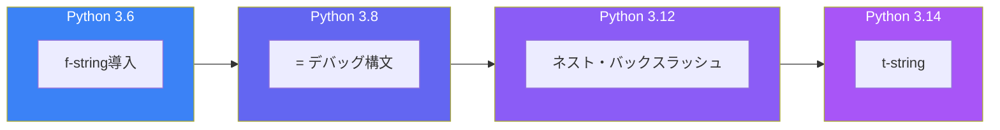

f-string（フォーマット済み文字列リテラル）は Python 3.6 で導入され、以来 Python で最も便利な機能の一つとなりました。各バージョンで機能が拡張され、より強力で柔軟になっています。

## f-stringの基本

```python
name = "Python"
version = 3.12

# 基本的な変数埋め込み
print(f"Hello, {name}!")  # Hello, Python!

# 式の埋め込み
print(f"Next version: {version + 0.01}")  # Next version: 3.13

# メソッド呼び出し
print(f"{name.lower()}")  # python
```

## フォーマット指定

### 数値フォーマット

```python
value = 1234.5678

# 小数点以下の桁数
print(f"{value:.2f}")      # 1234.57

# 桁区切り
print(f"{value:,.2f}")     # 1,234.57
print(f"{value:_.2f}")     # 1_234.57

# パーセント表示
ratio = 0.756
print(f"{ratio:.1%}")      # 75.6%

# 指数表記
big = 1234567890
print(f"{big:.2e}")        # 1.23e+09

# 2進数、8進数、16進数
num = 255
print(f"{num:b}")          # 11111111
print(f"{num:o}")          # 377
print(f"{num:x}")          # ff
print(f"{num:#x}")         # 0xff
```

### 文字列の配置

```python
text = "Python"

# 幅指定と配置
print(f"{text:>10}")   # "    Python" (右寄せ)
print(f"{text:<10}")   # "Python    " (左寄せ)
print(f"{text:^10}")   # "  Python  " (中央)

# 埋め文字
print(f"{text:->10}")  # "----Python"
print(f"{text:-^10}")  # "--Python--"

# 切り詰め
long_text = "Hello, World!"
print(f"{long_text:.5}")  # "Hello"
```

## デバッグ用 = 構文（Python 3.8+）

変数名と値を同時に表示：

```python
x = 10
y = 20
name = "Alice"

# 従来の方法
print(f"x={x}, y={y}")  # x=10, y=20

# = 構文（より簡潔）
print(f"{x=}, {y=}")    # x=10, y=20

# 式にも使用可能
print(f"{x + y=}")      # x + y=30

# フォーマット指定と組み合わせ
price = 19.99
print(f"{price=:.2f}")  # price=19.99

# スペースを含む形式
print(f"{name = }")     # name = 'Alice'
```

### デバッグでの活用

```python
def calculate(a, b, operation):
    result = eval(f"{a} {operation} {b}")
    print(f"DEBUG: {a=}, {b=}, {operation=}, {result=}")
    return result

calculate(5, 3, "+")
# DEBUG: a=5, b=3, operation='+', result=8
```

## Python 3.12の改善

### ネストした式のサポート

Python 3.12以前は、f-string内のクォートに制限がありました。3.12では解消されています：

```python
# Python 3.12: 同じクォートをネストで使用可能
data = {"name": "Alice", "age": 30}
print(f"User: {data["name"]}")  # User: Alice

# 複雑なネスト
users = [{"name": "Alice"}, {"name": "Bob"}]
print(f"First user: {users[0]["name"]}")  # First user: Alice

# 複数行のf-string
result = f"""
Summary:
  Name: {data["name"]}
  Age: {data["age"]}
"""
```

### バックスラッシュのサポート

Python 3.12では、f-string内でバックスラッシュが使用可能に：

```python
# Python 3.12: バックスラッシュが使用可能
items = ["apple", "banana", "cherry"]
print(f"Items:\n{'\n'.join(items)}")
# Items:
# apple
# banana
# cherry

# タブ区切り
print(f"A\tB\t{items[0]}")  # A	B	apple
```

### コメントのサポート

```python
# Python 3.12: f-string内にコメントを記述可能
result = f"""
{
    x  # x変数
    +
    y  # y変数
}
"""
```

## Python 3.14のt-string（テンプレート文字列）

Python 3.14では、セキュリティを考慮した新しい文字列リテラル `t-string` が導入予定です：

```python
# t-string（Python 3.14+）
from string.templatelib import Template

user_input = "'; DROP TABLE users; --"

# f-stringは直接埋め込む（SQLインジェクションの危険）
query_unsafe = f"SELECT * FROM users WHERE name = '{user_input}'"

# t-stringはTemplateオブジェクトを返す
query_template = t"SELECT * FROM users WHERE name = '{user_input}'"
# 後で安全にレンダリング
query_safe = render_sql(query_template)
```

### t-stringのユースケース

```python
# HTMLエスケープ
def render_html(template: Template) -> str:
    # 値を自動的にエスケープして安全なHTMLを生成
    pass

user_content = "<script>alert('xss')</script>"
html = t"<div>{user_content}</div>"
safe_html = render_html(html)
# <div>&lt;script&gt;alert('xss')&lt;/script&gt;</div>

# ログフォーマット
def log_with_context(template: Template) -> None:
    # 構造化ログとして処理
    pass

log_with_context(t"User {user_id} performed {action}")
```

## 実践的なパターン

### テーブル出力

```python
data = [
    ("Alice", 28, "Engineer"),
    ("Bob", 35, "Designer"),
    ("Charlie", 42, "Manager"),
]

# ヘッダー
print(f"{'Name':<10} {'Age':>5} {'Role':<12}")
print("-" * 30)

# データ行
for name, age, role in data:
    print(f"{name:<10} {age:>5} {role:<12}")

# 出力:
# Name        Age Role
# ------------------------------
# Alice        28 Engineer
# Bob          35 Designer
# Charlie      42 Manager
```

### 条件付きフォーマット

```python
def format_status(status: str, count: int) -> str:
    color = "green" if status == "success" else "red"
    emoji = "✓" if status == "success" else "✗"
    return f"{emoji} {status.upper()}: {count} {'item' if count == 1 else 'items'}"

print(format_status("success", 5))  # ✓ SUCCESS: 5 items
print(format_status("error", 1))    # ✗ ERROR: 1 item
```

### 日付と時刻

```python
from datetime import datetime

now = datetime.now()

# 様々なフォーマット
print(f"{now:%Y-%m-%d}")           # 2025-11-28
print(f"{now:%H:%M:%S}")           # 14:30:45
print(f"{now:%Y-%m-%d %H:%M}")     # 2025-11-28 14:30
print(f"{now:%A, %B %d, %Y}")      # Friday, November 28, 2025

# ログ形式
print(f"[{now:%Y-%m-%d %H:%M:%S}] Event occurred")
```

### 動的なフォーマット指定

```python
def format_number(value: float, precision: int, width: int) -> str:
    return f"{value:{width}.{precision}f}"

print(format_number(3.14159, 2, 8))   # "    3.14"
print(format_number(3.14159, 4, 10))  # "    3.1416"

# フォーマット指定自体を変数に
align = "^"
fill = "-"
width = 20
text = "centered"
print(f"{text:{fill}{align}{width}}")  # "------centered------"
```

## パフォーマンス比較

```python
import timeit

name = "World"

# 各方法の比較
methods = {
    "f-string": lambda: f"Hello, {name}!",
    "format()": lambda: "Hello, {}!".format(name),
    "%": lambda: "Hello, %s!" % name,
    "concat": lambda: "Hello, " + name + "!",
}

for method, func in methods.items():
    time = timeit.timeit(func, number=1000000)
    print(f"{method:>10}: {time:.4f}s")
```

一般的に、f-stringが最も高速です：

| 方法 | 相対速度 |
|------|---------|
| f-string | 1.0x（最速） |
| % フォーマット | 1.2x |
| .format() | 1.5x |
| 文字列連結 | 1.8x |

## まとめ

f-stringの進化により、Pythonの文字列処理はますます強力になっています：



| バージョン | 新機能 |
|-----------|--------|
| 3.6 | f-string導入 |
| 3.8 | `=`デバッグ構文 |
| 3.12 | ネストしたクォート、バックスラッシュ |
| 3.14 | t-string（テンプレート文字列） |

主要な原則：

- **f-stringを優先**: 最も読みやすく高速
- **=構文でデバッグ**: print文デバッグが劇的に改善
- **フォーマット指定を活用**: 数値、配置、幅を制御
- **t-stringを待つ**: セキュリティが重要な場面で活躍予定

f-stringは単なる文字列フォーマット以上の価値を提供し、Pythonコードをより読みやすく、保守しやすくします。

## 参考資料

- [PEP 498 – Literal String Interpolation](https://peps.python.org/pep-0498/)
- [PEP 701 – Syntactic formalization of f-strings](https://peps.python.org/pep-0701/)
- [PEP 750 – Template Strings](https://peps.python.org/pep-0750/)
