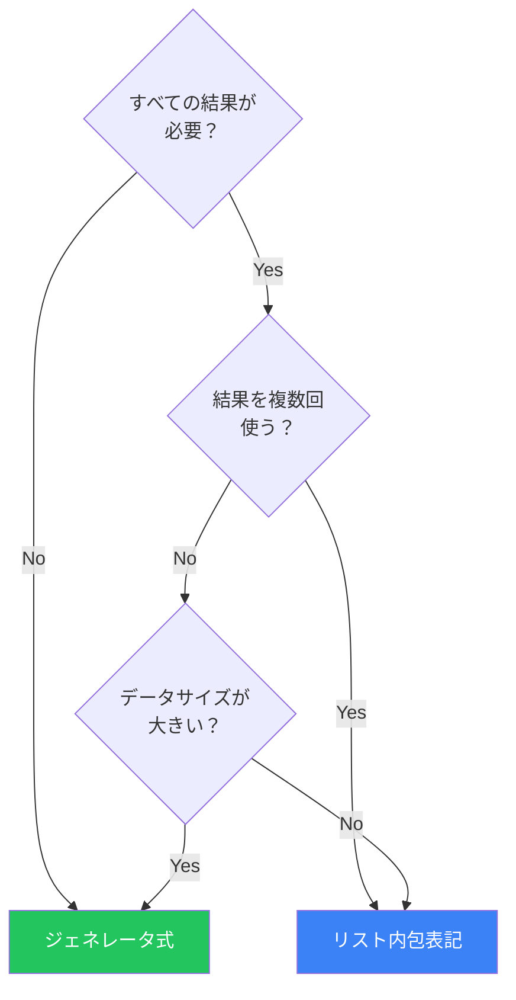

大量のデータを処理する際、すべてをメモリに読み込むとリソースを圧迫します。イテレータとジェネレータを使えば、必要な時に必要な分だけデータを生成する「遅延評価」が可能になります。

## イテレータの基本

### イテラブルとイテレータ

```python
# イテラブル（Iterable）: __iter__を持つオブジェクト
numbers = [1, 2, 3]

# イテレータ（Iterator）: __next__を持つオブジェクト
iterator = iter(numbers)

print(next(iterator))  # 1
print(next(iterator))  # 2
print(next(iterator))  # 3
print(next(iterator))  # StopIteration例外
```

### forループの内部動作

```python
# forループは内部的にこう動作する
numbers = [1, 2, 3]

iterator = iter(numbers)
while True:
    try:
        item = next(iterator)
        print(item)
    except StopIteration:
        break
```

### カスタムイテレータ

```python
class CountDown:
    def __init__(self, start: int):
        self.current = start

    def __iter__(self):
        return self

    def __next__(self) -> int:
        if self.current <= 0:
            raise StopIteration
        self.current -= 1
        return self.current + 1

for num in CountDown(5):
    print(num)  # 5, 4, 3, 2, 1
```

## ジェネレータ関数

`yield`キーワードを使用した関数は、ジェネレータを返します：

```python
def countdown(n: int):
    while n > 0:
        yield n
        n -= 1

# ジェネレータオブジェクトを取得
gen = countdown(5)
print(type(gen))  # <class 'generator'>

# イテレート
for num in gen:
    print(num)  # 5, 4, 3, 2, 1
```

### yieldの動作

```python
def simple_generator():
    print("Start")
    yield 1
    print("After first yield")
    yield 2
    print("After second yield")
    yield 3
    print("End")

gen = simple_generator()
print(next(gen))  # "Start" を出力後、1を返す
print(next(gen))  # "After first yield" を出力後、2を返す
print(next(gen))  # "After second yield" を出力後、3を返す
# next(gen)  # "End" を出力後、StopIteration
```

### メモリ効率の比較

```python
import sys

# リスト: すべてをメモリに保持
def get_squares_list(n: int) -> list[int]:
    return [x * x for x in range(n)]

# ジェネレータ: 必要な時に生成
def get_squares_gen(n: int):
    for x in range(n):
        yield x * x

n = 1_000_000

list_result = get_squares_list(n)
gen_result = get_squares_gen(n)

print(f"List size: {sys.getsizeof(list_result):,} bytes")  # ~8MB
print(f"Generator size: {sys.getsizeof(gen_result):,} bytes")  # ~200 bytes
```

## ジェネレータ式

リスト内包表記をジェネレータに：

```python
# リスト内包表記（即座に全要素を生成）
squares_list = [x * x for x in range(1000)]

# ジェネレータ式（遅延評価）
squares_gen = (x * x for x in range(1000))

# 使用例
total = sum(x * x for x in range(1000000))  # メモリ効率が良い
```

### いつジェネレータ式を使うか



## yield from

サブジェネレータに委譲：

```python
def flatten(nested_list):
    for item in nested_list:
        if isinstance(item, list):
            yield from flatten(item)  # 再帰的に委譲
        else:
            yield item

nested = [1, [2, 3, [4, 5]], 6, [7, 8]]
print(list(flatten(nested)))  # [1, 2, 3, 4, 5, 6, 7, 8]
```

### yield fromとforの違い

```python
# forを使った場合
def chain_with_for(*iterables):
    for it in iterables:
        for item in it:
            yield item

# yield fromを使った場合（より簡潔）
def chain_with_yield_from(*iterables):
    for it in iterables:
        yield from it

# 同じ結果
result1 = list(chain_with_for([1, 2], [3, 4]))      # [1, 2, 3, 4]
result2 = list(chain_with_yield_from([1, 2], [3, 4]))  # [1, 2, 3, 4]
```

## itertools

標準ライブラリの強力なイテレータツール：

### 無限イテレータ

```python
from itertools import count, cycle, repeat

# count: 無限カウンタ
for i in count(10, 2):  # 10から2ずつ
    if i > 20:
        break
    print(i)  # 10, 12, 14, 16, 18, 20

# cycle: 無限ループ
colors = cycle(["red", "green", "blue"])
for _, color in zip(range(5), colors):
    print(color)  # red, green, blue, red, green

# repeat: 同じ値を繰り返し
for x in repeat("hello", 3):
    print(x)  # hello, hello, hello
```

### 組み合わせ

```python
from itertools import chain, product, permutations, combinations

# chain: イテラブルを連結
print(list(chain([1, 2], [3, 4], [5])))  # [1, 2, 3, 4, 5]

# product: デカルト積
print(list(product("AB", [1, 2])))
# [('A', 1), ('A', 2), ('B', 1), ('B', 2)]

# permutations: 順列
print(list(permutations("ABC", 2)))
# [('A', 'B'), ('A', 'C'), ('B', 'A'), ('B', 'C'), ('C', 'A'), ('C', 'B')]

# combinations: 組み合わせ
print(list(combinations("ABC", 2)))
# [('A', 'B'), ('A', 'C'), ('B', 'C')]
```

### フィルタリングと変換

```python
from itertools import filterfalse, takewhile, dropwhile, islice

numbers = [1, 4, 6, 4, 4, 2, 8, 3]

# filterfalse: 条件がFalseの要素
print(list(filterfalse(lambda x: x % 2, numbers)))  # [4, 6, 4, 4, 2, 8]

# takewhile: 条件がTrueの間取得
print(list(takewhile(lambda x: x < 5, numbers)))  # [1, 4]

# dropwhile: 条件がTrueの間スキップ
print(list(dropwhile(lambda x: x < 5, numbers)))  # [6, 4, 4, 2, 8, 3]

# islice: スライス操作
print(list(islice(numbers, 2, 5)))  # [6, 4, 4]
```

### グループ化

```python
from itertools import groupby

data = [
    ("A", 1), ("A", 2), ("B", 3), ("B", 4), ("A", 5)
]

# 連続した同じキーでグループ化（ソート済みが前提）
sorted_data = sorted(data, key=lambda x: x[0])
for key, group in groupby(sorted_data, key=lambda x: x[0]):
    print(f"{key}: {list(group)}")
# A: [('A', 1), ('A', 2), ('A', 5)]
# B: [('B', 3), ('B', 4)]
```

## 実践的なパターン

### ファイルの遅延読み込み

```python
def read_large_file(path: str):
    """大きなファイルを1行ずつ処理"""
    with open(path, 'r') as f:
        for line in f:
            yield line.strip()

# メモリ効率よく処理
for line in read_large_file("huge_file.txt"):
    if "error" in line.lower():
        print(line)
```

### パイプライン処理

```python
def read_data(path: str):
    with open(path) as f:
        for line in f:
            yield line.strip()

def parse_json(lines):
    import json
    for line in lines:
        yield json.loads(line)

def filter_active(records):
    for record in records:
        if record.get("active"):
            yield record

def extract_names(records):
    for record in records:
        yield record["name"]

# パイプラインを構築
pipeline = extract_names(
    filter_active(
        parse_json(
            read_data("users.jsonl")
        )
    )
)

# 遅延評価で効率的に処理
for name in pipeline:
    print(name)
```

### バッチ処理

```python
from itertools import islice

def batched(iterable, n: int):
    """イテラブルをn個ずつのバッチに分割"""
    iterator = iter(iterable)
    while batch := list(islice(iterator, n)):
        yield batch

# 1000件のデータを100件ずつ処理
items = range(1000)
for batch in batched(items, 100):
    process_batch(batch)  # 100件ずつ処理
```

### 無限シーケンス

```python
def fibonacci():
    """無限フィボナッチ数列"""
    a, b = 0, 1
    while True:
        yield a
        a, b = b, a + b

# 最初の10個を取得
from itertools import islice
print(list(islice(fibonacci(), 10)))
# [0, 1, 1, 2, 3, 5, 8, 13, 21, 34]
```

## send()とジェネレータの双方向通信

```python
def accumulator():
    total = 0
    while True:
        value = yield total
        if value is not None:
            total += value

acc = accumulator()
next(acc)        # ジェネレータを起動
print(acc.send(10))  # 10
print(acc.send(20))  # 30
print(acc.send(15))  # 45
```

## まとめ

イテレータとジェネレータは、メモリ効率と処理効率を両立させる強力なツールです：

| 概念 | 説明 | ユースケース |
|------|------|-------------|
| イテレータ | `__next__`で値を順次取得 | カスタム反復処理 |
| ジェネレータ関数 | `yield`で値を生成 | 遅延評価、無限シーケンス |
| ジェネレータ式 | `(expr for x in iter)` | ワンライナーの遅延評価 |
| `yield from` | サブジェネレータに委譲 | ネストした構造の平坦化 |
| itertools | 標準ライブラリのツール | 組み合わせ、フィルタリング |

主要な原則：

- **遅延評価を活用**: 大量データはジェネレータで処理
- **パイプラインを構築**: ジェネレータをチェーンして効率化
- **itertoolsを知る**: 車輪の再発明を避ける
- **メモリを意識**: リストが必要な時以外はジェネレータ

ジェネレータは「必要な時に必要な分だけ」というPythonの効率的なデータ処理の要です。

## 参考資料

- [itertools — Functions creating iterators](https://docs.python.org/3/library/itertools.html)
- [Fluent Python, 2nd Edition - Chapter 17](https://www.oreilly.com/library/view/fluent-python-2nd/9781492056348/)
- [PEP 380 – Syntax for Delegating to a Subgenerator](https://peps.python.org/pep-0380/)
