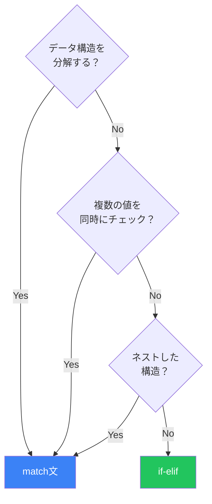

Python 3.10で導入された`match`文は、値の構造に基づいて分岐する強力な機能です。単純なswitch文を超えて、シーケンス、マッピング、クラスインスタンスなど、複雑なデータ構造を分解しながらマッチングできます。

## 基本構文

```python
def http_status(status: int) -> str:
    match status:
        case 200:
            return "OK"
        case 404:
            return "Not Found"
        case 500:
            return "Internal Server Error"
        case _:
            return "Unknown"
```

`_`はワイルドカードで、どんな値にもマッチします（他のcaseにマッチしなかった場合のデフォルト）。

## パターンの種類

### リテラルパターン

特定の値に完全一致：

```python
def describe_value(value):
    match value:
        case 0:
            return "zero"
        case 1:
            return "one"
        case True:  # 注意: True == 1 なので順序が重要
            return "true"
        case "hello":
            return "greeting"
        case None:
            return "nothing"
```

### キャプチャパターン

変数に値をバインド：

```python
def process(command: str) -> str:
    match command.split():
        case ["quit"]:
            return "Goodbye!"
        case ["hello", name]:
            return f"Hello, {name}!"
        case ["add", x, y]:
            return f"Result: {int(x) + int(y)}"
        case _:
            return "Unknown command"

print(process("hello World"))  # Hello, World!
print(process("add 5 3"))      # Result: 8
```

### シーケンスパターン

リストやタプルをマッチング：

```python
def analyze_sequence(seq):
    match seq:
        case []:
            return "empty"
        case [x]:
            return f"single: {x}"
        case [x, y]:
            return f"pair: {x}, {y}"
        case [first, *rest]:
            return f"first: {first}, rest: {rest}"

print(analyze_sequence([]))           # empty
print(analyze_sequence([1]))          # single: 1
print(analyze_sequence([1, 2]))       # pair: 1, 2
print(analyze_sequence([1, 2, 3, 4])) # first: 1, rest: [2, 3, 4]
```

### マッピングパターン

辞書をマッチング：

```python
def handle_event(event: dict):
    match event:
        case {"type": "click", "x": x, "y": y}:
            return f"Click at ({x}, {y})"
        case {"type": "keypress", "key": key}:
            return f"Key pressed: {key}"
        case {"type": "scroll", "direction": d, **rest}:
            return f"Scroll {d}, extra: {rest}"
        case _:
            return "Unknown event"

print(handle_event({"type": "click", "x": 100, "y": 200}))
# Click at (100, 200)

print(handle_event({"type": "scroll", "direction": "up", "speed": 5}))
# Scroll up, extra: {'speed': 5}
```

### クラスパターン

オブジェクトの属性をマッチング：

```python
from dataclasses import dataclass

@dataclass
class Point:
    x: float
    y: float

@dataclass
class Circle:
    center: Point
    radius: float

@dataclass
class Rectangle:
    top_left: Point
    width: float
    height: float

def area(shape) -> float:
    match shape:
        case Circle(center=_, radius=r):
            return 3.14159 * r * r
        case Rectangle(width=w, height=h):
            return w * h
        case Point():
            return 0.0
        case _:
            raise ValueError(f"Unknown shape: {shape}")

print(area(Circle(Point(0, 0), 5)))      # 78.53975
print(area(Rectangle(Point(0, 0), 3, 4))) # 12.0
```

## ガード条件

`if`でマッチに追加条件を指定：

```python
def classify_number(n: int) -> str:
    match n:
        case 0:
            return "zero"
        case x if x < 0:
            return "negative"
        case x if x % 2 == 0:
            return "positive even"
        case _:
            return "positive odd"

print(classify_number(-5))  # negative
print(classify_number(4))   # positive even
print(classify_number(7))   # positive odd
```

### 複合ガード

```python
def validate_user(user: dict) -> str:
    match user:
        case {"name": name, "age": age} if age >= 18 and len(name) > 0:
            return f"Valid adult: {name}"
        case {"name": name, "age": age} if age < 18:
            return f"Minor: {name}"
        case {"name": ""}:
            return "Empty name"
        case _:
            return "Invalid user"
```

## ORパターン

複数のパターンを`|`で組み合わせ：

```python
def day_type(day: str) -> str:
    match day.lower():
        case "saturday" | "sunday":
            return "weekend"
        case "monday" | "tuesday" | "wednesday" | "thursday" | "friday":
            return "weekday"
        case _:
            return "invalid"

print(day_type("Saturday"))  # weekend
print(day_type("Monday"))    # weekday
```

### ステータスコードの分類

```python
def classify_status(code: int) -> str:
    match code:
        case 200 | 201 | 204:
            return "success"
        case 301 | 302 | 307 | 308:
            return "redirect"
        case 400 | 401 | 403 | 404:
            return "client error"
        case 500 | 502 | 503:
            return "server error"
        case _:
            return "unknown"
```

## ASパターン

パターン全体を変数にバインド：

```python
def process_point(point):
    match point:
        case (x, y) as p if x == y:
            return f"Diagonal point: {p}"
        case (0, y) as p:
            return f"On Y-axis: {p}"
        case (x, 0) as p:
            return f"On X-axis: {p}"
        case p:
            return f"General point: {p}"

print(process_point((5, 5)))   # Diagonal point: (5, 5)
print(process_point((0, 10)))  # On Y-axis: (0, 10)
```

## ネストしたパターン

複雑な構造を再帰的にマッチング：

```python
def process_json(data):
    match data:
        case {"users": [{"name": name, "role": "admin"}, *_]}:
            return f"First admin: {name}"
        case {"users": [first, second, *rest]}:
            return f"First two users: {first}, {second}"
        case {"error": {"code": code, "message": msg}}:
            return f"Error {code}: {msg}"
        case {"data": {"items": [*items]}} if len(items) > 0:
            return f"Found {len(items)} items"
        case _:
            return "Unknown structure"

data = {
    "users": [
        {"name": "Alice", "role": "admin"},
        {"name": "Bob", "role": "user"}
    ]
}
print(process_json(data))  # First admin: Alice
```

## 実践的なパターン

### コマンドパーサー

```python
def execute(command: list[str]) -> str:
    match command:
        case ["exit" | "quit" | "q"]:
            return "Exiting..."
        case ["help"]:
            return "Available commands: help, list, add, remove"
        case ["list"]:
            return "Listing items..."
        case ["add", item]:
            return f"Adding: {item}"
        case ["add", *items] if len(items) > 1:
            return f"Adding multiple: {', '.join(items)}"
        case ["remove", item]:
            return f"Removing: {item}"
        case [cmd, *_]:
            return f"Unknown command: {cmd}"
        case []:
            return "No command provided"
```

### APIレスポンスハンドリング

```python
from typing import Any

def handle_response(response: dict[str, Any]) -> str:
    match response:
        case {"status": "success", "data": data}:
            return f"Success: {data}"
        case {"status": "error", "error": {"code": code, "message": msg}}:
            return f"Error {code}: {msg}"
        case {"status": "pending", "retry_after": seconds}:
            return f"Retry after {seconds} seconds"
        case {"status": status}:
            return f"Unknown status: {status}"
        case _:
            return "Invalid response format"
```

### 式ツリーの評価

```python
from dataclasses import dataclass
from typing import Union

@dataclass
class Num:
    value: float

@dataclass
class Add:
    left: "Expr"
    right: "Expr"

@dataclass
class Mul:
    left: "Expr"
    right: "Expr"

Expr = Union[Num, Add, Mul]

def evaluate(expr: Expr) -> float:
    match expr:
        case Num(value=v):
            return v
        case Add(left=l, right=r):
            return evaluate(l) + evaluate(r)
        case Mul(left=l, right=r):
            return evaluate(l) * evaluate(r)

# (2 + 3) * 4 = 20
expr = Mul(Add(Num(2), Num(3)), Num(4))
print(evaluate(expr))  # 20.0
```

## 注意点とベストプラクティス

### パターンの順序

より具体的なパターンを先に：

```python
# 正しい順序
match value:
    case [1, 2, 3]:        # 具体的
        pass
    case [1, 2, x]:        # やや具体的
        pass
    case [1, *rest]:       # 一般的
        pass
    case _:                # 最も一般的
        pass
```

### 定数の使用

定数はドット付きの名前で参照：

```python
class HttpStatus:
    OK = 200
    NOT_FOUND = 404

def handle_status(code: int) -> str:
    match code:
        case HttpStatus.OK:      # 定数として認識
            return "OK"
        case HttpStatus.NOT_FOUND:
            return "Not Found"
        case _:
            return "Unknown"
```

### if-elifとの使い分け



## まとめ

`match`文は、Pythonに強力なパターンマッチングをもたらします：

| パターン | 用途 |
|---------|------|
| リテラル | 特定の値にマッチ |
| キャプチャ | 値を変数にバインド |
| シーケンス | リスト/タプルを分解 |
| マッピング | 辞書を分解 |
| クラス | オブジェクト属性を分解 |
| OR (`\|`) | 複数パターンを組み合わせ |
| AS | パターン全体をキャプチャ |
| ガード | 追加条件を指定 |

主要な原則：

- **構造を分解する**: シンプルな値比較ならif-elif、構造分解ならmatch
- **具体的なパターンを先に**: より限定的なcaseを上に配置
- **ガードを活用**: パターンだけでは表現できない条件を追加
- **ワイルドカードで安全に**: `case _`でフォールバックを用意

match文は、複雑なデータ構造の処理を宣言的かつ読みやすく記述できる、モダンPythonの必須機能です。

## 参考資料

- [PEP 634 – Structural Pattern Matching](https://peps.python.org/pep-0634/)
- [PEP 636 – Structural Pattern Matching: Tutorial](https://peps.python.org/pep-0636/)
- [Fluent Python, 2nd Edition - Chapter 2, 18](https://www.oreilly.com/library/view/fluent-python-2nd/9781492056348/)
