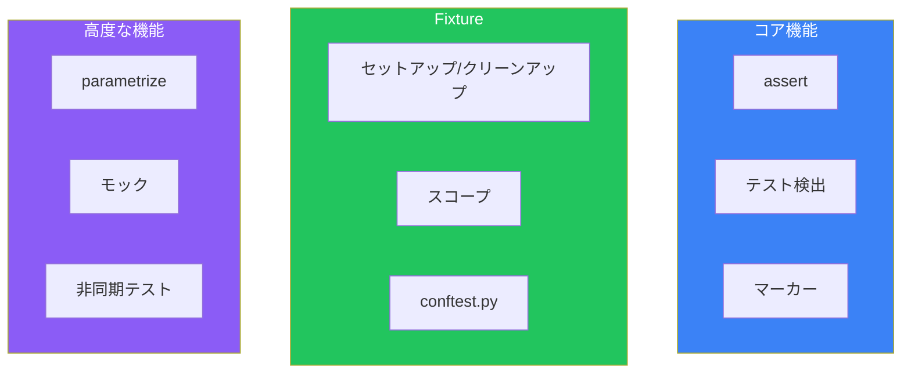

pytestはPythonの事実上の標準テストフレームワークです。シンプルな構文、強力なfixture、豊富なプラグインにより、効果的なテストを効率的に書けます。

## pytestの基本

### インストール

```bash
pip install pytest
# または
uv add --dev pytest
```

### 最初のテスト

```python
# test_calculator.py
def add(a: int, b: int) -> int:
    return a + b

def test_add():
    assert add(1, 2) == 3
    assert add(-1, 1) == 0
    assert add(0, 0) == 0
```

```bash
# テスト実行
pytest

# 詳細出力
pytest -v

# 特定のファイル
pytest test_calculator.py

# 特定のテスト
pytest test_calculator.py::test_add
```

### assertの使い方

```python
def test_assertions():
    # 等価性
    assert 1 + 1 == 2

    # 真偽値
    assert True
    assert not False

    # 含む/含まない
    assert "hello" in "hello world"
    assert 3 not in [1, 2]

    # 例外を期待
    import pytest
    with pytest.raises(ValueError):
        int("not a number")

    # 例外メッセージをチェック
    with pytest.raises(ValueError, match="invalid literal"):
        int("not a number")
```

## Fixture

### 基本的なfixture

```python
import pytest

@pytest.fixture
def sample_user():
    """テスト用のユーザーデータ"""
    return {"id": 1, "name": "Alice", "email": "alice@example.com"}

def test_user_name(sample_user):
    assert sample_user["name"] == "Alice"

def test_user_email(sample_user):
    assert "@" in sample_user["email"]
```

### fixtureのスコープ

```python
@pytest.fixture(scope="function")  # デフォルト: 各テストで新規作成
def per_test_resource():
    return create_resource()

@pytest.fixture(scope="class")  # クラス内で共有
def per_class_resource():
    return create_resource()

@pytest.fixture(scope="module")  # モジュール内で共有
def per_module_resource():
    return create_resource()

@pytest.fixture(scope="session")  # セッション全体で共有
def per_session_resource():
    return create_resource()
```

### セットアップとクリーンアップ

```python
import pytest

@pytest.fixture
def database_connection():
    # セットアップ
    conn = create_connection()

    yield conn  # テストに値を渡す

    # クリーンアップ
    conn.close()

def test_query(database_connection):
    result = database_connection.execute("SELECT 1")
    assert result == 1
```

### conftest.py

プロジェクト全体で共有するfixtureを定義：

```python
# conftest.py
import pytest

@pytest.fixture
def api_client():
    """APIクライアントをテスト全体で共有"""
    from my_app import create_client
    return create_client(base_url="http://test-api.local")

@pytest.fixture
def test_user(api_client):
    """テストユーザーを作成し、テスト後に削除"""
    user = api_client.create_user(name="Test User")
    yield user
    api_client.delete_user(user.id)
```

## Parametrize

### 複数のケースをテスト

```python
import pytest

@pytest.mark.parametrize("input,expected", [
    (1, 1),
    (2, 4),
    (3, 9),
    (4, 16),
])
def test_square(input, expected):
    assert input ** 2 == expected
```

### 複数パラメータの組み合わせ

```python
@pytest.mark.parametrize("x", [1, 2])
@pytest.mark.parametrize("y", [3, 4])
def test_multiply(x, y):
    # (1,3), (1,4), (2,3), (2,4) の4パターン
    assert x * y == x * y
```

### 条件付きスキップ

```python
import sys
import pytest

@pytest.mark.parametrize("value,expected", [
    (1, "one"),
    pytest.param(2, "two", marks=pytest.mark.skip(reason="未実装")),
    pytest.param(3, "three", marks=pytest.mark.skipif(
        sys.version_info < (3, 11),
        reason="Python 3.11以上が必要"
    )),
])
def test_number_to_word(value, expected):
    assert number_to_word(value) == expected
```

## モック

### unittest.mockの使用

```python
from unittest.mock import Mock, patch, MagicMock

def test_with_mock():
    # Mockオブジェクト
    mock_api = Mock()
    mock_api.get_user.return_value = {"id": 1, "name": "Alice"}

    result = mock_api.get_user(1)
    assert result["name"] == "Alice"
    mock_api.get_user.assert_called_once_with(1)

def test_with_patch():
    with patch("my_module.requests.get") as mock_get:
        mock_get.return_value.json.return_value = {"status": "ok"}

        from my_module import fetch_data
        result = fetch_data("http://example.com")

        assert result["status"] == "ok"
```

### pytest-mockプラグイン

```python
# pip install pytest-mock

def test_with_mocker(mocker):
    mock_api = mocker.patch("my_module.api_client")
    mock_api.get_user.return_value = {"id": 1}

    from my_module import get_user_name
    result = get_user_name(1)

    mock_api.get_user.assert_called_once_with(1)
```

### fixtureとモックの組み合わせ

```python
import pytest
from unittest.mock import Mock

@pytest.fixture
def mock_database():
    db = Mock()
    db.query.return_value = [
        {"id": 1, "name": "Item 1"},
        {"id": 2, "name": "Item 2"},
    ]
    return db

def test_list_items(mock_database):
    from my_app import ItemService
    service = ItemService(mock_database)

    items = service.list_all()

    assert len(items) == 2
    mock_database.query.assert_called_once()
```

## 非同期テスト

### pytest-asyncio

```bash
pip install pytest-asyncio
```

```python
import pytest
import asyncio

@pytest.mark.asyncio
async def test_async_function():
    result = await async_fetch_data()
    assert result == "expected"

@pytest.mark.asyncio
async def test_async_with_timeout():
    async with asyncio.timeout(1.0):
        result = await slow_operation()
        assert result is not None
```

### 非同期fixture

```python
import pytest

@pytest.fixture
async def async_client():
    client = await create_async_client()
    yield client
    await client.close()

@pytest.mark.asyncio
async def test_with_async_fixture(async_client):
    response = await async_client.get("/users")
    assert response.status == 200
```

## テストの整理

### マーカー

```python
import pytest

@pytest.mark.slow
def test_heavy_computation():
    """時間のかかるテスト"""
    pass

@pytest.mark.integration
def test_database_connection():
    """統合テスト"""
    pass

@pytest.mark.skip(reason="一時的にスキップ")
def test_broken_feature():
    pass

@pytest.mark.xfail(reason="既知のバグ")
def test_known_bug():
    pass
```

```bash
# マーカーでフィルタ
pytest -m "not slow"
pytest -m "integration"
```

### pytest.ini / pyproject.toml

```toml
# pyproject.toml
[tool.pytest.ini_options]
testpaths = ["tests"]
python_files = ["test_*.py"]
python_classes = ["Test*"]
python_functions = ["test_*"]
addopts = "-v --tb=short"
markers = [
    "slow: marks tests as slow",
    "integration: marks tests as integration tests",
]
```

## カバレッジ

### pytest-cov

```bash
pip install pytest-cov
```

```bash
# カバレッジレポート
pytest --cov=my_package

# HTML出力
pytest --cov=my_package --cov-report=html

# 最小カバレッジを要求
pytest --cov=my_package --cov-fail-under=80
```

```toml
# pyproject.toml
[tool.coverage.run]
source = ["src"]
omit = ["*/tests/*", "*/__pycache__/*"]

[tool.coverage.report]
exclude_lines = [
    "pragma: no cover",
    "if TYPE_CHECKING:",
    "raise NotImplementedError",
]
```

## 実践的なパターン

### テストの構造

```
tests/
├── conftest.py          # 共有fixture
├── unit/                # ユニットテスト
│   ├── test_models.py
│   └── test_services.py
├── integration/         # 統合テスト
│   └── test_api.py
└── e2e/                 # E2Eテスト
    └── test_workflow.py
```

### Given-When-Then パターン

```python
def test_user_registration():
    # Given: 前提条件
    user_data = {"email": "test@example.com", "password": "secure123"}

    # When: 実行
    result = register_user(user_data)

    # Then: 検証
    assert result.success is True
    assert result.user.email == "test@example.com"
```

### ファクトリfixture

```python
import pytest

@pytest.fixture
def user_factory():
    """テストユーザーを生成するファクトリ"""
    created_users = []

    def create(name: str = "Test User", email: str = None):
        email = email or f"{name.lower().replace(' ', '.')}@test.com"
        user = User(name=name, email=email)
        created_users.append(user)
        return user

    yield create

    # クリーンアップ
    for user in created_users:
        user.delete()

def test_multiple_users(user_factory):
    alice = user_factory("Alice")
    bob = user_factory("Bob")

    assert alice.email != bob.email
```

## まとめ

pytestの主要機能：



| 機能 | 用途 |
|------|------|
| `@pytest.fixture` | テストデータ・リソースの準備 |
| `@pytest.mark.parametrize` | 複数ケースのテスト |
| `conftest.py` | 共有fixtureの定義 |
| `mocker` / `patch` | 依存関係のモック |
| `@pytest.mark.asyncio` | 非同期テスト |
| `pytest-cov` | カバレッジ計測 |

主要な原則：

- **fixtureを活用**: 重複を減らし、テストを読みやすく
- **parametrizeでケースを網羅**: 1つのテストで複数のケースをカバー
- **適切なスコープ**: リソースの作成コストに応じてスコープを選択
- **モックは必要最小限**: 過度なモックはテストの価値を下げる
- **カバレッジを意識**: ただし100%を目標にしない

pytestは、シンプルな構文で強力なテストを書けるPython開発者の必須ツールです。

## 参考資料

- [pytest Documentation](https://docs.pytest.org/)
- [pytest-asyncio](https://pytest-asyncio.readthedocs.io/)
- [pytest-cov](https://pytest-cov.readthedocs.io/)
- [pytest-mock](https://pytest-mock.readthedocs.io/)
