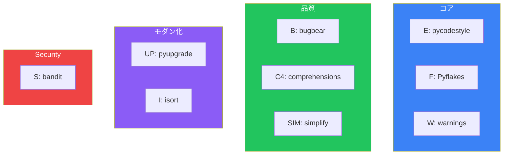

RuffはRust製の超高速Pythonリンター・フォーマッターです。Flake8、Black、isort、pyupgrade、その他多くのツールを1つに統合し、10-100倍高速に実行できます。

## なぜRuffなのか

### 従来のツールチェーン

```bash
# 複数のツールをインストール
pip install flake8 black isort pyupgrade autoflake

# 個別に実行
black .
isort .
flake8 .
pyupgrade --py310-plus **/*.py
autoflake --remove-all-unused-imports -r .
```

### Ruffなら

```bash
# 1つのツール
pip install ruff

# すべてを実行
ruff check --fix .
ruff format .
```

### パフォーマンス比較

```
Flake8:    ~12秒
Pylint:    ~60秒
Ruff:      ~0.1秒
```

## インストールと基本操作

### インストール

```bash
# pip
pip install ruff

# uv
uv add --dev ruff

# Homebrew
brew install ruff
```

### 基本コマンド

```bash
# リントチェック
ruff check .

# 自動修正
ruff check --fix .

# フォーマット
ruff format .

# フォーマット差分を確認
ruff format --diff .

# 特定のファイル
ruff check src/main.py
ruff format src/
```

## 設定

### pyproject.toml

```toml
[tool.ruff]
# 基本設定
line-length = 100
target-version = "py311"

# 対象/除外
include = ["*.py", "*.pyi"]
exclude = [
    ".git",
    ".venv",
    "__pycache__",
    "build",
    "dist",
]

[tool.ruff.lint]
# 有効化するルール
select = [
    "E",     # pycodestyle errors
    "W",     # pycodestyle warnings
    "F",     # Pyflakes
    "I",     # isort
    "B",     # flake8-bugbear
    "C4",    # flake8-comprehensions
    "UP",    # pyupgrade
    "SIM",   # flake8-simplify
]

# 無視するルール
ignore = [
    "E501",  # 行の長さ（formatterに任せる）
]

# 自動修正可能なルール
fixable = ["ALL"]

[tool.ruff.lint.per-file-ignores]
# テストファイルでは一部ルールを緩和
"tests/**/*.py" = ["S101"]  # assertを許可

[tool.ruff.format]
quote-style = "double"
indent-style = "space"
docstring-code-format = true
```

### ruff.toml（専用設定ファイル）

```toml
line-length = 100
target-version = "py311"

[lint]
select = ["E", "F", "I", "B", "UP"]
ignore = ["E501"]
```

## 主要なルールセット



### 推奨設定

```toml
[tool.ruff.lint]
select = [
    # 基本
    "E",      # pycodestyle
    "F",      # Pyflakes
    "W",      # pycodestyle warnings

    # インポート
    "I",      # isort

    # バグ防止
    "B",      # flake8-bugbear
    "C4",     # flake8-comprehensions
    "SIM",    # flake8-simplify
    "RUF",    # Ruff固有

    # モダン化
    "UP",     # pyupgrade

    # 型ヒント
    "TCH",    # flake8-type-checking
    "ANN",    # flake8-annotations

    # セキュリティ（必要に応じて）
    # "S",    # bandit
]
```

## 実践的な使用例

### 修正前後の比較

```python
# 修正前
from typing import List, Dict
import os
import sys
from collections import OrderedDict

def process_data(data: List[Dict[str, str]]) -> Dict:
    result = dict()
    for item in data:
        if item["key"] in result.keys():
            result[item["key"]] = result[item["key"]] + [item["value"]]
        else:
            result[item["key"]] = [item["value"]]
    return result
```

```bash
ruff check --fix example.py
ruff format example.py
```

```python
# 修正後
import os
import sys
from collections import OrderedDict

def process_data(data: list[dict[str, str]]) -> dict:
    result = {}
    for item in data:
        if item["key"] in result:
            result[item["key"]] = result[item["key"]] + [item["value"]]
        else:
            result[item["key"]] = [item["value"]]
    return result
```

### 変更点
- 未使用インポートの削除 (`typing`)
- `List[Dict]` → `list[dict]` (UP006, UP007)
- `dict()` → `{}` (C408)
- `.keys()` 削除 (SIM118)
- インポート順の整理 (I001)

## isortの代替

### 設定

```toml
[tool.ruff.lint]
select = ["I"]

[tool.ruff.lint.isort]
# First-partyパッケージ
known-first-party = ["my_project"]

# セクション間の空行
lines-after-imports = 2

# 強制的にシングルライン
force-single-line = false

# 結合インポートの許可
combine-as-imports = true
```

### 実行

```bash
# インポートのソート
ruff check --select I --fix .
```

## Black/Formatterの代替

### フォーマット設定

```toml
[tool.ruff.format]
# クォートスタイル
quote-style = "double"

# インデント
indent-style = "space"

# 行末
line-ending = "auto"

# マジックトレイリングカンマ
skip-magic-trailing-comma = false

# docstring内のコードもフォーマット
docstring-code-format = true
docstring-code-line-length = 80
```

### 実行

```bash
# フォーマット適用
ruff format .

# チェックのみ
ruff format --check .

# 差分表示
ruff format --diff .
```

## CI/CD統合

### GitHub Actions

```yaml
name: Lint

on: [push, pull_request]

jobs:
  ruff:
    runs-on: ubuntu-latest
    steps:
      - uses: actions/checkout@v4

      - name: Install Ruff
        run: pip install ruff

      - name: Run Ruff lint
        run: ruff check --output-format=github .

      - name: Run Ruff format check
        run: ruff format --check .
```

### Pre-commit

```yaml
# .pre-commit-config.yaml
repos:
  - repo: https://github.com/astral-sh/ruff-pre-commit
    rev: v0.8.0
    hooks:
      - id: ruff
        args: [--fix]
      - id: ruff-format
```

```bash
# インストール
pip install pre-commit
pre-commit install
```

## VSCode統合

### 拡張機能のインストール

1. 「Ruff」拡張機能をインストール
2. settings.jsonを設定

```json
{
    "[python]": {
        "editor.defaultFormatter": "charliermarsh.ruff",
        "editor.formatOnSave": true,
        "editor.codeActionsOnSave": {
            "source.fixAll.ruff": "explicit",
            "source.organizeImports.ruff": "explicit"
        }
    },
    "ruff.lineLength": 100
}
```

## 移行ガイド

### Flake8からの移行

```toml
# Flake8設定
# .flake8
# [flake8]
# max-line-length = 100
# ignore = E501,W503

# Ruff設定
[tool.ruff]
line-length = 100

[tool.ruff.lint]
select = ["E", "F", "W"]
ignore = ["E501", "W503"]
```

### Blackからの移行

```toml
# Black設定
# [tool.black]
# line-length = 100
# target-version = ['py311']

# Ruff設定
[tool.ruff]
line-length = 100
target-version = "py311"

[tool.ruff.format]
quote-style = "double"
```

### isortからの移行

```toml
# isort設定
# [tool.isort]
# profile = "black"
# known_first_party = ["my_project"]

# Ruff設定
[tool.ruff.lint]
select = ["I"]

[tool.ruff.lint.isort]
known-first-party = ["my_project"]
```

## まとめ

Ruffは複数のツールを1つに統合し、圧倒的な速度で実行します：

| 従来のツール | Ruff相当 | ルールセット |
|-------------|---------|-------------|
| Flake8 | ✅ | E, F, W |
| Black | ✅ | `ruff format` |
| isort | ✅ | I |
| pyupgrade | ✅ | UP |
| autoflake | ✅ | F401, F841 |
| Bandit | ✅ | S |
| pydocstyle | ✅ | D |

主要な原則：

- **段階的に導入**: まず`E`, `F`から始めて徐々にルールを追加
- **CIで必須**: 高速なのでCI/CDに最適
- **チームで統一**: pyproject.tomlで設定を共有
- **自動修正を活用**: `--fix`で可能な限り自動化

Ruffは2025年のPython開発における標準ツールになりつつあります。

## 参考資料

- [Ruff Documentation](https://docs.astral.sh/ruff/)
- [Ruff Rules Reference](https://docs.astral.sh/ruff/rules/)
- [Migrating from Flake8](https://docs.astral.sh/ruff/faq/#how-does-ruff-compare-to-flake8)
