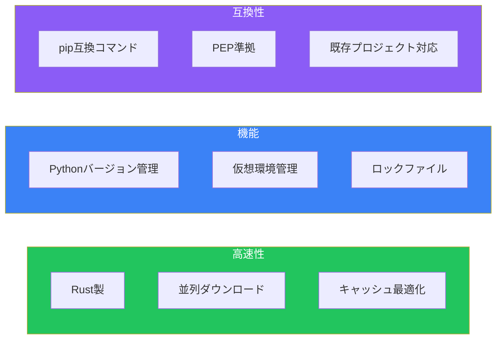
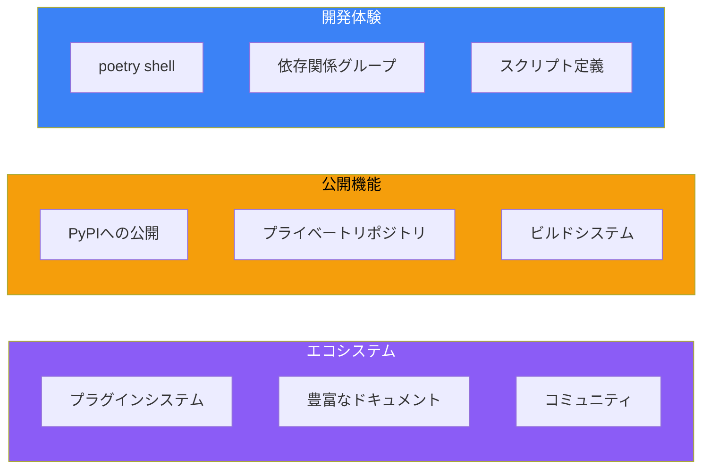
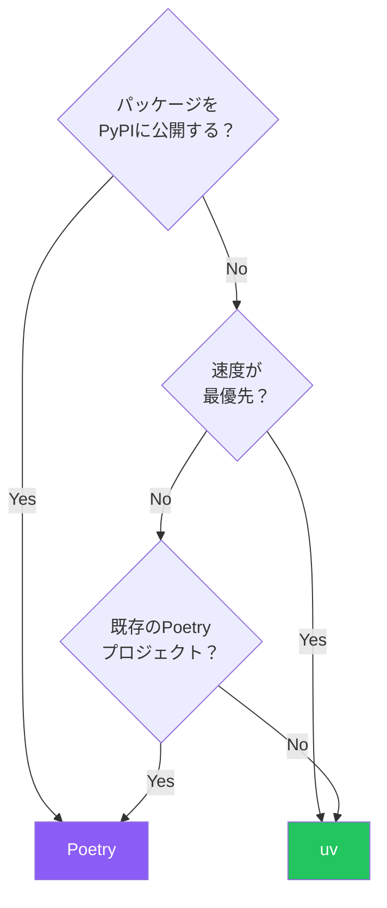

Pythonのパッケージ管理は長年の課題でしたが、PoetryとuvはPEP 517/518準拠のモダンなツールとして台頭しています。どちらを選ぶべきか、それぞれの特徴と使い分けを解説します。

## なぜモダンなツールが必要か

### 従来の問題点

```bash
# 従来のワークフロー
python -m venv venv
source venv/bin/activate
pip install -r requirements.txt
# requirements.txtの依存関係は手動管理...
# バージョンの競合は自分で解決...
```

### モダンなアプローチ

```bash
# Poetry
poetry install

# uv
uv sync
```

`pyproject.toml`で依存関係を宣言的に管理し、ロックファイルで再現性を保証します。

## pyproject.toml

両ツールとも`pyproject.toml`を使用：

```toml
[project]
name = "my-project"
version = "0.1.0"
description = "My awesome project"
requires-python = ">=3.10"
dependencies = [
    "fastapi>=0.100.0",
    "pydantic>=2.0.0",
]

[project.optional-dependencies]
dev = [
    "pytest>=7.0.0",
    "ruff>=0.1.0",
]

[build-system]
requires = ["hatchling"]
build-backend = "hatchling.build"
```

## uv

Rust製の超高速パッケージマネージャ（Astral社製）。

### インストール

```bash
# macOS/Linux
curl -LsSf https://astral.sh/uv/install.sh | sh

# Homebrew
brew install uv

# pip
pip install uv
```

### 基本操作

```bash
# 新規プロジェクト作成
uv init my-project
cd my-project

# 依存関係の追加
uv add fastapi pydantic

# 開発依存関係の追加
uv add --dev pytest ruff mypy

# 依存関係のインストール（同期）
uv sync

# スクリプト実行
uv run python main.py
uv run pytest

# Pythonバージョン管理
uv python install 3.12
uv python pin 3.12
```

### uvの特徴



### uv.lock

```toml
# uv.lockは自動生成
# requirements.txtへのエクスポート
uv export > requirements.txt

# 特定の環境向けにエクスポート
uv export --python 3.12 --platform linux > requirements-linux.txt
```

## Poetry

成熟したパッケージマネージャで、豊富なエコシステム。

### インストール

```bash
# 公式インストーラー
curl -sSL https://install.python-poetry.org | python3 -

# Homebrew
brew install poetry

# pipx
pipx install poetry
```

### 基本操作

```bash
# 新規プロジェクト作成
poetry new my-project
cd my-project

# 既存プロジェクトを初期化
poetry init

# 依存関係の追加
poetry add fastapi pydantic

# 開発依存関係の追加
poetry add --group dev pytest ruff mypy

# 依存関係のインストール
poetry install

# スクリプト実行
poetry run python main.py
poetry run pytest

# 仮想環境のシェルを起動
poetry shell
```

### Poetryの特徴



### pyproject.toml（Poetry形式）

```toml
[tool.poetry]
name = "my-project"
version = "0.1.0"
description = "My awesome project"
authors = ["Your Name <you@example.com>"]

[tool.poetry.dependencies]
python = "^3.10"
fastapi = "^0.100.0"
pydantic = "^2.0.0"

[tool.poetry.group.dev.dependencies]
pytest = "^7.0.0"
ruff = "^0.1.0"
mypy = "^1.0.0"

[tool.poetry.scripts]
serve = "my_project.main:app"

[build-system]
requires = ["poetry-core"]
build-backend = "poetry.core.masonry.api"
```

## 比較

### パフォーマンス

```bash
# 依存関係のインストール時間（例）
# uv sync: ~2秒
# poetry install: ~30秒
```

uvはPoetryの10-100倍高速です。

### 機能比較

| 機能 | uv | Poetry |
|------|-----|--------|
| 依存解決 | ✅ 高速 | ✅ 安定 |
| ロックファイル | ✅ | ✅ |
| Pythonバージョン管理 | ✅ | ❌ |
| PyPI公開 | ⚠️ 限定的 | ✅ 完全 |
| プラグイン | ❌ | ✅ |
| プライベートリポジトリ | ✅ | ✅ |
| pip互換 | ✅ | ❌ |
| 成熟度 | 新しい | 成熟 |

### 選択ガイド



## 実践的なセットアップ

### uv プロジェクト

```bash
# プロジェクト作成
uv init my-api
cd my-api

# 依存関係追加
uv add fastapi uvicorn pydantic-settings
uv add --dev pytest pytest-asyncio ruff mypy

# pyproject.toml
```

```toml
[project]
name = "my-api"
version = "0.1.0"
requires-python = ">=3.11"
dependencies = [
    "fastapi>=0.100.0",
    "uvicorn>=0.23.0",
    "pydantic-settings>=2.0.0",
]

[project.optional-dependencies]
dev = [
    "pytest>=7.0.0",
    "pytest-asyncio>=0.21.0",
    "ruff>=0.1.0",
    "mypy>=1.0.0",
]

[project.scripts]
serve = "my_api.main:run"

[tool.ruff]
line-length = 100
target-version = "py311"

[tool.mypy]
python_version = "3.11"
strict = true
```

### Poetry プロジェクト

```bash
# プロジェクト作成
poetry new my-library
cd my-library

# 依存関係追加
poetry add pydantic httpx
poetry add --group dev pytest ruff mypy

# ビルド＆公開
poetry build
poetry publish
```

## CI/CDでの使用

### GitHub Actions（uv）

```yaml
name: CI

on: [push, pull_request]

jobs:
  test:
    runs-on: ubuntu-latest
    steps:
      - uses: actions/checkout@v4

      - name: Install uv
        uses: astral-sh/setup-uv@v4

      - name: Install dependencies
        run: uv sync

      - name: Run tests
        run: uv run pytest

      - name: Run linter
        run: uv run ruff check .
```

### GitHub Actions（Poetry）

```yaml
name: CI

on: [push, pull_request]

jobs:
  test:
    runs-on: ubuntu-latest
    steps:
      - uses: actions/checkout@v4

      - name: Install Poetry
        uses: snok/install-poetry@v1

      - name: Setup Python
        uses: actions/setup-python@v5
        with:
          python-version: "3.12"
          cache: poetry

      - name: Install dependencies
        run: poetry install

      - name: Run tests
        run: poetry run pytest
```

## 移行ガイド

### pip → uv

```bash
# requirements.txtからの移行
uv init
uv add $(cat requirements.txt | grep -v "^#" | tr '\n' ' ')
```

### Poetry → uv

```bash
# poetry.lockをuv.lockに変換（手動）
uv init
# pyproject.tomlを標準形式に変換
uv add fastapi pydantic  # 依存関係を再追加
```

## まとめ

| 観点 | uv | Poetry |
|------|-----|--------|
| **速度** | ⭐⭐⭐ | ⭐ |
| **機能** | ⭐⭐ | ⭐⭐⭐ |
| **成熟度** | ⭐ | ⭐⭐⭐ |
| **公開機能** | ⭐ | ⭐⭐⭐ |

主要な原則：

- **新規プロジェクト → uv**: 速度と最新の標準準拠
- **ライブラリ公開 → Poetry**: 成熟した公開ワークフロー
- **既存Poetry → そのまま**: 動いているものは変えない
- **CI/CD → どちらでも**: キャッシュを活用

どちらを選んでも、`pyproject.toml`とロックファイルによる依存管理は、従来の`requirements.txt`より大幅に改善されています。

## 参考資料

- [uv Documentation](https://docs.astral.sh/uv/)
- [Poetry Documentation](https://python-poetry.org/docs/)
- [PEP 517 – Build system independent source format](https://peps.python.org/pep-0517/)
- [PEP 518 – Specifying Minimum Build System Requirements](https://peps.python.org/pep-0518/)
