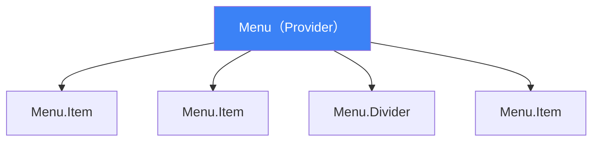

Reactアプリケーションが成長するにつれ、コンポーネントをより柔軟で再利用可能にするパターンが必要になります。3つの基本的なパターンが長年にわたって有効性を証明してきました：Compound Components、Render Props、Higher-Order Components（HOC）です。

各パターンといつ使うべきかを探っていきましょう。

## Compound Components

Compound Componentsは、複数のコンポーネントが連携して完全なUIを形成するパターンです。HTMLの`<select>`と`<option>`を考えてください — それらは一緒にしか意味がありません。

### 問題

カスタマイズ可能なMenuコンポーネントを構築することを想像してください：

```jsx
// 柔軟性がない：すべてのカスタマイズがprops経由
<Menu
  items={['Home', 'About', 'Contact']}
  onSelect={handleSelect}
  renderItem={(item) => <span>{item}</span>}
  showDividers={true}
  dividerAfter={[0, 1]}
/>
```

この「prop爆発」はコンポーネントを使いにくく、保守しにくくします。

### 解決策：Compound Components

```jsx
// 柔軟：設定よりコンポジション
<Menu>
  <Menu.Item onSelect={() => navigate('/home')}>Home</Menu.Item>
  <Menu.Item onSelect={() => navigate('/about')}>About</Menu.Item>
  <Menu.Divider />
  <Menu.Item onSelect={() => navigate('/contact')}>Contact</Menu.Item>
</Menu>
```



### 実装

```jsx
const MenuContext = createContext();

function Menu({ children }) {
  const [activeIndex, setActiveIndex] = useState(null);

  return (
    <MenuContext.Provider value={{ activeIndex, setActiveIndex }}>
      <ul className="menu" role="menu">
        {children}
      </ul>
    </MenuContext.Provider>
  );
}

function MenuItem({ children, onSelect, disabled = false }) {
  const { setActiveIndex } = useContext(MenuContext);

  const handleClick = () => {
    if (!disabled) {
      onSelect?.();
    }
  };

  return (
    <li
      className={`menu-item ${disabled ? 'disabled' : ''}`}
      onClick={handleClick}
      role="menuitem"
    >
      {children}
    </li>
  );
}

function MenuDivider() {
  return <li className="menu-divider" role="separator" />;
}

// サブコンポーネントをアタッチ
Menu.Item = MenuItem;
Menu.Divider = MenuDivider;

export default Menu;
```

### 実際の例

- Headless UIの`<Menu>`、`<Listbox>`、`<Dialog>`
- Radix UIのプリミティブコンポーネント
- Reach UIのアクセシブルコンポーネント

## Render Props

Render Propsは、値が関数であるpropを使用してコンポーネント間でコードを共有するパターンです。

### パターン

```jsx
// コンポーネントはデータでrender propを呼び出す
<DataFetcher
  url="/api/users"
  render={(data, loading, error) => {
    if (loading) return <Spinner />;
    if (error) return <Error error={error} />;
    return <UserList users={data} />;
  }}
/>
```

### 実装

```jsx
function DataFetcher({ url, render }) {
  const [data, setData] = useState(null);
  const [loading, setLoading] = useState(true);
  const [error, setError] = useState(null);

  useEffect(() => {
    setLoading(true);
    fetch(url)
      .then(res => res.json())
      .then(setData)
      .catch(setError)
      .finally(() => setLoading(false));
  }, [url]);

  return render(data, loading, error);
}
```

### 関数としてのchildren

一般的なバリエーションは、名前付きpropの代わりに`children`を使用します：

```jsx
<Mouse>
  {({ x, y }) => (
    <div>マウス位置: {x}, {y}</div>
  )}
</Mouse>

function Mouse({ children }) {
  const [position, setPosition] = useState({ x: 0, y: 0 });

  useEffect(() => {
    const handleMove = (e) => setPosition({ x: e.clientX, y: e.clientY });
    window.addEventListener('mousemove', handleMove);
    return () => window.removeEventListener('mousemove', handleMove);
  }, []);

  return children(position);
}
```

### Render Propsを使うとき

- データだけでなく動作を共有する必要がある場合
- 消費者がレンダリングを完全に制御する必要がある場合
- 動的なコンポジションが必要な場合のHOCの代替として

### Render Props vs カスタムフック

カスタムフックは、ロジック共有においてRender Propsをほぼ置き換えました：

```jsx
// Render Propsアプローチ
<WindowSize>
  {({ width, height }) => <div>{width} x {height}</div>}
</WindowSize>

// カスタムフックアプローチ（推奨）
function Component() {
  const { width, height } = useWindowSize();
  return <div>{width} x {height}</div>;
}
```

ただし、Render Propsは以下の場合にまだ有用です：
- クラスコンポーネント間で動作を共有する
- レンダリング時の条件に基づく動的なコンポジション

## Higher-Order Components（HOC）

Higher-Order Componentは、コンポーネントを受け取り、追加のpropsや動作を持つ新しいコンポーネントを返す関数です。


### 基本的なHOC

```jsx
function withLogger(WrappedComponent) {
  return function LoggedComponent(props) {
    useEffect(() => {
      console.log('Component mounted:', WrappedComponent.name);
      return () => console.log('Component unmounted:', WrappedComponent.name);
    }, []);

    return <WrappedComponent {...props} />;
  };
}

// 使用例
const LoggedButton = withLogger(Button);
```

### 実用的なHOC：withAuth

```jsx
function withAuth(WrappedComponent) {
  return function AuthenticatedComponent(props) {
    const { user, loading } = useAuth();

    if (loading) {
      return <Spinner />;
    }

    if (!user) {
      return <Redirect to="/login" />;
    }

    return <WrappedComponent {...props} user={user} />;
  };
}

// 使用例
const ProtectedDashboard = withAuth(Dashboard);
```

### HOCのベストプラクティス

#### 1. 関係ないpropsをパススルー

```jsx
function withExtraProps(WrappedComponent) {
  return function Enhanced(props) {
    const extraProps = { extra: 'value' };
    return <WrappedComponent {...props} {...extraProps} />;
  };
}
```

#### 2. displayNameを保持

```jsx
function withAuth(WrappedComponent) {
  function WithAuth(props) {
    // ...
  }

  WithAuth.displayName = `WithAuth(${WrappedComponent.displayName || WrappedComponent.name})`;

  return WithAuth;
}
```

#### 3. render内でHOCを使わない

```jsx
// 悪い：毎回新しいコンポーネント型を作成
function Component() {
  const Enhanced = withAuth(Child); // これはダメ！
  return <Enhanced />;
}

// 良い：コンポーネント外でHOCを作成
const Enhanced = withAuth(Child);
function Component() {
  return <Enhanced />;
}
```

#### 4. 静的メソッドをコピー

```jsx
import hoistNonReactStatics from 'hoist-non-react-statics';

function withAuth(WrappedComponent) {
  function WithAuth(props) {
    // ...
  }

  hoistNonReactStatics(WithAuth, WrappedComponent);
  return WithAuth;
}
```

### HOC vs カスタムフック

カスタムフックは新しいコードにおいてHOCをほぼ置き換えました：

```jsx
// HOCアプローチ
const EnhancedComponent = withWindowSize(withTheme(withAuth(Component)));

// カスタムフックアプローチ（推奨）
function Component() {
  const size = useWindowSize();
  const theme = useTheme();
  const auth = useAuth();
  // ...
}
```

HOCはまだ以下の場合に有用です：
- クラスコンポーネントで作業する場合
- 多くのコンポーネントに同じ動作を適用する場合
- ライブラリ用のコンポーネントバリエーションを作成する場合

## パターンの比較

| パターン | 最適な用途 | トレードオフ |
|---------|----------|------------|
| Compound Components | 柔軟で関連するUIコンポーネント | セットアップが多い、contextが必要 |
| Render Props | 動的なレンダリング判断 | ネストされたコールバックになりがち |
| HOC | 横断的関心事 | propの衝突を起こす可能性 |
| カスタムフック | ロジック共有 | 関数コンポーネントのみ |

## パターンの組み合わせ

パターンはしばしば一緒に機能します：

```jsx
// Render Propsを持つCompound Components
<Tabs>
  <Tabs.List>
    <Tabs.Tab>One</Tabs.Tab>
    <Tabs.Tab>Two</Tabs.Tab>
  </Tabs.List>
  <Tabs.Panels>
    {({ activeIndex }) => (
      <Tabs.Panel active={activeIndex === 0}>Content One</Tabs.Panel>
      <Tabs.Panel active={activeIndex === 1}>Content Two</Tabs.Panel>
    )}
  </Tabs.Panels>
</Tabs>
```

## まとめ

- **Compound Components**：連携する関連UI要素に使用（メニュー、タブ、アコーディオン）
- **Render Props**：消費者がレンダリングを制御する必要がある場合に使用
- **HOC**：横断的関心事、特にクラスコンポーネントで使用
- **カスタムフック**：関数コンポーネントでのロジック共有に推奨

各パターンにはそれぞれの場所があります。モダンReactはカスタムフックとCompound Componentsを好みますが、すべてのパターンを理解することで、各状況に適したツールを選択できます。

## 参考文献

- [React Documentation: Render Props](https://react.dev/reference/react/cloneElement#passing-data-with-a-render-prop)
- Kumar, Tejas. *Fluent React*. O'Reilly Media, 2024.
- Barklund, Morten. *React in Depth*. Manning Publications, 2024.
