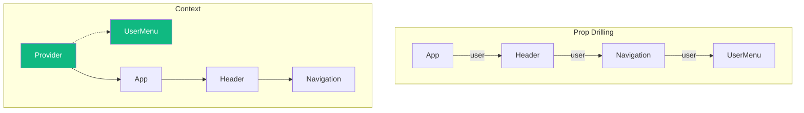
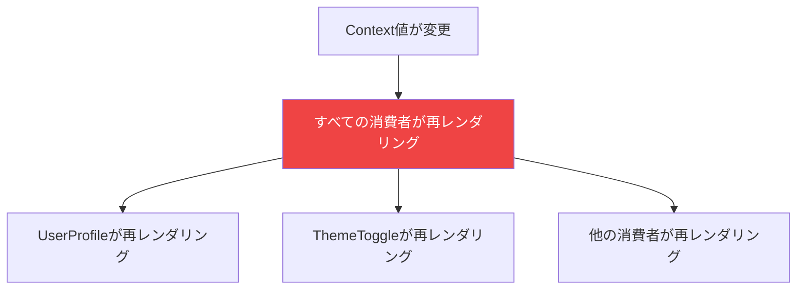

React Contextは、すべてのレベルでpropsを渡すことなくコンポーネント間で値を共有する方法を提供します。強力ですが、Contextを誤用するとパフォーマンスの問題や複雑なコードにつながる可能性があります。

Contextを効果的に使用する方法を探っていきましょう。

## Contextとは？

Contextは、すべてのレベルで手動でpropsを渡すことなく（prop drilling）、コンポーネントツリーを通じてデータを渡す方法を提供します。

```jsx
// Contextなし：Prop drilling
<App>
  <Header user={user} />        // userを下に渡す
    <Navigation user={user} />  // userを下に渡す
      <UserMenu user={user} />  // 最終的にuserを使用
</App>

// Contextあり：直接アクセス
<UserContext.Provider value={user}>
  <App>
    <Header />
      <Navigation />
        <UserMenu />  // Contextからuserを取得
  </App>
</UserContext.Provider>
```



## 基本的な使い方

### Contextの作成

```jsx
import { createContext, useContext, useState } from 'react';

// 1. Contextを作成
const ThemeContext = createContext(null);

// 2. Providerコンポーネントを作成
function ThemeProvider({ children }) {
  const [theme, setTheme] = useState('light');

  const value = {
    theme,
    toggleTheme: () => setTheme(t => t === 'light' ? 'dark' : 'light'),
  };

  return (
    <ThemeContext.Provider value={value}>
      {children}
    </ThemeContext.Provider>
  );
}

// 3. 消費用のカスタムフックを作成
function useTheme() {
  const context = useContext(ThemeContext);
  if (!context) {
    throw new Error('useThemeはThemeProvider内で使用する必要があります');
  }
  return context;
}

// 4. コンポーネントで使用
function ThemedButton() {
  const { theme, toggleTheme } = useTheme();
  return (
    <button
      onClick={toggleTheme}
      style={{ background: theme === 'light' ? '#fff' : '#333' }}
    >
      テーマを切り替え
    </button>
  );
}
```

## パフォーマンスの問題

ここに重要な問題があります：**Context値が変更されると、変更された部分を使用しているかどうかに関係なく、そのContextを消費するすべてのコンポーネントが再レンダリングされます**。

```jsx
const AppContext = createContext();

function AppProvider({ children }) {
  const [user, setUser] = useState(null);
  const [theme, setTheme] = useState('light');

  // このオブジェクトは毎回再作成される！
  const value = { user, setUser, theme, setTheme };

  return (
    <AppContext.Provider value={value}>
      {children}
    </AppContext.Provider>
  );
}

function UserProfile() {
  // userしか使っていないのに、themeが変わると再レンダリング！
  const { user } = useContext(AppContext);
  console.log('UserProfile rendered');
  return <div>{user?.name}</div>;
}

function ThemeToggle() {
  // themeしか使っていないのに、userが変わると再レンダリング！
  const { theme, setTheme } = useContext(AppContext);
  console.log('ThemeToggle rendered');
  return <button onClick={() => setTheme(t => t === 'light' ? 'dark' : 'light')} />;
}
```



## パフォーマンスの解決策

### 1. 更新頻度でContextを分割

頻繁に変更される値と安定した値を分離：

```jsx
// 悪い：すべてが1つのContext
const AppContext = createContext();

// 良い：別々のContext
const UserContext = createContext();
const ThemeContext = createContext();
const SettingsContext = createContext();

function AppProviders({ children }) {
  return (
    <UserProvider>
      <ThemeProvider>
        <SettingsProvider>
          {children}
        </SettingsProvider>
      </ThemeProvider>
    </UserProvider>
  );
}
```

### 2. StateとDispatchを分割

状態と更新関数を分離：

```jsx
const CountStateContext = createContext();
const CountDispatchContext = createContext();

function CountProvider({ children }) {
  const [count, setCount] = useState(0);

  return (
    <CountStateContext.Provider value={count}>
      <CountDispatchContext.Provider value={setCount}>
        {children}
      </CountDispatchContext.Provider>
    </CountStateContext.Provider>
  );
}

// 更新だけするコンポーネントは状態変更で再レンダリングされない
function IncrementButton() {
  const setCount = useContext(CountDispatchContext);
  console.log('IncrementButton rendered'); // 1回だけ！
  return <button onClick={() => setCount(c => c + 1)}>+</button>;
}

// 読み取りだけするコンポーネントは更新で再レンダリングされない
function CountDisplay() {
  const count = useContext(CountStateContext);
  return <span>{count}</span>;
}
```

### 3. Context値をメモ化

値をメモ化して不要な再レンダリングを防ぐ：

```jsx
function ThemeProvider({ children }) {
  const [theme, setTheme] = useState('light');

  // valueオブジェクトをメモ化
  const value = useMemo(() => ({
    theme,
    toggleTheme: () => setTheme(t => t === 'light' ? 'dark' : 'light'),
  }), [theme]);

  return (
    <ThemeContext.Provider value={value}>
      {children}
    </ThemeContext.Provider>
  );
}
```

### 4. 消費者にReact.memoを使用

構造を変更できない場合、消費コンポーネントをメモ化：

```jsx
const ExpensiveComponent = React.memo(function ExpensiveComponent({ data }) {
  // dataが変わった時だけ再レンダリング
  return <div>{/* 高コストなレンダリング */}</div>;
});

function Parent() {
  const { theme } = useContext(ThemeContext);

  return (
    <div className={theme}>
      <ExpensiveComponent data={staticData} />
    </div>
  );
}
```

### 5. Context以外の部分を抽出

Context消費を親に移動し、データをpropsとして渡す：

```jsx
// 前：Contextが変更されるたびに子が再レンダリング
function Parent() {
  return (
    <div>
      <ExpensiveChild />
    </div>
  );
}

function ExpensiveChild() {
  const { value } = useContext(SomeContext);
  // valueを使わない重いレンダリング
  return <div>{/* ... */}</div>;
}

// 後：ContextReaderだけが再レンダリング
function Parent() {
  return (
    <div>
      <ContextReader />
      <ExpensiveChild />
    </div>
  );
}

function ContextReader() {
  const { value } = useContext(SomeContext);
  return <SmallComponent value={value} />;
}
```

## Contextを使うべき時

### 良いユースケース

1. **テーマ** — ライト/ダークモード、色
2. **ユーザー認証** — 現在のユーザー、ログイン状態
3. **ロケール/i18n** — 現在の言語、翻訳
4. **機能フラグ** — 有効な機能
5. **UI状態** — サイドバーの開閉、モーダル状態

### Contextを使うべきでない時

1. **頻繁に更新される値** — 代わりに状態管理ライブラリを使用
2. **すべての状態** — すべての状態の代替ではない
3. **propsで十分な場合** — 過剰設計しない

```jsx
// これはダメ - シンプルなpropsにContext
const ButtonColorContext = createContext('blue');

// ただpropsを渡す！
<Button color="blue" />
```

## パターン：Contextモジュール

Contextを整理するためのクリーンなパターン：

```jsx
// contexts/auth.js
import { createContext, useContext, useReducer } from 'react';

const AuthContext = createContext();

const initialState = {
  user: null,
  loading: true,
  error: null,
};

function authReducer(state, action) {
  switch (action.type) {
    case 'LOGIN_START':
      return { ...state, loading: true, error: null };
    case 'LOGIN_SUCCESS':
      return { ...state, loading: false, user: action.user };
    case 'LOGIN_ERROR':
      return { ...state, loading: false, error: action.error };
    case 'LOGOUT':
      return { ...state, user: null };
    default:
      return state;
  }
}

export function AuthProvider({ children }) {
  const [state, dispatch] = useReducer(authReducer, initialState);

  const login = async (credentials) => {
    dispatch({ type: 'LOGIN_START' });
    try {
      const user = await authApi.login(credentials);
      dispatch({ type: 'LOGIN_SUCCESS', user });
    } catch (error) {
      dispatch({ type: 'LOGIN_ERROR', error: error.message });
    }
  };

  const logout = () => {
    authApi.logout();
    dispatch({ type: 'LOGOUT' });
  };

  const value = useMemo(() => ({
    ...state,
    login,
    logout,
  }), [state]);

  return (
    <AuthContext.Provider value={value}>
      {children}
    </AuthContext.Provider>
  );
}

export function useAuth() {
  const context = useContext(AuthContext);
  if (!context) {
    throw new Error('useAuthはAuthProvider内で使用する必要があります');
  }
  return context;
}
```

## まとめ

| ヒント | 説明 |
|-----|-------------|
| Contextを分割 | 更新頻度で分離 |
| State/Dispatchを分割 | 更新だけのコンポーネントの再レンダリングを回避 |
| 値をメモ化 | Context値オブジェクトに`useMemo`を使用 |
| 選択的に使用 | Contextはすべてのためではない |
| カスタムフック | 常に`useContext`をカスタムフックでラップ |

重要なポイント：

- Contextはprop drillingを避けるためのもので、グローバル状態管理ではない
- Context値が変更されるとすべての消費者が再レンダリングされる
- 値が変更される頻度でContextを分割する
- 不要な再レンダリングを防ぐためにContext値をメモ化する
- 複雑な状態には状態管理ライブラリを検討する

Contextは正しく使用すれば強力なツールです。Contextを小さく焦点を絞って保ち、何が再レンダリングをトリガーするかに注意してください。

## 参考文献

- [React Documentation: useContext](https://react.dev/reference/react/useContext)
- [React Documentation: Passing Data Deeply with Context](https://react.dev/learn/passing-data-deeply-with-context)
- Barklund, Morten. *React in Depth*. Manning Publications, 2024.
