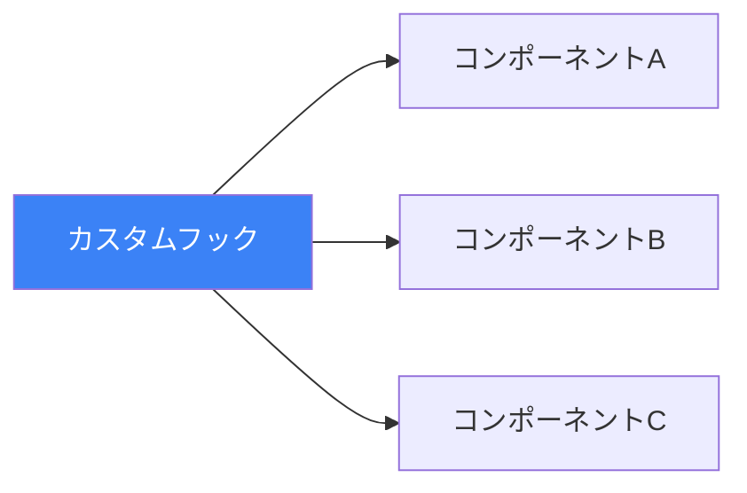

カスタムフックは、コードの再利用においてReactの最も強力な機能の1つです。コンポーネントのロジックを再利用可能な関数に抽出し、コードをよりクリーンで保守しやすくします。

## カスタムフックとは？

カスタムフックは単純に以下の条件を満たすJavaScript関数です：
1. `use`という単語で始まる
2. 他のフックを呼び出すことができる

```jsx
// これはカスタムフック
function useWindowWidth() {
  const [width, setWidth] = useState(window.innerWidth);

  useEffect(() => {
    const handleResize = () => setWidth(window.innerWidth);
    window.addEventListener('resize', handleResize);
    return () => window.removeEventListener('resize', handleResize);
  }, []);

  return width;
}

// コンポーネントでの使用
function Component() {
  const width = useWindowWidth();
  return <div>ウィンドウ幅: {width}</div>;
}
```



各コンポーネントはフックの状態の独立したコピーを取得します。

## なぜカスタムフックを作るのか？

### 1. ロジックを共有、状態は共有しない

カスタムフックは**ロジック**を共有しますが、フックを使用する各コンポーネントは独自の**状態**を取得します：

```jsx
function useCounter(initialValue = 0) {
  const [count, setCount] = useState(initialValue);
  const increment = () => setCount(c => c + 1);
  const decrement = () => setCount(c => c - 1);
  return { count, increment, decrement };
}

function ComponentA() {
  const { count, increment } = useCounter(0);
  // countはComponentBから独立
  return <button onClick={increment}>{count}</button>;
}

function ComponentB() {
  const { count, increment } = useCounter(100);
  // countはComponentAから独立
  return <button onClick={increment}>{count}</button>;
}
```

### 2. 関心の分離

複雑なロジックをコンポーネントから抽出：

```jsx
// 前: ロジックがUIと混在
function UserProfile({ userId }) {
  const [user, setUser] = useState(null);
  const [loading, setLoading] = useState(true);
  const [error, setError] = useState(null);

  useEffect(() => {
    setLoading(true);
    fetchUser(userId)
      .then(setUser)
      .catch(setError)
      .finally(() => setLoading(false));
  }, [userId]);

  if (loading) return <Spinner />;
  if (error) return <Error error={error} />;
  return <Profile user={user} />;
}

// 後: ロジックをカスタムフックに抽出
function useUser(userId) {
  const [user, setUser] = useState(null);
  const [loading, setLoading] = useState(true);
  const [error, setError] = useState(null);

  useEffect(() => {
    setLoading(true);
    fetchUser(userId)
      .then(setUser)
      .catch(setError)
      .finally(() => setLoading(false));
  }, [userId]);

  return { user, loading, error };
}

function UserProfile({ userId }) {
  const { user, loading, error } = useUser(userId);

  if (loading) return <Spinner />;
  if (error) return <Error error={error} />;
  return <Profile user={user} />;
}
```

## 一般的なカスタムフックパターン

### 1. useLocalStorage

状態をlocalStorageに永続化：

```jsx
function useLocalStorage(key, initialValue) {
  const [storedValue, setStoredValue] = useState(() => {
    try {
      const item = window.localStorage.getItem(key);
      return item ? JSON.parse(item) : initialValue;
    } catch (error) {
      console.error(error);
      return initialValue;
    }
  });

  const setValue = (value) => {
    try {
      const valueToStore = value instanceof Function
        ? value(storedValue)
        : value;
      setStoredValue(valueToStore);
      window.localStorage.setItem(key, JSON.stringify(valueToStore));
    } catch (error) {
      console.error(error);
    }
  };

  return [storedValue, setValue];
}

// 使用例
function Settings() {
  const [theme, setTheme] = useLocalStorage('theme', 'light');

  return (
    <button onClick={() => setTheme(t => t === 'light' ? 'dark' : 'light')}>
      現在: {theme}
    </button>
  );
}
```

### 2. useFetch

汎用データフェッチングフック：

```jsx
function useFetch(url) {
  const [data, setData] = useState(null);
  const [loading, setLoading] = useState(true);
  const [error, setError] = useState(null);

  useEffect(() => {
    const abortController = new AbortController();

    setLoading(true);
    setError(null);

    fetch(url, { signal: abortController.signal })
      .then(res => {
        if (!res.ok) throw new Error(`HTTP ${res.status}`);
        return res.json();
      })
      .then(setData)
      .catch(err => {
        if (err.name !== 'AbortError') {
          setError(err);
        }
      })
      .finally(() => setLoading(false));

    return () => abortController.abort();
  }, [url]);

  return { data, loading, error };
}

// 使用例
function UserList() {
  const { data: users, loading, error } = useFetch('/api/users');

  if (loading) return <Spinner />;
  if (error) return <Error message={error.message} />;
  return <ul>{users.map(u => <li key={u.id}>{u.name}</li>)}</ul>;
}
```

### 3. useDebounce

値をデバウンス：

```jsx
function useDebounce(value, delay) {
  const [debouncedValue, setDebouncedValue] = useState(value);

  useEffect(() => {
    const timer = setTimeout(() => {
      setDebouncedValue(value);
    }, delay);

    return () => clearTimeout(timer);
  }, [value, delay]);

  return debouncedValue;
}

// 使用例
function SearchInput() {
  const [query, setQuery] = useState('');
  const debouncedQuery = useDebounce(query, 300);

  useEffect(() => {
    if (debouncedQuery) {
      // ユーザーが入力を停止してから300ms後にのみ発火
      searchAPI(debouncedQuery);
    }
  }, [debouncedQuery]);

  return (
    <input
      value={query}
      onChange={e => setQuery(e.target.value)}
      placeholder="検索..."
    />
  );
}
```

### 4. useToggle

シンプルなブール状態管理：

```jsx
function useToggle(initialValue = false) {
  const [value, setValue] = useState(initialValue);

  const toggle = useCallback(() => setValue(v => !v), []);
  const setTrue = useCallback(() => setValue(true), []);
  const setFalse = useCallback(() => setValue(false), []);

  return { value, toggle, setTrue, setFalse };
}

// 使用例
function Modal() {
  const { value: isOpen, toggle, setFalse: close } = useToggle();

  return (
    <>
      <button onClick={toggle}>モーダルを開く</button>
      {isOpen && (
        <div className="modal">
          <button onClick={close}>閉じる</button>
        </div>
      )}
    </>
  );
}
```

### 5. usePrevious

前の値を追跡：

```jsx
function usePrevious(value) {
  const ref = useRef();

  useEffect(() => {
    ref.current = value;
  }, [value]);

  return ref.current;
}

// 使用例
function Counter() {
  const [count, setCount] = useState(0);
  const prevCount = usePrevious(count);

  return (
    <div>
      <p>現在: {count}, 前: {prevCount}</p>
      <button onClick={() => setCount(c => c + 1)}>増加</button>
    </div>
  );
}
```

### 6. useMediaQuery

CSSメディアクエリに応答：

```jsx
function useMediaQuery(query) {
  const [matches, setMatches] = useState(
    () => window.matchMedia(query).matches
  );

  useEffect(() => {
    const mediaQuery = window.matchMedia(query);
    const handler = (e) => setMatches(e.matches);

    mediaQuery.addEventListener('change', handler);
    return () => mediaQuery.removeEventListener('change', handler);
  }, [query]);

  return matches;
}

// 使用例
function ResponsiveComponent() {
  const isMobile = useMediaQuery('(max-width: 768px)');

  return isMobile ? <MobileLayout /> : <DesktopLayout />;
}
```

## ベストプラクティス

### 1. 常に「use」で始める

`use`プレフィックスは、ReactがフックとしてKen認識し、フックのルールを適用するために必要です：

```jsx
// 良い
function useAuth() { }
function useFormValidation() { }

// 悪い - Reactはフックのルールを強制しない
function getAuth() { }
function formValidation() { }
```

### 2. 必要なものだけを返す

消費者が必要とするものだけを返す：

```jsx
// 良い - 必要な値だけを返す
function useCounter() {
  const [count, setCount] = useState(0);
  const increment = () => setCount(c => c + 1);
  return { count, increment };
}

// 避ける - 内部状態を露出しすぎ
function useCounter() {
  const [count, setCount] = useState(0);
  return { count, setCount }; // setCountは低レベルすぎる
}
```

### 3. 一貫した戻り値の形式を使用

形式を選んで一貫させる：

```jsx
// 配列形式 - 位置による分割代入に適している
function useToggle(initial) {
  const [value, setValue] = useState(initial);
  const toggle = () => setValue(v => !v);
  return [value, toggle]; // useStateのように
}
const [isOpen, toggleOpen] = useToggle(false);

// オブジェクト形式 - 名前付きの値に適している
function useUser(id) {
  // ...
  return { user, loading, error }; // 名前付きプロパティ
}
const { user, loading } = useUser(123);
```

### 4. クリーンアップを処理

サブスクリプションとタイマーを常にクリーンアップ：

```jsx
function useEventListener(eventName, handler, element = window) {
  const savedHandler = useRef(handler);

  useEffect(() => {
    savedHandler.current = handler;
  }, [handler]);

  useEffect(() => {
    const eventListener = (e) => savedHandler.current(e);
    element.addEventListener(eventName, eventListener);
    return () => element.removeEventListener(eventName, eventListener);
  }, [eventName, element]);
}
```

### 5. フックをドキュメント化

```jsx
/**
 * 指定された遅延で値をデバウンスします。
 * @param {T} value - デバウンスする値
 * @param {number} delay - ミリ秒単位の遅延
 * @returns {T} - デバウンスされた値
 * @example
 * const debouncedSearch = useDebounce(searchTerm, 300);
 */
function useDebounce(value, delay) {
  // ...
}
```

## カスタムフックのテスト

`@testing-library/react-hooks`または`@testing-library/react`の`renderHook`を使用：

```jsx
import { renderHook, act } from '@testing-library/react';

test('useCounter increments', () => {
  const { result } = renderHook(() => useCounter(0));

  expect(result.current.count).toBe(0);

  act(() => {
    result.current.increment();
  });

  expect(result.current.count).toBe(1);
});
```

## まとめ

- カスタムフックはコンポーネントから再利用可能なロジックを抽出する
- 各コンポーネントはフックから独自の状態を取得する
- `use`で始まるフック名を付ける
- 消費者が必要とするものだけを返す
- 常に副作用をクリーンアップする
- 一般的なパターン：useLocalStorage、useFetch、useDebounce、useToggle
- `renderHook`を使用してフックをテストする

カスタムフックは、クリーンで再利用可能なReactコードを書くための鍵です。状態を共有せずにロジックを共有でき、コンポーネントをよりシンプルでUIレンダリングに集中させます。

## 参考文献

- [React Documentation: Reusing Logic with Custom Hooks](https://react.dev/learn/reusing-logic-with-custom-hooks)
- Barklund, Morten. *React in Depth*. Manning Publications, 2024.
- [usehooks.com](https://usehooks.com/) - Reactフックのコレクション
