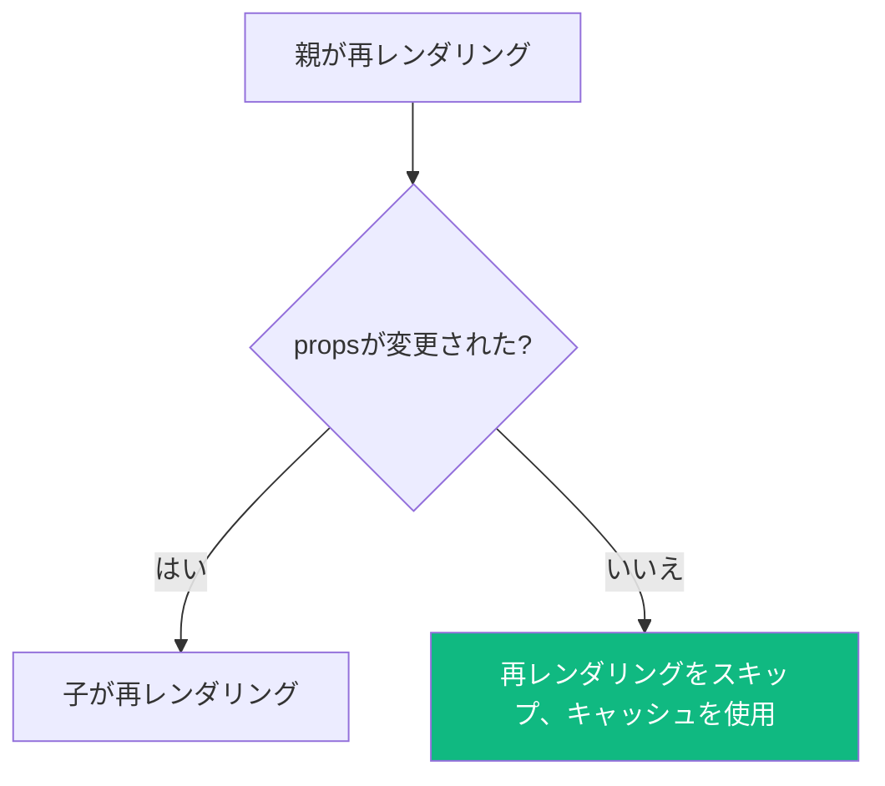
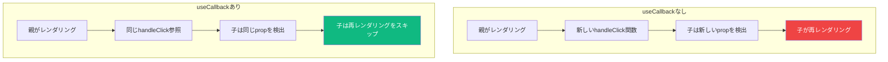

Reactはメモ化のために3つの主要ツールを提供しています：`useMemo`、`useCallback`、`React.memo`。これらは「パフォーマンス最適化ツール」としてまとめられることが多いですが、それぞれ異なる目的を持ち、頻繁に誤用されています。

いつ、どのように使うべきかを明確にしましょう。

## メモ化とは？

メモ化は、関数の結果を入力に基づいてキャッシュする技術です。同じ入力で関数が再び呼び出された場合、再計算せずにキャッシュされた結果を返します。

```javascript
// シンプルなメモ化の概念
const cache = {};
function memoizedAdd(a, b) {
  const key = `${a},${b}`;
  if (cache[key]) return cache[key];
  cache[key] = a + b;
  return cache[key];
}
```

Reactでは、メモ化は不要な再計算や再レンダリングを避けるのに役立ちます。

## React.memo: コンポーネントのメモ化

`React.memo`は、コンポーネントの**レンダリング出力**をメモ化する高階コンポーネントです。propsが変更されていない場合、再レンダリングを防ぎます。

```jsx
const ExpensiveList = React.memo(function ExpensiveList({ items }) {
  console.log('ExpensiveList rendered');
  return (
    <ul>
      {items.map(item => (
        <li key={item.id}>{item.name}</li>
      ))}
    </ul>
  );
});
```

### React.memoの動作



デフォルトでは、`React.memo`はpropsの**浅い比較**を行います：

```jsx
// これらは「等しい」と見なされる（同じ参照）
const items = [1, 2, 3];
<ExpensiveList items={items} />

// これらは「異なる」と見なされる（新しい配列参照）
<ExpensiveList items={[1, 2, 3]} />
```

### カスタム比較関数

カスタム比較を提供できます：

```jsx
const MemoizedComponent = React.memo(
  function MyComponent({ user, onClick }) {
    return <div onClick={onClick}>{user.name}</div>;
  },
  (prevProps, nextProps) => {
    // trueを返すとpropsが等しい（再レンダリングをスキップ）
    return prevProps.user.id === nextProps.user.id;
  }
);
```

## useMemo: 値のメモ化

`useMemo`は**計算結果**をメモ化します。依存関係が変更された場合のみ再計算します。

```jsx
function ProductList({ products, filterTerm }) {
  // productsまたはfilterTermが変更された場合のみ再計算
  const filteredProducts = useMemo(() => {
    console.log('Filtering products...');
    return products.filter(p =>
      p.name.toLowerCase().includes(filterTerm.toLowerCase())
    );
  }, [products, filterTerm]);

  return (
    <ul>
      {filteredProducts.map(p => <li key={p.id}>{p.name}</li>)}
    </ul>
  );
}
```

### useMemoを使うべき場合

**良いユースケース：**

```jsx
// 1. 高コストな計算
const sortedItems = useMemo(() => {
  return [...items].sort((a, b) => a.value - b.value);
}, [items]);

// 2. メモ化された子に渡すオブジェクト/配列の参照等価性
const chartData = useMemo(() => ({
  labels: data.map(d => d.label),
  values: data.map(d => d.value),
}), [data]);

return <MemoizedChart data={chartData} />;
```

**悪いユースケース：**

```jsx
// ダメ: シンプルな計算
const doubled = useMemo(() => value * 2, [value]);

// ダメ: プリミティブの作成
const greeting = useMemo(() => `Hello, ${name}`, [name]);
```

## useCallback: 関数のメモ化

`useCallback`は**関数定義**をメモ化します。依存関係が変更されていない場合、同じ関数参照を返します。

```jsx
function Parent() {
  const [count, setCount] = useState(0);

  // useCallbackなし：毎回新しい関数
  const handleClick = () => {
    console.log('clicked');
  };

  // useCallbackあり：同じ関数参照
  const memoizedHandleClick = useCallback(() => {
    console.log('clicked');
  }, []);

  return <MemoizedChild onClick={memoizedHandleClick} />;
}
```

### なぜ関数参照が重要か



### 一般的なパターン：依存関係付きuseCallback

```jsx
function SearchComponent({ onSearch }) {
  const [query, setQuery] = useState('');

  const handleSearch = useCallback(() => {
    onSearch(query);
  }, [query, onSearch]);

  return (
    <>
      <input value={query} onChange={e => setQuery(e.target.value)} />
      <MemoizedButton onClick={handleSearch}>Search</MemoizedButton>
    </>
  );
}
```

## 3つの関係

これらのツールは連携して動作します：

```jsx
const Parent = () => {
  const [items, setItems] = useState([]);
  const [filter, setFilter] = useState('');

  // useMemo: フィルタ結果をメモ化
  const filteredItems = useMemo(
    () => items.filter(item => item.includes(filter)),
    [items, filter]
  );

  // useCallback: ハンドラをメモ化
  const handleItemClick = useCallback((id) => {
    console.log('Clicked:', id);
  }, []);

  // React.memoの子は安定したpropsを受け取る
  return <MemoizedList items={filteredItems} onItemClick={handleItemClick} />;
};

// React.memo: propsが同じなら再レンダリングをスキップ
const MemoizedList = React.memo(function List({ items, onItemClick }) {
  return (
    <ul>
      {items.map(item => (
        <li key={item} onClick={() => onItemClick(item)}>{item}</li>
      ))}
    </ul>
  );
});
```

## メモ化すべきでない場合

メモ化にはオーバーヘッドがあります。以下の場合は使わないでください：

### 1. コンポーネントが既に高速な場合

```jsx
// ダメ: シンプルなコンポーネント、メモ化のオーバーヘッドに見合わない
const Badge = React.memo(({ label }) => (
  <span className="badge">{label}</span>
));
```

### 2. propsが毎回変わる場合

```jsx
// 無意味: items配列は毎回再作成される
function Parent() {
  return <MemoizedList items={[1, 2, 3]} />;
}
```

### 3. 計算が些細な場合

```jsx
// ダメ: 単純な計算にはメモ化は不要
const total = useMemo(() => price * quantity, [price, quantity]);

// こうするだけ:
const total = price * quantity;
```

### 4. メモ化された子に渡さない場合

```jsx
// 無意味: メモ化された消費者がないuseCallback
function Component() {
  const handleClick = useCallback(() => {
    console.log('clicked');
  }, []);

  // 通常のbuttonは安定した参照の恩恵を受けない
  return <button onClick={handleClick}>Click</button>;
}
```

## まずパフォーマンス測定

メモ化を追加する前に、実際のパフォーマンスを**測定**してください：

```jsx
function SlowComponent({ data }) {
  // React DevTools Profilerを使ってレンダリング時間を測定
  console.time('render');

  const result = expensiveOperation(data);

  console.timeEnd('render');

  return <div>{result}</div>;
}
```

React DevTools Profilerを使って以下のコンポーネントを特定：
1. 頻繁にレンダリングされる
2. レンダリングに時間がかかる
3. 不必要に再レンダリングされる

## まとめ表

| ツール | メモ化対象 | 使用場面 |
|------|----------|----------|
| `React.memo` | コンポーネントのレンダリング出力 | 子が同じpropsを頻繁に受け取る |
| `useMemo` | 計算された値 | 高コストな計算または参照等価性が必要 |
| `useCallback` | 関数参照 | メモ化された子にコールバックを渡す |

## ベストプラクティス

1. **まず測定** — 早まった最適化をしない
2. **高コストな操作をメモ化** — 単純な計算ではなく
3. **一緒に使う** — `useCallback`/`useMemo`は`React.memo`と組み合わせて効果的
4. **依存関係を正確に** — 依存関係の欠落はバグの原因
5. **代替案を検討** — 時にはメモ化より構造の再設計が良い

## まとめ

- `React.memo`はpropsが変更されていない場合に再レンダリングを防ぐ
- `useMemo`はレンダリング間で計算値をキャッシュする
- `useCallback`は安定した関数参照を維持する
- 3つは連携してパフォーマンスを最適化する
- すべてをメモ化しない — まず測定し、必要な場所で最適化する
- メモ化にはオーバーヘッドがある；慎重に使用する

重要な洞察は、メモ化は**参照等価性**に関するものだということです。JavaScriptでは、`{} !== {}`であり`[] !== []`です、たとえ同じ値を含んでいても。Reactのメモ化ツールは参照がいつ変わるかを制御し、それによってコンポーネントがいつ再レンダリングされるかを制御します。

## 参考文献

- [React Documentation: useMemo](https://react.dev/reference/react/useMemo)
- [React Documentation: useCallback](https://react.dev/reference/react/useCallback)
- [React Documentation: memo](https://react.dev/reference/react/memo)
- Barklund, Morten. *React in Depth*. Manning Publications, 2024.
- Kumar, Tejas. *Fluent React*. O'Reilly Media, 2024.
