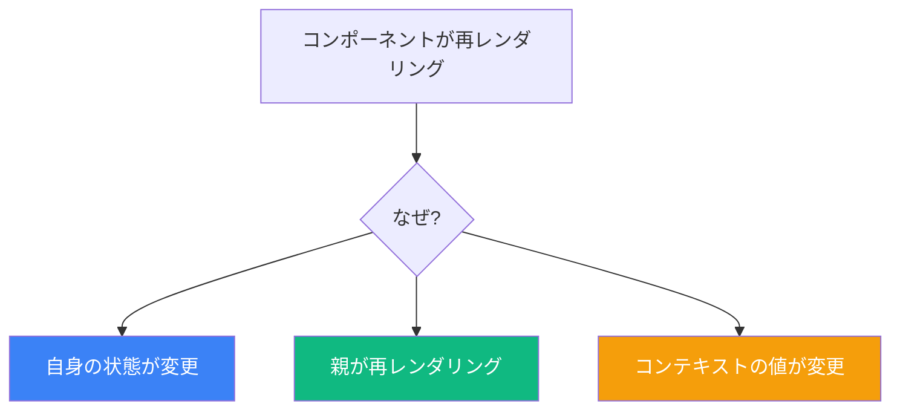
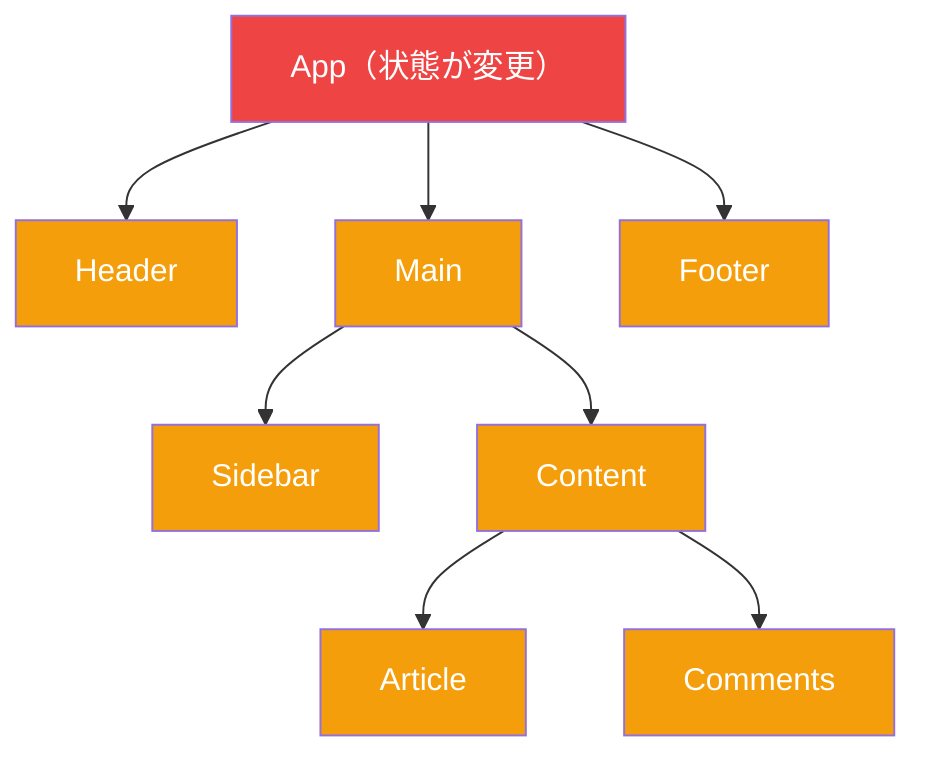

Reactで最もよく混乱される点の1つは、コンポーネントがいつ、なぜ再レンダリングされるかを理解することです。多くの開発者は、コンポーネントはpropsが変更された時だけ再レンダリングされると信じています。これは誤解であり、パフォーマンスの問題やバグのあるコードにつながります。

一度で混乱を解消しましょう。

## コンポーネントが再レンダリングされる3つの理由

Reactコンポーネントが再レンダリングされる理由は正確に3つだけです：

1. **状態の変更** — コンポーネント自身の状態が`useState`または`useReducer`で変更される
2. **親の再レンダリング** — 親コンポーネントが再レンダリングされる
3. **コンテキストの変更** — 消費しているコンテキストの値が変更される

これだけです。他に再レンダリングをトリガーするものはありません。



## 大きな誤解：propsは再レンダリングをトリガーしない

多くの開発者を驚かせる真実がこれです：**propsの変更は再レンダリングを引き起こしません**。

```jsx
function Parent() {
  const [count, setCount] = useState(0);

  return (
    <>
      <button onClick={() => setCount(c => c + 1)}>
        Increment
      </button>
      <Child value={count} />
    </>
  );
}

function Child({ value }) {
  console.log('Child rendered');
  return <div>{value}</div>;
}
```

ボタンをクリックすると：
1. `Parent`は**自身の状態が変更された**ため再レンダリング
2. `Child`は**親が再レンダリングされた**ため再レンダリング
3. 新しい`value` propはこの再レンダリング中に渡される

子はpropが変更された*から*再レンダリングしたのではありません。親が再レンダリングしたから再レンダリングしました。新しいprop値はその再レンダリングの副作用に過ぎません。

### 証明：静的なpropsでも再レンダリングが起きる

```jsx
function Parent() {
  const [count, setCount] = useState(0);

  return (
    <>
      <button onClick={() => setCount(c => c + 1)}>
        Increment: {count}
      </button>
      {/* Childは毎回同じpropsを受け取る */}
      <Child value="static" />
    </>
  );
}

function Child({ value }) {
  console.log('Child rendered'); // 親のレンダリングごとにログ出力！
  return <div>{value}</div>;
}
```

`Child`が同じpropsを受け取っているにもかかわらず、`Parent`が再レンダリングするたびに再レンダリングされます。

## 親の再レンダリングは下に連鎖する

コンポーネントが再レンダリングされると、デフォルトで**すべての子が再レンダリングされます**：



`App`の状態が変更されると、propsが変更されていなくても、ツリー内のすべてのコンポーネントが再レンダリングされます。

## 不要な再レンダリングを防ぐ方法

### 1. React.memo

コンポーネントを`React.memo`でラップして、propsが変更されていない場合に再レンダリングをスキップ：

```jsx
const Child = React.memo(function Child({ value }) {
  console.log('Child rendered');
  return <div>{value}</div>;
});

function Parent() {
  const [count, setCount] = useState(0);

  return (
    <>
      <button onClick={() => setCount(c => c + 1)}>
        Increment: {count}
      </button>
      <Child value="static" /> {/* これで1回だけレンダリング！ */}
    </>
  );
}
```

### 2. 状態を下に移動

状態を使用する場所にできるだけ近づける：

```jsx
// 悪い: 状態が高すぎて不要な再レンダリングを引き起こす
function App() {
  const [searchTerm, setSearchTerm] = useState('');

  return (
    <div>
      <Header /> {/* searchTermが変わると再レンダリング */}
      <SearchInput value={searchTerm} onChange={setSearchTerm} />
      <ExpensiveComponent /> {/* searchTermが変わると再レンダリング */}
    </div>
  );
}

// 良い: 状態を必要な場所に移動
function App() {
  return (
    <div>
      <Header />
      <Search /> {/* 自身の状態を含む */}
      <ExpensiveComponent />
    </div>
  );
}

function Search() {
  const [searchTerm, setSearchTerm] = useState('');
  return <SearchInput value={searchTerm} onChange={setSearchTerm} />;
}
```

### 3. コンテンツを上に持ち上げる（childrenパターン）

コンポーネントをchildrenとして渡して再レンダリングを避ける：

```jsx
// 悪い: countが変わるとExpensiveComponentが再レンダリング
function Parent() {
  const [count, setCount] = useState(0);

  return (
    <div>
      <button onClick={() => setCount(c => c + 1)}>
        Count: {count}
      </button>
      <ExpensiveComponent />
    </div>
  );
}

// 良い: ExpensiveComponentは再レンダリングされない
function App() {
  return (
    <Counter>
      <ExpensiveComponent />
    </Counter>
  );
}

function Counter({ children }) {
  const [count, setCount] = useState(0);

  return (
    <div>
      <button onClick={() => setCount(c => c + 1)}>
        Count: {count}
      </button>
      {children} {/* childrenはAppで作成され、Counterではない */}
    </div>
  );
}
```

なぜこれが機能するのでしょうか？`children`は`Counter`ではなく`App`で作成されるからです。`Counter`が再レンダリングされるとき、`children`は前の`App`のレンダリング中に作成されたReact要素です。

## Strict Modeと二重レンダリング

開発環境でStrict Modeを使用すると、Reactは意図的にコンポーネントを2回レンダリングします：

```jsx
function App() {
  console.log('App rendered'); // 開発環境では2回ログ出力！

  return <div>Hello</div>;
}
```

これはレンダリング関数内の副作用を検出するのに役立ちます。開発環境でのみ発生し、本番環境では発生しません。

## 再レンダリングを引き起こさない状態更新

Reactは状態が実際に変わらない場合、再レンダリングをスキップする賢さを持っています：

```jsx
function Counter() {
  const [count, setCount] = useState(0);

  const handleClick = () => {
    setCount(0); // 同じ値に設定
  };

  console.log('Rendered');

  return <button onClick={handleClick}>{count}</button>;
}
```

countがすでに0のときにボタンをクリックすると、Reactは状態値が同じ（`Object.is`比較を使用）ため、再レンダリングを**ベイルアウト**します。

ただし、このベイルアウトはReactがレンダリングを開始した*後*に発生するため、関数はベイルアウト前に一度呼び出されます。

## コンテキストと再レンダリング

コンテキストの変更は、消費するすべてのコンポーネントで再レンダリングをトリガーします：

```jsx
const ThemeContext = createContext('light');

function App() {
  const [theme, setTheme] = useState('light');

  return (
    <ThemeContext.Provider value={theme}>
      <Header />
      <Main />
      <Footer />
    </ThemeContext.Provider>
  );
}

function Header() {
  const theme = useContext(ThemeContext);
  console.log('Header rendered'); // themeが変わると再レンダリング
  return <header className={theme}>Header</header>;
}
```

`theme`が変更されると、`useContext(ThemeContext)`を使用するすべてのコンポーネントが再レンダリングされます、たとえ深くネストされていても。

### コンテキストの最適化

頻繁に変更される値と安定した値を分離：

```jsx
// 悪い: どの値が変わってもすべてが再レンダリング
const AppContext = createContext({ user: null, theme: 'light', locale: 'en' });

// 良い: 異なる更新頻度で別々のコンテキスト
const UserContext = createContext(null);
const ThemeContext = createContext('light');
const LocaleContext = createContext('en');
```

## 再レンダリングのデバッグ

### React DevTools Profiler

1. React DevToolsを開く
2. 「Profiler」タブに移動
3. 「Record」をクリック
4. アプリを操作
5. 記録を停止
6. どのコンポーネントがレンダリングされたか、なぜかを分析

### Why Did You Render

`@welldone-software/why-did-you-render`ライブラリを使用：

```jsx
import React from 'react';

if (process.env.NODE_ENV === 'development') {
  const whyDidYouRender = require('@welldone-software/why-did-you-render');
  whyDidYouRender(React);
}

const MyComponent = React.memo(function MyComponent({ data }) {
  return <div>{data}</div>;
});

MyComponent.whyDidYouRender = true;
```

## まとめ

| トリガー | 再レンダリングを引き起こす？ |
|---------|------------------|
| 状態の変更 | はい |
| 親の再レンダリング | はい |
| コンテキストの変更 | はい（消費者の場合） |
| propsの変更 | いいえ（ただし親の再レンダリングは引き起こす） |
| Force update | はい |

重要なポイント：

- コンポーネントは状態、親、またはコンテキストが変更されると再レンダリングされる
- propsの変更だけでは再レンダリングはトリガーされない
- 親の再レンダリングはデフォルトですべての子に連鎖する
- propsが変更されていない場合に再レンダリングをスキップするには`React.memo`を使用
- 状態を下に移動するか、コンテンツを上に持ち上げて再レンダリングを最小化
- 最適化する前にReact DevToolsで測定

Reactのレンダリング動作を理解することは、パフォーマンスの高いアプリケーションを書くための基本です。再レンダリングが親から子に連鎖することを理解すれば、最適化戦略がはるかに明確になります。

## 参考文献

- [React Documentation: Render and Commit](https://react.dev/learn/render-and-commit)
- [React Documentation: Preserving and Resetting State](https://react.dev/learn/preserving-and-resetting-state)
- Barklund, Morten. *React in Depth*. Manning Publications, 2024.
- Kumar, Tejas. *Fluent React*. O'Reilly Media, 2024.
