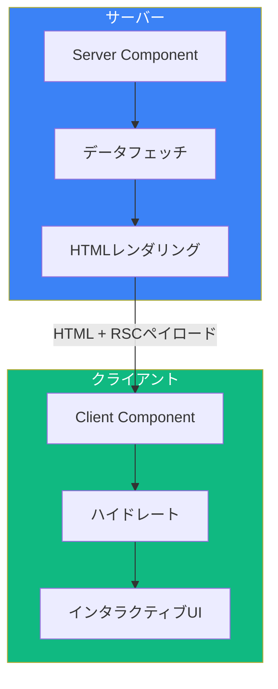
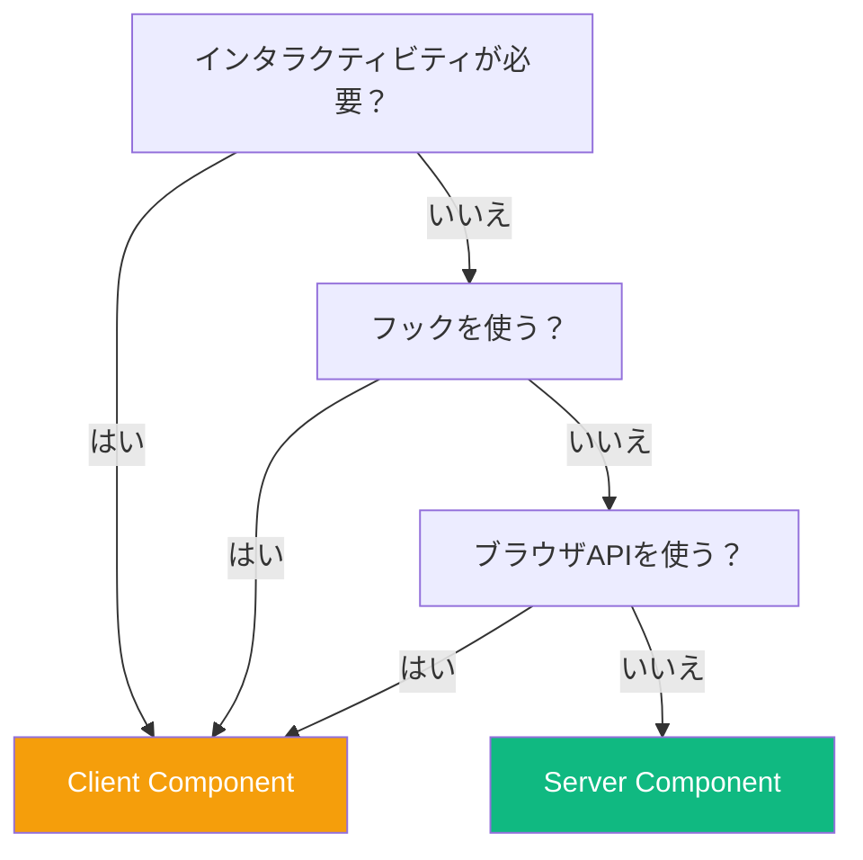
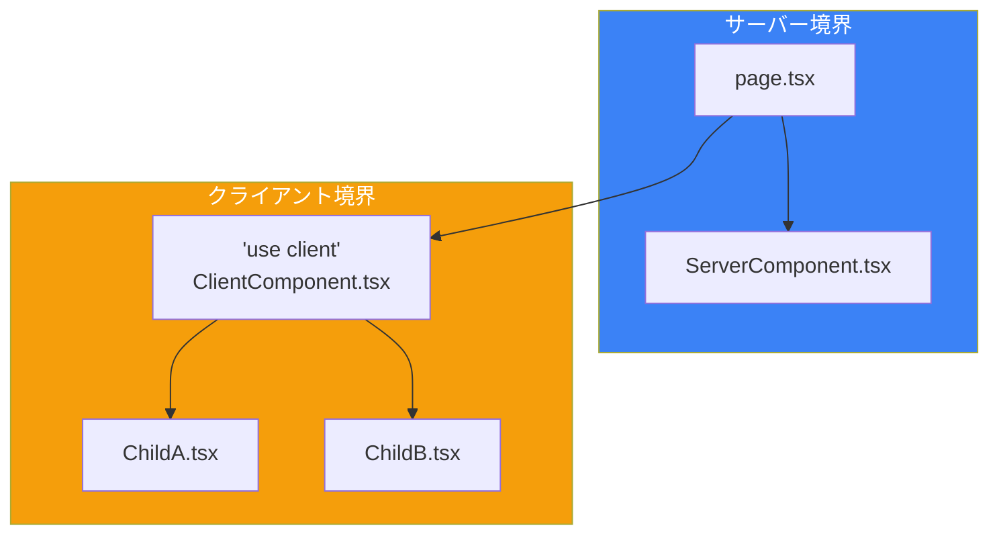

React Server Components（RSC）は、Reactアプリケーションの構築方法における根本的な転換を表しています。コンポーネントをサーバー上でのみ実行することで、バンドルサイズを削減し、バックエンドリソースへの直接アクセスを可能にします。

## React Server Componentsとは？



| 側面 | Server Components | Client Components |
|------|-------------------|-------------------|
| 実行 | サーバーのみ | サーバー + クライアント |
| バンドルサイズ | 含まれない | 含まれる |
| データアクセス | 直接DB/APIアクセス | APIコール経由 |
| インタラクティビティ | なし | 完全（イベント、状態） |
| App Routerでのデフォルト | はい | いいえ（'use client'が必要） |

## デフォルトでServer Components

Next.js App Routerでは、すべてのコンポーネントがデフォルトでServer Componentsです：

```tsx
// app/page.tsx - これはServer Component
async function getData() {
  const res = await fetch('https://api.example.com/data');
  return res.json();
}

export default async function HomePage() {
  const data = await getData();

  return (
    <main>
      <h1>ようこそ</h1>
      <p>データ: {data.message}</p>
    </main>
  );
}
```

### Server Componentsの利点

```tsx
// Server Componentはバックエンドリソースに直接アクセスできる
import { db } from '@/lib/database';

export default async function UsersPage() {
  // 直接データベースアクセス - APIは不要
  const users = await db.query('SELECT * FROM users');

  return (
    <ul>
      {users.map((user) => (
        <li key={user.id}>{user.name}</li>
      ))}
    </ul>
  );
}
```

### Server Componentsでできること

- データベースから直接データフェッチ
- サーバー専用リソースへのアクセス（ファイルシステム、環境変数）
- 機密性の高いロジックをサーバーに保持
- クライアント側JavaScriptバンドルの削減

### Server Componentsでできないこと

- Reactフックの使用（useState、useEffectなど）
- イベントハンドラーの追加（onClick、onChangeなど）
- ブラウザAPIへのアクセス（window、document、localStorage）
- Contextプロバイダーの使用

## Client Components

インタラクティビティが必要な場合は、`'use client'`ディレクティブを使用：

```tsx
// components/Counter.tsx
'use client';

import { useState } from 'react';

export default function Counter() {
  const [count, setCount] = useState(0);

  return (
    <div>
      <p>カウント: {count}</p>
      <button onClick={() => setCount(count + 1)}>増加</button>
    </div>
  );
}
```

### Client Componentsを使うべき時

```tsx
'use client';

import { useState, useEffect } from 'react';

export default function InteractiveForm() {
  // 状態管理
  const [value, setValue] = useState('');

  // ブラウザAPI
  useEffect(() => {
    const saved = localStorage.getItem('value');
    if (saved) setValue(saved);
  }, []);

  // イベントハンドラー
  const handleChange = (e: React.ChangeEvent<HTMLInputElement>) => {
    setValue(e.target.value);
    localStorage.setItem('value', e.target.value);
  };

  return (
    <input
      value={value}
      onChange={handleChange}
      placeholder="何か入力..."
    />
  );
}
```

## ServerとClientの選択



| ユースケース | コンポーネントタイプ |
|--------------|---------------------|
| データフェッチと表示 | Server |
| 静的コンテンツ | Server |
| クライアントバリデーション付きフォーム | Client |
| インタラクティブウィジェット | Client |
| onClickのあるボタン | Client |
| フック（useState、useEffect） | Client |
| アニメーション | Client |
| サードパーティUIライブラリ | 多くの場合Client |

## ServerとClient Componentsの構成

### パターン1: Serverの親、Clientの子

```tsx
// app/page.tsx（Server Component）
import { Counter } from '@/components/Counter';

async function getData() {
  const res = await fetch('https://api.example.com/initial-count');
  return res.json();
}

export default async function Page() {
  const data = await getData();

  return (
    <div>
      <h1>ダッシュボード</h1>
      {/* サーバーデータをクライアントコンポーネントに渡す */}
      <Counter initialCount={data.count} />
    </div>
  );
}
```

```tsx
// components/Counter.tsx（Client Component）
'use client';

import { useState } from 'react';

export function Counter({ initialCount }: { initialCount: number }) {
  const [count, setCount] = useState(initialCount);

  return (
    <button onClick={() => setCount(count + 1)}>
      カウント: {count}
    </button>
  );
}
```

### パターン2: Server Componentsをchildrenとして渡す

```tsx
// components/ClientWrapper.tsx（Client Component）
'use client';

import { useState } from 'react';

export function Accordion({ children }: { children: React.ReactNode }) {
  const [isOpen, setIsOpen] = useState(false);

  return (
    <div>
      <button onClick={() => setIsOpen(!isOpen)}>
        {isOpen ? '閉じる' : '開く'}
      </button>
      {isOpen && children}
    </div>
  );
}
```

```tsx
// app/page.tsx（Server Component）
import { Accordion } from '@/components/ClientWrapper';
import { ExpensiveServerContent } from '@/components/ExpensiveServerContent';

export default function Page() {
  return (
    <Accordion>
      {/* Server Componentをchildrenとして渡す */}
      <ExpensiveServerContent />
    </Accordion>
  );
}
```

### パターン3: Clientロジックの抽出

```tsx
// コンポーネント全体をクライアント側にする代わりに
// app/products/page.tsx（Server Component）
import { AddToCartButton } from '@/components/AddToCartButton';
import { db } from '@/lib/database';

export default async function ProductsPage() {
  const products = await db.query('SELECT * FROM products');

  return (
    <div>
      {products.map((product) => (
        <div key={product.id}>
          <h2>{product.name}</h2>
          <p>{product.description}</p>
          <p>¥{product.price}</p>
          {/* ボタンだけがClient Componentである必要がある */}
          <AddToCartButton productId={product.id} />
        </div>
      ))}
    </div>
  );
}
```

```tsx
// components/AddToCartButton.tsx（Client Component）
'use client';

export function AddToCartButton({ productId }: { productId: string }) {
  const handleClick = () => {
    // カートに追加するロジック
    console.log(`${productId}をカートに追加`);
  };

  return <button onClick={handleClick}>カートに追加</button>;
}
```

## 'use client'境界

`'use client'`ディレクティブは境界を作成します：



**重要**: `'use client'`を使用すると、インポートされたすべてのコンポーネントがクライアントコンポーネントになります：

```tsx
// components/ClientParent.tsx
'use client';

// これらも（'use client'がなくても）Client Componentsになる
import { ChildA } from './ChildA';
import { ChildB } from './ChildB';

export function ClientParent() {
  return (
    <div>
      <ChildA />
      <ChildB />
    </div>
  );
}
```

## データのシリアライゼーション

ServerからClient Componentsに渡されるデータはシリアライズ可能である必要があります：

```tsx
// ✅ シリアライズ可能 - 動作する
<ClientComponent
  name="John"
  age={30}
  items={['a', 'b', 'c']}
  config={{ theme: 'dark' }}
  date={new Date().toISOString()}  // 文字列に変換
/>

// ❌ シリアライズ不可 - 失敗する
<ClientComponent
  onClick={() => console.log('clicked')}  // 関数
  element={<div>Hello</div>}               // JSX要素
  date={new Date()}                        // Dateオブジェクト
  map={new Map()}                          // Map/Set
/>
```

## サードパーティライブラリ

多くのサードパーティライブラリは`'use client'`が必要です：

```tsx
// components/ChartWrapper.tsx
'use client';

import { Chart } from 'some-chart-library';

export function ChartWrapper({ data }: { data: number[] }) {
  return <Chart data={data} />;
}
```

```tsx
// app/analytics/page.tsx（Server Component）
import { ChartWrapper } from '@/components/ChartWrapper';
import { db } from '@/lib/database';

export default async function AnalyticsPage() {
  const data = await db.query('SELECT * FROM analytics');

  return (
    <div>
      <h1>アナリティクス</h1>
      <ChartWrapper data={data.values} />
    </div>
  );
}
```

## ベストプラクティス

### 1. Client Componentsを小さく保つ

```tsx
// ❌ 悪い例: ページ全体をClient Componentに
'use client';

export default function ProductPage() {
  // すべてがクライアント側になる
}

// ✅ 良い例: インタラクティブな部分のみをClient Componentに
// app/products/[id]/page.tsx（Server Component）
import { AddToCart } from '@/components/AddToCart';

export default async function ProductPage({ params }) {
  const product = await getProduct(params.id);

  return (
    <div>
      <h1>{product.name}</h1>
      <p>{product.description}</p>
      <AddToCart productId={product.id} /> {/* これだけがclient */}
    </div>
  );
}
```

### 2. Client境界を下に押し下げる

`'use client'`をコンポーネントツリーのできるだけ深くに移動：

```
✅ 良い構造:
app/
├── page.tsx           （Server）
├── components/
│   ├── Header.tsx     （Server）
│   ├── ProductList.tsx（Server）
│   └── AddToCart.tsx  （Client - 'use client'）

❌ 避ける:
app/
├── page.tsx           （Client - トップレベルで'use client'）
```

### 3. 複雑なUIにはコンポジションを使用

```tsx
// Server Componentがデータをフェッチ
async function ProductInfo({ id }: { id: string }) {
  const product = await getProduct(id);
  return (
    <div>
      <h2>{product.name}</h2>
      <p>{product.description}</p>
    </div>
  );
}

// Client Componentがインタラクションを処理
function ProductActions({ id }: { id: string }) {
  'use client';
  return <button onClick={() => addToCart(id)}>カートに追加</button>;
}

// それらを組み合わせる
export default function ProductCard({ id }: { id: string }) {
  return (
    <div>
      <ProductInfo id={id} />
      <ProductActions id={id} />
    </div>
  );
}
```

## まとめ

| 概念 | 説明 |
|------|------|
| Server Components | App Routerでのデフォルト、サーバーでのみ実行 |
| Client Components | `'use client'`が必要、インタラクティビティを含む |
| `'use client'` | クライアント境界を作成するディレクティブ |
| シリアライゼーション | クライアントへのデータはシリアライズ可能である必要 |
| コンポジション | Server ComponentsをClientのchildrenとして渡す |

重要なポイント：

- Server ComponentsはNext.js App Routerでのデフォルト
- `'use client'`はインタラクティビティやブラウザAPIが必要な時のみ使用
- クライアント境界はできるだけ小さく、ツリーの深くに保つ
- ServerからClientへはprops経由でデータを渡す（シリアライズ可能である必要）
- Server Componentsは子としてClient Componentsを持てる
- Client ComponentsはServer Componentsをインポートできない（ただしchildrenとして受け取れる）
- 多くのサードパーティライブラリは`'use client'`ディレクティブが必要

Server vs Client Componentsの使い分けを理解することが、効率的なNext.jsアプリケーション構築の鍵です。

## 参考文献

- [Next.js Server Components](https://nextjs.org/docs/app/building-your-application/rendering/server-components)
- [React Server Components RFC](https://github.com/reactjs/rfcs/blob/main/text/0188-server-components.md)
- Kumar, Tejas. *Fluent React*. O'Reilly, 2024.
- Schwarzmüller, Maximilian. *React Key Concepts - Second Edition*. Packt, 2025.
