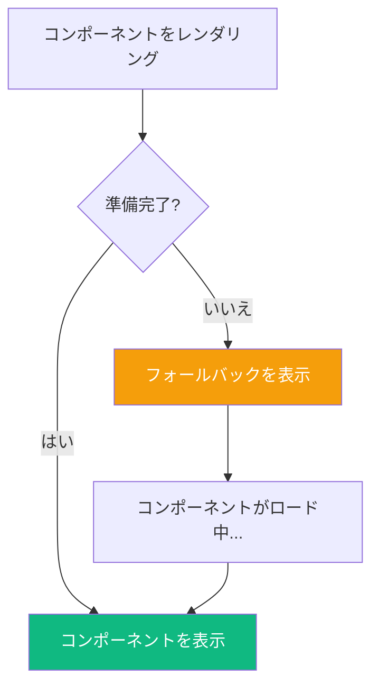
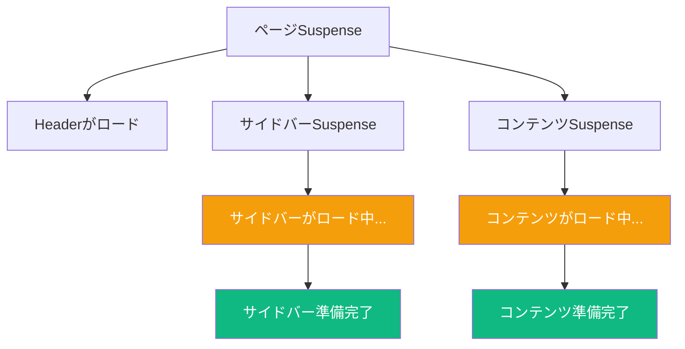

React Suspenseは非同期操作を宣言的に処理するためのメカニズムです。`React.lazy()`と組み合わせることで、アプリの初期ロード時間を大幅に改善できるコード分割が可能になります。

## Suspenseとは？

Suspenseは、何かのロードを待っている間のローディング状態を宣言的に指定できます：

```jsx
<Suspense fallback={<Spinner />}>
  <SomeComponent />
</Suspense>
```

`SomeComponent`がまだ準備できていない場合（lazy loadされているかデータをフェッチ中）、Reactは準備ができるまでfallbackを表示します。



## コンポーネントのLazy Loading

### 基本的な使い方

`React.lazy()`は、コンポーネントが必要になった時だけロードできます：

```jsx
import { lazy, Suspense } from 'react';

// コンポーネントはレンダリングされるまでロードされない
const HeavyChart = lazy(() => import('./HeavyChart'));

function Dashboard() {
  return (
    <div>
      <h1>ダッシュボード</h1>
      <Suspense fallback={<div>チャートをロード中...</div>}>
        <HeavyChart />
      </Suspense>
    </div>
  );
}
```

`HeavyChart`コンポーネントのコードは、`Dashboard`コンポーネントが初めてレンダリングするまでダウンロードされません。

### ルートベースのコード分割

lazy loadingの最も効果的な使用はルートレベルです：

```jsx
import { lazy, Suspense } from 'react';
import { BrowserRouter, Routes, Route } from 'react-router-dom';

// 各ルートは独自のバンドルをロード
const Home = lazy(() => import('./pages/Home'));
const About = lazy(() => import('./pages/About'));
const Dashboard = lazy(() => import('./pages/Dashboard'));
const Settings = lazy(() => import('./pages/Settings'));

function App() {
  return (
    <BrowserRouter>
      <Suspense fallback={<PageLoader />}>
        <Routes>
          <Route path="/" element={<Home />} />
          <Route path="/about" element={<About />} />
          <Route path="/dashboard" element={<Dashboard />} />
          <Route path="/settings" element={<Settings />} />
        </Routes>
      </Suspense>
    </BrowserRouter>
  );
}
```

ユーザーは訪問するページのコードだけをダウンロードします。

### 名前付きエクスポート

`React.lazy()`はdefaultエクスポートでのみ動作します。名前付きエクスポートの場合は、中間モジュールを作成します：

```jsx
// ManyComponents.jsは複数のコンポーネントをエクスポート
export const ComponentA = () => <div>A</div>;
export const ComponentB = () => <div>B</div>;

// 中間インポートを使用
const ComponentA = lazy(() =>
  import('./ManyComponents').then(module => ({ default: module.ComponentA }))
);
```

## Suspense境界

### 複数のSuspense境界

詳細なローディング状態のためにSuspense境界をネストできます：

```jsx
function App() {
  return (
    <Suspense fallback={<PageSkeleton />}>
      <Header />
      <main>
        <Suspense fallback={<SidebarSkeleton />}>
          <Sidebar />
        </Suspense>
        <Suspense fallback={<ContentSkeleton />}>
          <MainContent />
        </Suspense>
      </main>
    </Suspense>
  );
}
```



### Suspense境界の配置場所

- **高すぎる**：ユーザーは空白ページを長く見る
- **低すぎる**：ローディングスピナーが多すぎて不快な体験
- **ちょうど良い**：ユーザーの期待に合ったローディング状態

```jsx
// 高すぎる - ページ全体がローダーを表示
<Suspense fallback={<FullPageLoader />}>
  <EntireApp />
</Suspense>

// 低すぎる - すべてのコンポーネントが独自のローダーを持つ
<div>
  <Suspense fallback={<Spinner />}><Header /></Suspense>
  <Suspense fallback={<Spinner />}><Nav /></Suspense>
  <Suspense fallback={<Spinner />}><Content /></Suspense>
  <Suspense fallback={<Spinner />}><Footer /></Suspense>
</div>

// より良い - 論理的なグループ化
<div>
  <Header /> {/* 常にすぐにロード */}
  <Suspense fallback={<ContentSkeleton />}>
    <MainContent /> {/* メインエリアは一緒にロード */}
  </Suspense>
</div>
```

## エラーハンドリング

ロード失敗を処理するためにSuspenseと一緒にError Boundaryを使用します：

```jsx
import { Component } from 'react';

class ErrorBoundary extends Component {
  state = { hasError: false, error: null };

  static getDerivedStateFromError(error) {
    return { hasError: true, error };
  }

  render() {
    if (this.state.hasError) {
      return (
        <div>
          <h2>問題が発生しました。</h2>
          <button onClick={() => this.setState({ hasError: false })}>
            再試行
          </button>
        </div>
      );
    }
    return this.props.children;
  }
}

// 使用例
function App() {
  return (
    <ErrorBoundary>
      <Suspense fallback={<Spinner />}>
        <LazyComponent />
      </Suspense>
    </ErrorBoundary>
  );
}
```

## コンポーネントのプリロード

必要になる前にlazyコンポーネントをプリロードできます：

```jsx
const HeavyComponent = lazy(() => import('./HeavyComponent'));

// ホバー時にプリロード
function Navigation() {
  const handleMouseEnter = () => {
    // コンポーネントのロードを開始
    import('./HeavyComponent');
  };

  return (
    <Link
      to="/heavy"
      onMouseEnter={handleMouseEnter}
    >
      重いページへ
    </Link>
  );
}
```

または専用のプリロード関数を使用：

```jsx
// プリロード可能なlazyコンポーネントを作成
function lazyWithPreload(factory) {
  const Component = lazy(factory);
  Component.preload = factory;
  return Component;
}

const Dashboard = lazyWithPreload(() => import('./Dashboard'));

// ユーザーがそこにナビゲートするかもしれない時にプリロード
function Nav() {
  return (
    <nav onMouseEnter={() => Dashboard.preload()}>
      <Link to="/dashboard">ダッシュボード</Link>
    </nav>
  );
}
```

## データフェッチングのためのSuspense

主にコード分割に使用されますが、Suspenseは適切な統合でデータフェッチングも処理できます：

### React Query / TanStack Queryと

```jsx
import { useSuspenseQuery } from '@tanstack/react-query';

function UserProfile({ userId }) {
  // このコンポーネントはフェッチ中にサスペンドする
  const { data: user } = useSuspenseQuery({
    queryKey: ['user', userId],
    queryFn: () => fetchUser(userId),
  });

  return <div>{user.name}</div>;
}

function App() {
  return (
    <Suspense fallback={<ProfileSkeleton />}>
      <UserProfile userId={123} />
    </Suspense>
  );
}
```

### Reactの`use`フックと（React 19+）

```jsx
import { use, Suspense } from 'react';

function UserProfile({ userPromise }) {
  const user = use(userPromise);
  return <div>{user.name}</div>;
}

function App() {
  const userPromise = fetchUser(123); // Promiseを返す

  return (
    <Suspense fallback={<ProfileSkeleton />}>
      <UserProfile userPromise={userPromise} />
    </Suspense>
  );
}
```

## ベストプラクティス

### 1. 意味のあるローディング状態を表示

```jsx
// 悪い：汎用的なスピナー
<Suspense fallback={<Spinner />}>
  <DataTable />
</Suspense>

// 良い：コンテンツに合ったスケルトン
<Suspense fallback={<DataTableSkeleton rows={10} />}>
  <DataTable />
</Suspense>
```

### 2. レイアウトシフトを避ける

フォールバックをコンテンツと同じサイズにする：

```jsx
function CardSkeleton() {
  return (
    <div className="card" style={{ height: 200 }}>
      <div className="skeleton-title" />
      <div className="skeleton-content" />
    </div>
  );
}
```

### 3. 緊急でない更新にはstartTransitionを使用

素早いナビゲーションでローディング状態を防ぐ：

```jsx
import { startTransition } from 'react';

function Tabs({ tabs }) {
  const [tab, setTab] = useState(tabs[0]);

  function selectTab(nextTab) {
    // 素早い遷移ではSuspenseフォールバックを表示しない
    startTransition(() => {
      setTab(nextTab);
    });
  }

  return (
    <div>
      <TabButtons tabs={tabs} onSelect={selectTab} />
      <Suspense fallback={<TabSkeleton />}>
        <TabContent tab={tab} />
      </Suspense>
    </div>
  );
}
```

### 4. 初期バンドルを小さく保つ

ルートと大きな機能を積極的に分割：

```jsx
// ルートで分割
const routes = {
  home: lazy(() => import('./pages/Home')),
  dashboard: lazy(() => import('./pages/Dashboard')),
  settings: lazy(() => import('./pages/Settings')),
};

// 大きな機能を分割
const RichTextEditor = lazy(() => import('./components/RichTextEditor'));
const DataVisualization = lazy(() => import('./components/DataVisualization'));
```

## まとめ

| 概念 | 説明 |
|---------|-------------|
| `React.lazy()` | コンポーネントを動的にインポート |
| `<Suspense>` | ロード中にフォールバックを表示 |
| コード分割 | 必要な時だけコードをロード |
| Error Boundary | ロード失敗を処理 |
| プリロード | 必要になる前にロードを開始 |

重要なポイント：

- ルートレベルのコード分割に`React.lazy()`を使用
- 論理的なUIブレークポイントにSuspense境界を配置
- ロードするコンテンツの形状に合ったスケルトンを表示
- ロード失敗を処理するためにError Boundaryを使用
- ユーザーが次に必要としそうなコンポーネントをプリロード
- 素早いロードでちらつきを避けるために`startTransition`を使用

SuspenseとLazy Loadingは、パフォーマンスの高いReactアプリケーションを構築するための必須ツールです。ローディング中の良いユーザー体験を維持しながら、より小さな初期バンドルを配信できます。

## 参考文献

- [React Documentation: Suspense](https://react.dev/reference/react/Suspense)
- [React Documentation: lazy](https://react.dev/reference/react/lazy)
- Kumar, Tejas. *Fluent React*. O'Reilly Media, 2024.
