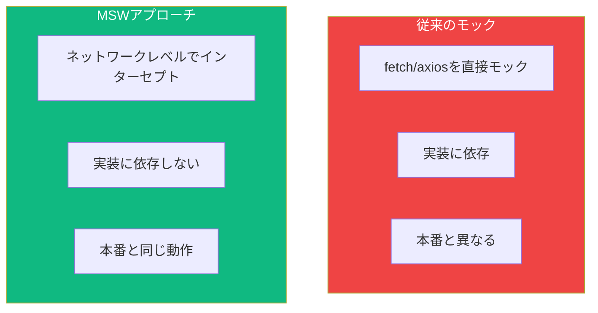

APIコールを行うコンポーネントのテストは難しいことがあります。Mock Service Worker (MSW)はネットワークレベルでリクエストをインターセプトし、本番環境と全く同じようにコンポーネントをテストできます。

## なぜMSWか？

従来のモックアプローチには制限があります：



| アプローチ | 長所 | 短所 |
|-----------|------|------|
| fetchをモック | シンプルなセットアップ | 実装に密結合 |
| axiosをモック | axios使用時は簡単 | ライブラリを切り替えると壊れる |
| MSW | どのライブラリでも動作 | セットアップが少し多い |

MSWはアプリからリクエストが出る前にインターセプトするため、コンポーネントのfetchコードは本番環境と全く同じように実行されます。

## MSWのセットアップ

### インストール

```bash
npm install -D msw
```

### ハンドラーの作成

モックサーバーがリクエストにどう応答するかを定義します：

```typescript
// src/mocks/handlers.ts
import { http, HttpResponse } from 'msw';

export const handlers = [
  // GETリクエスト
  http.get('/api/users', () => {
    return HttpResponse.json([
      { id: 1, name: 'Alice' },
      { id: 2, name: 'Bob' },
    ]);
  }),

  // パスパラメータ付きGET
  http.get('/api/users/:id', ({ params }) => {
    const { id } = params;
    return HttpResponse.json({ id: Number(id), name: 'John Doe' });
  }),

  // POSTリクエスト
  http.post('/api/users', async ({ request }) => {
    const body = await request.json();
    return HttpResponse.json(
      { id: 3, ...body },
      { status: 201 }
    );
  }),
];
```

### サーバーのセットアップ

```typescript
// src/mocks/server.ts
import { setupServer } from 'msw/node';
import { handlers } from './handlers';

export const server = setupServer(...handlers);
```

### テストセットアップ

テスト中にMSWを実行するよう設定：

```typescript
// src/test/setup.ts
import '@testing-library/jest-dom';
import { server } from '../mocks/server';

// すべてのテスト前にサーバーを開始
beforeAll(() => server.listen());

// 各テスト後にハンドラーをリセット
afterEach(() => server.resetHandlers());

// すべてのテスト後にサーバーを閉じる
afterAll(() => server.close());
```

Vite/Jest設定を更新：

```typescript
// vite.config.ts
export default defineConfig({
  test: {
    setupFiles: './src/test/setup.ts',
  },
});
```

## データフェッチコンポーネントのテスト

### 基本的な非同期コンポーネント

```tsx
// UserList.tsx
function UserList() {
  const [users, setUsers] = useState([]);
  const [loading, setLoading] = useState(true);
  const [error, setError] = useState(null);

  useEffect(() => {
    fetch('/api/users')
      .then((res) => res.json())
      .then((data) => {
        setUsers(data);
        setLoading(false);
      })
      .catch((err) => {
        setError(err.message);
        setLoading(false);
      });
  }, []);

  if (loading) return <div>読み込み中...</div>;
  if (error) return <div role="alert">{error}</div>;

  return (
    <ul>
      {users.map((user) => (
        <li key={user.id}>{user.name}</li>
      ))}
    </ul>
  );
}
```

### ハッピーパスのテスト

```tsx
import { render, screen } from '@testing-library/react';
import { UserList } from './UserList';

test('ロード後にユーザーを表示', async () => {
  render(<UserList />);

  // ローディング状態を表示
  expect(screen.getByText('読み込み中...')).toBeInTheDocument();

  // ユーザーが表示されるのを待つ
  expect(await screen.findByText('Alice')).toBeInTheDocument();
  expect(screen.getByText('Bob')).toBeInTheDocument();

  // ローディングは消える
  expect(screen.queryByText('読み込み中...')).not.toBeInTheDocument();
});
```

### エラー状態のテスト

特定のテストでハンドラーをオーバーライド：

```tsx
import { http, HttpResponse } from 'msw';
import { server } from '../mocks/server';

test('失敗時にエラーメッセージを表示', async () => {
  // このテスト用にハンドラーをオーバーライド
  server.use(
    http.get('/api/users', () => {
      return HttpResponse.json(
        { message: 'Server error' },
        { status: 500 }
      );
    })
  );

  render(<UserList />);

  // エラーが表示されるのを待つ
  expect(await screen.findByRole('alert')).toBeInTheDocument();
});
```

### ローディング状態のテスト

```tsx
import { delay, http, HttpResponse } from 'msw';
import { server } from '../mocks/server';

test('フェッチ中にローディング状態を表示', async () => {
  // レスポンスに遅延を追加
  server.use(
    http.get('/api/users', async () => {
      await delay(100);
      return HttpResponse.json([]);
    })
  );

  render(<UserList />);

  expect(screen.getByText('読み込み中...')).toBeInTheDocument();

  // ローディングが終わるのを待つ
  await waitForElementToBeRemoved(() => screen.queryByText('読み込み中...'));
});
```

## データ送信フォームのテスト

### フォームコンポーネント

```tsx
// CreateUserForm.tsx
function CreateUserForm({ onSuccess }) {
  const [name, setName] = useState('');
  const [submitting, setSubmitting] = useState(false);
  const [error, setError] = useState(null);

  const handleSubmit = async (e) => {
    e.preventDefault();
    setSubmitting(true);
    setError(null);

    try {
      const res = await fetch('/api/users', {
        method: 'POST',
        headers: { 'Content-Type': 'application/json' },
        body: JSON.stringify({ name }),
      });

      if (!res.ok) throw new Error('ユーザー作成に失敗しました');

      const user = await res.json();
      onSuccess(user);
    } catch (err) {
      setError(err.message);
    } finally {
      setSubmitting(false);
    }
  };

  return (
    <form onSubmit={handleSubmit}>
      <label htmlFor="name">名前</label>
      <input
        id="name"
        value={name}
        onChange={(e) => setName(e.target.value)}
      />
      <button type="submit" disabled={submitting}>
        {submitting ? '作成中...' : 'ユーザー作成'}
      </button>
      {error && <div role="alert">{error}</div>}
    </form>
  );
}
```

### フォーム送信のテスト

```tsx
import userEvent from '@testing-library/user-event';
import { CreateUserForm } from './CreateUserForm';

test('フォームを送信してonSuccessを呼び出す', async () => {
  const user = userEvent.setup();
  const handleSuccess = jest.fn();

  render(<CreateUserForm onSuccess={handleSuccess} />);

  await user.type(screen.getByLabelText('名前'), 'Jane Doe');
  await user.click(screen.getByRole('button', { name: 'ユーザー作成' }));

  // 送信完了を待つ
  await waitFor(() => {
    expect(handleSuccess).toHaveBeenCalledWith(
      expect.objectContaining({ name: 'Jane Doe' })
    );
  });
});

test('送信失敗時にエラーを表示', async () => {
  server.use(
    http.post('/api/users', () => {
      return HttpResponse.json(
        { message: 'Validation failed' },
        { status: 400 }
      );
    })
  );

  const user = userEvent.setup();
  render(<CreateUserForm onSuccess={jest.fn()} />);

  await user.type(screen.getByLabelText('名前'), 'Jane');
  await user.click(screen.getByRole('button'));

  expect(await screen.findByRole('alert')).toHaveTextContent(
    'ユーザー作成に失敗しました'
  );
});

test('送信中にボタンを無効化', async () => {
  server.use(
    http.post('/api/users', async () => {
      await delay(100);
      return HttpResponse.json({ id: 1, name: 'Jane' });
    })
  );

  const user = userEvent.setup();
  render(<CreateUserForm onSuccess={jest.fn()} />);

  await user.type(screen.getByLabelText('名前'), 'Jane');
  await user.click(screen.getByRole('button'));

  // ボタンがローディング状態を表示
  expect(screen.getByRole('button')).toHaveTextContent('作成中...');
  expect(screen.getByRole('button')).toBeDisabled();

  // 完了を待つ
  await waitFor(() => {
    expect(screen.getByRole('button')).toHaveTextContent('ユーザー作成');
  });
});
```

## 高度なMSWパターン

### リクエストデータの検査

```tsx
test('APIに正しいデータを送信', async () => {
  let capturedRequest;

  server.use(
    http.post('/api/users', async ({ request }) => {
      capturedRequest = await request.json();
      return HttpResponse.json({ id: 1, ...capturedRequest });
    })
  );

  const user = userEvent.setup();
  render(<CreateUserForm onSuccess={jest.fn()} />);

  await user.type(screen.getByLabelText('名前'), 'Jane Doe');
  await user.click(screen.getByRole('button'));

  await waitFor(() => {
    expect(capturedRequest).toEqual({ name: 'Jane Doe' });
  });
});
```

### 連続レスポンス

```tsx
test('失敗後のリトライを処理', async () => {
  let callCount = 0;

  server.use(
    http.get('/api/users', () => {
      callCount++;
      if (callCount === 1) {
        return HttpResponse.json({ message: 'Error' }, { status: 500 });
      }
      return HttpResponse.json([{ id: 1, name: 'Alice' }]);
    })
  );

  const user = userEvent.setup();
  render(<UserListWithRetry />);

  // 最初のリクエストが失敗
  expect(await screen.findByRole('alert')).toBeInTheDocument();

  // リトライをクリック
  await user.click(screen.getByRole('button', { name: '再試行' }));

  // 2回目のリクエストが成功
  expect(await screen.findByText('Alice')).toBeInTheDocument();
});
```

### ネットワークエラー

```tsx
test('ネットワーク障害を処理', async () => {
  server.use(
    http.get('/api/users', () => {
      return HttpResponse.error();
    })
  );

  render(<UserList />);

  expect(await screen.findByRole('alert')).toBeInTheDocument();
});
```

### リクエストヘッダー

```tsx
test('認証ヘッダーを送信', async () => {
  let authHeader;

  server.use(
    http.get('/api/users', ({ request }) => {
      authHeader = request.headers.get('Authorization');
      return HttpResponse.json([]);
    })
  );

  render(<AuthenticatedUserList token="bearer-token-123" />);

  await waitFor(() => {
    expect(authHeader).toBe('Bearer bearer-token-123');
  });
});
```

## React Queryでのテスト

MSWはReact Queryと相性抜群です：

```tsx
// UserProfile.tsx
function UserProfile({ userId }) {
  const { data: user, isLoading, error } = useQuery({
    queryKey: ['user', userId],
    queryFn: () => fetch(`/api/users/${userId}`).then((r) => r.json()),
  });

  if (isLoading) return <div>読み込み中...</div>;
  if (error) return <div role="alert">ユーザーの読み込みエラー</div>;

  return <div>{user.name}</div>;
}
```

```tsx
// UserProfile.test.tsx
import { QueryClient, QueryClientProvider } from '@tanstack/react-query';

function renderWithQueryClient(ui) {
  const queryClient = new QueryClient({
    defaultOptions: {
      queries: {
        retry: false, // テストでは失敗したリクエストをリトライしない
      },
    },
  });

  return render(
    <QueryClientProvider client={queryClient}>{ui}</QueryClientProvider>
  );
}

test('ユーザープロフィールを表示', async () => {
  server.use(
    http.get('/api/users/1', () => {
      return HttpResponse.json({ id: 1, name: 'John Doe' });
    })
  );

  renderWithQueryClient(<UserProfile userId={1} />);

  expect(await screen.findByText('John Doe')).toBeInTheDocument();
});
```

## テストパターン

### waitFor vs findBy

```tsx
// findBy - 表示される要素を待つ
const element = await screen.findByText('Data');

// waitFor - アサーションが真になるのを待つ
await waitFor(() => {
  expect(mockFn).toHaveBeenCalled();
});

// waitForElementToBeRemoved - 消える要素を待つ
await waitForElementToBeRemoved(() => screen.queryByText('読み込み中...'));
```

### テストの整理

```tsx
describe('UserList', () => {
  describe('ロード中', () => {
    test('ローディングインジケーターを表示', () => {
      render(<UserList />);
      expect(screen.getByText('読み込み中...')).toBeInTheDocument();
    });
  });

  describe('正常にロード完了', () => {
    test('ユーザーを表示', async () => {
      render(<UserList />);
      expect(await screen.findByText('Alice')).toBeInTheDocument();
    });
  });

  describe('リクエスト失敗時', () => {
    beforeEach(() => {
      server.use(
        http.get('/api/users', () => HttpResponse.error())
      );
    });

    test('エラーメッセージを表示', async () => {
      render(<UserList />);
      expect(await screen.findByRole('alert')).toBeInTheDocument();
    });
  });
});
```

## まとめ

| 概念 | 説明 |
|------|------|
| `http.get/post/put/delete` | モックハンドラーを定義 |
| `HttpResponse.json()` | JSONレスポンスを返す |
| `server.use()` | 特定のテストでハンドラーをオーバーライド |
| `delay()` | ネットワーク遅延をシミュレート |
| `findBy*` | 要素が表示されるのを待つ |
| `waitFor()` | アサーションが通るのを待つ |

重要なポイント：

- MSWはネットワークレベルでリクエストをインターセプトし、テストをより現実的に
- デフォルトハンドラーはhandlersファイルに定義し、特定のテストでオーバーライド
- `server.use()`でエラー状態やエッジケースをテスト
- 非同期データの表示を待つには`findBy`クエリを使用
- テスト汚染を避けるため各テスト後にハンドラーをリセット
- 完全なカバレッジのためにローディング、成功、エラー状態をテスト

MSWはAPIと連携するコンポーネントをテストするための強力で現実的な方法を提供します。テストは本番と同じコードを実行するため、コンポーネントが正しく動作するという信頼を得られます。

## 参考文献

- [MSW Documentation](https://mswjs.io/)
- [Testing Library Async Utilities](https://testing-library.com/docs/dom-testing-library/api-async)
- Ruscio, Daniel. *Testing JavaScript Applications*. Manning Publications, 2021.
- Barklund, Morten. *React in Depth*. Manning Publications, 2024.
