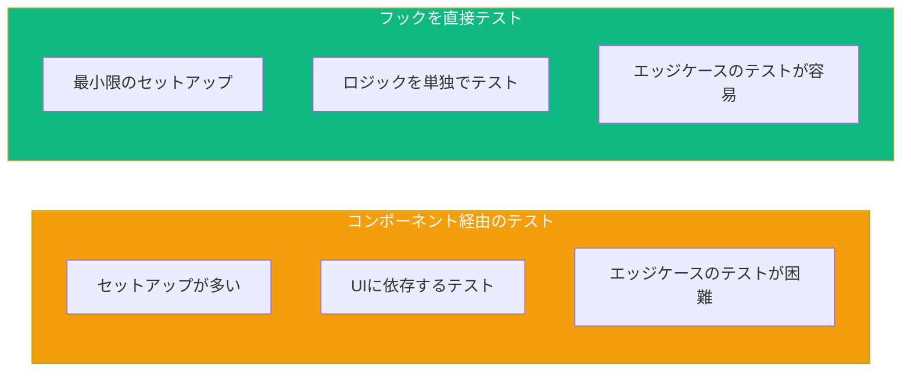

カスタムフックはReactアプリケーションで再利用可能なロジックをカプセル化します。フックを適切にテストすることで、コンポーネントで使用する前に単独で正しく動作することを確認できます。

## なぜフックを個別にテストするのか？



フックを直接テストすると：
- UI依存なしでロジックをテストできる
- エッジケースのテストが容易になる
- より速く、焦点を絞ったテストになる

## セットアップ

テストライブラリをインストール：

```bash
npm install -D @testing-library/react
```

`renderHook`関数は`@testing-library/react`に含まれています：

```tsx
import { renderHook } from '@testing-library/react';
```

## 基本的なフックテスト

### シンプルなカウンターフック

```tsx
// useCounter.ts
import { useState, useCallback } from 'react';

export function useCounter(initialValue = 0) {
  const [count, setCount] = useState(initialValue);

  const increment = useCallback(() => setCount((c) => c + 1), []);
  const decrement = useCallback(() => setCount((c) => c - 1), []);
  const reset = useCallback(() => setCount(initialValue), [initialValue]);

  return { count, increment, decrement, reset };
}
```

### フックのテスト

```tsx
// useCounter.test.ts
import { renderHook, act } from '@testing-library/react';
import { useCounter } from './useCounter';

test('デフォルト値で初期化', () => {
  const { result } = renderHook(() => useCounter());

  expect(result.current.count).toBe(0);
});

test('指定された値で初期化', () => {
  const { result } = renderHook(() => useCounter(10));

  expect(result.current.count).toBe(10);
});

test('カウントを増加', () => {
  const { result } = renderHook(() => useCounter());

  act(() => {
    result.current.increment();
  });

  expect(result.current.count).toBe(1);
});

test('カウントを減少', () => {
  const { result } = renderHook(() => useCounter(5));

  act(() => {
    result.current.decrement();
  });

  expect(result.current.count).toBe(4);
});

test('初期値にリセット', () => {
  const { result } = renderHook(() => useCounter(10));

  act(() => {
    result.current.increment();
    result.current.increment();
  });

  expect(result.current.count).toBe(12);

  act(() => {
    result.current.reset();
  });

  expect(result.current.count).toBe(10);
});
```

## renderHookを理解する

### resultオブジェクト

`renderHook`は`result`プロパティを持つオブジェクトを返します：

```tsx
const { result } = renderHook(() => useMyHook());

// 現在の戻り値にアクセス
result.current; // { value, setValue, ... }
```

`result.current`は常にフックからの最新の戻り値を含みます。

### act関数

状態更新を`act`でラップしてReactが処理するようにします：

```tsx
import { act } from '@testing-library/react';

test('状態を更新', () => {
  const { result } = renderHook(() => useCounter());

  // actなしでは正しく更新されないかもしれない
  act(() => {
    result.current.increment();
  });

  expect(result.current.count).toBe(1);
});
```

## Propsを持つフックのテスト

### Propsの変更

`rerender`を使用して異なるpropsでフックをテスト：

```tsx
// useTitle.ts
import { useEffect } from 'react';

export function useTitle(title: string) {
  useEffect(() => {
    document.title = title;
  }, [title]);
}
```

```tsx
// useTitle.test.ts
test('ドキュメントタイトルを更新', () => {
  const { rerender } = renderHook(({ title }) => useTitle(title), {
    initialProps: { title: '初期タイトル' },
  });

  expect(document.title).toBe('初期タイトル');

  rerender({ title: '新しいタイトル' });

  expect(document.title).toBe('新しいタイトル');
});
```

### 依存関係のテスト

```tsx
// useLocalStorage.ts
import { useState, useEffect } from 'react';

export function useLocalStorage<T>(key: string, initialValue: T) {
  const [value, setValue] = useState<T>(() => {
    const stored = localStorage.getItem(key);
    return stored ? JSON.parse(stored) : initialValue;
  });

  useEffect(() => {
    localStorage.setItem(key, JSON.stringify(value));
  }, [key, value]);

  return [value, setValue] as const;
}
```

```tsx
// useLocalStorage.test.ts
beforeEach(() => {
  localStorage.clear();
});

test('localStorageの値で初期化', () => {
  localStorage.setItem('test-key', JSON.stringify('保存された値'));

  const { result } = renderHook(() => useLocalStorage('test-key', 'デフォルト'));

  expect(result.current[0]).toBe('保存された値');
});

test('localStorageが空の時はデフォルトで初期化', () => {
  const { result } = renderHook(() => useLocalStorage('test-key', 'デフォルト'));

  expect(result.current[0]).toBe('デフォルト');
});

test('値が変わるとlocalStorageを更新', () => {
  const { result } = renderHook(() => useLocalStorage('test-key', '初期値'));

  act(() => {
    result.current[1]('新しい値');
  });

  expect(localStorage.getItem('test-key')).toBe('"新しい値"');
});

test('キーが変わると値を更新', () => {
  localStorage.setItem('key-a', JSON.stringify('value-a'));
  localStorage.setItem('key-b', JSON.stringify('value-b'));

  const { result, rerender } = renderHook(
    ({ key }) => useLocalStorage(key, 'デフォルト'),
    { initialProps: { key: 'key-a' } }
  );

  expect(result.current[0]).toBe('value-a');

  rerender({ key: 'key-b' });

  expect(result.current[0]).toBe('value-b');
});
```

## 非同期フックのテスト

### 非同期データフェッチフック

```tsx
// useFetch.ts
import { useState, useEffect } from 'react';

interface UseFetchResult<T> {
  data: T | null;
  loading: boolean;
  error: Error | null;
}

export function useFetch<T>(url: string): UseFetchResult<T> {
  const [data, setData] = useState<T | null>(null);
  const [loading, setLoading] = useState(true);
  const [error, setError] = useState<Error | null>(null);

  useEffect(() => {
    let cancelled = false;

    setLoading(true);
    setError(null);

    fetch(url)
      .then((res) => res.json())
      .then((data) => {
        if (!cancelled) {
          setData(data);
          setLoading(false);
        }
      })
      .catch((err) => {
        if (!cancelled) {
          setError(err);
          setLoading(false);
        }
      });

    return () => {
      cancelled = true;
    };
  }, [url]);

  return { data, loading, error };
}
```

### MSWでのテスト

```tsx
// useFetch.test.ts
import { renderHook, waitFor } from '@testing-library/react';
import { http, HttpResponse } from 'msw';
import { server } from '../mocks/server';
import { useFetch } from './useFetch';

test('データを正常にフェッチ', async () => {
  server.use(
    http.get('/api/data', () => {
      return HttpResponse.json({ message: 'Hello' });
    })
  );

  const { result } = renderHook(() => useFetch('/api/data'));

  // 最初はローディング中
  expect(result.current.loading).toBe(true);
  expect(result.current.data).toBe(null);

  // データを待つ
  await waitFor(() => {
    expect(result.current.loading).toBe(false);
  });

  expect(result.current.data).toEqual({ message: 'Hello' });
  expect(result.current.error).toBe(null);
});

test('フェッチエラーを処理', async () => {
  server.use(
    http.get('/api/data', () => {
      return HttpResponse.error();
    })
  );

  const { result } = renderHook(() => useFetch('/api/data'));

  await waitFor(() => {
    expect(result.current.loading).toBe(false);
  });

  expect(result.current.data).toBe(null);
  expect(result.current.error).toBeTruthy();
});

test('URLが変わると再フェッチ', async () => {
  server.use(
    http.get('/api/users/1', () => {
      return HttpResponse.json({ id: 1, name: 'Alice' });
    }),
    http.get('/api/users/2', () => {
      return HttpResponse.json({ id: 2, name: 'Bob' });
    })
  );

  const { result, rerender } = renderHook(
    ({ url }) => useFetch(url),
    { initialProps: { url: '/api/users/1' } }
  );

  await waitFor(() => {
    expect(result.current.data).toEqual({ id: 1, name: 'Alice' });
  });

  rerender({ url: '/api/users/2' });

  await waitFor(() => {
    expect(result.current.data).toEqual({ id: 2, name: 'Bob' });
  });
});
```

## Contextを使用するフックのテスト

### Contextを使用するフック

```tsx
// useAuth.ts
import { useContext } from 'react';
import { AuthContext } from './AuthContext';

export function useAuth() {
  const context = useContext(AuthContext);

  if (!context) {
    throw new Error('useAuthはAuthProvider内で使用する必要があります');
  }

  return context;
}
```

### Wrapperの作成

```tsx
// useAuth.test.ts
import { renderHook } from '@testing-library/react';
import { AuthProvider } from './AuthContext';
import { useAuth } from './useAuth';

test('認証コンテキストを返す', () => {
  const wrapper = ({ children }) => (
    <AuthProvider value={{ user: { name: 'John' }, isAuthenticated: true }}>
      {children}
    </AuthProvider>
  );

  const { result } = renderHook(() => useAuth(), { wrapper });

  expect(result.current.user).toEqual({ name: 'John' });
  expect(result.current.isAuthenticated).toBe(true);
});

test('プロバイダー外で使用するとエラーをスロー', () => {
  // このテストではconsole.errorを抑制
  const consoleSpy = jest.spyOn(console, 'error').mockImplementation();

  expect(() => {
    renderHook(() => useAuth());
  }).toThrow('useAuthはAuthProvider内で使用する必要があります');

  consoleSpy.mockRestore();
});
```

### 再利用可能なWrapperファクトリー

```tsx
// test-utils.tsx
import { AuthProvider } from './AuthContext';
import { ThemeProvider } from './ThemeContext';

export function createWrapper(authValue, themeValue) {
  return function Wrapper({ children }) {
    return (
      <AuthProvider value={authValue}>
        <ThemeProvider value={themeValue}>
          {children}
        </ThemeProvider>
      </AuthProvider>
    );
  };
}

// テストでの使用
test('複数のコンテキストを使用するフック', () => {
  const wrapper = createWrapper(
    { user: null, isAuthenticated: false },
    { theme: 'dark' }
  );

  const { result } = renderHook(() => useMyHook(), { wrapper });
  // ...
});
```

## タイマーを使用するフックのテスト

### デバウンスフック

```tsx
// useDebounce.ts
import { useState, useEffect } from 'react';

export function useDebounce<T>(value: T, delay: number): T {
  const [debouncedValue, setDebouncedValue] = useState(value);

  useEffect(() => {
    const timer = setTimeout(() => {
      setDebouncedValue(value);
    }, delay);

    return () => clearTimeout(timer);
  }, [value, delay]);

  return debouncedValue;
}
```

### フェイクタイマーでのテスト

```tsx
// useDebounce.test.ts
import { renderHook, act } from '@testing-library/react';
import { useDebounce } from './useDebounce';

beforeEach(() => {
  jest.useFakeTimers();
});

afterEach(() => {
  jest.useRealTimers();
});

test('初期値を即座に返す', () => {
  const { result } = renderHook(() => useDebounce('hello', 500));

  expect(result.current).toBe('hello');
});

test('値の変更をデバウンス', () => {
  const { result, rerender } = renderHook(
    ({ value }) => useDebounce(value, 500),
    { initialProps: { value: '初期値' } }
  );

  // 値を変更
  rerender({ value: '変更後' });

  // まだ値は変わっていない
  expect(result.current).toBe('初期値');

  // タイマーを一部進める
  act(() => {
    jest.advanceTimersByTime(300);
  });

  // まだ変わっていない
  expect(result.current).toBe('初期値');

  // 遅延を超えて進める
  act(() => {
    jest.advanceTimersByTime(200);
  });

  // 今度は変わった
  expect(result.current).toBe('変更後');
});

test('連続した変更でタイマーをリセット', () => {
  const { result, rerender } = renderHook(
    ({ value }) => useDebounce(value, 500),
    { initialProps: { value: 'a' } }
  );

  rerender({ value: 'b' });
  act(() => jest.advanceTimersByTime(300));

  rerender({ value: 'c' });
  act(() => jest.advanceTimersByTime(300));

  // タイマーがリセットし続けるのでまだ'a'
  expect(result.current).toBe('a');

  act(() => jest.advanceTimersByTime(200));

  // 今度は'c'（最後の値）
  expect(result.current).toBe('c');
});
```

## コールバックを使用するフックのテスト

### コールバックを受け取るフック

```tsx
// useEventListener.ts
import { useEffect, useRef } from 'react';

export function useEventListener(
  eventName: string,
  handler: (event: Event) => void,
  element: HTMLElement | Window = window
) {
  const savedHandler = useRef(handler);

  useEffect(() => {
    savedHandler.current = handler;
  }, [handler]);

  useEffect(() => {
    const eventListener = (event: Event) => savedHandler.current(event);
    element.addEventListener(eventName, eventListener);

    return () => {
      element.removeEventListener(eventName, eventListener);
    };
  }, [eventName, element]);
}
```

### イベントハンドラーのテスト

```tsx
// useEventListener.test.ts
test('イベントリスナーを追加', () => {
  const handler = jest.fn();

  renderHook(() => useEventListener('click', handler));

  // クリックをシミュレート
  act(() => {
    window.dispatchEvent(new Event('click'));
  });

  expect(handler).toHaveBeenCalledTimes(1);
});

test('アンマウント時にイベントリスナーを削除', () => {
  const handler = jest.fn();

  const { unmount } = renderHook(() => useEventListener('click', handler));

  unmount();

  act(() => {
    window.dispatchEvent(new Event('click'));
  });

  expect(handler).not.toHaveBeenCalled();
});

test('最新のハンドラーを使用', () => {
  const handler1 = jest.fn();
  const handler2 = jest.fn();

  const { rerender } = renderHook(
    ({ handler }) => useEventListener('click', handler),
    { initialProps: { handler: handler1 } }
  );

  rerender({ handler: handler2 });

  act(() => {
    window.dispatchEvent(new Event('click'));
  });

  expect(handler1).not.toHaveBeenCalled();
  expect(handler2).toHaveBeenCalledTimes(1);
});
```

## よくあるパターン

### 複数の状態更新のテスト

```tsx
test('複数の更新を処理', () => {
  const { result } = renderHook(() => useCounter());

  act(() => {
    result.current.increment();
    result.current.increment();
    result.current.increment();
  });

  expect(result.current.count).toBe(3);
});
```

### クリーンアップのテスト

```tsx
test('アンマウント時にクリーンアップ', () => {
  const cleanup = jest.fn();
  const { unmount } = renderHook(() => {
    useEffect(() => cleanup, []);
  });

  expect(cleanup).not.toHaveBeenCalled();

  unmount();

  expect(cleanup).toHaveBeenCalledTimes(1);
});
```

## まとめ

| 概念 | 説明 |
|------|------|
| `renderHook()` | テスト用にフックをレンダリング |
| `result.current` | フックの現在の戻り値 |
| `act()` | 状態更新をラップして処理 |
| `rerender()` | 新しいpropsで再レンダリング |
| `unmount()` | フックをアンマウント |
| `wrapper` | コンテキスト/プロバイダーを提供 |

重要なポイント：

- `renderHook`を使用してフックを単独でテスト
- `act()`で状態更新をラップして処理されるようにする
- 変化するpropsでフックをテストするには`rerender`を使用
- Contextを使用するフックには`wrapper`を提供
- 遅延/デバウンスを持つフックにはフェイクタイマーを使用
- `unmount()`後の動作を確認してクリーンアップをテスト

カスタムフックを直接テストすることで、より焦点を絞った保守しやすいテストになります。コンポーネントに統合する前にフックのロジックを徹底的にテストできます。

## 参考文献

- [Testing Library renderHook](https://testing-library.com/docs/react-testing-library/api/#renderhook)
- [React Hooks Testing](https://kentcdodds.com/blog/how-to-test-custom-react-hooks)
- Crump, Scottie. *Simplify Testing with React Testing Library*. Packt, 2021.
- Barklund, Morten. *React in Depth*. Manning Publications, 2024.
