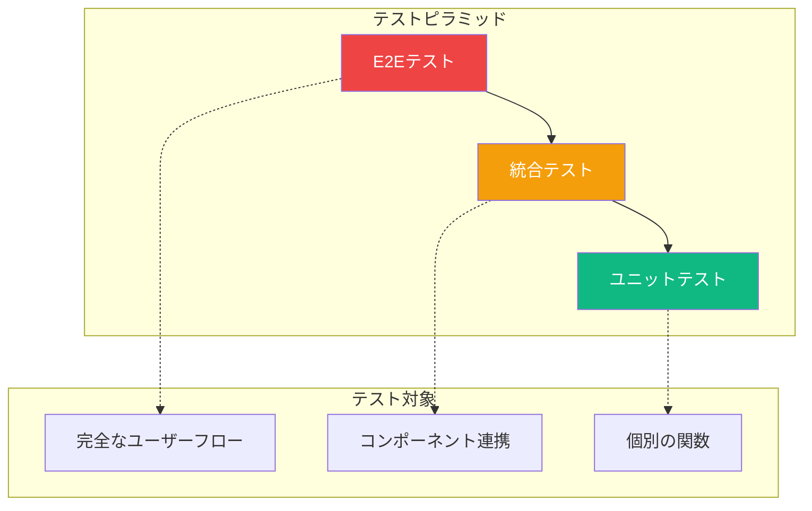

エンドツーエンド（E2E）テストは、ブラウザ、API、データベースを含むフルスタックをテストし、ユーザーの視点からアプリケーションが正しく動作することを検証します。Playwrightは信頼性の高いテストを簡単に書ける現代的なE2Eテストフレームワークです。

## なぜE2Eテストか？



E2Eテストは：
- 実際のユーザーワークフローをテスト
- 統合の問題を検出
- 重要なパスの動作を検証
- 実際のブラウザで実行

## Playwrightのセットアップ

### インストール

```bash
npm init playwright@latest
```

これにより以下が作成されます：
- `playwright.config.ts` - 設定ファイル
- `tests/` - テストディレクトリ
- `tests-examples/` - サンプルテスト

### 基本設定

```typescript
// playwright.config.ts
import { defineConfig, devices } from '@playwright/test';

export default defineConfig({
  testDir: './e2e',
  fullyParallel: true,
  forbidOnly: !!process.env.CI,
  retries: process.env.CI ? 2 : 0,
  workers: process.env.CI ? 1 : undefined,
  reporter: 'html',

  use: {
    baseURL: 'http://localhost:3000',
    trace: 'on-first-retry',
    screenshot: 'only-on-failure',
  },

  projects: [
    {
      name: 'chromium',
      use: { ...devices['Desktop Chrome'] },
    },
    {
      name: 'firefox',
      use: { ...devices['Desktop Firefox'] },
    },
    {
      name: 'webkit',
      use: { ...devices['Desktop Safari'] },
    },
  ],

  // テスト前に開発サーバーを起動
  webServer: {
    command: 'npm run dev',
    url: 'http://localhost:3000',
    reuseExistingServer: !process.env.CI,
  },
});
```

## 最初のテストを書く

```typescript
// e2e/home.spec.ts
import { test, expect } from '@playwright/test';

test('タイトルがある', async ({ page }) => {
  await page.goto('/');

  await expect(page).toHaveTitle(/My App/);
});

test('アバウトページにナビゲート', async ({ page }) => {
  await page.goto('/');

  await page.click('text=About');

  await expect(page).toHaveURL('/about');
  await expect(page.locator('h1')).toContainText('About Us');
});
```

### テストの実行

```bash
# すべてのテストを実行
npx playwright test

# headedモードで実行（ブラウザを表示）
npx playwright test --headed

# 特定のファイルを実行
npx playwright test home.spec.ts

# デバッグモードで実行
npx playwright test --debug

# HTMLレポートを表示
npx playwright show-report
```

## ロケーターとセレクター

Playwrightは要素を見つけるさまざまな方法を提供します：

### 推奨ロケーター

```typescript
// ロールで（アクセシビリティ優先）
page.getByRole('button', { name: '送信' });
page.getByRole('heading', { level: 1 });
page.getByRole('textbox', { name: 'メール' });

// ラベルで
page.getByLabel('メールアドレス');

// プレースホルダーで
page.getByPlaceholder('メールを入力');

// テキストで
page.getByText('ようこそ');
page.getByText(/ようこそ/i); // 大文字小文字を区別しない

// テストIDで
page.getByTestId('submit-button');
```

### CSSとXPath（非推奨）

```typescript
// CSSセレクター
page.locator('.submit-btn');
page.locator('#email-input');

// XPath
page.locator('xpath=//button[@type="submit"]');
```

### ロケーターのチェーン

```typescript
// 特定のセクション内のボタンを見つける
const section = page.locator('section.user-profile');
const editButton = section.getByRole('button', { name: '編集' });

// または直接チェーン
page.locator('section.user-profile').getByRole('button', { name: '編集' });
```

## アクション

### クリックアクション

```typescript
// 基本的なクリック
await page.click('button');
await page.getByRole('button').click();

// ダブルクリック
await page.dblclick('button');

// 右クリック
await page.click('button', { button: 'right' });

// 修飾キー付きクリック
await page.click('button', { modifiers: ['Shift'] });
```

### フォーム操作

```typescript
// テキスト入力
await page.fill('input[name="email"]', 'test@example.com');
await page.getByLabel('メール').fill('test@example.com');

// クリアして入力
await page.getByLabel('メール').clear();
await page.getByLabel('メール').fill('new@example.com');

// 遅延付き入力（実際のタイピングをシミュレート）
await page.getByLabel('メール').pressSequentially('test@example.com', { delay: 100 });

// オプション選択
await page.selectOption('select[name="country"]', 'jp');
await page.getByLabel('国').selectOption({ label: '日本' });

// チェック/チェック解除
await page.check('input[type="checkbox"]');
await page.uncheck('input[type="checkbox"]');
await page.getByLabel('利用規約に同意').check();
```

### キーボードアクション

```typescript
// キーを押す
await page.keyboard.press('Enter');
await page.keyboard.press('Control+a');

// テキストを入力
await page.keyboard.type('Hello');

// キーの組み合わせ
await page.keyboard.down('Shift');
await page.keyboard.press('ArrowDown');
await page.keyboard.up('Shift');
```

## アサーション

### ページアサーション

```typescript
// URL
await expect(page).toHaveURL('/dashboard');
await expect(page).toHaveURL(/.*dashboard/);

// タイトル
await expect(page).toHaveTitle('ダッシュボード | My App');
await expect(page).toHaveTitle(/ダッシュボード/);
```

### 要素アサーション

```typescript
const button = page.getByRole('button', { name: '送信' });

// 可視性
await expect(button).toBeVisible();
await expect(button).toBeHidden();

// 有効/無効
await expect(button).toBeEnabled();
await expect(button).toBeDisabled();

// テキストコンテンツ
await expect(button).toHaveText('送信');
await expect(button).toContainText('送');

// 属性
await expect(button).toHaveAttribute('type', 'submit');

// CSS
await expect(button).toHaveClass(/primary/);
await expect(button).toHaveCSS('background-color', 'rgb(0, 128, 0)');

// カウント
await expect(page.getByRole('listitem')).toHaveCount(5);

// 入力値
await expect(page.getByLabel('メール')).toHaveValue('test@example.com');
```

### ソフトアサーション

アサーションが失敗してもテスト実行を継続：

```typescript
await expect.soft(page.getByText('エラー')).not.toBeVisible();
await expect.soft(page.getByRole('button')).toBeEnabled();

// 上記アサーションが失敗してもテストは継続
await page.click('button');
```

## ユーザーフローのテスト

### ログインフロー

```typescript
// e2e/auth.spec.ts
import { test, expect } from '@playwright/test';

test.describe('認証', () => {
  test('ユーザーがログインできる', async ({ page }) => {
    await page.goto('/login');

    await page.getByLabel('メール').fill('user@example.com');
    await page.getByLabel('パスワード').fill('password123');
    await page.getByRole('button', { name: 'ログイン' }).click();

    // ダッシュボードにリダイレクト
    await expect(page).toHaveURL('/dashboard');
    await expect(page.getByText('おかえりなさい')).toBeVisible();
  });

  test('無効な資格情報でエラーを表示', async ({ page }) => {
    await page.goto('/login');

    await page.getByLabel('メール').fill('user@example.com');
    await page.getByLabel('パスワード').fill('wrong-password');
    await page.getByRole('button', { name: 'ログイン' }).click();

    await expect(page.getByRole('alert')).toContainText('資格情報が無効です');
    await expect(page).toHaveURL('/login');
  });
});
```

### ショッピングカートフロー

```typescript
test('購入フローを完了', async ({ page }) => {
  // 商品を閲覧
  await page.goto('/products');
  await page.getByRole('link', { name: /ラップトップ/i }).click();

  // カートに追加
  await page.getByRole('button', { name: 'カートに追加' }).click();
  await expect(page.getByText('カートに追加しました')).toBeVisible();

  // カートへ移動
  await page.getByRole('link', { name: 'カート (1)' }).click();
  await expect(page).toHaveURL('/cart');

  // チェックアウトへ進む
  await page.getByRole('button', { name: 'チェックアウト' }).click();

  // 配送情報を入力
  await page.getByLabel('住所').fill('東京都渋谷区1-2-3');
  await page.getByLabel('市区町村').fill('渋谷区');
  await page.getByRole('button', { name: '続行' }).click();

  // 支払いを完了
  await page.getByLabel('カード番号').fill('4242424242424242');
  await page.getByRole('button', { name: '支払う' }).click();

  // 成功を確認
  await expect(page.getByRole('heading')).toContainText('注文完了');
});
```

## Page Objectモデル

Page Objectパターンでテストを整理：

```typescript
// e2e/pages/LoginPage.ts
import { Page, Locator } from '@playwright/test';

export class LoginPage {
  readonly page: Page;
  readonly emailInput: Locator;
  readonly passwordInput: Locator;
  readonly submitButton: Locator;
  readonly errorMessage: Locator;

  constructor(page: Page) {
    this.page = page;
    this.emailInput = page.getByLabel('メール');
    this.passwordInput = page.getByLabel('パスワード');
    this.submitButton = page.getByRole('button', { name: 'ログイン' });
    this.errorMessage = page.getByRole('alert');
  }

  async goto() {
    await this.page.goto('/login');
  }

  async login(email: string, password: string) {
    await this.emailInput.fill(email);
    await this.passwordInput.fill(password);
    await this.submitButton.click();
  }
}
```

```typescript
// e2e/auth.spec.ts
import { test, expect } from '@playwright/test';
import { LoginPage } from './pages/LoginPage';

test('ユーザーがログインできる', async ({ page }) => {
  const loginPage = new LoginPage(page);

  await loginPage.goto();
  await loginPage.login('user@example.com', 'password123');

  await expect(page).toHaveURL('/dashboard');
});
```

## 認証の処理

### 認証状態の保存

```typescript
// e2e/auth.setup.ts
import { test as setup, expect } from '@playwright/test';

const authFile = 'playwright/.auth/user.json';

setup('認証', async ({ page }) => {
  await page.goto('/login');
  await page.getByLabel('メール').fill('user@example.com');
  await page.getByLabel('パスワード').fill('password123');
  await page.getByRole('button', { name: 'ログイン' }).click();

  await expect(page).toHaveURL('/dashboard');

  // 認証状態を保存
  await page.context().storageState({ path: authFile });
});
```

```typescript
// playwright.config.ts
export default defineConfig({
  projects: [
    // セットアッププロジェクト
    { name: 'setup', testMatch: /.*\.setup\.ts/ },

    // 認証が必要なテスト
    {
      name: 'chromium',
      use: {
        ...devices['Desktop Chrome'],
        storageState: 'playwright/.auth/user.json',
      },
      dependencies: ['setup'],
    },
  ],
});
```

## APIテスト

```typescript
import { test, expect } from '@playwright/test';

test('APIがユーザーを返す', async ({ request }) => {
  const response = await request.get('/api/users');

  expect(response.ok()).toBeTruthy();

  const users = await response.json();
  expect(users).toHaveLength(10);
  expect(users[0]).toHaveProperty('email');
});

test('新しいユーザーを作成', async ({ request }) => {
  const response = await request.post('/api/users', {
    data: {
      name: 'Alice',
      email: 'alice@example.com',
    },
  });

  expect(response.status()).toBe(201);

  const user = await response.json();
  expect(user.name).toBe('Alice');
});
```

## ビジュアルテスト

```typescript
test('ホームページのビジュアル', async ({ page }) => {
  await page.goto('/');

  // フルページスクリーンショット
  await expect(page).toHaveScreenshot('homepage.png');

  // 要素スクリーンショット
  await expect(page.getByRole('navigation')).toHaveScreenshot('nav.png');
});
```

スクリーンショットを更新：

```bash
npx playwright test --update-snapshots
```

## ベストプラクティス

### 1. 信頼性の高いセレクターを使用

```typescript
// 脆弱 - 構造に依存
page.locator('div > div > button');

// 堅牢 - アクセシビリティを使用
page.getByRole('button', { name: '送信' });
```

### 2. 要素を適切に待機

```typescript
// 自動待機が組み込み
await page.getByRole('button').click(); // 自動的に待機

// 必要な時に明示的に待機
await page.waitForSelector('.dynamic-content');
await page.waitForLoadState('networkidle');
```

### 3. テストを分離

```typescript
test.beforeEach(async ({ page }) => {
  // 各テスト前に状態をリセット
  await page.goto('/');
});
```

### 4. テストフックを使用

```typescript
test.beforeAll(async () => {
  // すべてのテスト前に1回実行
});

test.afterEach(async ({ page }) => {
  // 各テスト後にクリーンアップ
});
```

## まとめ

| 概念 | 説明 |
|------|------|
| `page.goto()` | URLにナビゲート |
| `page.getByRole()` | アクセシビリティロールで検索 |
| `page.click()` | 要素をクリック |
| `page.fill()` | 入力にテキストを入力 |
| `expect(page)` | ページアサーション |
| `expect(locator)` | 要素アサーション |

重要なポイント：

- アクセシビリティベースのセレクター（`getByRole`、`getByLabel`）を使用
- Playwrightには要素の自動待機が組み込み
- 保守しやすいテストにはPage Objectモデルを使用
- 認証状態を保存してテストを高速化
- projectsで複数ブラウザでテストを実行
- UIリグレッション検出にビジュアルテストを使用

E2Eテストはユーザーの視点からアプリケーションが動作するという信頼を与えます。Playwrightは現代的なAPIと強力な機能により、信頼性が高く高速なE2Eテストを簡単に書けるようにします。

## 参考文献

- [Playwright Documentation](https://playwright.dev/docs/intro)
- [Playwright Best Practices](https://playwright.dev/docs/best-practices)
- Ruscio, Daniel. *Testing JavaScript Applications*. Manning Publications, 2021.
