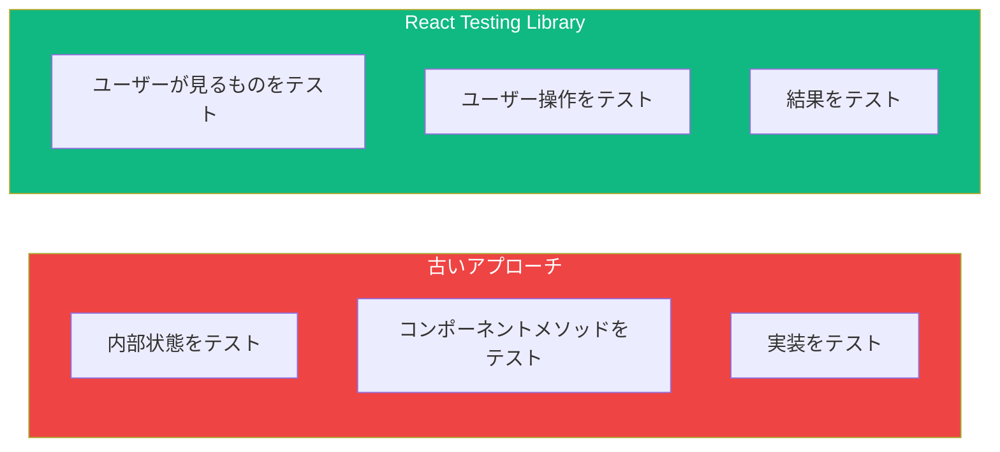

React Testing LibraryはReactコンポーネントをテストするための標準となりました。実装の詳細をテストする古いアプローチとは異なり、ユーザーが実際に操作する方法でコンポーネントをテストすることを推奨しています。

## コアフィロソフィー

React Testing Libraryは1つの指針に基づいて構築されています：

> 「テストがソフトウェアの使用方法に近いほど、より多くの信頼を得られる。」

これは以下を意味します：
- 内部状態やメソッドではなく、ユーザーが見て行うことをテストする
- ユーザーが見つける方法で要素をクエリする（テキスト、ロール、ラベルで）
- 実装の詳細をテストすることを避ける



## セットアップ

ViteプロジェクトでVitestを使用する場合：

```bash
npm install -D @testing-library/react @testing-library/jest-dom @testing-library/user-event jsdom
```

`vite.config.ts`でVitestを設定：

```typescript
import { defineConfig } from 'vite';
import react from '@vitejs/plugin-react';

export default defineConfig({
  plugins: [react()],
  test: {
    environment: 'jsdom',
    globals: true,
    setupFiles: './src/test/setup.ts',
  },
});
```

`src/test/setup.ts`を作成：

```typescript
import '@testing-library/jest-dom';
```

## 基本的なテスト構造

典型的なテストは3つの部分で構成されます：**Arrange（準備）**、**Act（実行）**、**Assert（検証）**。

```tsx
import { render, screen } from '@testing-library/react';
import { Greeting } from './Greeting';

test('挨拶メッセージをレンダリングする', () => {
  // Arrange: コンポーネントをレンダリング
  render(<Greeting name="World" />);

  // Act: （このテストでは不要）

  // Assert: 出力を確認
  expect(screen.getByText('Hello, World!')).toBeInTheDocument();
});
```

## コンポーネントのレンダリング

`render`関数はコンポーネントを仮想DOMにレンダリングします：

```tsx
import { render, screen } from '@testing-library/react';

// 基本的なレンダリング
render(<Button>Click me</Button>);

// propsと一緒に
render(<UserCard user={{ name: 'John', email: 'john@example.com' }} />);

// コンテキストプロバイダーと一緒に
render(
  <ThemeProvider theme="dark">
    <Button>Click me</Button>
  </ThemeProvider>
);
```

### カスタムrenderの作成

プロバイダーが必要なコンポーネントには、カスタムrenderを作成します：

```tsx
// test/utils.tsx
import { render, RenderOptions } from '@testing-library/react';
import { ThemeProvider } from '../contexts/ThemeContext';
import { AuthProvider } from '../contexts/AuthContext';

function AllProviders({ children }: { children: React.ReactNode }) {
  return (
    <AuthProvider>
      <ThemeProvider>
        {children}
      </ThemeProvider>
    </AuthProvider>
  );
}

const customRender = (ui: React.ReactElement, options?: RenderOptions) =>
  render(ui, { wrapper: AllProviders, ...options });

export * from '@testing-library/react';
export { customRender as render };
```

## 要素のクエリ

React Testing Libraryは、アクセシビリティを優先したいくつかのクエリタイプを提供しています：

### 優先順位（良い順）

1. **誰でもアクセス可能**: `getByRole`、`getByLabelText`、`getByPlaceholderText`、`getByText`
2. **セマンティッククエリ**: `getByAltText`、`getByTitle`
3. **テストID**（最後の手段）: `getByTestId`

### クエリタイプ

| クエリ | 戻り値 | 例外をスロー? | 非同期? | ユースケース |
|-------|---------|---------|--------|----------|
| `getBy` | 要素 | はい | いいえ | 要素が存在する |
| `queryBy` | 要素またはnull | いいえ | いいえ | 要素が存在しないかもしれない |
| `findBy` | Promise | はい | はい | 要素が非同期で出現 |

```tsx
// getBy - 見つからない場合は例外をスロー
const button = screen.getByRole('button', { name: 'Submit' });

// queryBy - 見つからない場合はnullを返す
const error = screen.queryByText('Error message');
expect(error).not.toBeInTheDocument();

// findBy - 要素が出現するまで待機
const data = await screen.findByText('Loaded data');
```

### 一般的なクエリ

```tsx
// By Role（推奨）
screen.getByRole('button', { name: 'Submit' });
screen.getByRole('heading', { level: 1 });
screen.getByRole('textbox', { name: 'Email' });
screen.getByRole('checkbox', { name: 'Remember me' });

// By Label Text（フォーム要素用）
screen.getByLabelText('Email address');

// By Placeholder
screen.getByPlaceholderText('Enter your email');

// By Text
screen.getByText('Welcome back!');
screen.getByText(/welcome/i); // 大文字小文字を区別しない正規表現

// By Alt Text（画像用）
screen.getByAltText('User avatar');

// By Test ID（最後の手段）
screen.getByTestId('custom-element');
```

### `within`を使用したスコープ付きクエリ

```tsx
import { render, screen, within } from '@testing-library/react';

render(<UserList users={users} />);

// 特定のコンテナ内でクエリ
const userCard = screen.getByRole('article', { name: 'John Doe' });
const deleteButton = within(userCard).getByRole('button', { name: 'Delete' });
```

## jest-domによるアサーション

`@testing-library/jest-dom`パッケージはカスタムマッチャーを提供します：

```tsx
// 存在確認
expect(element).toBeInTheDocument();
expect(element).not.toBeInTheDocument();

// 可視性
expect(element).toBeVisible();
expect(element).not.toBeVisible();

// コンテンツ
expect(element).toHaveTextContent('Hello');
expect(element).toHaveTextContent(/hello/i);

// 属性
expect(input).toHaveValue('test@example.com');
expect(input).toHaveAttribute('type', 'email');
expect(button).toBeDisabled();
expect(button).toBeEnabled();

// CSS
expect(element).toHaveClass('active');
expect(element).toHaveStyle({ color: 'red' });

// フォーム状態
expect(checkbox).toBeChecked();
expect(input).toBeRequired();
expect(input).toBeValid();
expect(input).toBeInvalid();

// フォーカス
expect(input).toHaveFocus();
```

## テストのデバッグ

### `screen.debug()`の使用

```tsx
render(<MyComponent />);

// DOM全体を出力
screen.debug();

// 特定の要素を出力
screen.debug(screen.getByRole('button'));

// 出力長を増やす
screen.debug(undefined, 30000);
```

### `logRoles`の使用

```tsx
import { logRoles } from '@testing-library/react';

const { container } = render(<MyComponent />);
logRoles(container);
```

これはすべてのARIAロールを出力し、正しいクエリを見つけるのに役立ちます。

## テストパターン

### 条件付きレンダリングのテスト

```tsx
test('バリデーション失敗時にエラーメッセージを表示', () => {
  render(<LoginForm />);

  // 初期状態ではエラーなし
  expect(screen.queryByRole('alert')).not.toBeInTheDocument();

  // バリデーションエラーをトリガー
  fireEvent.click(screen.getByRole('button', { name: 'Submit' }));

  // エラーが表示される
  expect(screen.getByRole('alert')).toHaveTextContent('Email is required');
});
```

### リストのテスト

```tsx
test('ユーザーリストをレンダリング', () => {
  const users = [
    { id: 1, name: 'Alice' },
    { id: 2, name: 'Bob' },
  ];

  render(<UserList users={users} />);

  const items = screen.getAllByRole('listitem');
  expect(items).toHaveLength(2);
  expect(items[0]).toHaveTextContent('Alice');
  expect(items[1]).toHaveTextContent('Bob');
});
```

### アクセシビリティのテスト

```tsx
test('フォーム入力にアクセシブルなラベルがある', () => {
  render(<ContactForm />);

  // ラベルがない場合、これらのクエリは失敗する
  expect(screen.getByLabelText('Name')).toBeInTheDocument();
  expect(screen.getByLabelText('Email')).toBeInTheDocument();
  expect(screen.getByLabelText('Message')).toBeInTheDocument();
});
```

## 避けるべき一般的な間違い

### 1. 実装の詳細をテスト

```tsx
// ❌ 悪い: 内部状態をテスト
expect(component.state.isOpen).toBe(true);

// ✅ 良い: ユーザーが見るものをテスト
expect(screen.getByRole('dialog')).toBeVisible();
```

### 2. コンテナクエリの使用

```tsx
// ❌ 悪い: クラスや構造でクエリ
const { container } = render(<MyComponent />);
container.querySelector('.my-class');

// ✅ 良い: アクセシブルなクエリを使用
screen.getByRole('button', { name: 'Submit' });
```

### 3. 非同期更新を待たない

```tsx
// ❌ 悪い: 待機しない
render(<AsyncComponent />);
expect(screen.getByText('Data')).toBeInTheDocument(); // 失敗するかも！

// ✅ 良い: findByまたはwaitForを使用
render(<AsyncComponent />);
expect(await screen.findByText('Data')).toBeInTheDocument();
```

## まとめ

| 概念 | 説明 |
|---------|-------------|
| `render()` | コンポーネントを仮想DOMにレンダリング |
| `screen` | レンダリング出力のグローバルクエリ |
| `getBy*` | 要素が見つからない場合は例外をスロー |
| `queryBy*` | 見つからない場合はnullを返す |
| `findBy*` | 非同期、要素を待機 |
| `*AllBy*` | 要素の配列を返す |

重要なポイント：

- 実装の詳細ではなく、ユーザーの動作をテストする
- アクセシブルなクエリ（`getByRole`、`getByLabelText`）を最初に使用する
- 要素が存在すべき場合は`getBy`、存在しないかもしれない場合は`queryBy`を使用
- 非同期で出現する要素には`findBy`を使用
- 失敗するテストのトラブルシューティングには`screen.debug()`を使用

React Testing Libraryは、アプリがユーザーにとって機能するという信頼を与えるテストを書くことを推奨しています。ユーザーが見て行うことに焦点を当てることで、テストはより保守しやすく意味のあるものになります。

## 参考文献

- [React Testing Library Documentation](https://testing-library.com/docs/react-testing-library/intro/)
- [Testing Library Queries](https://testing-library.com/docs/queries/about)
- Crump, Scottie. *Simplify Testing with React Testing Library*. Packt, 2021.
- Barklund, Morten. *React in Depth*. Manning Publications, 2024.
