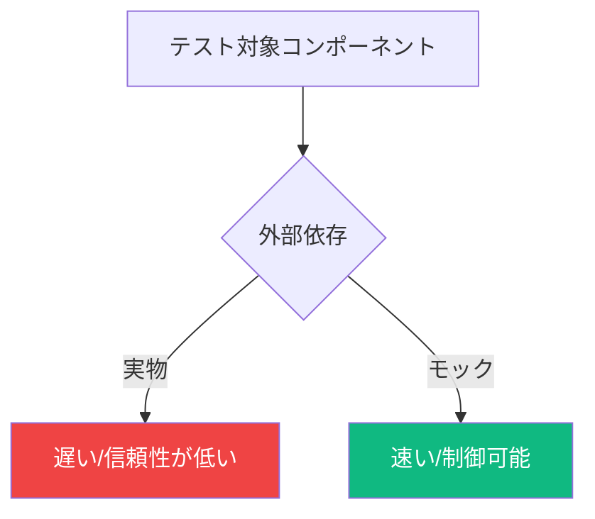
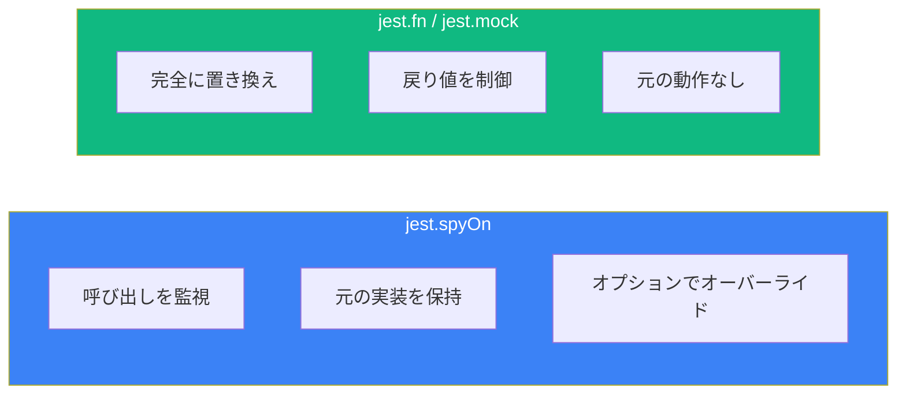

モックはコンポーネントを分離して独立してテストするために不可欠です。このガイドではJestとVitestを使用したReactテストでの一般的なモックパターンを解説します。

## なぜモックするのか？

モックは以下の点で役立ちます：
- テスト対象のコードを分離する
- 依存関係の動作を制御する
- 遅いまたは信頼性の低い操作（ネットワーク、ファイルシステム）を回避する
- エッジケースやエラーシナリオをテストする



## モジュールのモック

### 基本的なモジュールモック

```tsx
// api.ts
export async function fetchUsers() {
  const response = await fetch('/api/users');
  return response.json();
}

// UserList.tsx
import { fetchUsers } from './api';

function UserList() {
  const [users, setUsers] = useState([]);

  useEffect(() => {
    fetchUsers().then(setUsers);
  }, []);

  return (
    <ul>
      {users.map((user) => (
        <li key={user.id}>{user.name}</li>
      ))}
    </ul>
  );
}
```

```tsx
// UserList.test.tsx
import { render, screen } from '@testing-library/react';
import { UserList } from './UserList';
import { fetchUsers } from './api';

// モジュール全体をモック
jest.mock('./api');

// モック関数の型付け
const mockFetchUsers = fetchUsers as jest.MockedFunction<typeof fetchUsers>;

test('ユーザーを表示', async () => {
  mockFetchUsers.mockResolvedValue([
    { id: 1, name: 'Alice' },
    { id: 2, name: 'Bob' },
  ]);

  render(<UserList />);

  expect(await screen.findByText('Alice')).toBeInTheDocument();
  expect(screen.getByText('Bob')).toBeInTheDocument();
});

test('空のリストを処理', async () => {
  mockFetchUsers.mockResolvedValue([]);

  render(<UserList />);

  // 空の状態をアサート
  await waitFor(() => {
    expect(screen.queryByRole('listitem')).not.toBeInTheDocument();
  });
});
```

### 部分的なモジュールモック

特定のエクスポートのみをモック：

```tsx
// utils.ts
export function formatDate(date: Date) { /* ... */ }
export function formatCurrency(amount: number) { /* ... */ }
export function calculateTax(amount: number) { /* ... */ }
```

```tsx
// formatDateだけモック、他は実物を保持
jest.mock('./utils', () => ({
  ...jest.requireActual('./utils'),
  formatDate: jest.fn(() => '2024-01-01'),
}));
```

### ファクトリーでのモック

```tsx
jest.mock('./api', () => ({
  fetchUsers: jest.fn(),
  createUser: jest.fn(),
  deleteUser: jest.fn(),
}));
```

## コンポーネントのモック

### 子コンポーネントのモック

```tsx
// Dashboard.tsx
import { HeavyChart } from './HeavyChart';
import { UserStats } from './UserStats';

function Dashboard({ userId }) {
  return (
    <div>
      <h1>ダッシュボード</h1>
      <UserStats userId={userId} />
      <HeavyChart data={chartData} />
    </div>
  );
}
```

```tsx
// Dashboard.test.tsx
// 子コンポーネントをモック
jest.mock('./HeavyChart', () => ({
  HeavyChart: () => <div data-testid="mock-chart">チャート</div>,
}));

jest.mock('./UserStats', () => ({
  UserStats: ({ userId }) => <div data-testid="mock-stats">{userId}の統計</div>,
}));

test('モックされた子でダッシュボードをレンダリング', () => {
  render(<Dashboard userId={123} />);

  expect(screen.getByText('ダッシュボード')).toBeInTheDocument();
  expect(screen.getByTestId('mock-chart')).toBeInTheDocument();
  expect(screen.getByTestId('mock-stats')).toHaveTextContent('123の統計');
});
```

### Propsをキャプチャするモック

```tsx
jest.mock('./UserStats', () => ({
  UserStats: jest.fn(() => null),
}));

import { UserStats } from './UserStats';

test('UserStatsに正しいpropsを渡す', () => {
  render(<Dashboard userId={123} />);

  expect(UserStats).toHaveBeenCalledWith(
    expect.objectContaining({ userId: 123 }),
    expect.anything()
  );
});
```

## 関数のスパイ

### Spy vs Mock



### スパイの使用

```tsx
// オブジェクトメソッドをスパイ
const consoleSpy = jest.spyOn(console, 'error').mockImplementation();

test('失敗時にエラーをログ', async () => {
  render(<ComponentThatMightError />);

  await waitFor(() => {
    expect(consoleSpy).toHaveBeenCalledWith('Something went wrong');
  });

  consoleSpy.mockRestore();
});
```

### モジュール関数のスパイ

```tsx
import * as api from './api';

test('マウント時にfetchUsersを呼び出す', () => {
  const spy = jest.spyOn(api, 'fetchUsers').mockResolvedValue([]);

  render(<UserList />);

  expect(spy).toHaveBeenCalledTimes(1);

  spy.mockRestore();
});
```

## モック関数（jest.fn）

### 基本的な使い方

```tsx
test('onClickハンドラーを呼び出す', async () => {
  const handleClick = jest.fn();
  const user = userEvent.setup();

  render(<Button onClick={handleClick}>クリック</Button>);

  await user.click(screen.getByRole('button'));

  expect(handleClick).toHaveBeenCalledTimes(1);
});
```

### 戻り値のモック

```tsx
const mockFn = jest.fn();

// 戻り値
mockFn.mockReturnValue('hello');

// 一度だけ戻り値
mockFn.mockReturnValueOnce('first').mockReturnValueOnce('second');

// 非同期戻り値
mockFn.mockResolvedValue({ data: 'value' });
mockFn.mockRejectedValue(new Error('Failed'));
```

### アサーション

```tsx
// 呼び出された
expect(mockFn).toHaveBeenCalled();
expect(mockFn).toHaveBeenCalledTimes(3);

// 特定の引数で呼び出された
expect(mockFn).toHaveBeenCalledWith('arg1', 'arg2');
expect(mockFn).toHaveBeenLastCalledWith('final');
expect(mockFn).toHaveBeenNthCalledWith(2, 'second call');

// 呼び出されていない
expect(mockFn).not.toHaveBeenCalled();

// すべての呼び出しを確認
expect(mockFn.mock.calls).toEqual([
  ['first call'],
  ['second call'],
  ['third call'],
]);
```

## ブラウザAPIのモック

### localStorage

```tsx
const localStorageMock = {
  getItem: jest.fn(),
  setItem: jest.fn(),
  removeItem: jest.fn(),
  clear: jest.fn(),
};

Object.defineProperty(window, 'localStorage', {
  value: localStorageMock,
});

test('localStorageに保存', () => {
  render(<SettingsForm />);

  // ... フォームと対話

  expect(localStorageMock.setItem).toHaveBeenCalledWith(
    'settings',
    expect.any(String)
  );
});
```

### window.matchMedia

```tsx
beforeAll(() => {
  Object.defineProperty(window, 'matchMedia', {
    writable: true,
    value: jest.fn().mockImplementation((query) => ({
      matches: false,
      media: query,
      onchange: null,
      addListener: jest.fn(),
      removeListener: jest.fn(),
      addEventListener: jest.fn(),
      removeEventListener: jest.fn(),
      dispatchEvent: jest.fn(),
    })),
  });
});

test('ダークモードの設定を検出', () => {
  window.matchMedia = jest.fn().mockImplementation((query) => ({
    matches: query === '(prefers-color-scheme: dark)',
    media: query,
    // ... 残りのモック
  }));

  render(<ThemeProvider><App /></ThemeProvider>);

  expect(screen.getByTestId('theme')).toHaveTextContent('dark');
});
```

### IntersectionObserver

```tsx
const mockIntersectionObserver = jest.fn();
mockIntersectionObserver.mockReturnValue({
  observe: jest.fn(),
  unobserve: jest.fn(),
  disconnect: jest.fn(),
});

window.IntersectionObserver = mockIntersectionObserver;

test('画像を遅延ロード', () => {
  render(<LazyImage src="photo.jpg" />);

  expect(mockIntersectionObserver).toHaveBeenCalled();
});
```

## 外部ライブラリのモック

### React Router

```tsx
import { useNavigate, useParams } from 'react-router-dom';

jest.mock('react-router-dom', () => ({
  ...jest.requireActual('react-router-dom'),
  useNavigate: jest.fn(),
  useParams: jest.fn(),
}));

test('送信時にナビゲート', async () => {
  const navigate = jest.fn();
  (useNavigate as jest.Mock).mockReturnValue(navigate);
  (useParams as jest.Mock).mockReturnValue({ id: '123' });

  const user = userEvent.setup();
  render(<EditForm />);

  await user.click(screen.getByRole('button', { name: '保存' }));

  expect(navigate).toHaveBeenCalledWith('/success');
});
```

### 日付/時刻ライブラリ

```tsx
// 現在日付をモック
beforeEach(() => {
  jest.useFakeTimers();
  jest.setSystemTime(new Date('2024-01-15'));
});

afterEach(() => {
  jest.useRealTimers();
});

test('現在日付を表示', () => {
  render(<DateDisplay />);

  expect(screen.getByText('2024年1月15日')).toBeInTheDocument();
});
```

## モックのクリアとリセット

### 個別のテストで

```tsx
const mockFn = jest.fn();

afterEach(() => {
  mockFn.mockClear(); // 呼び出し履歴をクリア
  // または
  mockFn.mockReset(); // クリア + 戻り値を削除
  // または
  mockFn.mockRestore(); // 元に戻す（スパイ用）
});
```

### グローバル設定

```tsx
// jest.config.js または vitest.config.ts
{
  clearMocks: true, // テスト間でモック呼び出しをクリア
  resetMocks: true, // テスト間でモック状態をリセット
  restoreMocks: true, // 元の実装を復元
}
```

## モックパターン

### 複雑なモック用のファクトリーパターン

```tsx
// test-utils/mockUser.ts
export function createMockUser(overrides = {}) {
  return {
    id: 1,
    name: 'テストユーザー',
    email: 'test@example.com',
    role: 'user',
    ...overrides,
  };
}

// 使用例
test('管理者ユーザーに管理者バッジを表示', () => {
  const adminUser = createMockUser({ role: 'admin' });

  render(<UserProfile user={adminUser} />);

  expect(screen.getByText('管理者')).toBeInTheDocument();
});
```

### コンテキストモックヘルパー

```tsx
// test-utils/renderWithProviders.tsx
export function renderWithAuth(ui, { user = null } = {}) {
  return render(
    <AuthContext.Provider value={{ user, isAuthenticated: !!user }}>
      {ui}
    </AuthContext.Provider>
  );
}

// 使用例
test('未認証時にログインボタンを表示', () => {
  renderWithAuth(<Header />);

  expect(screen.getByRole('button', { name: 'ログイン' })).toBeInTheDocument();
});

test('認証時にユーザー名を表示', () => {
  renderWithAuth(<Header />, { user: { name: 'Alice' } });

  expect(screen.getByText('Alice')).toBeInTheDocument();
});
```

## ベストプラクティス

### 1. 過度にモックしない

```tsx
// 悪い：すべてをモック
jest.mock('./utils');
jest.mock('./helpers');
jest.mock('./formatters');

// 良い：外部依存のみモック
jest.mock('./api'); // 外部APIコールのみ
```

### 2. 適切なレベルでモック

```tsx
// 悪い：実装の詳細をモック
jest.mock('./useUserState'); // 内部フック

// 良い：外部境界でモック
jest.mock('./api'); // ネットワーク境界
```

### 3. モックを実際の動作に近づける

```tsx
// 悪い：非現実的なモック
mockFetch.mockResolvedValue({ anything: 'goes' });

// 良い：APIの形状に一致
mockFetch.mockResolvedValue({
  users: [{ id: 1, name: 'Alice', email: 'alice@example.com' }],
  total: 1,
  page: 1,
});
```

### 4. テスト間でモックをリセット

```tsx
afterEach(() => {
  jest.clearAllMocks();
});
```

## まとめ

| テクニック | ユースケース |
|-----------|--------------|
| `jest.mock()` | モジュール全体をモック |
| `jest.spyOn()` | 呼び出しを監視、オプションでモック |
| `jest.fn()` | モック関数を作成 |
| `mockReturnValue` | 戻り値を設定 |
| `mockResolvedValue` | 非同期戻り値を設定 |
| `mockImplementation` | カスタムモック動作 |

重要なポイント：

- 内部実装ではなく外部依存をモック
- 動作を変えずに監視したい場合はスパイを使用
- 複雑なデータ構造にはモックファクトリーを作成
- 汚染を避けるためテスト間でモックをクリア
- 統合の問題を発見するためモックを現実的に保つ
- APIモックには手動のfetchモックよりMSWを推奨

効果的なモックはテストをより速く、信頼性が高く、書きやすくします。アプリケーションの境界でモックすることに集中しましょう。

## 参考文献

- [Jest Mock Functions](https://jestjs.io/docs/mock-functions)
- [Vitest Mocking](https://vitest.dev/guide/mocking.html)
- Crump, Scottie. *Simplify Testing with React Testing Library*. Packt, 2021.
- Ruscio, Daniel. *Testing JavaScript Applications*. Manning Publications, 2021.
