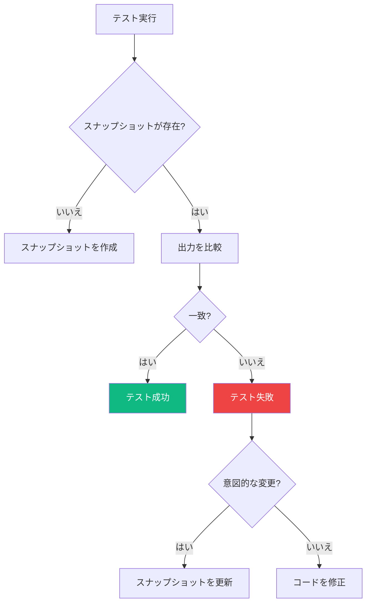
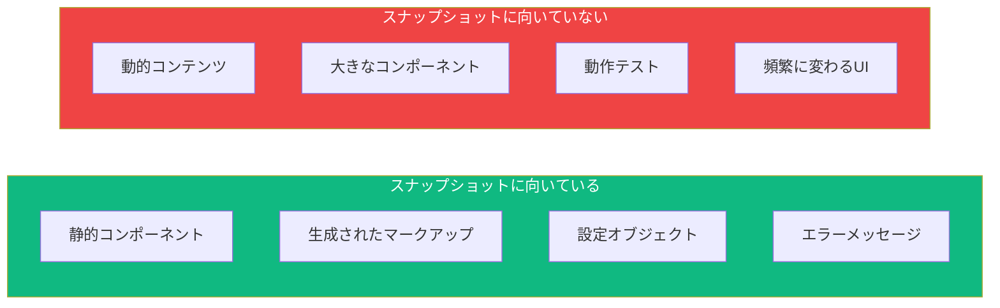

スナップショットテストはコンポーネントのレンダリング出力をキャプチャし、保存された参照と比較します。予期しない変更を検出するのに強力ですが、しばしば誤用されます。スナップショットを効果的に使用する方法を探っていきましょう。

## スナップショットテストとは？

スナップショットテストはコンポーネントをレンダリングし、その出力をファイルに保存します。将来のテスト実行は、この保存されたスナップショットと比較します：



## 基本的なスナップショットテスト

```tsx
import { render } from '@testing-library/react';
import { UserCard } from './UserCard';

test('ユーザーカードをレンダリング', () => {
  const { container } = render(
    <UserCard
      user={{
        name: 'Alice',
        email: 'alice@example.com',
        avatar: 'avatar.jpg',
      }}
    />
  );

  expect(container).toMatchSnapshot();
});
```

これによりスナップショットファイル（`__snapshots__/UserCard.test.tsx.snap`）が作成されます：

```
exports[`ユーザーカードをレンダリング 1`] = `
<div>
  <div
    class="user-card"
  >
    
    <div
      class="user-info"
    >
      <h3>
        Alice
      </h3>
      <p>
        alice@example.com
      </p>
    </div>
  </div>
</div>
`;
```

## インラインスナップショット

別ファイルの代わりに、テストファイル内にスナップショットを保存：

```tsx
test('挨拶をレンダリング', () => {
  const { container } = render(<Greeting name="World" />);

  expect(container).toMatchInlineSnapshot(`
    <div>
      <h1>
        Hello, World!
      </h1>
    </div>
  `);
});
```

インラインスナップショットのメリット：
- コードレビューで確認しやすい
- 別のスナップショットファイルを探す必要がない
- 変更が同じファイルで見える

## スナップショットを使うべき時

### 良いユースケース



### 1. 小さく静的なコンポーネント

```tsx
// 良い：シンプルなプレゼンテーションコンポーネント
test('バッジをレンダリング', () => {
  const { container } = render(<Badge type="success">承認済み</Badge>);
  expect(container).toMatchInlineSnapshot(`
    <div>
      <span class="badge badge-success">
        承認済み
      </span>
    </div>
  `);
});
```

### 2. 設定/データオブジェクト

```tsx
test('正しい設定を生成', () => {
  const config = generateChartConfig({
    type: 'bar',
    data: [1, 2, 3],
    title: '売上',
  });

  expect(config).toMatchInlineSnapshot(`
    {
      "options": {
        "responsive": true,
        "title": {
          "display": true,
          "text": "売上",
        },
      },
      "type": "bar",
    }
  `);
});
```

### 3. エラーメッセージ

```tsx
test('バリデーションエラーを表示', () => {
  const result = validateForm({ email: 'invalid' });

  expect(result.errors).toMatchInlineSnapshot(`
    [
      {
        "field": "email",
        "message": "有効なメールアドレスを入力してください",
      },
    ]
  `);
});
```

## スナップショットを使うべきでない時

### 1. 大きなコンポーネント

```tsx
// 悪い：スナップショットが大きすぎて意味のあるレビューができない
test('ページ全体をレンダリング', () => {
  const { container } = render(<DashboardPage />);
  expect(container).toMatchSnapshot(); // 500行以上！
});

// より良い：特定の動作をテスト
test('ヘッダーにユーザー名を表示', () => {
  render(<DashboardPage user={{ name: 'Alice' }} />);
  expect(screen.getByText('Alice')).toBeInTheDocument();
});
```

### 2. 動的コンテンツ

```tsx
// 悪い：毎回スナップショットが失敗する
test('タイムスタンプをレンダリング', () => {
  const { container } = render(<Comment createdAt={new Date()} />);
  expect(container).toMatchSnapshot(); // 現在日時が含まれる！
});

// より良い：日付をモックするかフォーマットをテスト
test('フォーマットされた日付を表示', () => {
  render(<Comment createdAt={new Date('2024-01-15')} />);
  expect(screen.getByText('2024年1月15日')).toBeInTheDocument();
});
```

### 3. 動作のテスト

```tsx
// 悪い：スナップショットは操作をテストできない
test('ボタンクリック', () => {
  const { container } = render(<Counter />);
  fireEvent.click(screen.getByRole('button'));
  expect(container).toMatchSnapshot(); // UI状態を表示するだけ
});

// より良い：動作をテスト
test('クリックでカウントを増加', async () => {
  const user = userEvent.setup();
  render(<Counter />);

  await user.click(screen.getByRole('button'));

  expect(screen.getByText('カウント: 1')).toBeInTheDocument();
});
```

## スナップショットのアンチパターン

### 1. すべてをスナップショット

```tsx
// アンチパターン：すべてのテストでスナップショット
describe('UserList', () => {
  test('空の状態をレンダリング', () => {
    const { container } = render(<UserList users={[]} />);
    expect(container).toMatchSnapshot();
  });

  test('ユーザーありでレンダリング', () => {
    const { container } = render(<UserList users={users} />);
    expect(container).toMatchSnapshot();
  });

  test('ローディングをレンダリング', () => {
    const { container } = render(<UserList loading />);
    expect(container).toMatchSnapshot();
  });
});

// より良い：明示的なアサーション
describe('UserList', () => {
  test('ユーザーがいない時に空のメッセージを表示', () => {
    render(<UserList users={[]} />);
    expect(screen.getByText('ユーザーが見つかりません')).toBeInTheDocument();
  });

  test('すべてのユーザーを表示', () => {
    render(<UserList users={[{ id: 1, name: 'Alice' }]} />);
    expect(screen.getByText('Alice')).toBeInTheDocument();
  });

  test('ローディングスピナーを表示', () => {
    render(<UserList loading />);
    expect(screen.getByRole('progressbar')).toBeInTheDocument();
  });
});
```

### 2. 盲目的なスナップショット更新

```bash
# 危険！レビューなしですべての失敗したスナップショットを更新
npm test -- -u
```

更新前に必ずスナップショットの変更をレビュー：

```bash
# インタラクティブモード - 各変更をレビュー
npm test -- --watch
# その後 'i' を押してインタラクティブに更新
```

### 3. 実装の詳細をテスト

```tsx
// アンチパターン：CSSクラス、内部構造を含むスナップショット
expect(container).toMatchInlineSnapshot(`
  <div class="sc-hKMtZM jPSxnS user-card__wrapper--active">
    <div class="sc-bdVaJa bULBFu">
      ...
    </div>
  </div>
`);

// より良い：意味のある出力をテスト
expect(screen.getByRole('article')).toHaveTextContent('Alice');
```

## カスタムシリアライザー

スナップショット出力をクリーンアップするカスタムシリアライザーを作成：

```tsx
// 動的なクラス名を削除（styled-components、CSS modules）
expect.addSnapshotSerializer({
  test: (val) => typeof val === 'string' && val.match(/sc-[a-zA-Z]+/),
  print: (val) => val.replace(/sc-[a-zA-Z]+ [a-zA-Z]+/g, 'styled'),
});

// 日付を簡略化
expect.addSnapshotSerializer({
  test: (val) => val instanceof Date,
  print: (val) => `Date(${val.toISOString()})`,
});
```

## フォーカスしたスナップショットテスト

### 特定の要素のスナップショット

```tsx
test('ユーザー名を正しくレンダリング', () => {
  render(<UserCard user={{ name: 'Alice', email: 'alice@example.com' }} />);

  // 名前要素だけをスナップショット
  expect(screen.getByRole('heading')).toMatchInlineSnapshot(`
    <h3>
      Alice
    </h3>
  `);
});
```

### プロパティマッチャー

オブジェクトスナップショットで動的な値を処理：

```tsx
test('タイムスタンプ付きでユーザーを作成', () => {
  const user = createUser({ name: 'Alice' });

  expect(user).toMatchSnapshot({
    id: expect.any(String),
    createdAt: expect.any(Date),
    name: 'Alice',
  });
});
```

## スナップショットテスト戦略

### コンポーネントスナップショットマトリックス

| コンポーネントタイプ | スナップショット? | より良い代替案 |
|---------------------|------------------|----------------|
| アイコン/バッジ | はい | - |
| ボタン | 場合による | クリック動作をテスト |
| フォーム | いいえ | バリデーション、送信をテスト |
| リスト | いいえ | アイテム、空の状態をテスト |
| モーダル | いいえ | 開閉、コンテンツをテスト |
| ページ | いいえ | 主要要素をテスト |

### アプローチの組み合わせ

```tsx
describe('NotificationBadge', () => {
  // 視覚的構造のスナップショット
  test('正しくレンダリング', () => {
    const { container } = render(<NotificationBadge count={5} />);
    expect(container).toMatchInlineSnapshot(`
      <div>
        <span class="badge">
          5
        </span>
      </div>
    `);
  });

  // 動作の明示的テスト
  test('カウントがゼロの時は非表示', () => {
    render(<NotificationBadge count={0} />);
    expect(screen.queryByRole('status')).not.toBeInTheDocument();
  });

  test('大きなカウントには99+を表示', () => {
    render(<NotificationBadge count={150} />);
    expect(screen.getByText('99+')).toBeInTheDocument();
  });
});
```

## スナップショットの更新

### Watchモードで

```
`u`を押してすべての失敗したスナップショットを更新
`i`を押してインタラクティブに更新
```

### コマンドライン

```bash
# すべてのスナップショットを更新
npm test -- -u

# 特定のテストファイルを更新
npm test UserCard.test.tsx -- -u
```

### CI/CDの考慮

```yaml
# スナップショットが古い場合CIを失敗
test:
  script:
    - npm test -- --ci
```

`--ci`フラグはCI上での誤ったスナップショット更新を防ぎます。

## まとめ

| 観点 | 推奨事項 |
|------|----------|
| サイズ | スナップショットを小さく保つ（50行未満） |
| スコープ | プレゼンテーションコンポーネントをスナップショット |
| 更新 | すべての変更をレビュー、盲目的に更新しない |
| 代替案 | 動作には明示的アサーションを優先 |
| インライン | 可能な限りインラインスナップショットを使用 |

重要なポイント：

- スナップショットは小さく静的なコンポーネントに最適
- ページ全体や動的コンテンツのスナップショットを避ける
- 更新前に必ずスナップショットの変更をレビュー
- 動作テストには明示的アサーションを優先
- コードレビューを容易にするためインラインスナップショットを使用
- 意味のあるテストの代替としてスナップショットを使わない

スナップショットテストはツールであり、戦略ではありません。予期しない視覚的リグレッションを捕捉するために控えめに意図的に使用し、思慮深いテストの代替としては使用しないでください。

## 参考文献

- [Jest Snapshot Testing](https://jestjs.io/docs/snapshot-testing)
- [Effective Snapshot Testing](https://kentcdodds.com/blog/effective-snapshot-testing)
- Crump, Scottie. *Simplify Testing with React Testing Library*. Packt, 2021.
