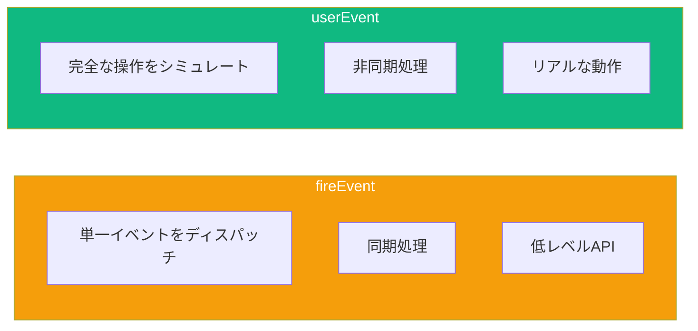

ユーザー操作はあらゆるReactアプリケーションの中核です。これらの操作を適切にテストすることで、コンポーネントがクリック、フォーム入力、キーボードイベントに正しく応答することを確認できます。

## fireEvent vs userEvent

React Testing Libraryはユーザー操作をシミュレートする2つの方法を提供しています：

### fireEvent

`fireEvent`はDOMイベントを直接ディスパッチする低レベルユーティリティです：

```tsx
import { render, screen, fireEvent } from '@testing-library/react';

test('fireEventでのボタンクリック', () => {
  const handleClick = jest.fn();
  render(<button onClick={handleClick}>Click me</button>);

  fireEvent.click(screen.getByRole('button'));

  expect(handleClick).toHaveBeenCalledTimes(1);
});
```

### userEvent

`userEvent`は実際のユーザー動作をより正確にシミュレートします：

```tsx
import { render, screen } from '@testing-library/react';
import userEvent from '@testing-library/user-event';

test('userEventでのボタンクリック', async () => {
  const user = userEvent.setup();
  const handleClick = jest.fn();
  render(<button onClick={handleClick}>Click me</button>);

  await user.click(screen.getByRole('button'));

  expect(handleClick).toHaveBeenCalledTimes(1);
});
```

### 主な違い



| 項目 | fireEvent | userEvent |
|------|-----------|-----------|
| クリック | 単一のクリックイベント | focus → mousedown → mouseup → click |
| 入力 | 単一のchangeイベント | focus → keydown → keypress → input → keyup（文字ごと） |
| API | 同期 | 非同期（Promiseを返す） |
| リアルさ | 低い | 高い |

**推奨**: ほとんどのテストでは`userEvent`を使用してください。実際のユーザー動作をシミュレートするため、より多くのバグを発見できます。

## userEventのセットアップ

常に`setup()`でuserインスタンスを作成します：

```tsx
import userEvent from '@testing-library/user-event';

test('例', async () => {
  // レンダリング前にuserインスタンスを作成
  const user = userEvent.setup();

  render(<MyComponent />);

  // userインスタンスを使って操作
  await user.click(element);
});
```

### セットアップオプション

```tsx
const user = userEvent.setup({
  // キー入力間の遅延（ミリ秒）
  delay: 50,

  // ポインターイベントの検証をスキップ
  pointerEventsCheck: 0,

  // カスタムドキュメント
  document: customDocument,
});
```

## クリック操作

### 基本的なクリック

```tsx
test('ボタンクリックを処理', async () => {
  const user = userEvent.setup();
  const handleClick = jest.fn();

  render(<Button onClick={handleClick}>送信</Button>);

  await user.click(screen.getByRole('button', { name: '送信' }));

  expect(handleClick).toHaveBeenCalledTimes(1);
});
```

### ダブルクリック

```tsx
test('ダブルクリックを処理', async () => {
  const user = userEvent.setup();
  const handleDoubleClick = jest.fn();

  render(<div onDoubleClick={handleDoubleClick}>ダブルクリックしてね</div>);

  await user.dblClick(screen.getByText('ダブルクリックしてね'));

  expect(handleDoubleClick).toHaveBeenCalledTimes(1);
});
```

### 右クリック（コンテキストメニュー）

```tsx
test('右クリックでコンテキストメニューを開く', async () => {
  const user = userEvent.setup();
  const handleContextMenu = jest.fn();

  render(<div onContextMenu={handleContextMenu}>右クリックしてね</div>);

  await user.pointer({
    keys: '[MouseRight]',
    target: screen.getByText('右クリックしてね'),
  });

  expect(handleContextMenu).toHaveBeenCalled();
});
```

### 修飾キー付きクリック

```tsx
test('Ctrl+クリックを処理', async () => {
  const user = userEvent.setup();
  const handleClick = jest.fn();

  render(<button onClick={handleClick}>クリック</button>);

  await user.click(screen.getByRole('button'), {
    ctrlKey: true,
  });

  expect(handleClick).toHaveBeenCalledWith(
    expect.objectContaining({ ctrlKey: true })
  );
});
```

## フォーム入力のテスト

### テキスト入力

```tsx
test('テキスト入力を更新', async () => {
  const user = userEvent.setup();
  const handleChange = jest.fn();

  render(<input onChange={handleChange} placeholder="名前を入力" />);

  const input = screen.getByPlaceholderText('名前を入力');
  await user.type(input, 'John Doe');

  expect(input).toHaveValue('John Doe');
  // 文字ごとに1回呼ばれる
  expect(handleChange).toHaveBeenCalledTimes(8);
});
```

### クリアして入力

```tsx
test('クリアして新しい値を入力', async () => {
  const user = userEvent.setup();

  render(<input defaultValue="古い値" />);

  const input = screen.getByRole('textbox');
  await user.clear(input);
  await user.type(input, '新しい値');

  expect(input).toHaveValue('新しい値');
});
```

### 特殊文字

```tsx
test('特殊文字を入力', async () => {
  const user = userEvent.setup();

  render(<input />);

  const input = screen.getByRole('textbox');

  // {selectall} - すべて選択
  // {backspace} - 選択を削除
  // {enter} - Enterキー
  await user.type(input, 'Hello{selectall}{backspace}World{enter}');

  expect(input).toHaveValue('World');
});
```

### チェックボックスとラジオボタン

```tsx
test('チェックボックスを切り替え', async () => {
  const user = userEvent.setup();
  const handleChange = jest.fn();

  render(
    <label>
      <input type="checkbox" onChange={handleChange} />
      利用規約に同意
    </label>
  );

  const checkbox = screen.getByRole('checkbox');

  expect(checkbox).not.toBeChecked();

  await user.click(checkbox);
  expect(checkbox).toBeChecked();

  await user.click(checkbox);
  expect(checkbox).not.toBeChecked();
});

test('ラジオオプションを選択', async () => {
  const user = userEvent.setup();

  render(
    <fieldset>
      <label><input type="radio" name="size" value="small" /> 小</label>
      <label><input type="radio" name="size" value="large" /> 大</label>
    </fieldset>
  );

  await user.click(screen.getByLabelText('大'));

  expect(screen.getByLabelText('大')).toBeChecked();
  expect(screen.getByLabelText('小')).not.toBeChecked();
});
```

### セレクトドロップダウン

```tsx
test('ドロップダウンからオプションを選択', async () => {
  const user = userEvent.setup();
  const handleChange = jest.fn();

  render(
    <select onChange={handleChange}>
      <option value="">色を選択</option>
      <option value="red">赤</option>
      <option value="blue">青</option>
    </select>
  );

  await user.selectOptions(screen.getByRole('combobox'), 'blue');

  expect(screen.getByRole('combobox')).toHaveValue('blue');
  expect(handleChange).toHaveBeenCalled();
});

test('複数のオプションを選択', async () => {
  const user = userEvent.setup();

  render(
    <select multiple>
      <option value="apple">りんご</option>
      <option value="banana">バナナ</option>
      <option value="cherry">さくらんぼ</option>
    </select>
  );

  await user.selectOptions(screen.getByRole('listbox'), ['apple', 'cherry']);

  expect(screen.getByRole('option', { name: 'りんご' })).toBeSelected();
  expect(screen.getByRole('option', { name: 'バナナ' })).not.toBeSelected();
  expect(screen.getByRole('option', { name: 'さくらんぼ' })).toBeSelected();
});
```

## フォーム送信

### フォーム送信のテスト

```tsx
test('ユーザーデータでフォームを送信', async () => {
  const user = userEvent.setup();
  const handleSubmit = jest.fn((e) => e.preventDefault());

  render(
    <form onSubmit={handleSubmit}>
      <label htmlFor="email">メール</label>
      <input id="email" name="email" type="email" />

      <label htmlFor="password">パスワード</label>
      <input id="password" name="password" type="password" />

      <button type="submit">ログイン</button>
    </form>
  );

  await user.type(screen.getByLabelText('メール'), 'test@example.com');
  await user.type(screen.getByLabelText('パスワード'), 'secret123');
  await user.click(screen.getByRole('button', { name: 'ログイン' }));

  expect(handleSubmit).toHaveBeenCalledTimes(1);
});
```

### フォームバリデーションのテスト

```tsx
function LoginForm({ onSubmit }) {
  const [errors, setErrors] = useState({});

  const handleSubmit = (e) => {
    e.preventDefault();
    const form = e.target;
    const email = form.email.value;
    const password = form.password.value;

    const newErrors = {};
    if (!email) newErrors.email = 'メールは必須です';
    if (!password) newErrors.password = 'パスワードは必須です';

    if (Object.keys(newErrors).length > 0) {
      setErrors(newErrors);
      return;
    }

    onSubmit({ email, password });
  };

  return (
    <form onSubmit={handleSubmit}>
      <div>
        <label htmlFor="email">メール</label>
        <input id="email" name="email" />
        {errors.email && <span role="alert">{errors.email}</span>}
      </div>
      <div>
        <label htmlFor="password">パスワード</label>
        <input id="password" name="password" type="password" />
        {errors.password && <span role="alert">{errors.password}</span>}
      </div>
      <button type="submit">ログイン</button>
    </form>
  );
}

test('バリデーションエラーを表示', async () => {
  const user = userEvent.setup();
  const handleSubmit = jest.fn();

  render(<LoginForm onSubmit={handleSubmit} />);

  // フォームを入力せずに送信
  await user.click(screen.getByRole('button', { name: 'ログイン' }));

  expect(screen.getByText('メールは必須です')).toBeInTheDocument();
  expect(screen.getByText('パスワードは必須です')).toBeInTheDocument();
  expect(handleSubmit).not.toHaveBeenCalled();
});

test('バリデーションが通ると送信', async () => {
  const user = userEvent.setup();
  const handleSubmit = jest.fn();

  render(<LoginForm onSubmit={handleSubmit} />);

  await user.type(screen.getByLabelText('メール'), 'test@example.com');
  await user.type(screen.getByLabelText('パスワード'), 'password123');
  await user.click(screen.getByRole('button', { name: 'ログイン' }));

  expect(screen.queryByRole('alert')).not.toBeInTheDocument();
  expect(handleSubmit).toHaveBeenCalledWith({
    email: 'test@example.com',
    password: 'password123',
  });
});
```

## キーボードイベント

### 基本的なキーボード入力

```tsx
test('キーボードショートカットを処理', async () => {
  const user = userEvent.setup();
  const handleKeyDown = jest.fn();

  render(<input onKeyDown={handleKeyDown} />);

  const input = screen.getByRole('textbox');
  await user.type(input, '{Control>}s{/Control}');

  expect(handleKeyDown).toHaveBeenCalledWith(
    expect.objectContaining({
      key: 's',
      ctrlKey: true,
    })
  );
});
```

### Tabナビゲーション

```tsx
test('Tabキーでナビゲート', async () => {
  const user = userEvent.setup();

  render(
    <form>
      <input placeholder="最初" />
      <input placeholder="2番目" />
      <button>送信</button>
    </form>
  );

  // 要素間をTabで移動
  await user.tab();
  expect(screen.getByPlaceholderText('最初')).toHaveFocus();

  await user.tab();
  expect(screen.getByPlaceholderText('2番目')).toHaveFocus();

  await user.tab();
  expect(screen.getByRole('button')).toHaveFocus();

  // Shift+Tabで戻る
  await user.tab({ shift: true });
  expect(screen.getByPlaceholderText('2番目')).toHaveFocus();
});
```

### Enterキーでの送信

```tsx
test('Enterキーで送信', async () => {
  const user = userEvent.setup();
  const handleSubmit = jest.fn((e) => e.preventDefault());

  render(
    <form onSubmit={handleSubmit}>
      <input placeholder="検索" />
      <button type="submit">検索</button>
    </form>
  );

  const input = screen.getByPlaceholderText('検索');
  await user.type(input, 'react testing{enter}');

  expect(handleSubmit).toHaveBeenCalled();
});
```

### Escapeキー

```tsx
test('Escapeでモーダルを閉じる', async () => {
  const user = userEvent.setup();
  const handleClose = jest.fn();

  render(
    <div role="dialog" onKeyDown={(e) => e.key === 'Escape' && handleClose()}>
      <p>モーダルの内容</p>
    </div>
  );

  await user.keyboard('{Escape}');

  expect(handleClose).toHaveBeenCalled();
});
```

## ホバーとフォーカス

### ホバーイベント

```tsx
test('ホバーでツールチップを表示', async () => {
  const user = userEvent.setup();

  render(
    <Tooltip text="詳細情報">
      <button>ホバーしてね</button>
    </Tooltip>
  );

  // 最初はツールチップは見えない
  expect(screen.queryByText('詳細情報')).not.toBeInTheDocument();

  // ボタンにホバー
  await user.hover(screen.getByRole('button'));
  expect(screen.getByText('詳細情報')).toBeInTheDocument();

  // 離れる
  await user.unhover(screen.getByRole('button'));
  expect(screen.queryByText('詳細情報')).not.toBeInTheDocument();
});
```

### フォーカスイベント

```tsx
test('フォーカスインジケーターを表示', async () => {
  const user = userEvent.setup();
  const handleFocus = jest.fn();
  const handleBlur = jest.fn();

  render(
    <input
      onFocus={handleFocus}
      onBlur={handleBlur}
      placeholder="フォーカスしてね"
    />
  );

  const input = screen.getByPlaceholderText('フォーカスしてね');

  // Tabでフォーカス
  await user.tab();
  expect(handleFocus).toHaveBeenCalled();
  expect(input).toHaveFocus();

  // Tabで離れる
  await user.tab();
  expect(handleBlur).toHaveBeenCalled();
  expect(input).not.toHaveFocus();
});
```

## よくあるパターン

### 制御コンポーネントのテスト

```tsx
function ControlledInput({ value, onChange }) {
  return (
    <input
      value={value}
      onChange={(e) => onChange(e.target.value)}
    />
  );
}

test('制御された入力が親の状態を更新', async () => {
  const user = userEvent.setup();
  let value = '';
  const setValue = jest.fn((v) => { value = v; });

  const { rerender } = render(
    <ControlledInput value={value} onChange={setValue} />
  );

  const input = screen.getByRole('textbox');
  await user.type(input, 'a');

  expect(setValue).toHaveBeenCalledWith('a');

  // 新しい値で再レンダリングして親の更新をシミュレート
  rerender(<ControlledInput value="a" onChange={setValue} />);
  expect(input).toHaveValue('a');
});
```

### デバウンス入力のテスト

```tsx
test('デバウンスされた検索入力', async () => {
  jest.useFakeTimers();
  const user = userEvent.setup({ advanceTimers: jest.advanceTimersByTime });
  const handleSearch = jest.fn();

  render(<SearchInput onSearch={handleSearch} debounceMs={300} />);

  await user.type(screen.getByRole('searchbox'), 'react');

  // まだ呼ばれない（デバウンス中）
  expect(handleSearch).not.toHaveBeenCalled();

  // タイマーを進める
  jest.advanceTimersByTime(300);

  expect(handleSearch).toHaveBeenCalledWith('react');

  jest.useRealTimers();
});
```

## まとめ

| メソッド | ユースケース |
|----------|--------------|
| `user.click()` | ボタンクリック、チェックボックス、リンク |
| `user.dblClick()` | ダブルクリック操作 |
| `user.type()` | リアルなキー入力でテキスト入力 |
| `user.clear()` | 入力フィールドをクリア |
| `user.selectOptions()` | ドロップダウンオプションを選択 |
| `user.tab()` | キーボードナビゲーション |
| `user.keyboard()` | 複雑なキーボードシーケンス |
| `user.hover()` / `user.unhover()` | マウスホバーイベント |

重要なポイント：

- リアルな操作のために`fireEvent`より`userEvent`を優先
- レンダリング前に常に`userEvent.setup()`でuserインスタンスを作成
- すべての`userEvent`メソッドで`await`を使用（非同期）
- 無効/有効なデータで送信してフォームバリデーションをテスト
- `user.tab()`でキーボードナビゲーションとアクセシビリティをテスト
- `type()`の特殊文字は波括弧で囲む：`{enter}`、`{backspace}`

ユーザー操作を適切にテストすることで、コンポーネントがユーザーの期待通りに動作することを確認できます。`userEvent`は実際のブラウザ動作をシミュレートすることで、より多くのバグを発見できます。

## 参考文献

- [Testing Library User Event Documentation](https://testing-library.com/docs/user-event/intro)
- [Testing Library fireEvent Documentation](https://testing-library.com/docs/dom-testing-library/api-events)
- Crump, Scottie. *Simplify Testing with React Testing Library*. Packt, 2021.
- Barklund, Morten. *React in Depth*. Manning Publications, 2024.
