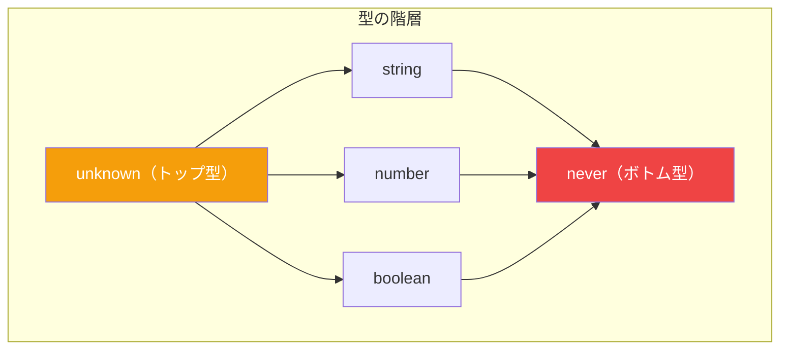
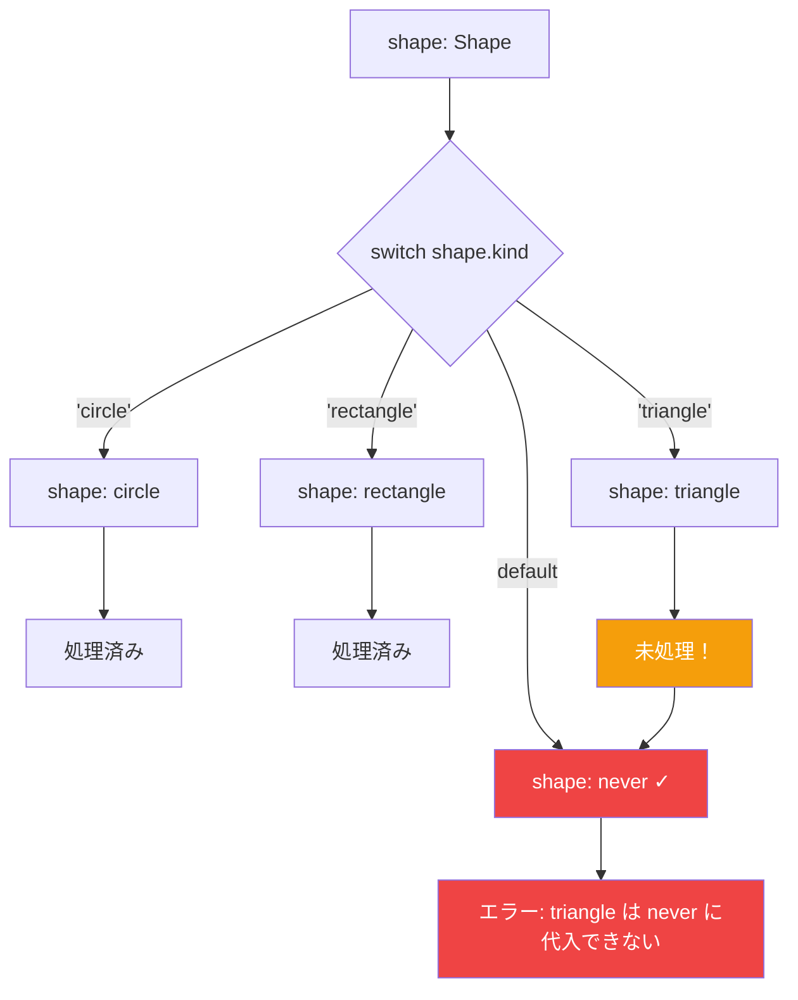

TypeScript の静的型解析は、間違ったことをしたときにエラーを検出するのが得意です。しかし、*何かをすべきなのにしていない*という「漏れ」のエラーはどうでしょうか？ここで**網羅性チェック**が役立ち、`never` 型がその鍵となります。

## 問題: 欠落したケース

図形描画アプリケーションを作成しているとしましょう：

```typescript
type Shape =
  | { kind: 'circle'; radius: number }
  | { kind: 'rectangle'; width: number; height: number };

function getArea(shape: Shape): number {
  switch (shape.kind) {
    case 'circle':
      return Math.PI * shape.radius ** 2;
    case 'rectangle':
      return shape.width * shape.height;
  }
}
```

これは問題なく動作します。しかし、新しい図形を追加したらどうなるでしょうか？

```typescript
type Shape =
  | { kind: 'circle'; radius: number }
  | { kind: 'rectangle'; width: number; height: number }
  | { kind: 'triangle'; base: number; height: number };  // 新規追加！

function getArea(shape: Shape): number {
  switch (shape.kind) {
    case 'circle':
      return Math.PI * shape.radius ** 2;
    case 'rectangle':
      return shape.width * shape.height;
    // おっと！'triangle' の処理を忘れた
  }
}
```

TypeScript は欠落したケースについて警告しません。関数は実行時に `undefined` を返す可能性があり、バグの原因になります。

## 解決策: 網羅性チェック

トリックは、値を `never` 型に代入する `default` ケースを追加することです：

```typescript
function assertNever(x: never): never {
  throw new Error(`予期しない値: ${x}`);
}

function getArea(shape: Shape): number {
  switch (shape.kind) {
    case 'circle':
      return Math.PI * shape.radius ** 2;
    case 'rectangle':
      return shape.width * shape.height;
    default:
      return assertNever(shape);
      //                 ~~~~~
      // エラー: 型 '{ kind: "triangle"; ... }' の引数を
      // 型 'never' のパラメータに割り当てることはできません
  }
}
```

これで TypeScript は、どのケースの処理を忘れたかを正確に教えてくれます！

## `never` 型を理解する



`never` 型は、決して発生しない値を表します：
- 常に例外をスローする関数
- 無限ループを持つ関数
- 何も残らないように絞り込まれた値

最も重要なのは、**`never` 以外の値を `never` に代入することはできない**ということです。これが網羅性チェックを機能させる仕組みです。

## 仕組み



すべてのケースを処理した場合：
1. 各 `case` が型を絞り込む
2. すべてのケース後、型は `never` に絞り込まれる
3. `never` を `never` に代入するのは問題なし—エラーなし

ケースを漏らした場合：
1. 未処理のケースが型に残る
2. その型は `never` に代入できない
3. TypeScript がエラーを表示

## 異なるパターン

### パターン 1: アサート関数（推奨）

```typescript
function assertNever(x: never): never {
  throw new Error(`予期しない値: ${JSON.stringify(x)}`);
}

function getArea(shape: Shape): number {
  switch (shape.kind) {
    case 'circle':
      return Math.PI * shape.radius ** 2;
    case 'rectangle':
      return shape.width * shape.height;
    default:
      return assertNever(shape);
  }
}
```

**利点:**
- 実行時の安全性（何らかの理由で到達した場合に例外をスロー）
- エラーメッセージがデバッグに役立つ
- コードベース全体で再利用可能

### パターン 2: 型注釈

```typescript
function getArea(shape: Shape): number {
  switch (shape.kind) {
    case 'circle':
      return Math.PI * shape.radius ** 2;
    case 'rectangle':
      return shape.width * shape.height;
    default:
      const _exhaustiveCheck: never = shape;
      return _exhaustiveCheck;
  }
}
```

**利点:**
- 関数呼び出しのオーバーヘッドなし
- 追加のユーティリティなしで動作

### パターン 3: satisfies（TypeScript 4.9 以降）

```typescript
function getArea(shape: Shape): number {
  switch (shape.kind) {
    case 'circle':
      return Math.PI * shape.radius ** 2;
    case 'rectangle':
      return shape.width * shape.height;
    default:
      return shape satisfies never;
  }
}
```

**利点:**
- 最も簡潔な構文
- 最新の TypeScript 機能

## 実際の例

### Redux リデューサー

```typescript
type Action =
  | { type: 'INCREMENT' }
  | { type: 'DECREMENT' }
  | { type: 'SET'; value: number };

interface State {
  count: number;
}

function reducer(state: State, action: Action): State {
  switch (action.type) {
    case 'INCREMENT':
      return { count: state.count + 1 };
    case 'DECREMENT':
      return { count: state.count - 1 };
    case 'SET':
      return { count: action.value };
    default:
      return assertNever(action);
  }
}
```

### API レスポンス処理

```typescript
type ApiResponse =
  | { status: 'success'; data: User }
  | { status: 'error'; message: string }
  | { status: 'loading' };

function renderResponse(response: ApiResponse): string {
  switch (response.status) {
    case 'success':
      return `ようこそ、${response.data.name}さん！`;
    case 'error':
      return `エラー: ${response.message}`;
    case 'loading':
      return '読み込み中...';
    default:
      return assertNever(response);
  }
}
```

### イベント処理

```typescript
type AppEvent =
  | { type: 'click'; x: number; y: number }
  | { type: 'keydown'; key: string }
  | { type: 'scroll'; offset: number };

function handleEvent(event: AppEvent): void {
  switch (event.type) {
    case 'click':
      console.log(`クリック位置: (${event.x}, ${event.y})`);
      break;
    case 'keydown':
      console.log(`キー押下: ${event.key}`);
      break;
    case 'scroll':
      console.log(`スクロール位置: ${event.offset}`);
      break;
    default:
      assertNever(event);
  }
}
```

## if 文での使用

網羅性チェックは switch 文に限定されません：

```typescript
function getArea(shape: Shape): number {
  if (shape.kind === 'circle') {
    return Math.PI * shape.radius ** 2;
  }
  if (shape.kind === 'rectangle') {
    return shape.width * shape.height;
  }
  // 新しい図形を追加すると、ここでエラーになる
  return assertNever(shape);
}
```

## ESLint との連携

追加の安全レイヤーとして、ESLint の `@typescript-eslint/switch-exhaustiveness-check` ルールも使用できます：

```json
{
  "rules": {
    "@typescript-eslint/switch-exhaustiveness-check": "error"
  }
}
```

このルールは、`assertNever` パターンがなくても、switch 文がすべてのユニオンメンバーを処理していない場合に警告します。

## まとめ

- **`never` 型**は決して発生しないはずの値を表す
- **網羅性チェック**は `never` を使ってコンパイル時に欠落したケースを検出する
- 実行時の安全性とより良いデバッグのために `assertNever()` 関数を使う
- このパターンはタグ付きユニオンや Redux スタイルのリデューサーと相性が良い
- 最大限の安全性のために ESLint ルールとの組み合わせを検討する

ユニオン型に新しいバリアントを追加すると、網羅性チェックにより TypeScript がコード内の更新が必要なすべての場所を案内してくれます。これによりリファクタリングがより安全になり、バグの見落としを防ぐことができます。

## 参考資料

- [TypeScript ハンドブック: Narrowing - Exhaustiveness checking](https://www.typescriptlang.org/docs/handbook/2/narrowing.html#exhaustiveness-checking)
- Vanderkam, Dan. *Effective TypeScript*, 2nd Edition. O'Reilly Media, 2024.
