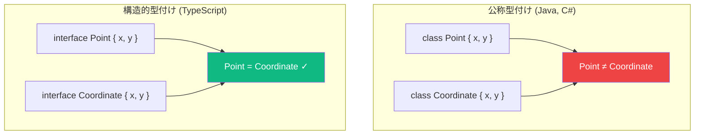

Java、C#、その他の公称型付け言語から来た方は、TypeScript の型システムに驚くかもしれません。TypeScript は**構造的型付け**（「ダックタイピング」とも呼ばれる）を採用しており、型の名前ではなく構造に基づいて互換性が判断されます。

## 構造的型付けとは？

TypeScript では、2つの型が同じ構造（同じプロパティと互換性のある型）を持っていれば、互換性があるとみなされます。型の名前は関係ありません。

```typescript
interface Point {
  x: number;
  y: number;
}

interface Coordinate {
  x: number;
  y: number;
}

const point: Point = { x: 10, y: 20 };
const coord: Coordinate = point; // OK! 同じ構造
```

`Point` と `Coordinate` は異なるインターフェースですが、TypeScript は同じ形状を持つため互換性があるとみなします。

## 公称型付け vs 構造的型付け



**公称型付け**（Java、C#）では：
- 型は同じ名前または明示的な継承関係がある場合のみ互換性がある
- `class Point` と `class Coordinate` は別の型

**構造的型付け**（TypeScript）では：
- 型は同じ構造を持っていれば互換性がある
- 型の名前はドキュメンテーションのためのラベルに過ぎない

## ダックタイピング:「アヒルのように鳴くなら...」

「ダックタイピング」という言葉は次の格言に由来します：

> アヒルのように歩き、アヒルのように鳴くなら、それはアヒルに違いない。

TypeScript はこの原則をコンパイル時に適用します：

```typescript
interface Duck {
  walk(): void;
  quack(): void;
}

// このオブジェクトは Duck として宣言されていないが、正しい形状を持つ
const bird = {
  walk() { console.log('Walking...'); },
  quack() { console.log('Quack!'); },
  fly() { console.log('Flying...'); }  // 追加のメソッドは問題なし
};

function makeDuckQuack(duck: Duck) {
  duck.quack();
}

makeDuckQuack(bird); // OK! bird は walk() と quack() を持っている
```

`bird` オブジェクトは `Duck` として宣言されていませんが、必要なすべてのプロパティを持っているため互換性があります。

## なぜ構造的型付けなのか？

### 1. サードパーティライブラリとの柔軟性

ライブラリの型をインポートせずに、それと互換性のあるオブジェクトを作成できます：

```typescript
// あるライブラリがこのインターフェースを定義
interface Serializable {
  toJSON(): string;
}

// あなたのコード - Serializable をインポートや実装する必要なし
const user = {
  name: 'Alice',
  toJSON() {
    return JSON.stringify({ name: this.name });
  }
};

// Serializable を期待する任意の関数で動作
function save(item: Serializable) {
  console.log(item.toJSON());
}

save(user); // OK!
```

### 2. モックを使った簡単なテスト

複雑なモックフレームワークは不要—正しい形状のオブジェクトを作成するだけ：

```typescript
interface UserRepository {
  findById(id: string): User | null;
  save(user: User): void;
}

// テストでは同じ形状のオブジェクトを作成するだけ
const mockRepo = {
  findById(id: string) {
    return { id, name: 'Test User', email: 'test@example.com' };
  },
  save(user: User) {
    console.log('Saved:', user);
  }
};

// UserRepository が期待される場所で mockRepo を使用
```

### 3. JSON との連携

構造的型付けにより、JSON データとの連携が自然になります：

```typescript
interface ApiResponse {
  status: string;
  data: {
    id: number;
    name: string;
  };
}

// JSON.parse は any を返すが、インターフェースに代入可能
const response: ApiResponse = JSON.parse(jsonString);
// TypeScript はコンパイル時に構造をチェック
```

## 「余分なプロパティ」の注意点

構造的型付けは、オブジェクトが必要以上のプロパティを持つことを許容します：

```typescript
interface Point {
  x: number;
  y: number;
}

const point3D = { x: 1, y: 2, z: 3 };
const point2D: Point = point3D; // OK! x と y を持っている

function logPoint(p: Point) {
  console.log(p.x, p.y);
}

logPoint(point3D); // OK!
```

ただし、TypeScript はオブジェクトリテラルに対して**余剰プロパティチェック**を適用します：

```typescript
const point: Point = { x: 1, y: 2, z: 3 };
//                                  ~~~
// エラー: オブジェクトリテラルは既知のプロパティのみ指定できます
```

これにより、オブジェクトを直接作成する際のタイプミスや間違いを検出できます。

## 構造的型付けで驚くこと

### 驚き 1: 関数も構造的に型付けされる

```typescript
type Handler = (event: MouseEvent) => void;

// この関数はパラメータが少ない - それでも OK!
const simpleHandler = () => console.log('clicked');

const handler: Handler = simpleHandler; // OK!
```

一部のパラメータを無視する関数でも互換性があります。これは、関数が使用する以上の引数を渡すことは常に安全だからです。

### 驚き 2: クラスインスタンスも構造的

```typescript
class Person {
  constructor(public name: string) {}
}

class Dog {
  constructor(public name: string) {}
}

const person: Person = new Dog('Buddy'); // OK! 同じ構造
```

クラスインスタンスも構造的に比較されます。クラスに公称型付けが必要な場合は、private メンバーを使用できます：

```typescript
class Person {
  private readonly __brand = 'Person';
  constructor(public name: string) {}
}

class Dog {
  private readonly __brand = 'Dog';
  constructor(public name: string) {}
}

const person: Person = new Dog('Buddy');
//    ~~~~~~
// エラー: 型には private プロパティ '__brand' の個別の宣言があります
```

### 驚き 3: 広い型は狭い値を受け入れる

```typescript
interface Named {
  name: string;
}

interface Person extends Named {
  age: number;
}

const people: Named[] = [];
const person: Person = { name: 'Alice', age: 30 };

people.push(person); // OK! Person は Named のすべてのプロパティを持つ
```

## ブランド型: 公称型付けのシミュレーション

同じ構造を持つ型を区別する必要がある場合があります：

```typescript
type USD = number & { readonly brand: unique symbol };
type EUR = number & { readonly brand: unique symbol };

function usd(amount: number): USD {
  return amount as USD;
}

function eur(amount: number): EUR {
  return amount as EUR;
}

function addUSD(a: USD, b: USD): USD {
  return (a + b) as USD;
}

const dollars = usd(100);
const euros = eur(100);

addUSD(dollars, dollars); // OK
addUSD(dollars, euros);   // エラー! EUR は USD に代入できません
```

この「ブランド型」パターンは、型システムにのみ存在する幻のプロパティを追加します。

## 実践的なヒント

### ヒント 1: 公開 API にはインターフェースを使用

他の人が実装する型を定義する場合、インターフェースは構造的型付けと自然に連携します：

```typescript
// ライブラリコード
interface Logger {
  log(message: string): void;
  error(message: string): void;
}

// ユーザーコード - 明示的に実装する必要なし
const consoleLogger = {
  log: console.log,
  error: console.error,
};
```

### ヒント 2: 構造的互換性を活用する

構造的型付けと戦わず、活用しましょう：

```typescript
// これの代わりに:
function processUser(user: User) { ... }

// 必要なプロパティを持つ任意のオブジェクトを受け入れることを検討:
function processUser(user: { name: string; email: string }) { ... }
```

### ヒント 3: 実行時の安全性には型ガードを使用

構造的型付けはコンパイル時のみです。実行時の安全性には型ガードを追加してください：

```typescript
function isPoint(obj: unknown): obj is Point {
  return (
    typeof obj === 'object' &&
    obj !== null &&
    'x' in obj &&
    'y' in obj &&
    typeof (obj as Point).x === 'number' &&
    typeof (obj as Point).y === 'number'
  );
}
```

## まとめ

| 側面 | 構造的型付け |
|------|--------------|
| 互換性 | 名前ではなく形状に基づく |
| 柔軟性 | 高い - 一致するオブジェクトなら何でも動作 |
| テスト | 簡単 - 一致する形状のオブジェクトを作成 |
| サードパーティコード | インポートなしで動作 |
| 実行時 | 強制されない - コンパイル時のみ |

重要なポイント：
- TypeScript は構造的型付けを使用：正しい形状を持っていれば互換性がある
- これによりモック、サードパーティコード、JSON との柔軟性が実現
- 余分なプロパティは許容される（オブジェクトリテラルを除く）
- パラメータが少ない関数は、より多くを期待する関数と互換性がある
- 公称的な動作が必要な場合はブランド型を使用

構造的型付けを理解することは、TypeScript らしいコードを書くために不可欠です。これを活用すれば、TypeScript の型システムが驚くほど柔軟で強力であることがわかるでしょう。

## 参考資料

- [TypeScript ハンドブック: Type Compatibility](https://www.typescriptlang.org/docs/handbook/type-compatibility.html)
- Vanderkam, Dan. *Effective TypeScript*, 2nd Edition. O'Reilly Media, 2024.
