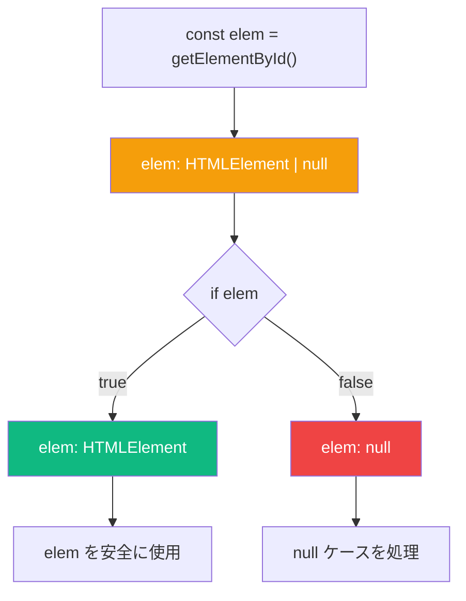
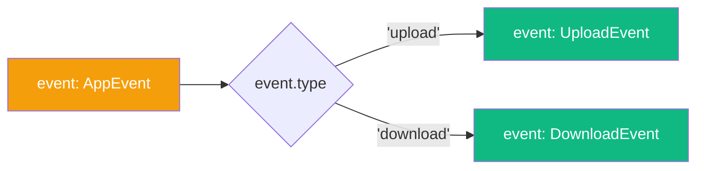

TypeScript の型システムは強力ですが、その真価はコードの制御フローに基づいて型を絞り込む機能にあります。この機能は**型の絞り込み**（ナローイング、またはリファインメント）と呼ばれ、型安全かつエレガントなコードを書くことができます。

## 型の絞り込みとは？

型の絞り込みは、コードの実行パスに基づいて TypeScript が広い型からより具体的な型へと推論を変化させるプロセスです。最も一般的な例は null チェックです：

```typescript
const elem = document.getElementById('my-element');
// elem は HTMLElement | null

if (elem) {
  elem.innerHTML = 'Hello!';
  // elem は HTMLElement（null は除外される）
} else {
  // elem は null
  console.log('Element not found');
}
```

コンパイラはコードの実行パスを追跡するため、これは**制御フロー解析**とも呼ばれます。

## 重要な洞察: 型は場所によって変わる

TypeScript が Java や C++ などの言語と異なる重要な概念があります：



TypeScript では、**シンボルはコード内の場所ごとに型を持ちます**。同じ変数がコードの異なる場所で異なる型を持つことができます。これはプログラミング言語の中でも珍しい特徴ですが、非常に強力です。

## 型を絞り込む方法

### 1. 早期 throw または return

```typescript
function processValue(value: string | null) {
  if (!value) {
    throw new Error('Value is required');
  }
  // value は string になる
  return value.toUpperCase();
}
```

### 2. `typeof` を使う

```typescript
function formatValue(value: string | number) {
  if (typeof value === 'string') {
    return value.toUpperCase();
    // value は string
  }
  return value.toFixed(2);
  // value は number
}
```

### 3. `instanceof` を使う

```typescript
function processInput(input: Date | string) {
  if (input instanceof Date) {
    return input.toISOString();
    // input は Date
  }
  return new Date(input).toISOString();
  // input は string
}
```

### 4. `in` によるプロパティチェック

```typescript
interface Bird {
  fly(): void;
  layEggs(): void;
}

interface Fish {
  swim(): void;
  layEggs(): void;
}

function move(animal: Bird | Fish) {
  if ('fly' in animal) {
    animal.fly();
    // animal は Bird
  } else {
    animal.swim();
    // animal は Fish
  }
}
```

### 5. `Array.isArray()` を使う

```typescript
function processItems(items: string | string[]) {
  const list = Array.isArray(items) ? items : [items];
  // list は string[]
  return list.join(', ');
}
```

## タグ付きユニオン: 最も強力なパターン

型を絞り込む最も効果的な方法の一つが**タグ付きユニオン**（判別ユニオンとも呼ばれる）です：

```typescript
interface UploadEvent {
  type: 'upload';
  filename: string;
  contents: string;
}

interface DownloadEvent {
  type: 'download';
  filename: string;
}

type AppEvent = UploadEvent | DownloadEvent;

function handleEvent(event: AppEvent) {
  switch (event.type) {
    case 'upload':
      // event は UploadEvent
      console.log(`Uploading ${event.filename}: ${event.contents.length} bytes`);
      break;
    case 'download':
      // event は DownloadEvent
      console.log(`Downloading ${event.filename}`);
      break;
  }
}
```



`type` プロパティが「タグ」として機能し、TypeScript がユニオンのメンバーを判別するために使用します。

## ユーザー定義型ガード

TypeScript が自動的に型を判断できない場合、**ユーザー定義型ガード**で補助できます：

```typescript
interface User {
  name: string;
  email: string;
}

function isUser(value: unknown): value is User {
  return (
    typeof value === 'object' &&
    value !== null &&
    'name' in value &&
    'email' in value &&
    typeof (value as User).name === 'string' &&
    typeof (value as User).email === 'string'
  );
}

function greet(data: unknown) {
  if (isUser(data)) {
    // data は User
    console.log(`Hello, ${data.name}!`);
  }
}
```

`value is User` という戻り値の型は**型述語**と呼ばれます。関数が `true` を返した場合、パラメータが指定した型であることを TypeScript に伝えます。

## よくある落とし穴

### 落とし穴 1: `typeof null` は "object"

```typescript
function process(value: object | null) {
  if (typeof value === 'object') {
    // value はまだ object | null！
    // JavaScript では typeof null === 'object'
  }
}
```

代わりに明示的な null チェックを使用してください：

```typescript
function process(value: object | null) {
  if (value !== null) {
    // value は object
  }
}
```

### 落とし穴 2: Falsy な値

```typescript
function process(value: string | number | null) {
  if (!value) {
    // value は ''、0、または null の可能性がある！
  }
}
```

チェックする内容を明示的にしてください：

```typescript
function process(value: string | number | null) {
  if (value === null) {
    // value は null
  } else {
    // value は string | number（'' や 0 を含む）
  }
}
```

### 落とし穴 3: コールバックは絞り込みを保持しない

```typescript
function processLater(obj: { value: string | number }) {
  if (typeof obj.value === 'number') {
    setTimeout(() => {
      // obj.value は再び string | number に戻る！
      console.log(obj.value.toFixed(2)); // エラー！
    });
  }
}
```

TypeScript はコールバックが実行される前に `obj.value` が変更される可能性があることを知っています。値をローカル変数にキャプチャしてください：

```typescript
function processLater(obj: { value: string | number }) {
  if (typeof obj.value === 'number') {
    const value = obj.value; // number としてキャプチャ
    setTimeout(() => {
      console.log(value.toFixed(2)); // OK
    });
  }
}
```

## 実践例: 安全な JSON パース

型ガードと絞り込みを組み合わせて、安全な API レスポンス処理を行う方法：

```typescript
interface ApiResponse<T> {
  status: 'success' | 'error';
  data?: T;
  error?: string;
}

interface User {
  id: number;
  name: string;
}

function isSuccessResponse<T>(
  response: ApiResponse<T>
): response is ApiResponse<T> & { status: 'success'; data: T } {
  return response.status === 'success' && response.data !== undefined;
}

async function fetchUser(id: number): Promise<User | null> {
  const response: ApiResponse<User> = await fetch(`/api/users/${id}`)
    .then(r => r.json());

  if (isSuccessResponse(response)) {
    // response.data は User（保証される）
    return response.data;
  }

  console.error(response.error);
  return null;
}
```

## まとめ

- 型の絞り込みは、制御フローに基づいて型を絞り込む TypeScript の機能
- 変数はコード内の場所によって異なる型を持つことができる
- `typeof`、`instanceof`、`in`、`Array.isArray()` を使って絞り込む
- タグ付きユニオンは型を判別する最も強力なパターン
- ユーザー定義型ガードでカスタム型チェックを TypeScript に教えることができる
- 注意点: `typeof null`、falsy な値、コールバック

型の絞り込みをマスターすれば、型安全で自然に読める TypeScript コードを書くことができます。コンパイラに働いてもらいましょう！

## 参考資料

- [TypeScript ハンドブック: Narrowing](https://www.typescriptlang.org/docs/handbook/2/narrowing.html)
- Vanderkam, Dan. *Effective TypeScript*, 2nd Edition. O'Reilly Media, 2024.
