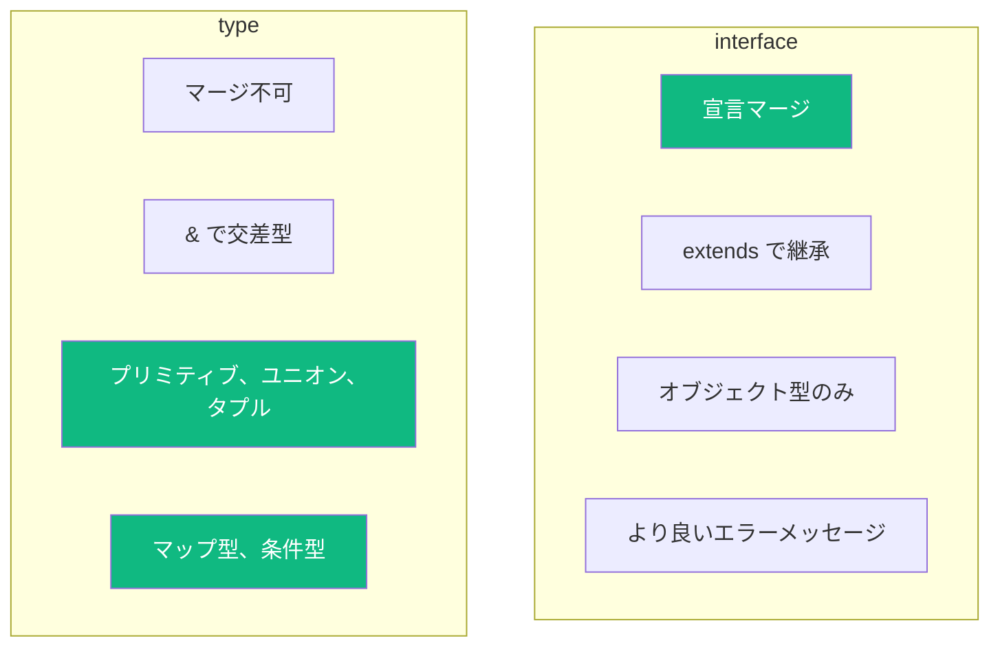
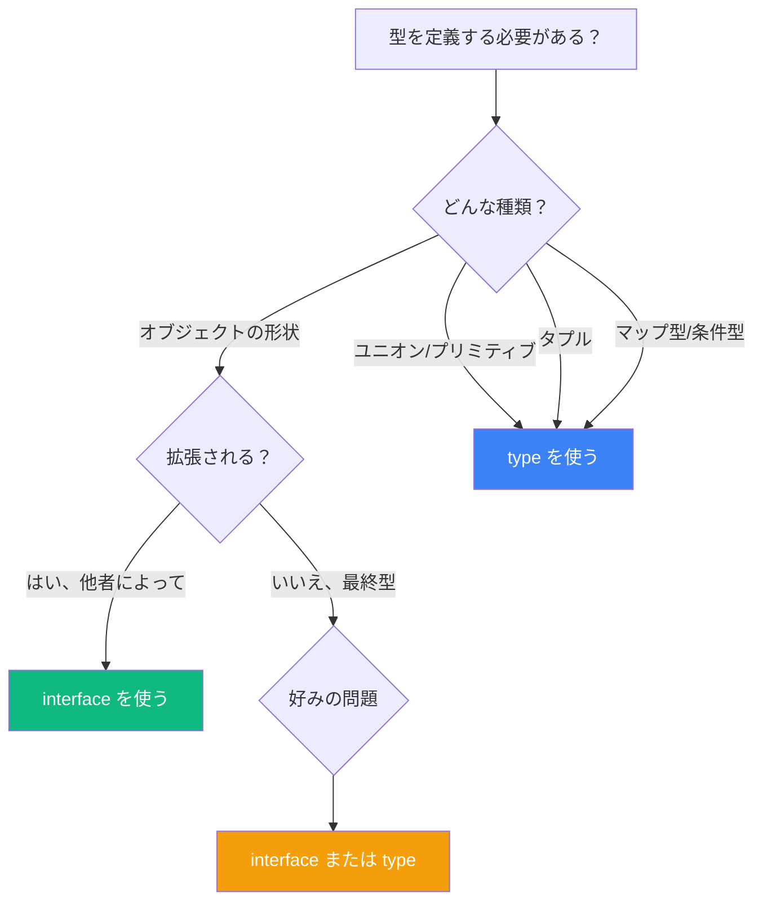

TypeScript 開発者が最もよく聞く質問の一つが「`type` と `interface`、どちらを使うべき？」です。答えは必ずしも単純ではありませんが、違いを理解することでより良い選択ができるようになります。

## 基本

`type` と `interface` はどちらもオブジェクトの形状を記述できます：

```typescript
// interface を使う
interface Person {
  name: string;
  age: number;
}

// type を使う
type PersonType = {
  name: string;
  age: number;
};

// どちらも同じように動作する
const alice: Person = { name: 'Alice', age: 30 };
const bob: PersonType = { name: 'Bob', age: 25 };
```

単純なオブジェクト型では、ほぼ互換性があります。しかし、重要な違いがあります。

## 主な違い



### 1. 宣言マージ

interface は複数回宣言でき、TypeScript がそれらをマージします：

```typescript
interface User {
  name: string;
}

interface User {
  email: string;
}

// User は name と email の両方を持つ
const user: User = {
  name: 'Alice',
  email: 'alice@example.com'
};
```

type エイリアスはマージできません：

```typescript
type User = {
  name: string;
};

type User = {  // エラー: 識別子 'User' が重複しています
  email: string;
};
```

**これはいつ役立つ？** 宣言マージは、サードパーティライブラリや組み込み型を拡張する際に便利です：

```typescript
// Window インターフェースを拡張
interface Window {
  myCustomProperty: string;
}

window.myCustomProperty = 'Hello!'; // OK
```

### 2. 継承 vs 交差型

interface は `extends` を使い、type は `&` を使います：

```typescript
// interface の継承
interface Animal {
  name: string;
}

interface Dog extends Animal {
  breed: string;
}

// type の交差型
type AnimalType = {
  name: string;
};

type DogType = AnimalType & {
  breed: string;
};
```

どちらも似た結果を得られますが、エラー処理に微妙な違いがあります：

```typescript
interface Named {
  name: string;
}

interface Person extends Named {
  name: number;  // エラー: 型が互換性がありません
}

type PersonType = Named & {
  name: number;  // エラーなし、ただし name は 'never' になる
};
```

interface は宣言時に衝突を検出しますが、type の交差型は静かに `never` 型を作成します。

### 3. type だけができること

type エイリアスは interface では表現できないものを表すことができます：

```typescript
// プリミティブ型
type ID = string | number;

// ユニオン型
type Status = 'pending' | 'approved' | 'rejected';

// タプル型
type Point = [number, number];

// 関数型（より簡潔な構文）
type Callback = (data: string) => void;

// マップ型
type Readonly<T> = {
  readonly [P in keyof T]: T[P];
};

// 条件型
type NonNullable<T> = T extends null | undefined ? never : T;
```

### 4. エラーメッセージ

interface は TypeScript が参照できる名前を持つため、より明確なエラーメッセージを提供することが多いです：

```typescript
interface User {
  name: string;
  email: string;
}

function greet(user: User) {
  console.log(user.name);
}

greet({ name: 'Alice' });
// エラー: プロパティ 'email' が型 '{ name: string; }' に存在しませんが、
// 型 'User' では必須です
```

複雑な type エイリアスでは、エラーメッセージが読みにくくなることがあります。

## それぞれをいつ使うべきか



### `interface` を使うべき場合:

1. **公開 API のオブジェクト形状を定義する場合** - 宣言マージにより利用者が型を拡張できる
2. **クラスと連携する場合** - interface は `implements` と自然に連携する
3. **明確なエラーメッセージが欲しい場合** - 名前付き interface はエラーで理解しやすい

```typescript
// interface の良い使い方: クラス実装
interface Serializable {
  serialize(): string;
}

class User implements Serializable {
  constructor(public name: string) {}

  serialize() {
    return JSON.stringify({ name: this.name });
  }
}
```

### `type` を使うべき場合:

1. **ユニオン型や交差型を定義する場合** - type でのみ可能
2. **プリミティブを扱う場合** - `type ID = string | number`
3. **マップ型や条件型を作成する場合** - 高度な型操作
4. **拡張を防ぎたい場合** - type はマージできない

```typescript
// type の良い使い方: ユニオン型
type Result<T> =
  | { status: 'success'; data: T }
  | { status: 'error'; error: string };

async function fetchData(): Promise<Result<User>> {
  try {
    const data = await fetch('/api/user').then(r => r.json());
    return { status: 'success', data };
  } catch (e) {
    return { status: 'error', error: String(e) };
  }
}
```

## 実践的な推奨

ほとんどのコードベースでは、一貫性が具体的な選択よりも重要です。実践的なアプローチを紹介します：

1. **オブジェクトの形状には `interface`** を使う（拡張される可能性がある場合）
2. **それ以外には `type`** を使う（ユニオン、タプル、プリミティブ、マップ型）
3. **一つを選んで一貫性を保つ** - コードベース内で統一する

```typescript
// 一貫したアプローチの例

// データの形状には interface
interface User {
  id: string;
  name: string;
  email: string;
}

interface Post {
  id: string;
  title: string;
  authorId: string;
}

// ユニオンとユーティリティには type
type ID = string | number;
type Status = 'draft' | 'published' | 'archived';
type UserWithPosts = User & { posts: Post[] };
```

## よくある誤解

### 「interface の方が速い」

これは古い TypeScript バージョンでは正しかったですが、現代の TypeScript は両方を同等に処理します。パフォーマンスで選ばないでください。

### 「常にどちらか一方を使うべき」

どちらにも適した場面があります。最良のコードベースは両方を適切に使い分けています。

### 「完全に互換性がある」

そうではありません！上記で示したように、type は interface にできないことができます（逆に宣言マージは interface のみ）。

## まとめ

| 機能 | `interface` | `type` |
|------|-------------|--------|
| オブジェクトの形状 | はい | はい |
| 宣言マージ | はい | いいえ |
| `extends` キーワード | はい | いいえ（`&` を使用） |
| ユニオン型 | いいえ | はい |
| プリミティブ型 | いいえ | はい |
| タプル型 | いいえ | はい |
| マップ型 | いいえ | はい |
| 条件型 | いいえ | はい |

必要に応じて選択してください：
- **拡張性が必要？** `interface` を使う
- **ユニオン/プリミティブ/高度な型？** `type` を使う
- **迷ったら？** オブジェクトには `interface`、それ以外には `type`

## 参考資料

- [TypeScript ハンドブック: Object Types](https://www.typescriptlang.org/docs/handbook/2/objects.html)
- Vanderkam, Dan. *Effective TypeScript*, 2nd Edition. O'Reilly Media, 2024.
