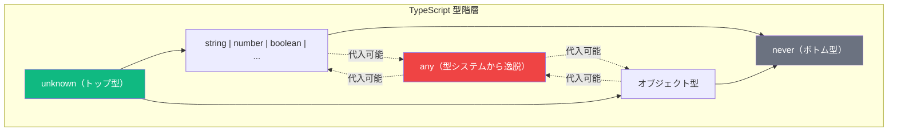
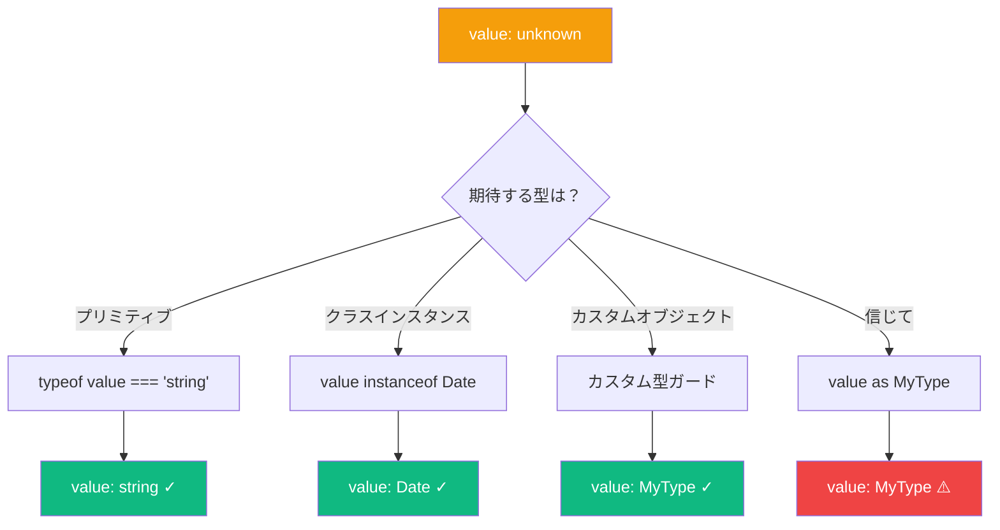

TypeScript を使っていると、コンパイル時に値の型がわからない状況に必ず遭遇します。JSON のパース、API レスポンスの処理、サードパーティライブラリの利用など、「どんな値でも受け入れる」型が必要になることがあります。

TypeScript には `any` と `unknown` という2つの選択肢があります。一見似ているように見えますが、動作は大きく異なり、正しい選択がコードの型安全性に大きな影響を与えます。

## `any` の問題点

`any` 型は TypeScript の型システムからの「脱出口」です。`any` を使うと、TypeScript に「信じて、何をしているかわかっている」と伝えることになります。

```typescript
function parseJSON(json: string): any {
  return JSON.parse(json);
}

const data = parseJSON('{"name": "Alice", "age": 30}');
console.log(data.name);        // OK
console.log(data.foo.bar.baz); // エラーなし、実行時にクラッシュ！
data();                         // エラーなし、実行時にクラッシュ！
```

問題は、`any` がすべての型チェックを無効化することです。TypeScript は以下について警告しません：

- 存在しないプロパティへのアクセス
- 関数ではない値の呼び出し
- メソッドへの不正な引数の受け渡し

さらに悪いことに、`any` は**伝染性**があります。`any` 値を別の変数に代入すると、その変数も `any` になります：

```typescript
const data: any = getExternalData();
const name = data.name;  // name も 'any' になる
const age = data.age;    // age も 'any' になる
name.toFixed(2);         // エラーなし、クラッシュする可能性あり！
```

## `unknown` の登場：型安全な代替手段

`unknown` 型は TypeScript 3.0 で `any` のより安全な代替として導入されました。`any` と同様にあらゆる値を保持できますが、`any` と違って、型を絞り込まないと `unknown` 値に対して何もできません。

```typescript
function parseJSON(json: string): unknown {
  return JSON.parse(json);
}

const data = parseJSON('{"name": "Alice"}');
console.log(data.name);  // エラー: 'data' は 'unknown' 型です
data();                   // エラー: 'data' は 'unknown' 型です
```

最初は不便に感じるかもしれませんが、これは機能です。TypeScript が値を使う前に型を検証することを強制しているのです。

## 型システムの理解

`unknown` がなぜより安全なのかを理解するために、これらの型が TypeScript の型システムにどう適合するか考えてみましょう：



### `any` は型システムを壊す

`any` には2つの矛盾した性質があります：

1. どの型も `any` に代入可能
2. `any` はどの型にも代入可能

これは `any` がすべての型のスーパータイプとサブタイプを同時に持つことを意味し、数学的には不可能です。これが `any` が型チェックを無効化する理由です。

### `unknown` は型システムを尊重する

`unknown` は最初の性質のみを持つ「トップ型」です：

1. どの型も `unknown` に代入可能
2. `unknown` は `unknown` と `any` にのみ代入可能

これにより、`unknown` は型安全性を維持しながら真の「あらゆる値」型になります。

## `unknown` の使い方

`unknown` 値を直接使用できないため、まず型を絞り込む必要があります。いくつかの方法を紹介します：



### 型アサーション

```typescript
const data: unknown = fetchData();
const user = data as User;
console.log(user.name);
```

注意：型アサーションは型チェックをバイパスするため、慎重に使用してください。

### `typeof` による型ガード

```typescript
function processValue(value: unknown) {
  if (typeof value === "string") {
    console.log(value.toUpperCase()); // OK、value は string
  } else if (typeof value === "number") {
    console.log(value.toFixed(2));    // OK、value は number
  }
}
```

### `instanceof` によるインスタンスチェック

```typescript
function processValue(value: unknown) {
  if (value instanceof Date) {
    console.log(value.toISOString()); // OK、value は Date
  } else if (value instanceof Error) {
    console.log(value.message);       // OK、value は Error
  }
}
```

### カスタム型ガード

```typescript
interface User {
  name: string;
  email: string;
}

function isUser(value: unknown): value is User {
  return (
    typeof value === "object" &&
    value !== null &&
    "name" in value &&
    "email" in value
  );
}

function greetUser(data: unknown) {
  if (isUser(data)) {
    console.log(`Hello, ${data.name}!`); // OK、data は User
  }
}
```

## 実践的な例

### JSON の安全なパース

```typescript
interface ApiResponse {
  status: string;
  data: {
    id: number;
    name: string;
  };
}

function isApiResponse(value: unknown): value is ApiResponse {
  return (
    typeof value === "object" &&
    value !== null &&
    "status" in value &&
    "data" in value
  );
}

async function fetchUser(): Promise<ApiResponse> {
  const response = await fetch("/api/user");
  const json: unknown = await response.json();

  if (isApiResponse(json)) {
    return json;
  }

  throw new Error("Invalid API response");
}
```

### 外部データの処理

```typescript
function processExternalData(data: unknown): string {
  if (typeof data === "string") {
    return data;
  }
  if (typeof data === "number") {
    return data.toString();
  }
  if (Array.isArray(data)) {
    return data.join(", ");
  }
  return JSON.stringify(data);
}
```

## 使い分けの指針

| `any` を使う場面 | `unknown` を使う場面 |
|-----------------|---------------------|
| JavaScript から TypeScript への移行時 | 値の型がわからない場合 |
| 本当に動的なコードを扱う場合 | 外部データ（JSON、APIレスポンス）のパース |
| 一時的な回避策（修正予定あり） | 型安全な汎用ユーティリティの構築 |

## まとめ

- **`any`** は型チェックを無効化するため、可能な限り避けるべき
- **`unknown`** は「あらゆる値」を表す型安全な方法
- `unknown` は使用前に絞り込みが必要で、これにより適切な型処理が強制される
- 型ガード、`instanceof`、`typeof` を使って `unknown` 型を絞り込む
- 関数の戻り値や外部データを扱う際は `any` より `unknown` を優先する

`any` の代わりに `unknown` を選択することで、不確かな型の値を扱いながらも TypeScript の型安全性を維持できます。最初は少しコードが増えるかもしれませんが、実行時エラーを防ぎ、より堅牢なコードを作成できます。

## 参考資料

- [TypeScript ハンドブック: `unknown` 型](https://www.typescriptlang.org/docs/handbook/2/functions.html#unknown)
- Vanderkam, Dan. *Effective TypeScript*, 2nd Edition. O'Reilly Media, 2024.
