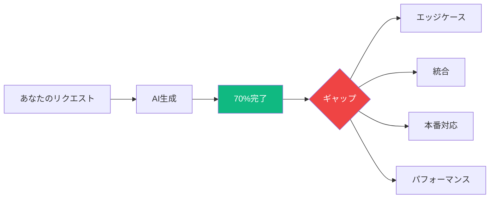
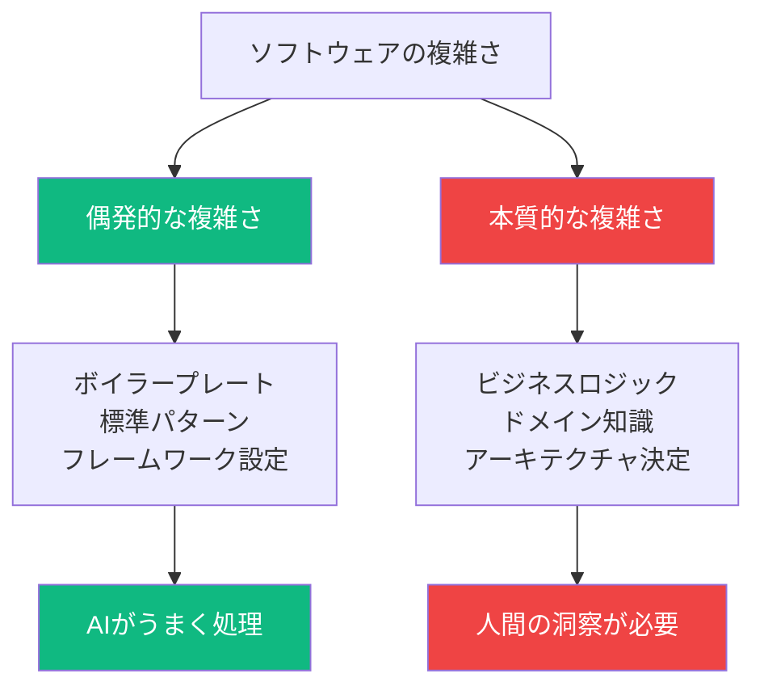
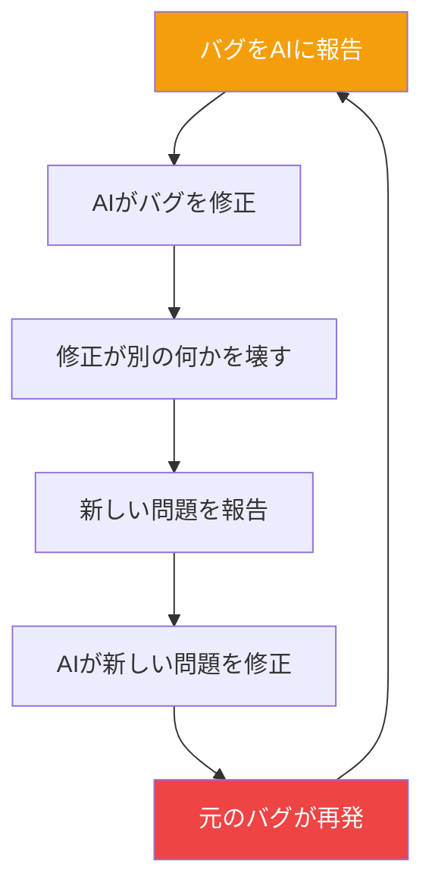
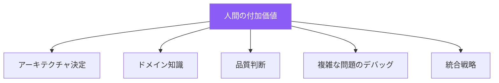

AIコーディングアシスタントは素早く印象的な結果を生成できます。ボイラープレートを作成し、ルーチン関数を書き、数分で動くプロトタイプを作成します。しかし多くの開発者が壁にぶつかります：AIはおよそ70%まで到達できますが、残りの30%は収穫逓減の繰り返しになります。

## 70%問題を理解する



### 70%はどんな感じか

最初の70%は魔法のよう：

```
最初のAI出力: 動くプロトタイプ
├── 基本機能: ✓
├── ハッピーパス: ✓
├── 標準パターン: ✓
├── ボイラープレート: ✓
└── 一般的なユースケース: ✓
```

### 30%に含まれるもの

残りの30%に難しさが隠れている：

```
挑戦的な30%:
├── エッジケースとエラーハンドリング
├── セキュリティ考慮
├── パフォーマンス最適化
├── 既存システムとの統合
├── ビジネスロジックのニュアンス
├── 本番グレードの信頼性
└── 保守可能なアーキテクチャ
```

## なぜこのギャップが存在するか

### AIのパターンマッチングの強み

AIは「偶発的な複雑さ」—繰り返しの多いパターン化された作業—に優れています：

| AIが得意 | AIが苦手 |
|--------------|-------------------|
| CRUD操作 | 新しいアルゴリズム |
| 標準UIパターン | 独自のビジネスルール |
| 一般的な統合 | エッジケース処理 |
| フレームワークボイラープレート | パフォーマンスチューニング |
| ルーチンバリデーション | セキュリティ強化 |

### 本質的複雑さの問題



AIは標準パターンの何百万もの例を見てきました。しかしあなた特有の：
- ビジネス要件
- 統合制約
- パフォーマンス目標
- セキュリティ要件

...はトレーニングデータにマッチしない独自の組み合わせです。

## 収穫逓減のサイクル

多くの開発者がこのパターンを経験：

```
イテレーション1: AIがソリューションの70%を生成
イテレーション2: バグ修正、AIが新しいバグを導入
イテレーション3: 新しいバグを修正、元の機能が壊れる
イテレーション4: それを修正、エッジケースが出現
...
イテレーションN: 「自分で書いた方が早かった」
```

### なぜAIは「一歩前進、二歩後退」するのか



これが起こる理由：
1. **限られたコンテキスト**: AIはシステム全体を理解していない
2. **ランタイム可視性なし**: AIはコードの実際の動作を見られない
3. **理解よりパターン**: AIはパターンマッチし、推論しない
4. **トレーニングデータの偏り**: 最適でなく一般的なアプローチを反映

## ギャップを埋める: 実践的戦略

### 1. 明確な仕様から始める

```
悪いプロンプト:
「ユーザー認証システムを作成して」

良いプロンプト:
「以下の仕様でユーザー認証システムを作成して:
- メール/パスワードログイン
- JWTトークン、有効期限1時間
- レート制限: 失敗5回でアカウント15分ロック
- パスワード要件: 8文字以上、大小英字混合、数字
- models/user.jsの既存Userモデルと統合」
```

要件が具体的であるほど、30%の多くを事前に対処できます。

### 2. AIは下書き用、最終版ではない


AI出力は以下が必要な最初の下書きとして扱う：
- エラーハンドリングレビュー
- エッジケース分析
- セキュリティ監査
- パフォーマンスチェック

### 3. ビッグバンではなく段階的に

AIに機能全体を構築させるのではなく：

```
# 効果が低い
「完全なeコマースチェックアウトシステムを構築して」

# より効果的
「カートのデータモデルを作成して」
[レビュー、改善]
「カートに追加する関数を追加して」
[レビュー、改善]
「税込み価格計算を実装して」
[レビュー、改善]
...
```

### 4. レビューチェックリスト

AIがコードを生成した後、体系的にチェック：

| 領域 | 確認すべき質問 |
|------|------------------|
| エラーハンドリング | APIが失敗したら？入力が無効なら？ |
| エッジケース | 空リスト？Null値？同時アクセス？ |
| セキュリティ | SQLインジェクション？XSS？認証バイパス？ |
| パフォーマンス | N+1クエリ？メモリリーク？非効率なループ？ |
| 統合 | 既存パターンと互換？規約に従っている？ |

### 5. いつ引き継ぐべきか知る

手動コーディングの方が速いパターンを認識：

```
AIが行き詰まっているサイン:
- 「修正」後に同じバグが再発
- ソリューションがますます複雑に
- 無関係な機能を壊す
- 解決策ではなく回避策を提案

対処: 止まる、コードを理解する、手動で修正
```

## 人間の30%: 重要なスキル

### AIが代替できないもの



### 磨くべきスキル

| スキル | なぜ重要か |
|-------|----------------|
| コードリーディング | AI出力を理解し検証 |
| アーキテクチャ | AIが実装するシステムを設計 |
| デバッグ | AIが診断できない問題を修正 |
| ドメイン専門知識 | AIにないビジネスコンテキストを適用 |
| テスト戦略 | 正確性を包括的に検証 |

## 実践的ワークフロー

### 70/30開発サイクル

```
フェーズ1: AI支援（70%）
├── 初期構造を生成
├── ボイラープレートを作成
├── 標準パターンを実装
└── ハッピーパス機能を構築

フェーズ2: 人間のエンジニアリング（30%）
├── 生成されたコードをすべてレビュー
├── エラーハンドリングを追加
├── エッジケースを処理
├── パフォーマンスを最適化
├── セキュリティを強化
└── 統合テスト
```

### 時間配分

現実的に時間を計画：

```
AIを使った機能開発:
├── AI生成: 時間の20%
├── レビューとテスト: 時間の30%
├── 手動改善: 時間の40%
└── 統合: 時間の10%

コードの70%は時間の20%
コードの30%は時間の80%
```

## 例: ログインシステムの構築

### AIの70%

```javascript
// AIがこれを素早く生成
async function login(email, password) {
  const user = await User.findOne({ email });
  if (!user) return { error: 'User not found' };

  const valid = await bcrypt.compare(password, user.password);
  if (!valid) return { error: 'Invalid password' };

  const token = jwt.sign({ userId: user.id }, SECRET);
  return { token };
}
```

### 人間の30%

```javascript
// 人間が本番対応部分を追加
async function login(email, password) {
  // 入力バリデーション
  if (!email || !isValidEmail(email)) {
    return { error: 'Invalid email format' };
  }

  // レート制限チェック
  const attempts = await getLoginAttempts(email);
  if (attempts >= 5) {
    return { error: 'Account locked. Try again later.' };
  }

  const user = await User.findOne({ email });

  // タイミングセーフな応答（列挙攻撃防止）
  if (!user) {
    await bcrypt.compare(password, DUMMY_HASH);
    await recordFailedAttempt(email);
    return { error: 'Invalid credentials' };
  }

  const valid = await bcrypt.compare(password, user.password);
  if (!valid) {
    await recordFailedAttempt(email);
    return { error: 'Invalid credentials' };
  }

  // 成功時に失敗回数をクリア
  await clearLoginAttempts(email);

  // 監査ログ
  await auditLog('login', user.id, { ip: req.ip });

  const token = jwt.sign(
    { userId: user.id, version: user.tokenVersion },
    SECRET,
    { expiresIn: '1h' }
  );

  return {
    token,
    expiresIn: 3600
  };
}
```

## まとめ

| 観点 | 70% | 30% |
|--------|---------|---------|
| 内容 | 標準パターン、ボイラープレート | エッジケース、本番対応 |
| 担当 | AIが得意 | 人間が不可欠 |
| 必要時間 | 速い | 労力の大部分 |
| 必要スキル | プロンプティング | エンジニアリング判断 |

70%問題は修正すべき欠陥ではなく、受け入れるべき現実です。AIはコーディングのルーチン部分を劇的に加速し、人間の判断が最も重要な本当に難しい30%に専門知識を集中できるようにします。

最高の開発者はこのダイナミクスと戦いません。迅速な下書きにAIを活用しながら、その重要な最後の部分を完成、保護、最適化するためのエンジニアリング規律を維持します。

## 参考資料

- Osmani, Addy. *Beyond Vibe Coding*. O'Reilly Media, 2025.
- Yang, Peter. "Honest reflections from coding with AI." X/Twitter, 2024.
