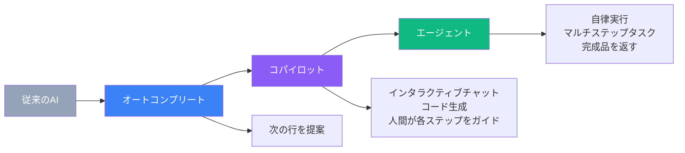
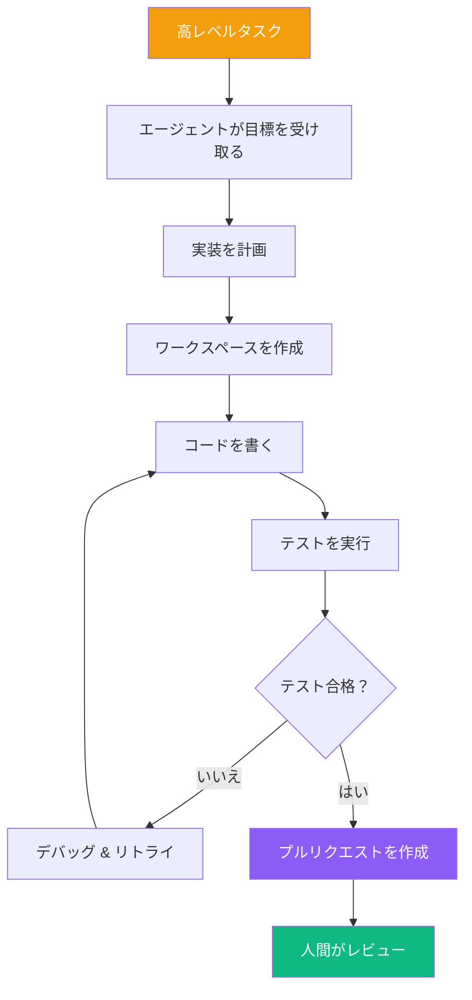
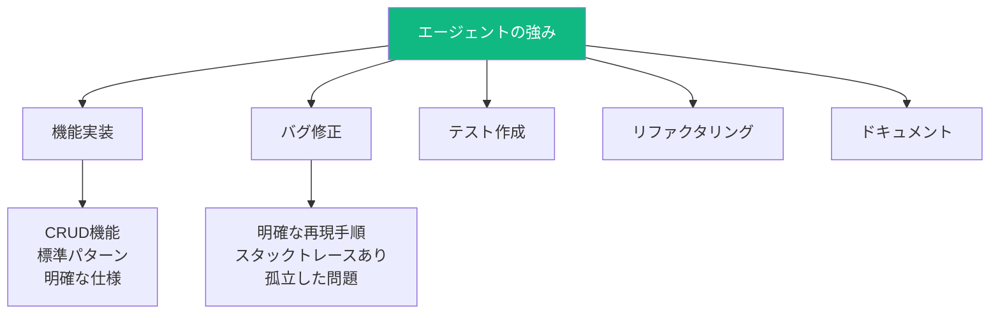
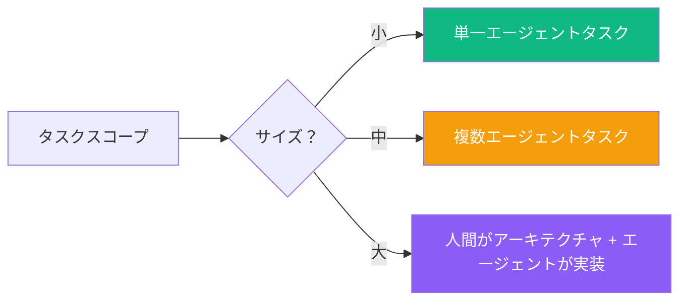
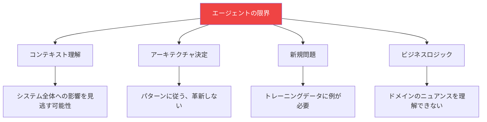
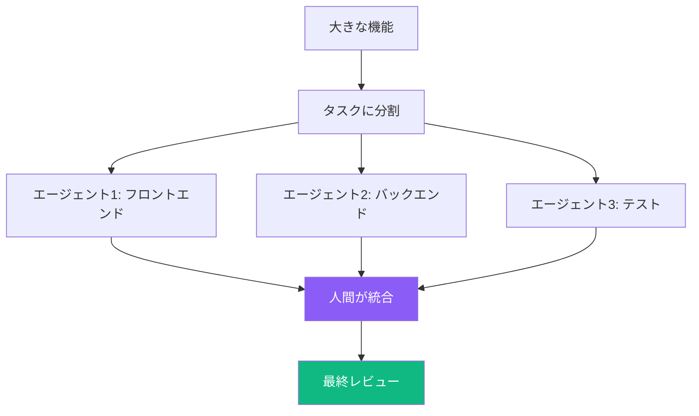
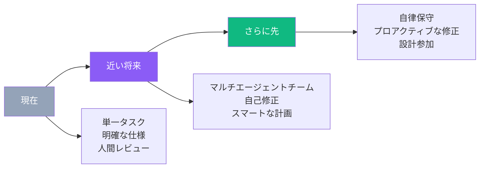

AIコーディングはインタラクティブなアシスタントから、タスク全体を独立して処理できる自律エージェントへと進化しています。これらのエージェントは根本的な変化を表しています：入力中にコードを提案するのではなく、バックグラウンドで作業を完了するために派遣するジュニア開発者のように働きます。

## コパイロットからエージェントへ



### 主な違い

| 観点 | コパイロットスタイル | 自律エージェント |
|--------|---------------|------------------|
| インタラクション | 継続的なガイダンス | 火をつけて忘れる |
| 出力 | レビュー用の提案 | 完成したPR |
| 人間の役割 | ドライバー | レビュアー |
| スコープ | 単一の編集 | 機能全体 |
| 環境 | あなたのIDE | 隔離されたサンドボックス |

## 自律エージェントの仕組み



### エージェントループ

1. **タスク割り当て**: やりたいことを説明
2. **計画**: エージェントがタスクを分解
3. **実行**: 隔離環境で作業
4. **検証**: テスト実行、出力確認
5. **反復**: 自動的に問題を修正
6. **納品**: レビュー用に完成品を返す

## 現在のエージェント状況

### 統合エージェント

| ツール | エージェント機能 | 動作方法 |
|------|---------------|--------------|
| Cursor | Agent Mode | ツール呼び出し付き複数ファイル編集 |
| Cline | Autonomous Mode | VSCodeでタスク実行 |
| GitHub Copilot | Agent Mode | PR生成機能 |
| Windsurf | Cascade Mode | コードベース対応タスク実行 |

### 専用エージェントプラットフォーム

| プラットフォーム | フォーカス | 主な機能 |
|----------|-------|-------------|
| Devin | フルスタック開発 | 完全なエンジニアリング環境 |
| Jules | Googleのエージェント | 深いIDE統合 |
| Codex CLI | OpenAIのエージェント | コマンドライン中心 |
| Replit Agent | ラピッドプロトタイピング | デプロイ可能な出力 |

## エージェントの能力

### エージェントが得意なこと



### エージェントに最適なタスク

| タスクタイプ | 適性 | 例 |
|-----------|-------------|---------|
| ボイラープレート機能 | 優秀 | 「編集フォーム付きユーザープロフィールページを追加」 |
| スタックトレース付きバグ | 優秀 | 「チェックアウトのTypeErrorを修正」 |
| テストカバレッジ | 良い | 「UserServiceのユニットテストを追加」 |
| ドキュメント | 良い | 「エンドポイントのAPIドキュメントを生成」 |
| 複雑なアーキテクチャ | 不向き | 「マイクロサービス移行を設計」 |
| 曖昧な要件 | 不向き | 「もっとユーザーフレンドリーに」 |

## エージェント使用のベストプラクティス

### 1. 明確なタスク定義

```
悪いタスク:
「バグを直して」

良いタスク:
「src/checkout/payment.js:45のTypeErrorを修正して。
'undefined'がcalculateTotal()に渡される問題。
カートにアイテムがないユーザーで発生。
ガード句とユニットテストを追加して。」
```

### 2. 適切なスコープ設定



### 3. コンテキストを提供

| コンテキストタイプ | なぜ役立つか |
|--------------|--------------|
| 関連ファイル | エージェントがどこを見るか知る |
| 既存パターン | エージェントが規約に従う |
| テスト例 | エージェントが一貫したテストを書く |
| 制約 | エージェントが間違ったアプローチを避ける |

### 4. 厳密にレビュー

自律的な作業も人間の検証が必要：

```
エージェントPRのレビューチェックリスト:
├── 述べられた問題を解決しているか？
├── 意図しない変更がないか？
├── テストは本当に正しいものをテストしているか？
├── セキュリティへの影響は？
├── パフォーマンスは許容範囲か？
└── コードベーススタイルに合っているか？
```

## エージェントの限界

### 現在の課題



### エージェントを使うべきでない場面

| シナリオ | なぜ問題か |
|----------|-----------------|
| セキュリティ重要コード | 事前に専門家レビューが必要 |
| パフォーマンス重要パス | 深い分析が必要 |
| クロスシステム統合 | 多すぎるコンテキストが必要 |
| アーキテクチャ変更 | 人間の判断が必要 |
| 不明確な要件 | 仮定を立ててしまう |

## 人間-エージェント協調パターン

### パターン1: ドラフターとしてのエージェント

```
人間: タスクと制約を定義
エージェント: 初期実装を生成
人間: レビュー、改善、ガイド
エージェント: フィードバックを取り入れる
人間: 最終承認とマージ
```

### パターン2: 並列エージェント



### パターン3: 人間がアーキテクチャ、エージェントが実装

```
人間アーキテクトが設計:
├── システム境界
├── データモデル
├── APIコントラクト
└── 主要アルゴリズム

エージェントが実装:
├── 個別コンポーネント
├── ユニットテスト
├── ドキュメント
└── ボイラープレートコード
```

## エージェント出力の管理

### バージョン管理戦略

```
ブランチ命名:
feature/agent-task-description
bugfix/agent-issue-number

コミット規約:
[agent] 機能Xの初期実装
[human] エージェント実装のレビュー修正
[agent] レビューフィードバックを適用
```

### コード所有権

エージェント生成でも、人間がコードを所有：

| 責任 | 所有者 |
|----------------|-------|
| タスク定義 | 人間 |
| 実装 | エージェント（初期） |
| レビュー | 人間 |
| 承認 | 人間 |
| 保守 | 人間 |
| バグ | 人間（承認したのはあなた） |

## エージェント開発の未来

### 新しい機能



### ワークフローの準備

1. **構造化された仕様**: エージェントは明確な要件でより良く動く
2. **堅牢なテスト**: 自動テストが不可欠なゲートキーパーに
3. **コードレビュー慣行**: 機械生成コードのレビューに適応
4. **アーキテクチャドキュメント**: エージェントが効果的に動くためにコンテキストが必要

## 実践ワークフロー例

### シナリオ: 機能追加

```
1. 人間がタスク仕様を作成:
   「パスワードリセットフローを追加:
   - /reset-passwordにメールリクエストフォーム
   - メールサービス経由でリセットリンク送信
   - トークンベースの検証
   - パスワード更新フォーム
   - 各エンドポイントのテスト
   src/auth/の既存認証パターンを使用」

2. エージェントが実行:
   - 既存認証コードを分析
   - 新しいコンポーネントを作成
   - APIエンドポイントを作成
   - メールテンプレートを追加
   - テストを生成
   - PRを作成

3. 人間がレビュー:
   - トークン処理のセキュリティ
   - メールテンプレートの内容
   - テストカバレッジ
   - 統合ポイント

4. 反復:
   - 人間: 「悪用防止のためレート制限を追加」
   - エージェント: 実装を更新
   - 人間: 承認してマージ
```

## まとめ

| 観点 | ポイント |
|--------|-----------|
| 正体 | コーディングタスクのバックグラウンドワーカー |
| 最適な用途 | 明確に定義された、範囲が限定された機能 |
| 不向きな用途 | アーキテクチャ、曖昧な要件 |
| 人間の役割 | タスク定義、レビュー、承認 |
| 重要な慣行 | 明確な仕様、厳密なレビュー |

自律エージェントはソフトウェア構築方法の大きな変化を表しています。開発者を置き換えるのではなく、私たちの能力を拡張します—眠らないジュニア開発者のチームを持つようなものです。成功の鍵は効果的なマネージャーになることを学ぶこと：明確なタスクを定義し、良いコンテキストを提供し、注意深いレビューを通じて品質を維持することです。

開発の未来は、複数のAIエージェントをオーケストレーションしながら、人間の専門知識を本当に難しい問題—アーキテクチャ、要件、機械がまだできない微妙な判断の呼び出し—に集中させることになるでしょう。

## 参考資料

- Osmani, Addy. *Beyond Vibe Coding*. O'Reilly Media, 2025.
- Anthropic. "Claude Agent Documentation." 2025.
