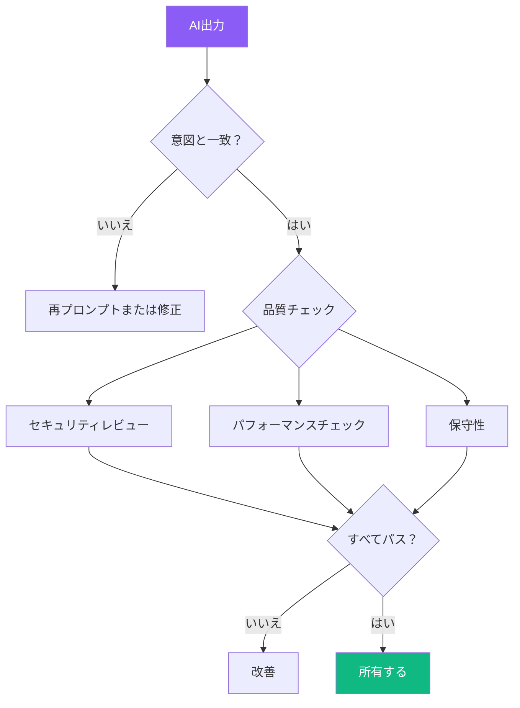
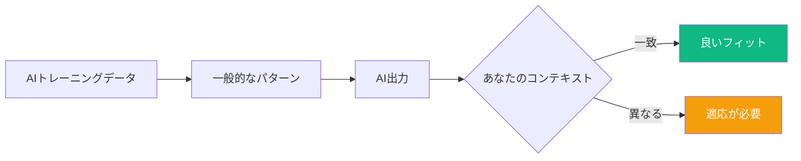
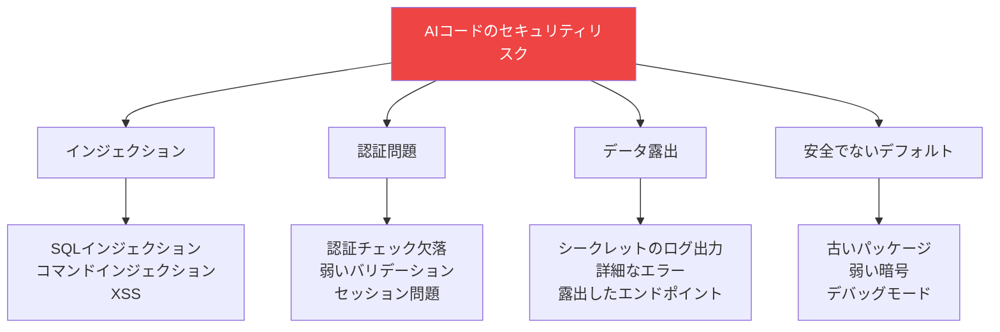
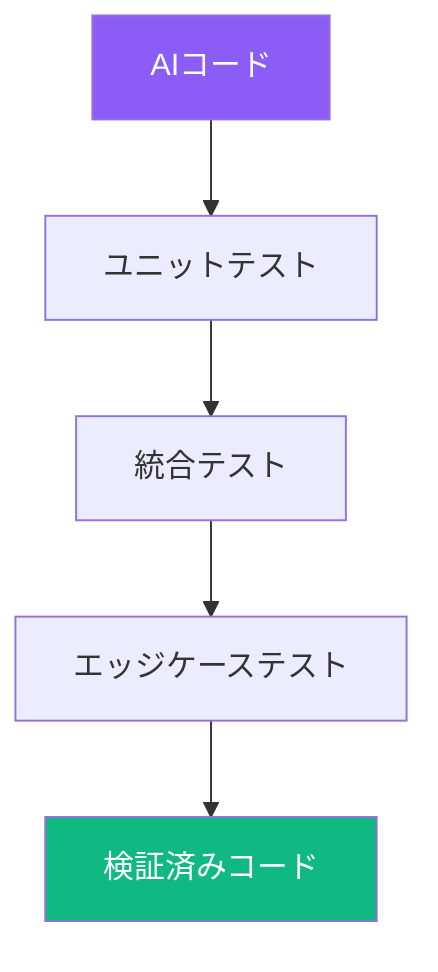

AIコーディングツールは素早く印象的な量のコードを生成できますが、品質を伴わない速度は技術的負債につながります。AI生成コードのレビューには、人間が書いたコードのレビューとは異なるマインドセットが必要です。このガイドでは、AI出力が正確で、安全で、保守可能であることを確認するための実践的なテクニックを解説します。

## レビューのマインドセット



### AIをジュニア開発者として扱う

AIを熱心だが経験の浅いチームメンバーとして考える：
- コードを素早く生成できる
- 一般的なパターンが得意
- エッジケースを見逃す可能性
- ビジネスコンテキストを理解しない
- 監督が必要

すべてのAIコードは出荷前に人間の検証が必要です。

## ステップ1: 意図の検証

まず、コードが要件と一致するか確認します。

### 確認すべき質問

| 領域 | 質問 |
|------|-----------|
| 機能性 | 私が求めたことをしているか？ |
| 完全性 | すべての要件が対処されているか？ |
| 解釈 | AIは私の意図を正しく理解したか？ |
| 仮定 | AIはどんな仮定をしたか？ |

### よくある誤解釈

```
あなたの要求: 「ユーザーを名前でソート」
AIの仮定: アルファベット昇順、大文字小文字区別

あなたの要求: 「フォームをバリデート」
AIの仮定: 基本的なフィールド存在チェックのみ

あなたの要求: 「エラーを処理」
AIの仮定: 一般的なメッセージ付きtry-catch
```

## ステップ2: マジョリティ問題

AIはトレーニングデータで最も一般的なソリューションに似たコードを生成します。これがあなたのコンテキストに最適とは限りません。



### 「マジョリティソリューション」問題の兆候

| パターン | 問題 | 解決策 |
|---------|---------|----------|
| 一般的な変数名 | 理解しにくい | ドメイン用語に変更 |
| 過剰設計 | 必要以上に複雑 | シンプル化 |
| 設計不足 | 要件が欠けている | 不足ロジックを追加 |
| 間違った技術選択 | 人気だが適切でない | 正しいものに置換 |

### 例

```javascript
// AI生成（一般的なパターン）
function fetchData() {
  return fetch('/api/data')
    .then(res => res.json())
    .then(data => data);
}

// あなたのコンテキストはエラー処理、認証、リトライが必要
async function fetchData() {
  const token = getAuthToken();

  for (let attempt = 0; attempt < 3; attempt++) {
    try {
      const res = await fetch('/api/data', {
        headers: { Authorization: `Bearer ${token}` }
      });

      if (!res.ok) {
        throw new Error(`HTTP ${res.status}`);
      }

      return await res.json();
    } catch (error) {
      if (attempt === 2) throw error;
      await delay(1000 * Math.pow(2, attempt));
    }
  }
}
```

## ステップ3: セキュリティレビュー

AI生成コードにはセキュリティ脆弱性が含まれることが多いです。これらの領域を必ずチェックしましょう。

### 一般的な脆弱性



### セキュリティチェックリスト

| カテゴリ | 確認項目 |
|----------|-----------|
| 入力バリデーション | すべての入力がサニタイズ・検証されているか？ |
| SQL/NoSQL | パラメータ化クエリを使用しているか？ |
| 認証 | すべてのルートに適切な認証チェックがあるか？ |
| 認可 | アクセス制御が検証されているか？ |
| シークレット | ハードコードされた認証情報がないか？ |
| 依存関係 | 既知の脆弱なパッケージがないか？ |
| エラー処理 | エラーに機密情報が含まれていないか？ |

### AIコードの危険信号

```javascript
// 危険信号: SQLインジェクション脆弱性
const query = `SELECT * FROM users WHERE id = ${userId}`;

// 危険信号: ハードコードされたシークレット
const API_KEY = "sk-abc123...";

// 危険信号: 認証チェック欠落
app.get('/admin/users', (req, res) => {
  // 最初に管理者ロールを確認すべき！
  return db.getAllUsers();
});

// 危険信号: ログに機密データ
console.log('Login attempt:', { email, password });
```

## ステップ4: パフォーマンス分析

AIは正確だが非効率なコードを生成することが多いです。

### 一般的なパフォーマンス問題

| 問題 | 例 | 修正 |
|-------|---------|-----|
| N+1クエリ | ループ内にDBコール | バッチまたはJOIN |
| メモリ肥大 | フィルタのためにすべて読み込み | クエリレベルのフィルタ |
| 非同期で同期 | ブロッキングI/O操作 | 適切な非同期パターン |
| 繰り返し計算 | ループ内で同じ計算 | メモ化 |

### 例: N+1問題

```javascript
// AI生成（N+1問題）
async function getOrdersWithProducts(userId) {
  const orders = await Order.find({ userId });

  for (const order of orders) {
    order.products = await Product.find({
      _id: { $in: order.productIds }
    });
  }

  return orders;
}

// 最適化版
async function getOrdersWithProducts(userId) {
  const orders = await Order.find({ userId });

  const allProductIds = orders.flatMap(o => o.productIds);
  const products = await Product.find({
    _id: { $in: allProductIds }
  });

  const productMap = new Map(
    products.map(p => [p._id.toString(), p])
  );

  return orders.map(order => ({
    ...order.toObject(),
    products: order.productIds.map(id =>
      productMap.get(id.toString())
    )
  }));
}
```

## ステップ5: 保守性チェック

後で理解できないコードは負債になります。

### コード明確性レビュー

```
自問する:
├── AI説明なしで理解できるか？
├── チームメイトは理解できるか？
├── 変数名は意味があるか？
├── 構造は論理的か？
└── 必要な場所にコメントがあるか？
```

### 命名規則

```javascript
// AI生成（一般的）
const d = getData();
const r = d.filter(x => x.a > 10);
const m = r.map(i => i.b);

// 意味のある名前
const users = fetchActiveUsers();
const adultUsers = users.filter(user => user.age > 18);
const userEmails = adultUsers.map(user => user.email);
```

### 構造評価

| 良い兆候 | 悪い兆候 |
|------------|-----------|
| 単一責任 | 神関数/クラス |
| 明確なデータフロー | 絡み合った依存関係 |
| 一貫したスタイル | 混在したパターン |
| 適切な抽象化 | 過剰/不足な抽象化 |

## ステップ6: AI生成コードのテスト

テストなしでAIコードを信用しないこと。

### テスト戦略



### 何をテストするか

| テストタイプ | フォーカス |
|-----------|-------|
| ハッピーパス | 期待通りに動くか？ |
| エッジケース | 空入力、null、境界 |
| エラーケース | どのように失敗するか？ |
| 統合 | 実際の依存関係で動くか？ |

### AIにテスト作成を手伝わせる

```
プロンプト: 「この関数のユニットテストを書いて、以下を含めて:
- 通常操作
- 空入力
- 無効入力
- 境界条件
- エラーハンドリング」
```

そしてテストの完全性をレビュー！

## レビューワークフロー

### クイックレビュー（5分）

```
1. コード構造をざっと見る
2. 明らかなセキュリティ問題をチェック
3. コンパイル/実行できることを確認
4. ハッピーパスを手動テスト
```

### フルレビュー（30分以上）

```
1. 意図の検証
2. 行ごとの読み込み
3. セキュリティ監査
4. パフォーマンス分析
5. 保守性チェック
6. テスト作成/実行
7. 変更をドキュメント化
```

### いつ何をするか

| シナリオ | レビューレベル |
|----------|--------------|
| プロトタイプ/POC | クイック |
| 本番機能 | フル |
| セキュリティ重要 | フル + セキュリティ専門家 |
| パフォーマンス重要 | フル + ベンチマーク |

## AIコードのリファクタリング

### いつリファクタするか

```
リファクタする時:
├── コードは正しいが不明瞭
├── コンテキストにより良いパターンがある
├── パフォーマンスが不十分
├── スタイルがコードベースと合わない
└── 抽象化のレベルが間違っている
```

### リファクタリング例

```javascript
// AI生成（動くが不明瞭）
function proc(d) {
  let r = [];
  for (let i = 0; i < d.length; i++) {
    if (d[i].s === 'A' && d[i].v > 100) {
      r.push({ n: d[i].n, t: d[i].v * 0.1 });
    }
  }
  return r;
}

// 明確さのためにリファクタ
function calculateActiveTaxes(orders) {
  const TAX_RATE = 0.1;
  const MINIMUM_VALUE = 100;

  return orders
    .filter(order =>
      order.status === 'ACTIVE' &&
      order.value > MINIMUM_VALUE
    )
    .map(order => ({
      name: order.name,
      tax: order.value * TAX_RATE
    }));
}
```

## まとめ: レビューチェックリスト

| ステージ | 主要アクション |
|-------|-------------|
| 1. 意図 | 要件と一致するか？ |
| 2. マジョリティ | 一般的なソリューションがあなたに適切か？ |
| 3. セキュリティ | OWASP Top 10脆弱性をチェック |
| 4. パフォーマンス | N+1、メモリ、非同期問題を特定 |
| 5. 保守性 | 明確な名前、構造、コメント |
| 6. テスト | ユニット、統合、エッジケース |
| 7. 所有権 | 理解し、修正できる |

目標は単に動くコードではなく、あなたが所有し、理解し、自信を持って保守できるコードです。AIはあなたの下書き執筆者であり、あなたは出版前に品質を確保する編集者です。

## 参考資料

- Osmani, Addy. *Beyond Vibe Coding*. O'Reilly Media, 2025.
- OWASP Foundation. "OWASP Top Ten." 2024.
