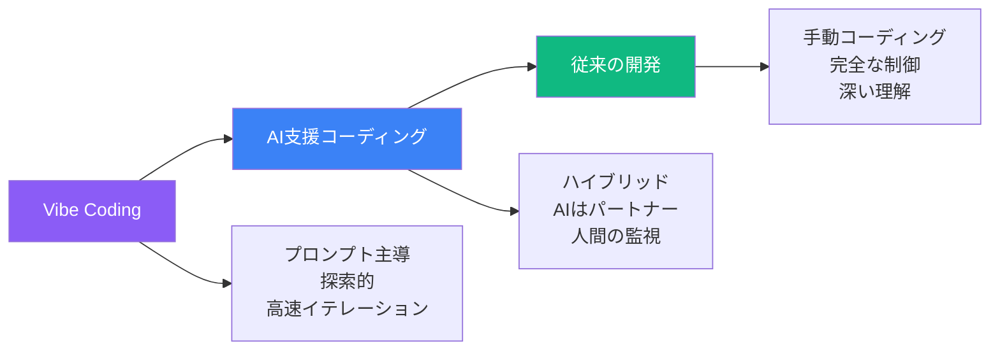
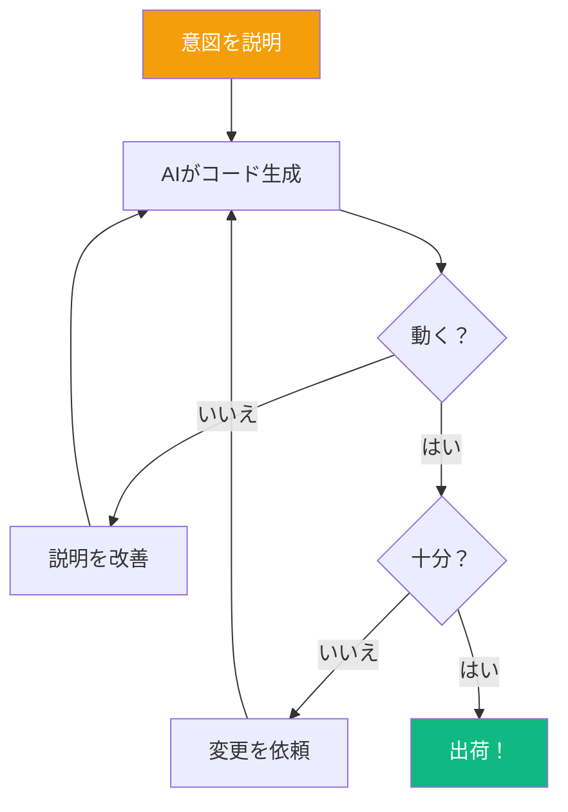
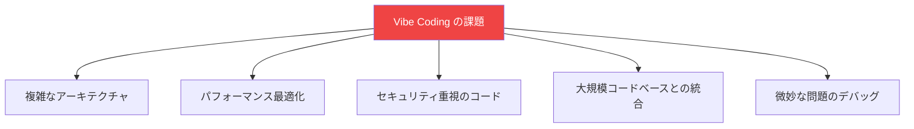
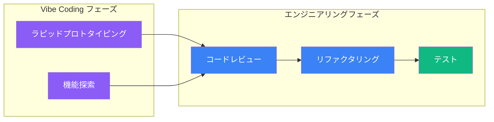

やりたいことを説明するだけで、まるでチームメイトと話すようにソフトウェアを書けることを想像してください。AIがあなたのアイデアをコードに変換します。これが Vibe Coding です。AIの先駆者 Andrej Karpathy が提唱した用語で、開発者がAIアシスタントの「バイブスに完全に身を委ねる」プロンプト主導の探索的なプログラミングアプローチを指します。

## AIコーディングの範囲

AI支援開発には、ゆるい探索から構造化されたエンジニアリングまでの範囲があります：



### Vibe Coding アプローチ

Vibe Coding では：
- 機能を自然言語で説明
- AIに最初の実装を生成させる
- 会話を通じてイテレーション
- 「十分に良い」ソリューションを受け入れる
- 完璧さよりスピードを優先

### AI支援エンジニアリングアプローチ

構造化されたAI支援開発では：
- プロンプトの前にアーキテクチャを計画
- 生成されたコードをすべてレビュー・理解
- コードベース全体の理解を維持
- AIを代替ではなく生産性ツールとして使用
- 保守性を優先

## Vibe Coding の仕組み



### 会話の例

```
あなた: ユーザーのリストを名前とメールで表示するReactコンポーネントを
作成してください。ユーザーをフィルタリングする検索ボックスを追加してください。

AI: [コンポーネントコードを生成]

あなた: 検索は大文字小文字を区別せず、メールでもフィルタリングできるようにして。

AI: [コードを更新]

あなた: ローディングとエラー状態を追加して。

AI: [ローディングスピナーとエラーハンドリングを追加]

あなた: 完璧、動いた！
```

## Vibe Coding が輝く場面

### 理想的なユースケース

| ユースケース | 効果的な理由 |
|-------------|--------------|
| プロトタイプ | 完成度よりスピード |
| ワンオフスクリプト | 使い捨てのコード |
| 学習プロジェクト | 探索モード |
| ハッカソン | 時間のプレッシャー |
| 社内ツール | 品質基準が低い |
| 概念実証 | アイデアを素早く検証 |

### 例：クイックプロトタイプ

```
プロンプト: シンプルな経費トラッカーアプリを作成してください：
- 金額とカテゴリで経費を追加/削除
- カテゴリ別の合計を表示
- 円グラフで表示
- localStorageで永続化

動けばいいので、完璧なコード構造は気にしないで。
```

このプロンプトで、手動でコーディングすると数時間かかるプロトタイプを数分で生成できます。

## Vibe Coding の限界

### 課題



| 課題 | 難しい理由 |
|------|-----------|
| 複雑なシステム | AIは全体のコンテキストを持たない |
| パフォーマンス調整 | 深い分析が必要 |
| セキュリティ | AIが脆弱性を見逃す可能性 |
| レガシー統合 | 既存コードの理解が必要 |
| デバッグ | AIは実行時の動作を見ない |

### 70%問題

AIは素早くソリューションの70%まで到達できることが多いですが、残りの30%には人間の専門知識が必要です：

```
最初のAI出力: 70%機能
+ デバッグ: 80%
+ エッジケース: 90%
+ 本番準備: 100%

最後の30%は、最初の70%より時間がかかることが多い。
```

## Vibe Coder のツールキット

### 必須スキル

1. **プロンプトの明確さ**: 意図を正確に説明
2. **イテレーション速度**: 素早いフィードバックループ
3. **コード読解**: AIが生成したものを理解
4. **パターン認識**: AIのよくある間違いを見つける
5. **止め時を知る**: 十分を受け入れる

### コードのための効果的なプロンプティング

```
良いプロンプト構造:
1. コンテキスト: 何を構築しているか
2. 要件: 具体的な機能
3. 制約: 技術、スタイル、制限
4. 例: 入出力サンプル
5. 品質メモ: 重要なこと、そうでないこと
```

例：
```
コンテキスト: Express.jsでREST APIを構築
要件:
- ユーザーを作成する POST /users エンドポイント
- メール形式と必須フィールドを検証
- 適切なHTTPステータスコードを返す
制約:
- async/awaitを使用
- データベースなし、インメモリ配列のみ
品質: 動くコード、詳細なエラーハンドリングは不要
```

## バイブスとエンジニアリングのバランス

最良のアプローチは多くの場合、両方のマインドセットを組み合わせます：



### 推奨ワークフロー

1. **バイブスから始める**: 何か動くものを得る
2. **アプローチを検証**: プロトタイプはコンセプトを証明したか？
3. **エンジニアリングにシフト**: レビュー、リファクタ、テスト
4. **イテレーション**: 特定の改善にAIを使用
5. **コードを所有**: 出荷するすべての行を理解

## まとめ

| 観点 | Vibe Coding | 従来 |
|------|-------------|------|
| スピード | 非常に速い | 遅め |
| 制御 | 少ない | 完全 |
| 理解 | 部分的かも | 完全 |
| 最適な用途 | プロトタイプ、学習 | 本番システム |
| リスク | 技術的負債 | 過剰エンジニアリング |

Vibe Coding は適切に使用すれば強力なツールです。迅速な探索とプロトタイピングに活用しつつ、保守、スケール、セキュリティが必要なコードにはエンジニアリングモードに切り替えるタイミングを知りましょう。

将来は、これらのアプローチの間を流動的に移動することになるでしょう—バイブスに身を委ねる時と、制御を取り戻す時を知ることが重要です。

## 参考資料

- Osmani, Addy. *Beyond Vibe Coding*. O'Reilly Media, 2025.
- Karpathy, Andrej. "There's a new kind of coding emerging..." Twitter/X, 2024.
