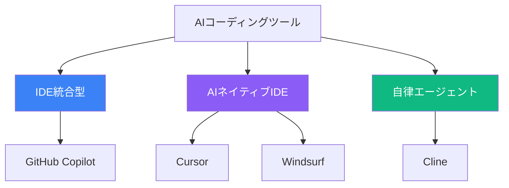
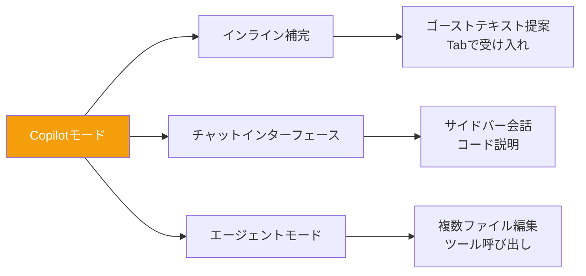
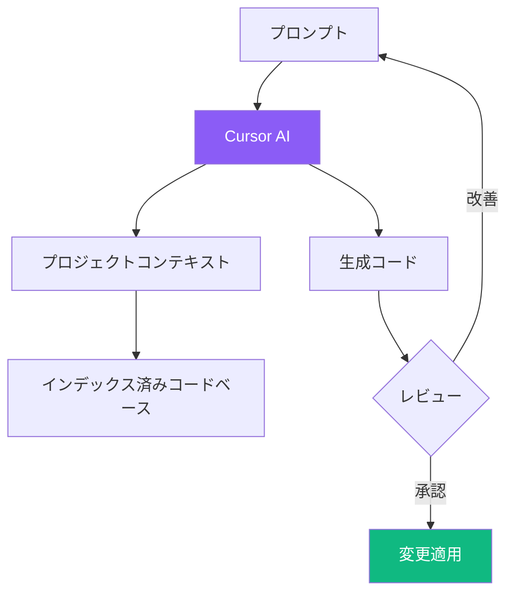
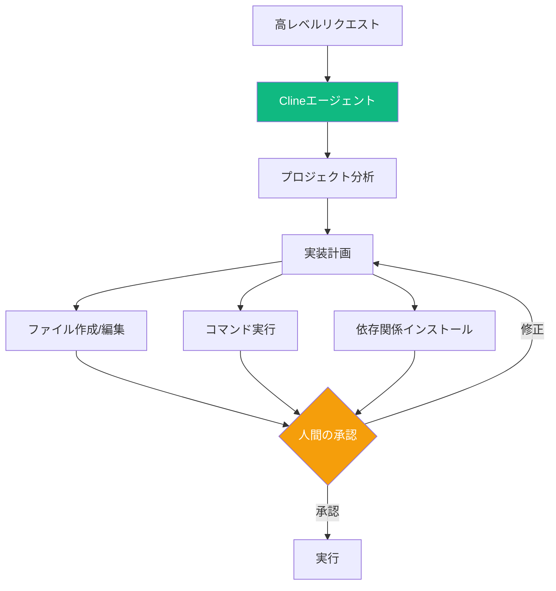
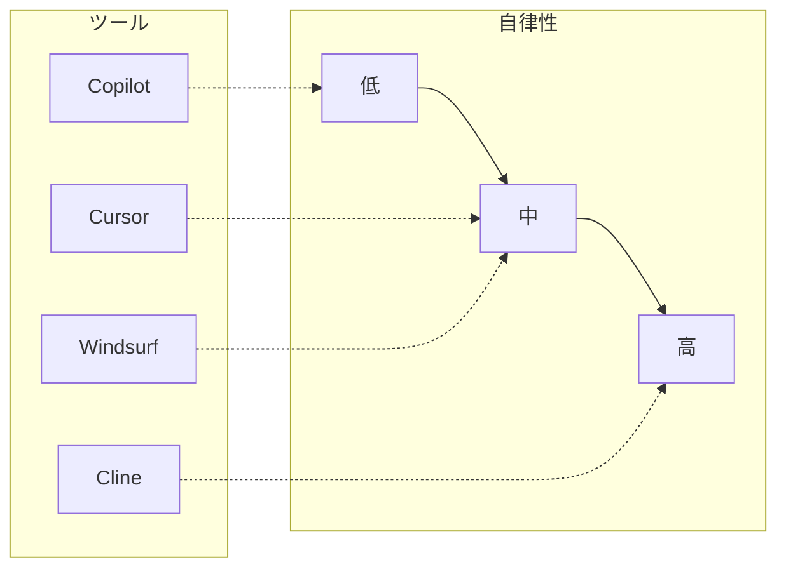
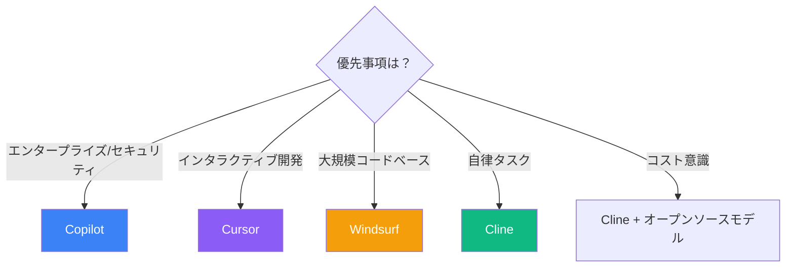

AIコーディングツールの世界は多様な選択肢で溢れており、それぞれがAI支援開発に対する独自のアプローチを提供しています。これらの違いを理解することで、ワークフローに最適なツール、またはツールの組み合わせを選択できます。

## AIコーディングツールのエコシステム



### ツールカテゴリ

| カテゴリ | ツール | アプローチ |
|----------|-------|----------|
| IDE統合型 | Copilot | 既存エディタへのAIアドオン |
| AIネイティブIDE | Cursor, Windsurf | AI機能を中心に構築されたエディタ |
| 自律エージェント | Cline | 独立したコーディングエージェントとしてのAI |

## GitHub Copilot: 業界標準

GitHub CopilotはVSCodeに深く統合され、Microsoftの人気エディタエコシステム内でAI支援を提供します。

### 主な機能



**強み：**
- シームレスなVSCode統合
- 既存のVSCodeユーザーには馴染みのある環境
- エンタープライズグレードのセキュリティとコンプライアンス
- 拡張性のためのModel Context Protocol（MCP）サポート

**ワークフロー例：**

```
1. 関数シグネチャを入力開始
2. Copilotが実装を提案（ゴーストテキスト）
3. Tabで受け入れ、または入力を続けて改善
4. 複雑な質問にはチャットサイドバーを使用
5. 複数ファイルの変更にはエージェントモード
```

### Copilotを使うべき場面

| シナリオ | 効果 |
|----------|---------------|
| 入力中のコード補完 | 優秀 |
| エンタープライズ環境 | 優秀 |
| 既存のVSCodeワークフロー | 優秀 |
| 複雑なリファクタリング | 良い |
| プロジェクト全体の生成 | 限定的 |

## Cursor: AIファーストエディタ

CursorはAIを中核に据えてIDEを再構築しています。VSCodeのフォークとして馴染みがありながら、強力なAIネイティブ機能を追加しています。

### アーキテクチャ



**主な差別化要素：**
- プロジェクト対応の提案（コードベースをインデックス）
- マルチステップ生成のComposerモード
- 自然言語による直接コード編集
- 複数モデルサポート（Claude、GPT-4など）

### Cursorワークフロー

```
あなた: 「このReactアプリにメール/パスワード認証を追加して」

Cursor: [プロジェクト構造を分析]
        [認証コンポーネントを生成]
        [APIエンドポイントを作成]
        [ルーティングを更新]

あなた: 「ログインフォームにTailwindでスタイリングして」

Cursor: [Tailwindクラスで更新]

あなた: 「メールが既に登録されている場合の処理を追加して」

Cursor: [エラーハンドリングとバリデーションを追加]
```

### Cursorモード

| モード | 目的 | 最適な用途 |
|------|---------|----------|
| Chat | コードについての会話 | 質問、説明 |
| Edit | 直接コード修正 | 的を絞った変更 |
| Composer | 複数ファイル生成 | 機能、リファクタリング |

## Windsurf: コードベース対応IDE

Windsurfは高度なインデックスと検索を通じて、大規模コードベースの理解に優れています。

### Windsurfの仕組み


**主な機能：**
- コード用の検索拡張生成（RAG）
- 完全なコードベースインデックス
- 自動ファイル変更のWriteモード
- 複雑な操作のCascadeビュー

### Windsurfの強み

```
コードベースQ&A:
「ユーザー認証ロジックはどこで処理されている？」
→ 正確なファイルと関数を指し示す

グローバルコンテキスト:
「支払いモジュールを新しいロギングユーティリティを使うようにリファクタして」
→ 両方のモジュールを把握し、一貫した変更を行う

複数ファイル操作:
「ログインフローに電話ベースの2FAを追加して」
→ データベース、API、フロントエンドを一貫して更新
```

### Windsurf vs Cursor

| 観点 | Cursor | Windsurf |
|--------|--------|----------|
| 哲学 | AIペアプログラマー | コードベース対応アシスタント |
| コンテキスト処理 | 選択ファイル + プロンプト | 完全インデックスコードベース |
| 変更適用 | レビュー後に適用 | Writeモードで自動 |
| 速度 | 速い | 非常に速い |
| 最適な用途 | インタラクティブ開発 | 大規模プロジェクトナビゲーション |

## Cline: 自律エージェント

Cline（旧Claude Dev）はVSCodeを自律コーディング環境に変換します。提案するアシスタントとは異なり、Clineは実行できます。

### エージェントアーキテクチャ



**ユニークな機能：**
- マルチステップタスク実行
- ファイル作成と修正
- ターミナルコマンド実行
- リサーチ用ブラウザ自動化
- 外部サービス用MCP統合

### Clineワークフロー

```
あなた: 「認証付きのユーザー管理REST APIを作成して」

Cline: [実装を計画]
       ├── フォルダ構造を作成
       ├── express、jsonwebtoken、bcryptをインストール
       ├── ユーザーモデルを作成
       ├── 認証エンドポイントを実装
       ├── ミドルウェアを追加
       └── テストを作成

       [各アクションを承認用に表示]

あなた: [各ステップを承認または修正]

Cline: [承認されたアクションを実行]
       [完了サマリーを報告]
```

### Human-in-the-Loop設計

Clineは実行前にすべての計画されたアクションを表示：

| アクションタイプ | Clineが表示 | 選択肢 |
|-------------|------------------|--------------|
| ファイル作成 | ファイルパスと内容 | 承認、編集、スキップ |
| ファイル修正 | 差分ビュー | 承認、編集、スキップ |
| ターミナルコマンド | 正確なコマンド | 承認、修正、スキップ |
| 依存関係インストール | パッケージリスト | 承認、レビュー、スキップ |

## ツール比較マトリックス



### 機能比較

| 機能 | Copilot | Cursor | Windsurf | Cline |
|---------|---------|--------|----------|-------|
| インライン補完 | 優秀 | 良い | 良い | N/A |
| チャットインターフェース | あり | あり | あり | あり |
| 複数ファイル編集 | エージェントモード | Composer | Writeモード | ネイティブ |
| コードベースインデックス | 限定的 | あり | 優秀 | あり |
| ターミナル実行 | なし | なし | なし | あり |
| モデル柔軟性 | 限定的 | 高い | 中程度 | 高い |
| オープンソース | なし | なし | なし | あり |

## 適切なツールの選択

### 判断フレームワーク



### ユースケース別推奨

| ユースケース | 最適なツール | 理由 |
|----------|-----------|-----|
| 日常的なコーディング | Copilot | 摩擦が少なく、優れた自動補完 |
| 機能開発 | Cursor | インタラクティブな改善、良いコンテキスト |
| レガシーコードベース探索 | Windsurf | 優れたインデックスと検索 |
| 新規プロジェクトのスキャフォールディング | Cline | 自律的なセットアップと設定 |
| 学習/実験 | Cursor | 優れた説明、反復的 |

## ポートフォリオアプローチ

多くの開発者は複数のツールを戦略的に使用：

```
午前: 機能開発
→ Cursorでインタラクティブなコーディングとリファクタリング

午後: バグ調査
→ Windsurfでコードベースを検索して根本原因を特定

夕方: 新規プロジェクトセットアップ
→ Clineでプロジェクト構造をスキャフォールドと設定

終日: クイック編集
→ Copilotで入力中の高速補完
```

## モデル選択

各ツールは異なるAIモデルをサポート：

| ツール | 利用可能なモデル | デフォルト |
|------|------------------|---------|
| Copilot | GPT-4、Claude（プレビュー） | GPT-4 |
| Cursor | Claude、GPT-4、Gemini | Claude |
| Windsurf | 複数 | 様々 |
| Cline | Claude、GPT-4、Gemini、ローカル | ユーザー選択 |

### モデルマッチング

```
複雑な推論 → Claude
高速応答 → GPT-4 Turbo
大きなコンテキスト → Gemini
プライバシー重視 → ローカルモデル（Ollama）
```

## まとめ

| ツール | 最適な用途 | トレードオフ |
|------|----------|-----------|
| Copilot | エンタープライズ、既存VSCodeユーザー | 自律性が低い |
| Cursor | インタラクティブな機能開発 | サブスクリプションコスト |
| Windsurf | 大規模コードベースナビゲーション | 学習曲線 |
| Cline | 自律タスク実行 | 監視が必要 |

AIコーディングの世界は急速に進化し続けています。単一のツールを選ぶのではなく、各ツールの強みを活かしたツールキットを構築することを検討しましょう。最高の開発者はAIを戦略的に使用します—各ツールが優れている場面と手動制御に切り替えるべき場面を見極めることが重要です。

## 参考資料

- Osmani, Addy. *Beyond Vibe Coding*. O'Reilly Media, 2025.
- Morgan, Jeremy. *Coding with AI*. Manning Publications, 2025.
- Wienholt, Nick. *GitHub Copilot and AI Coding Tools in Practice*. Apress, 2025.
