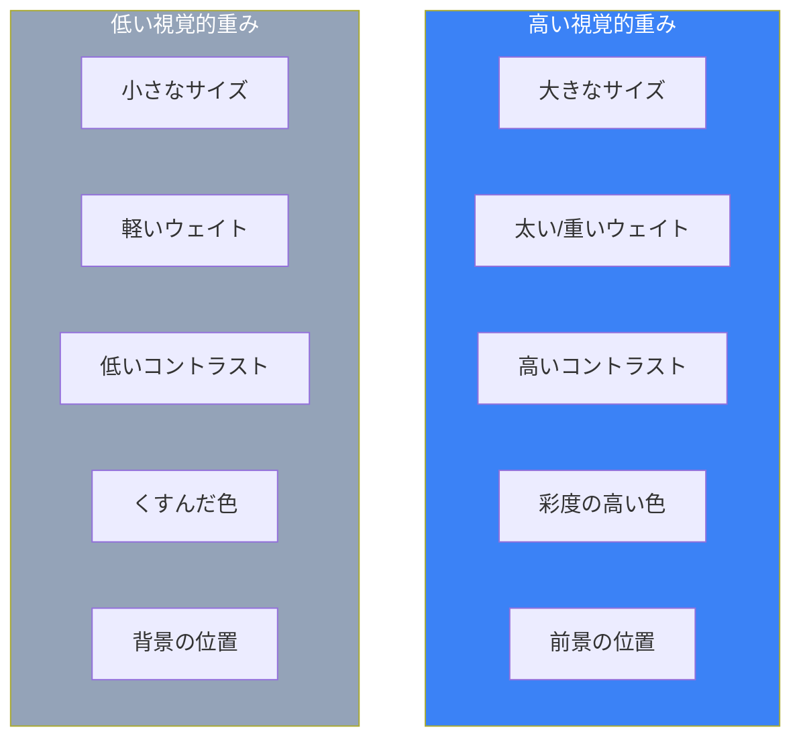
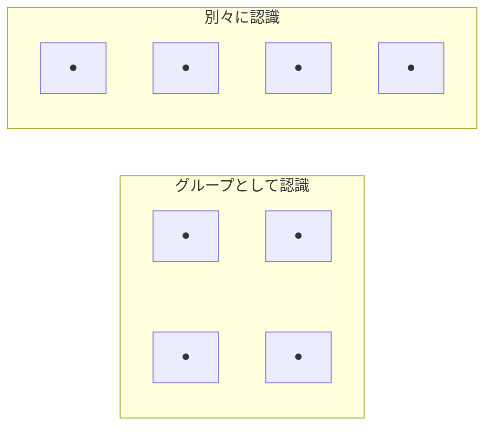
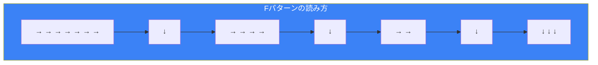
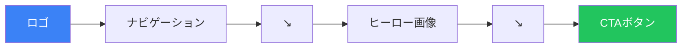

## はじめに

優れたインターフェースは、ユーザーがすべての単語を読んだり、どこを見るべきか考えたりする必要がありません。視覚的階層とゲシュタルト原則を通じて、ユーザーの注意を誘導し、構造を瞬時に伝えることができます。

視覚的階層は、ユーザーが最初に見るもの、次に見るもの、その次に見るものを決定します。ゲシュタルト原則は、人間がどのように視覚要素を自然にグループ化し、解釈するかを説明します。これらが組み合わさって、効果的なレイアウト設計の基盤を形成します。

## 視覚的階層

視覚的階層とは、要素を重要度順に配置することです。ユーザーはレイアウトだけで情報構造を推測できるべきです。

### 何が物事を重要に見せるか？

いくつかの視覚的特性が認識される重要性に寄与します：



### 視覚的重みの要素

| 要素 | 高い重要性 | 低い重要性 |
|-----|----------|----------|
| サイズ | 大きい | 小さい |
| ウェイト | 太い | 細い |
| 色 | 彩度が高い、暖色 | くすんだ、寒色 |
| コントラスト | 背景との差が大きい | 背景との差が小さい |
| 位置 | 上、左、中央 | 下、端 |
| 余白 | 周囲にスペース | 詰まっている |
| 詳細度 | 複雑、詳細 | シンプル、無地 |

### CSSでの階層作成

```css
/* 主見出し - 最も高い視覚的重み */
.heading-primary {
  font-size: 2.5rem;
  font-weight: 800;
  color: #111827;
  line-height: 1.2;
}

/* 副見出し */
.heading-secondary {
  font-size: 1.75rem;
  font-weight: 700;
  color: #1f2937;
  line-height: 1.3;
}

/* 第三レベルの見出し */
.heading-tertiary {
  font-size: 1.25rem;
  font-weight: 600;
  color: #374151;
  line-height: 1.4;
}

/* 本文 - 最も低い階層レベル */
.body-text {
  font-size: 1rem;
  font-weight: 400;
  color: #4b5563;
  line-height: 1.6;
}

/* 控えめなテキスト */
.text-muted {
  font-size: 0.875rem;
  font-weight: 400;
  color: #9ca3af;
}
```

### 実践での階層

```tsx
function ProductCard({ product }) {
  return (
    <article className="p-6 bg-white rounded-lg shadow">
      {/* 主要: 商品名 - 最大、最も太い */}
      <h2 className="text-xl font-bold text-gray-900">
        {product.name}
      </h2>

      {/* 副次: 価格 - 目立つがより小さい */}
      <p className="mt-2 text-lg font-semibold text-blue-600">
        ¥{product.price}
      </p>

      {/* 第三: 説明 - 通常のウェイト */}
      <p className="mt-2 text-gray-600">
        {product.description}
      </p>

      {/* 第四: メタデータ - 最小、控えめ */}
      <p className="mt-4 text-sm text-gray-400">
        SKU: {product.sku} • 在庫 {product.stock}
      </p>

      {/* アクション: 高コントラストのボタン */}
      <button className="mt-4 w-full py-2 bg-blue-600 text-white
                         font-medium rounded hover:bg-blue-700">
        カートに追加
      </button>
    </article>
  );
}
```

## ゲシュタルト原則

ゲシュタルト心理学は、人間がどのようにパターンを認識し、視覚情報を整理するかを説明します。これらの原則はインターフェース設計の基本です。

### 1. 近接（Proximity）

近くにある要素はグループとして認識されます。



**実装：**

```tsx
function FormSection() {
  return (
    <form>
      {/* 配送フィールド - 近接でグループ化 */}
      <div className="space-y-3 mb-8">
        <h3 className="font-semibold">配送先住所</h3>
        <input placeholder="住所" />
        <input placeholder="市区町村" />
        <input placeholder="郵便番号" />
      </div>

      {/* 支払いフィールド - 間隔で別グループ */}
      <div className="space-y-3 mb-8">
        <h3 className="font-semibold">支払い情報</h3>
        <input placeholder="カード番号" />
        <input placeholder="有効期限" />
        <input placeholder="セキュリティコード" />
      </div>
    </form>
  );
}
```

```css
/* 一貫した間隔でグループを示す */
.form-group {
  margin-bottom: 2rem; /* グループ間は大きな間隔 */
}

.form-group > * + * {
  margin-top: 0.75rem; /* グループ内は小さな間隔 */
}
```

### 2. 類似（Similarity）

見た目が似ている要素は関連していると認識されます。

```tsx
function StatusIndicators() {
  return (
    <div className="flex gap-4">
      {/* 同じスタイル = 同じカテゴリ */}
      <span className="px-2 py-1 bg-green-100 text-green-800 rounded">
        アクティブ
      </span>
      <span className="px-2 py-1 bg-green-100 text-green-800 rounded">
        確認済み
      </span>

      {/* 異なるスタイル = 異なるカテゴリ */}
      <span className="px-2 py-1 bg-red-100 text-red-800 rounded">
        期限超過
      </span>
    </div>
  );
}

function NavigationMenu() {
  return (
    <nav>
      {/* メインナビ - 同じスタイル */}
      <div className="flex gap-4 text-gray-900 font-medium">
        <a href="/">ホーム</a>
        <a href="/products">製品</a>
        <a href="/about">会社概要</a>
      </div>

      {/* ユーティリティナビ - 異なるスタイルで異なる目的を示す */}
      <div className="flex gap-4 text-gray-500 text-sm">
        <a href="/help">ヘルプ</a>
        <a href="/contact">お問い合わせ</a>
      </div>
    </nav>
  );
}
```

### 3. 閉合（Closure）

脳は不完全な形を完成させ、全体として認識します。

```tsx
// 完全な境界線がなくてもカードは完全なユニットとして認識される
function Card({ children }) {
  return (
    <div className="bg-white rounded-lg shadow-sm p-4">
      {/* 影と背景が暗黙の境界を作る */}
      {children}
    </div>
  );
}

// 進捗インジケーターは閉合を使用
function ProgressRing({ progress }) {
  const circumference = 2 * Math.PI * 40;
  const offset = circumference - (progress / 100) * circumference;

  return (
    <svg width="100" height="100">
      {/* 背景の円が閉合のコンテキストを提供 */}
      <circle
        cx="50" cy="50" r="40"
        fill="none"
        stroke="#e5e7eb"
        strokeWidth="8"
      />
      {/* 部分的な弧 - 脳が円を完成させる */}
      <circle
        cx="50" cy="50" r="40"
        fill="none"
        stroke="#3b82f6"
        strokeWidth="8"
        strokeDasharray={circumference}
        strokeDashoffset={offset}
        transform="rotate(-90 50 50)"
      />
    </svg>
  );
}
```

### 4. 連続（Continuity）

線やカーブ上に配置された要素は関連していると認識されます。

```tsx
function StepIndicator({ steps, currentStep }) {
  return (
    <div className="flex items-center">
      {steps.map((step, index) => (
        <React.Fragment key={step.id}>
          {/* ステップの円 */}
          <div className={`
            w-8 h-8 rounded-full flex items-center justify-center
            ${index <= currentStep
              ? 'bg-blue-600 text-white'
              : 'bg-gray-200 text-gray-600'
            }
          `}>
            {index + 1}
          </div>

          {/* 連結線が連続性を作る */}
          {index < steps.length - 1 && (
            <div className={`
              h-1 w-16
              ${index < currentStep ? 'bg-blue-600' : 'bg-gray-200'}
            `} />
          )}
        </React.Fragment>
      ))}
    </div>
  );
}

// パンくずリストは連続性を使用
function Breadcrumbs({ items }) {
  return (
    <nav className="flex items-center gap-2 text-sm">
      {items.map((item, index) => (
        <React.Fragment key={item.href}>
          <a href={item.href} className="text-gray-600 hover:text-gray-900">
            {item.label}
          </a>
          {/* 区切り文字が視覚的な連続性を作る */}
          {index < items.length - 1 && (
            <span className="text-gray-400">/</span>
          )}
        </React.Fragment>
      ))}
    </nav>
  );
}
```

### 5. 共通領域（Common Region）

境界内の要素はグループとして認識されます。

```tsx
function FeatureComparison({ plans }) {
  return (
    <div className="grid grid-cols-3 gap-4">
      {plans.map(plan => (
        // 各カードが共通領域を作る
        <div
          key={plan.id}
          className="border rounded-lg p-6 bg-white"
        >
          <h3 className="text-xl font-bold">{plan.name}</h3>
          <p className="text-3xl font-bold mt-2">¥{plan.price}</p>

          {/* 機能用のネストした領域 */}
          <div className="mt-4 p-4 bg-gray-50 rounded">
            <ul className="space-y-2">
              {plan.features.map(feature => (
                <li key={feature}>✓ {feature}</li>
              ))}
            </ul>
          </div>

          <button className="mt-4 w-full btn-primary">
            {plan.name}を選択
          </button>
        </div>
      ))}
    </div>
  );
}
```

### 6. 図と地（Figure-Ground）

ユーザーは前景（図）と背景（地）を区別します。

```tsx
// モーダルは図と地の分離を使用
function Modal({ isOpen, onClose, children }) {
  if (!isOpen) return null;

  return (
    <>
      {/* 地: 暗くした背景 */}
      <div
        className="fixed inset-0 bg-black/50"
        onClick={onClose}
      />

      {/* 図: 浮き上がったモーダル */}
      <div className="fixed inset-0 flex items-center justify-center">
        <div className="bg-white rounded-lg shadow-xl p-6 max-w-md
                        relative z-10">
          {children}
        </div>
      </div>
    </>
  );
}

// ドロップダウンは図と地を使用
function Dropdown({ trigger, items }) {
  const [isOpen, setIsOpen] = useState(false);

  return (
    <div className="relative">
      <button onClick={() => setIsOpen(!isOpen)}>
        {trigger}
      </button>

      {isOpen && (
        <>
          {/* 地: クリックで閉じる領域 */}
          <div
            className="fixed inset-0"
            onClick={() => setIsOpen(false)}
          />

          {/* 図: 浮き上がったドロップダウンメニュー */}
          <div className="absolute top-full mt-2 bg-white rounded-lg
                          shadow-lg border z-10">
            {items.map(item => (
              <button
                key={item.id}
                className="block w-full px-4 py-2 text-left
                           hover:bg-gray-100"
              >
                {item.label}
              </button>
            ))}
          </div>
        </>
      )}
    </div>
  );
}
```

## 視線の流れ

視線の流れとは、ユーザーの目がデザインを通って自然にたどるパスです。

### テキストが多いページのFパターン



```tsx
function ArticlePage({ article }) {
  return (
    <article>
      {/* 上部: 全幅の見出しが水平スキャンをキャッチ */}
      <h1 className="text-3xl font-bold">{article.title}</h1>

      {/* 2回目のスキャン: 最初の段落に重要な情報 */}
      <p className="text-lg text-gray-600 mt-4">
        {article.summary}
      </p>

      {/* コンテンツ: 各セクションの先頭に重要な情報 */}
      {article.sections.map(section => (
        <section key={section.id} className="mt-8">
          <h2 className="text-xl font-semibold">{section.title}</h2>
          <p className="mt-2">{section.content}</p>
        </section>
      ))}
    </article>
  );
}
```

### コンテンツが少ないページのZパターン



```tsx
function LandingPage() {
  return (
    <div className="min-h-screen">
      {/* 上部バーはZの開始に沿う */}
      <header className="flex justify-between items-center p-4">
        <Logo />                    {/* 左上: Zの開始 */}
        <Navigation />              {/* 右上: Zが右に移動 */}
      </header>

      {/* ヒーローはZの対角線に沿う */}
      <main className="flex flex-col items-center py-20">
        <h1 className="text-5xl font-bold text-center">
          ワークフローを変革する
        </h1>

        <p className="mt-4 text-xl text-gray-600 text-center max-w-2xl">
          モダンなチームのためのオールインワンプラットフォーム
        </p>

        {/* CTAはZの終点 - 右下エリア */}
        <button className="mt-8 px-8 py-4 bg-blue-600 text-white
                           text-lg font-semibold rounded-lg">
          無料で始める
        </button>
      </main>
    </div>
  );
}
```

## 段階的開示

まず重要な情報だけを表示し、詳細は必要に応じて利用可能にします。

```tsx
function ProductDetails({ product }) {
  const [showSpecs, setShowSpecs] = useState(false);

  return (
    <div>
      {/* レベル1: 必須情報は常に表示 */}
      <h1>{product.name}</h1>
      <p className="text-2xl font-bold">¥{product.price}</p>
      <p>{product.shortDescription}</p>

      {/* レベル2: 展開可能な詳細 */}
      <button
        onClick={() => setShowSpecs(!showSpecs)}
        className="mt-4 text-blue-600"
      >
        仕様を{showSpecs ? '隠す' : '表示'}
      </button>

      {showSpecs && (
        <table className="mt-4">
          {Object.entries(product.specs).map(([key, value]) => (
            <tr key={key}>
              <td className="font-medium pr-4">{key}</td>
              <td>{value}</td>
            </tr>
          ))}
        </table>
      )}

      {/* レベル3: 完全なドキュメントへのリンク */}
      <a href={`/products/${product.id}/docs`} className="block mt-4">
        完全なドキュメントを見る →
      </a>
    </div>
  );
}
```

## まとめ

| 原則 | 重要な洞察 | 設計への適用 |
|-----|----------|------------|
| 視覚的階層 | サイズ、ウェイト、色が重要性を示す | 主要コンテンツを最大かつ最も太く |
| 近接 | 近い = 関連 | 関連要素をグループ化、無関係なものを分離 |
| 類似 | 同じスタイル = 同じ意味 | 関連要素に一貫したスタイルを使用 |
| 閉合 | 脳が形を完成させる | カード、影で暗黙の境界を使用 |
| 連続 | 線が目を導く | ステップ、パンくずで連結を使用 |
| 共通領域 | 境界がグループ化 | コンテナでコンテンツをグループ化 |
| 図と地 | 前景が目立つ | モーダルコンテンツにオーバーレイ、影を使用 |
| 視線の流れ | 目はパターンに従う | F/Zパターンで重要コンテンツを配置 |

これらの原則は連携して機能します。優れた設計では、近接と共通領域で関連コンテンツをグループ化し、類似で関係を示し、視覚的階層で重要性を示し、視線の流れで意図したパスにユーザーを導きます。

## 参考文献

- Tidwell, Jenifer, et al. "Designing Interfaces" (3rd Edition), Chapters 4-5
- Bradley, Steven. "Design Fundamentals: Elements, Attributes, and Principles"
- Gestalt Principles - Laws of UX
- Nielsen Norman Group - Visual Hierarchy
