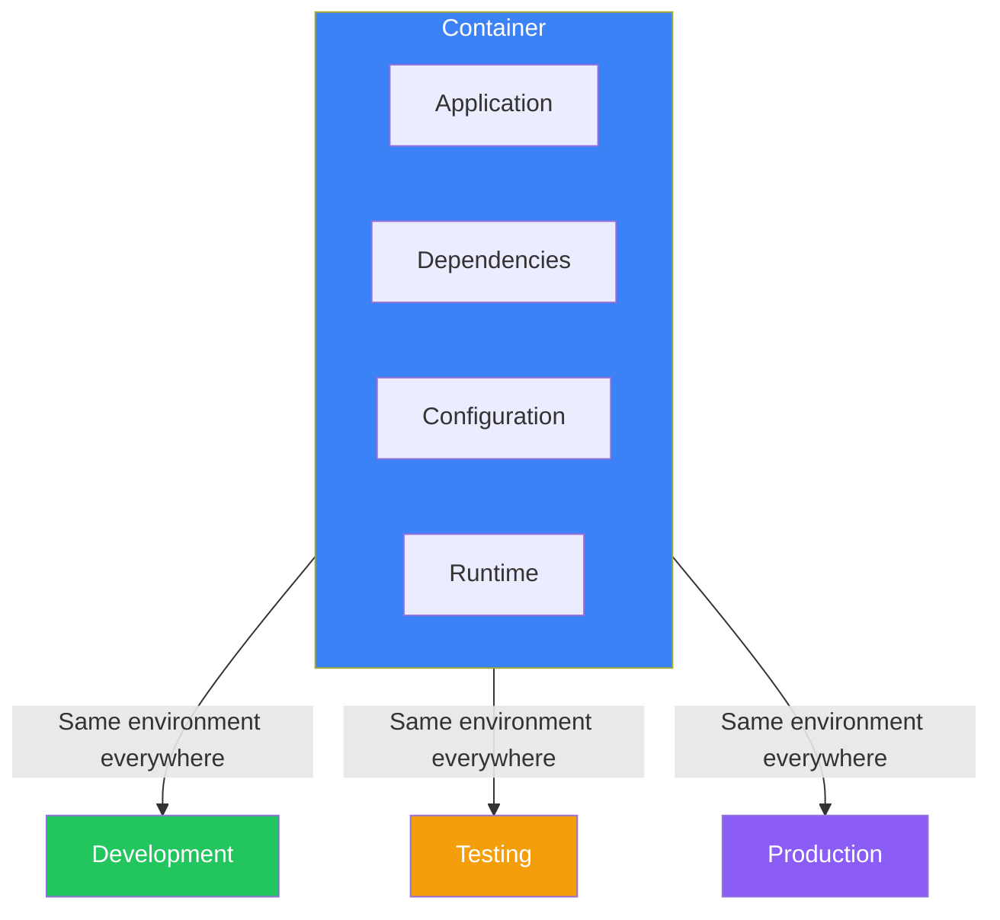
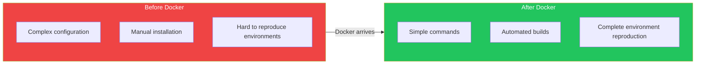
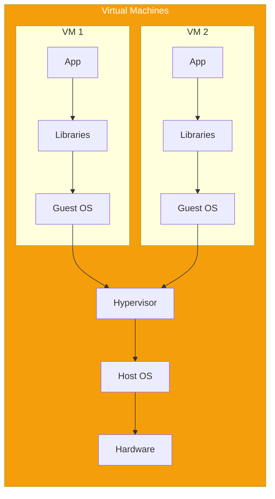
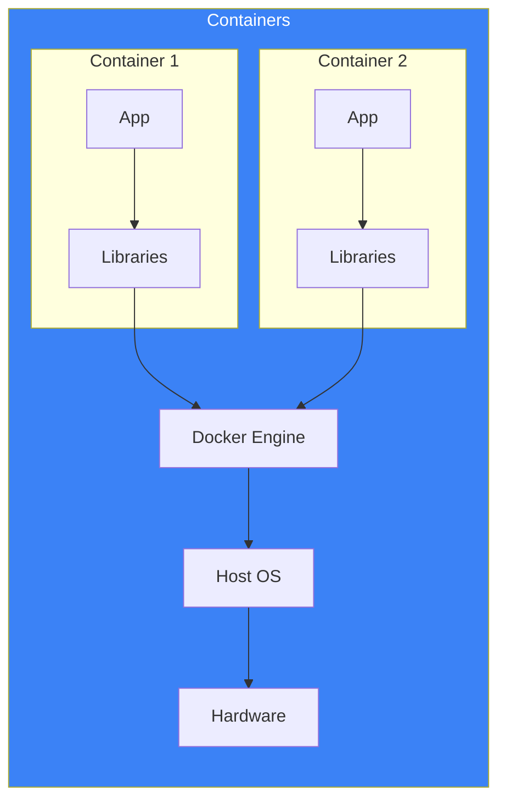
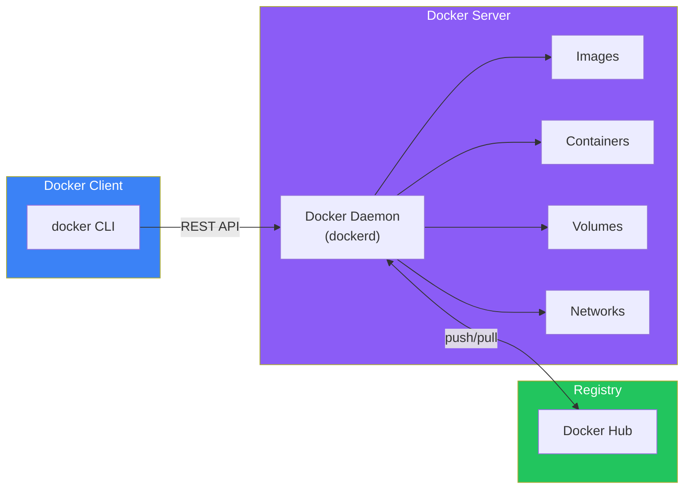

# Day 1: Welcome to Docker

## What You'll Learn Today

- What container technology is and why we need it
- The history and background of Docker
- The differences between Virtual Machines (VMs) and containers
- The benefits Docker brings to development

---

## The Challenge of Application Development

"It worked on my machine..."

If you've been in software development for any length of time, you've probably heard this phrase. Applications that work perfectly in development suddenly break when deployed to test or production environments. This is one of the most common problems in software development.

### Why Does Behavior Change Across Environments?

Applications don't run in isolation. They depend on OS versions, libraries, configuration files, environment variables, and many other factors.

```
Development Env         Production Env
┌──────────────┐       ┌──────────────┐
│ Python 3.11  │       │ Python 3.9   │  ← Version mismatch
│ Ubuntu 22.04 │       │ CentOS 7     │  ← Different OS
│ Library A v2.0│       │ Library A v1.8│  ← Library mismatch
└──────────────┘       └──────────────┘
```

These "environment differences" cause numerous problems:

- **"It doesn't work" issues**: Errors due to dependency differences
- **Hard-to-reproduce bugs**: Problems that only occur in specific environments
- **Deployment fear**: Anxiety about changes to production

---

## The Emergence of Container Technology

Containers were born to solve this "environment difference" problem.

### What is a Container?

A container is a **lightweight executable unit that packages an application with all its dependencies**.



Containers include everything needed for an application to run. This means containers behave exactly the same regardless of where they're executed.

---

## What is Docker?

Docker is a container platform announced in 2013 by Solomon Hykes of DotCloud (later Docker, Inc.).

### Why Did Docker Revolutionize Computing?

Container technology existed before Docker (LXC, FreeBSD Jail, etc.). However, Docker was revolutionary for the following reasons:

1. **Ease of use**: Simple commands to operate containers
2. **Image sharing**: Easy sharing via Docker Hub
3. **Dockerfile**: Build images from text files
4. **Ecosystem**: Rich tools and community support



---

## Virtual Machines vs Containers

Traditionally, virtual machines (VMs) were used for environment isolation. How do containers differ from VMs?

### Virtual Machines (VMs)

VMs use a **hypervisor** to virtualize physical hardware. Each VM contains a complete OS.



### Containers

Containers share the host OS kernel and are isolated at the **process level**.



### Comparison Table

| Feature | Virtual Machine | Container |
|---------|-----------------|-----------|
| Startup time | Minutes | Seconds |
| Size | Several GB to tens of GB | Tens to hundreds of MB |
| Resource efficiency | Low (OS needed for each VM) | High (shared kernel) |
| Isolation level | Strong (complete OS isolation) | Medium (process isolation) |
| Portability | Limited | Very high |

---

## Docker Architecture

Docker uses a client-server architecture.



### Main Components

1. **Docker Client**: CLI for users to interact with Docker
2. **Docker Daemon**: Background service that manages containers
3. **Docker Images**: Blueprints for containers
4. **Docker Containers**: Running instances created from images
5. **Docker Registry**: Storage for sharing images

---

## Key Benefits of Docker

### 1. Environment Consistency

Use the same containers in development, testing, and production. The "it worked on my machine" problem is eliminated.

### 2. Fast Startup

While VMs take minutes, containers start in seconds. Development cycles are significantly shortened.

### 3. Efficient Resource Usage

Multiple containers share the OS kernel, allowing more applications to run with fewer resources than VMs.

### 4. Easy Scaling

Containers are lightweight, making it easy to scale up or down as needed.

### 5. Version Control

Images can be tagged for version control. If problems occur, you can easily roll back to previous versions.

### 6. Microservices Compatibility

Each service can run as an independent container, making Docker ideal for microservices architecture.

---

## Docker Terminology

Let's organize the important terms you'll need as you learn Docker.

| Term | Description |
|------|-------------|
| **Image** | Read-only template for creating containers |
| **Container** | Executable instance created from an image |
| **Dockerfile** | Text file containing instructions to build an image |
| **Registry** | Place to store and distribute images (Docker Hub, etc.) |
| **Layer** | Individual layers that make up an image |
| **Volume** | Mechanism for persisting container data |

---

## Summary

| Concept | Description |
|---------|-------------|
| Container | Lightweight execution unit packaging app and dependencies |
| Docker | Platform for easily creating and managing containers |
| VM vs Container | Containers share kernel, making them lightweight and fast |
| Image | Blueprint for containers (read-only) |
| Docker Hub | Registry for sharing images |

### Key Points

1. Containers solve the "environment difference" problem
2. Docker popularized container technology through ease of use
3. Containers are lighter and faster than VMs
4. Docker uses a client-server architecture
5. Containers are created from images

---

## Practice Problems

### Problem 1: Basic Concepts
What is the biggest difference between containers and virtual machines? Explain in your own words.

### Problem 2: Understanding Terminology
Fill in the blanks:
- A Docker "___" is a read-only template for creating containers
- A "___" is a place to store and distribute images
- A "___" is a file containing instructions to build an image

### Challenge Problem
Imagine you have a web application in development. List three problems that might occur when deploying from development to production, and explain how Docker could solve each one.

---

## References

- [Docker Official Documentation](https://docs.docker.com/)
- [Docker Hub](https://hub.docker.com/)
- [What is a Container? - Docker](https://www.docker.com/resources/what-container/)
- [Containers vs Virtual Machines - Microsoft](https://learn.microsoft.com/en-us/virtualization/windowscontainers/about/containers-vs-vm)

---

**Next Up**: In Day 2, we'll learn about "Setting Up Your Docker Environment." We'll actually install Docker and get ready to start using it.
