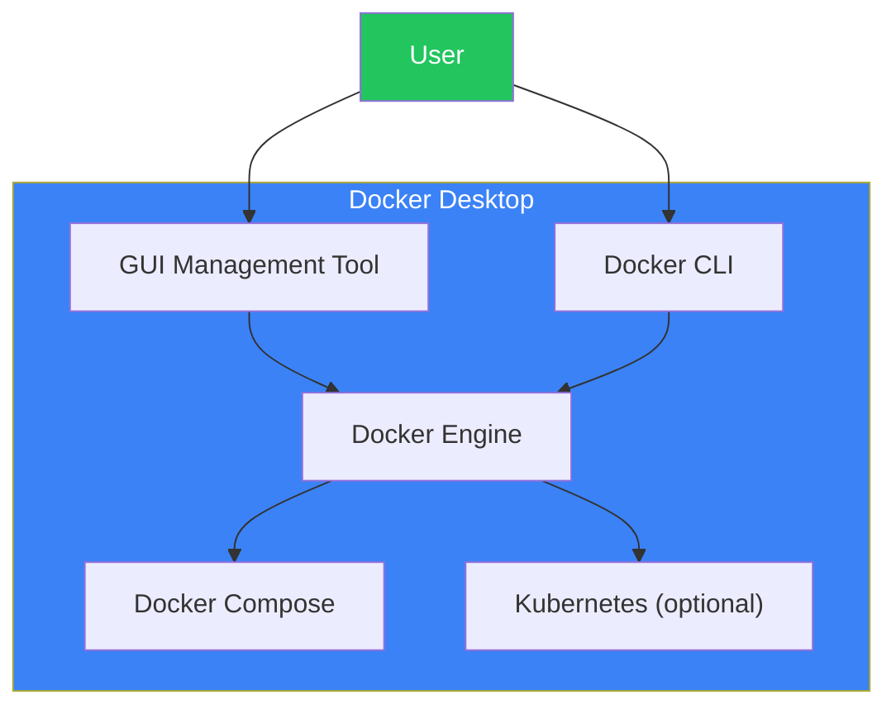
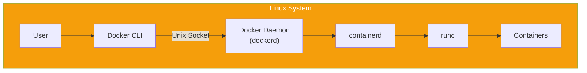
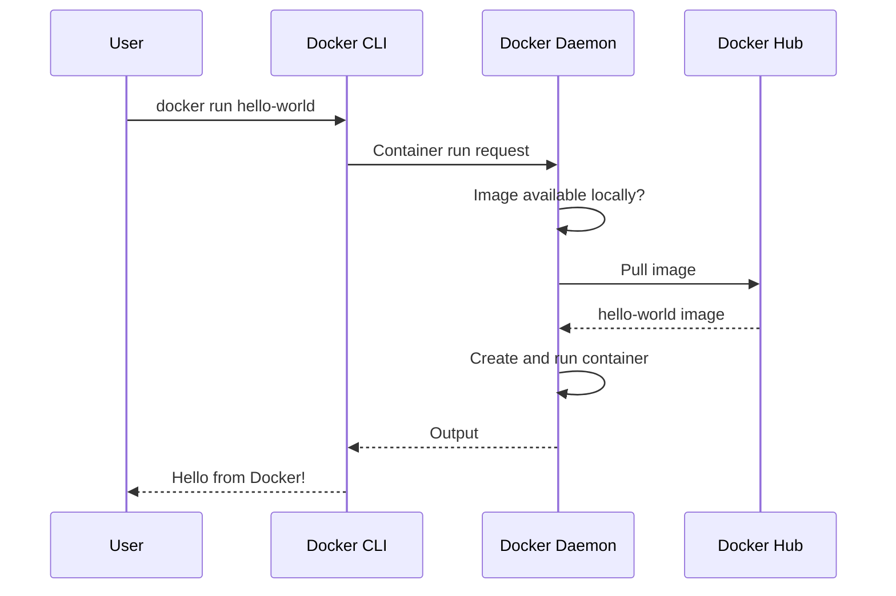

# Day 2: Setting Up Your Docker Environment

## What You'll Learn Today

- Installing Docker Desktop (Windows/Mac)
- Installing Docker on Linux
- Creating a Docker Hub account
- Verifying the installation

---

## What is Docker Desktop?

Docker Desktop is the easiest way to use Docker on Windows/macOS. It includes both a GUI management tool and the CLI.



### What's Included in Docker Desktop

| Component | Description |
|-----------|-------------|
| Docker Engine | Core engine that runs containers |
| Docker CLI | Command-line interface |
| Docker Compose | Tool for managing multiple containers |
| Docker Build | Tool for building images |
| GUI | Graphical management interface |
| Kubernetes | Can be enabled optionally |

---

## Installing on Windows

### System Requirements

- Windows 10 64-bit: Home, Pro, Enterprise, Education (Build 19041 or later)
- Windows 11 64-bit: Home, Pro, Enterprise, Education
- WSL 2 feature enabled
- Virtualization enabled in BIOS

### Installation Steps

#### 1. Enable WSL 2

Open PowerShell as Administrator and run:

```powershell
# Install WSL
wsl --install

# After restart, set WSL 2 as default
wsl --set-default-version 2
```

#### 2. Download Docker Desktop

Download the installer from the [Docker official website](https://www.docker.com/products/docker-desktop/).

#### 3. Run the Installer

1. Run the downloaded `Docker Desktop Installer.exe`
2. Check "Use WSL 2 instead of Hyper-V"
3. Complete installation and restart

#### 4. First Launch

- Launch Docker Desktop
- Accept the service agreement
- Apply recommended settings


---

## Installing on macOS

### System Requirements

- macOS 12 (Monterey) or later
- Apple Silicon (M1/M2/M3) or Intel chip
- 4GB RAM minimum

### Installation Steps

#### 1. Download Docker Desktop

Download the appropriate installer for your Mac from the [Docker official website](https://www.docker.com/products/docker-desktop/):

- **Apple Silicon (M1/M2/M3)**: For Apple chip
- **Intel**: For Intel chip

#### 2. Install

1. Open the downloaded `.dmg` file
2. Drag the Docker icon to the Applications folder
3. Launch Docker from Applications

#### 3. First Launch

- Select "Open" when prompted for security confirmation
- Enter your password when prompted for privileged access
- Accept the service agreement

---

## Installing on Linux

On Linux, you install Docker Engine directly. Here we'll show the procedure for Ubuntu.

### Installation on Ubuntu

#### 1. Remove Old Versions

```bash
# Remove old versions if present
sudo apt-get remove docker docker-engine docker.io containerd runc
```

#### 2. Set Up the Repository

```bash
# Install required packages
sudo apt-get update
sudo apt-get install ca-certificates curl gnupg

# Add Docker's official GPG key
sudo install -m 0755 -d /etc/apt/keyrings
curl -fsSL https://download.docker.com/linux/ubuntu/gpg | sudo gpg --dearmor -o /etc/apt/keyrings/docker.gpg
sudo chmod a+r /etc/apt/keyrings/docker.gpg

# Add the repository
echo \
  "deb [arch=$(dpkg --print-architecture) signed-by=/etc/apt/keyrings/docker.gpg] https://download.docker.com/linux/ubuntu \
  $(. /etc/os-release && echo "$VERSION_CODENAME") stable" | \
  sudo tee /etc/apt/sources.list.d/docker.list > /dev/null
```

#### 3. Install Docker Engine

```bash
# Update package index
sudo apt-get update

# Install Docker Engine
sudo apt-get install docker-ce docker-ce-cli containerd.io docker-buildx-plugin docker-compose-plugin
```

#### 4. Configure Non-Root User Access

```bash
# Add user to docker group
sudo usermod -aG docker $USER

# Apply changes (logout/login or run the following)
newgrp docker
```

### Post-Installation Structure



---

## Creating a Docker Hub Account

Docker Hub is the official registry for storing and sharing images. Creating an account allows you to push your own images and use private repositories.

### Account Creation Steps

1. Visit [Docker Hub](https://hub.docker.com/)
2. Click "Sign Up"
3. Enter required information:
   - Username (Docker ID)
   - Email address
   - Password
4. Complete email verification

### Logging in via Docker CLI

```bash
# Log in to Docker Hub
docker login

# Enter username and password
# Or use an access token (recommended)
```

---

## Verifying the Installation

### Basic Verification

```bash
# Check Docker version
docker --version
```

Expected output:
```
Docker version 27.x.x, build xxxxxxx
```

### Detailed Information

```bash
# Display detailed Docker information
docker info
```

This output includes:
- Number of running containers
- Number of images
- Storage driver
- OS/Architecture

### Running Your First Container

```bash
# Run the Hello World container
docker run hello-world
```

On success, you'll see a message like this:

```
Hello from Docker!
This message shows that your installation appears to be working correctly.

To generate this message, Docker took the following steps:
 1. The Docker client contacted the Docker daemon.
 2. The Docker daemon pulled the "hello-world" image from the Docker Hub.
 3. The Docker daemon created a new container from that image which runs the
    executable that produces the output you are currently reading.
 4. The Docker daemon streamed that output to the Docker client, which sent it
    to your terminal.
...
```

### What Happened?



---

## Docker Desktop Features

### Dashboard

When you launch Docker Desktop, the dashboard is displayed.

| Tab | Description |
|-----|-------------|
| Containers | Manage running and stopped containers |
| Images | Manage local images |
| Volumes | Manage volumes |
| Dev Environments | Manage development environments |
| Extensions | Manage extensions |

### Settings

Important settings:

| Setting | Description |
|---------|-------------|
| Resources > Memory | Amount of memory allocated to Docker |
| Resources > CPUs | Number of CPUs allocated to Docker |
| Docker Engine | daemon.json configuration |
| Kubernetes | Enable Kubernetes |

---

## Troubleshooting

### Common Problems and Solutions

#### 1. Docker Daemon Won't Start

**Windows:**
```powershell
# Restart WSL 2
wsl --shutdown
# Restart Docker Desktop
```

**Linux:**
```bash
# Check Docker service status
sudo systemctl status docker

# Restart Docker
sudo systemctl restart docker
```

#### 2. Permission Denied Error (Linux)

```bash
# Check if added to docker group
groups $USER

# If not added
sudo usermod -aG docker $USER

# Log out and log back in
```

#### 3. Disk Space Issues

```bash
# Remove unused resources
docker system prune -a
```

---

## Summary

| Item | Description |
|------|-------------|
| Docker Desktop | All-in-one package for Windows/macOS |
| Docker Engine | Core engine for Linux |
| Docker Hub | Official image registry |
| docker run | Basic command to run containers |
| docker info | Display system information |

### Key Points

1. Docker Desktop is the easiest option for Windows/macOS
2. Linux installs Docker Engine directly
3. Add users to the docker group to avoid sudo
4. Verify with `docker run hello-world`
5. Docker Hub account enables image sharing

---

## Practice Problems

### Problem 1: Verification Commands
Write the command to check Docker version and the command to display detailed information.

### Problem 2: Understanding Installation
Explain why WSL 2 is needed when using Docker Desktop on Windows.

### Challenge Problem
After running `docker run hello-world`, run the following commands and examine the results:

```bash
# List local images
docker images

# Show all containers (including stopped ones)
docker ps -a
```

Check the hello-world image size and the container status.

---

## References

- [Install Docker Desktop on Windows](https://docs.docker.com/desktop/setup/install/windows-install/)
- [Install Docker Desktop on Mac](https://docs.docker.com/desktop/setup/install/mac-install/)
- [Install Docker Engine on Ubuntu](https://docs.docker.com/engine/install/ubuntu/)
- [Docker Hub](https://hub.docker.com/)

---

**Next Up**: In Day 3, we'll learn about "Running Your First Container." You'll master the container lifecycle and basic operation commands.
