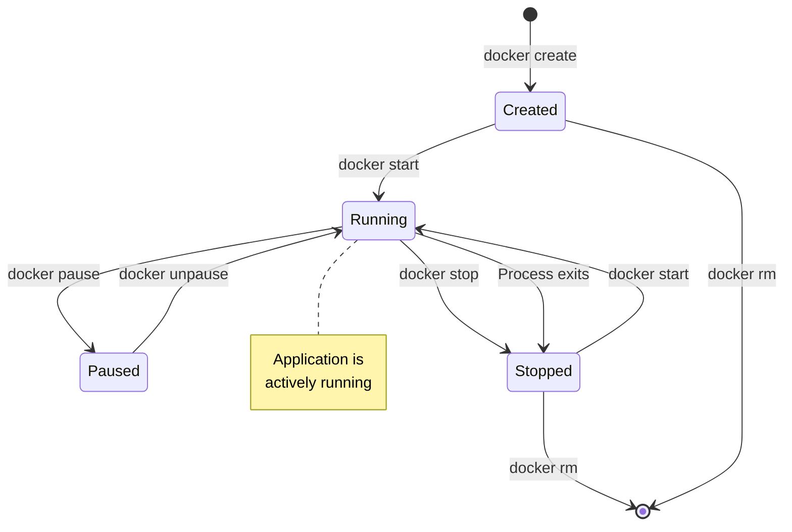
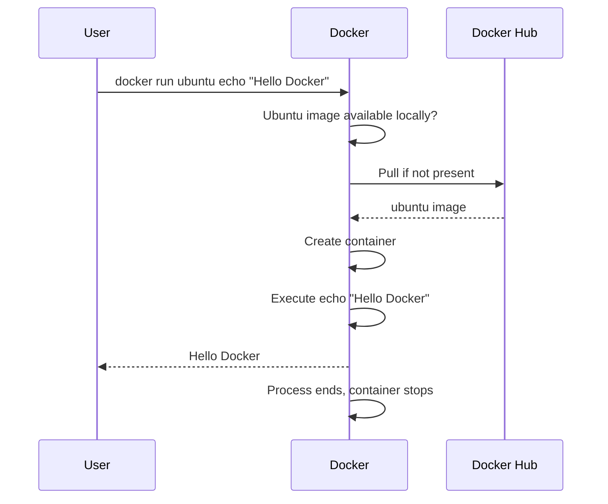
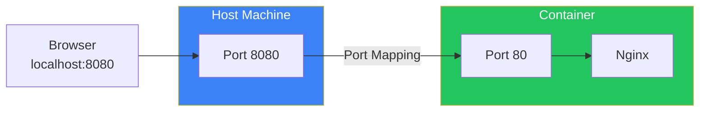
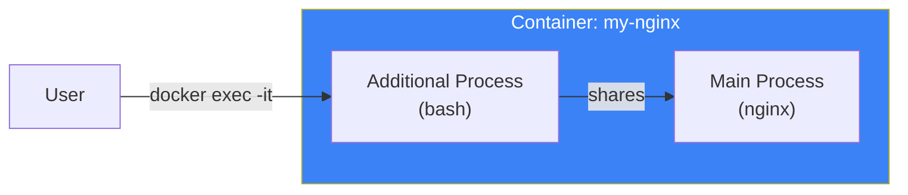
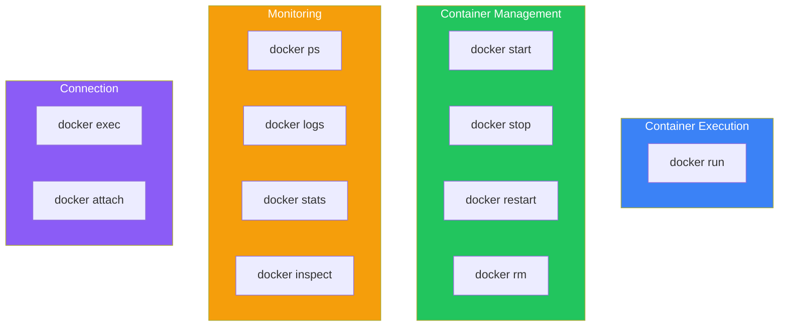

# Day 3: Running Your First Container

## What You'll Learn Today

- The container lifecycle
- The docker run command in detail
- Basic container operations (start, stop, rm)
- Connecting to containers and viewing logs

---

## The Container Lifecycle

Containers have a lifecycle from creation to deletion.



### Container States

| State | Description |
|-------|-------------|
| Created | Container created but not yet started |
| Running | Container is running |
| Paused | Container is temporarily paused |
| Stopped | Container has stopped |
| Deleted | Container has been removed |

---

## The docker run Command

`docker run` is the most frequently used command. It creates a container from an image and runs it.

### Basic Syntax

```bash
docker run [options] image-name [command]
```

### Simple Execution

```bash
# Run an Ubuntu container and execute echo
docker run ubuntu echo "Hello Docker"
```

Output:
```
Hello Docker
```

What happened with this command:



---

## Important Options

### -it: Interactive Mode

Use this when you want to interact within the container.

```bash
# Connect to Ubuntu container and operate bash
docker run -it ubuntu bash
```

| Option | Meaning |
|--------|---------|
| `-i` | Keep stdin open (interactive) |
| `-t` | Allocate a pseudo-TTY (terminal) |

A shell inside the container starts:

```bash
root@abc123def456:/# ls
bin  boot  dev  etc  home  lib  ...

root@abc123def456:/# cat /etc/os-release
PRETTY_NAME="Ubuntu 24.04 LTS"
...

root@abc123def456:/# exit
```

### -d: Background Execution

Run the container in the background.

```bash
# Run Nginx in background
docker run -d nginx
```

Output (container ID):
```
d8e7f6a5b4c3d2e1f0a9b8c7d6e5f4a3b2c1d0e9
```

### --name: Name the Container

```bash
# Run container with name my-nginx
docker run -d --name my-nginx nginx
```

### -p: Port Mapping

Map a host port to a container port.

```bash
# Map host port 8080 to container port 80
docker run -d -p 8080:80 nginx
```



Access `http://localhost:8080` in your browser to see the Nginx welcome page.

### --rm: Auto-remove on Exit

Container is automatically removed when it stops.

```bash
# Container is automatically deleted after running
docker run --rm ubuntu echo "Temporary container"
```

---

## Listing Containers

### Show Running Containers

```bash
docker ps
```

Example output:
```
CONTAINER ID   IMAGE   COMMAND                  STATUS          PORTS                  NAMES
d8e7f6a5b4c3   nginx   "/docker-entrypoint.…"   Up 5 minutes    0.0.0.0:8080->80/tcp   my-nginx
```

### Show All Containers (Including Stopped)

```bash
docker ps -a
```

### Understanding the Output Columns

| Column | Description |
|--------|-------------|
| CONTAINER ID | Unique identifier for the container |
| IMAGE | Image the container was created from |
| COMMAND | Command running in the container |
| CREATED | When the container was created |
| STATUS | Container state |
| PORTS | Port mappings |
| NAMES | Container name |

---

## Container Operations

### Stop a Container

```bash
# Stop by container name or ID
docker stop my-nginx

# Stop multiple containers at once
docker stop container1 container2
```

### Start a Container

```bash
# Start a stopped container
docker start my-nginx
```

### Restart a Container

```bash
docker restart my-nginx
```

### Remove a Container

```bash
# Remove a stopped container
docker rm my-nginx

# Force remove a running container
docker rm -f my-nginx
```

### Remove All Stopped Containers

```bash
docker container prune
```

---

## Connecting to Running Containers

### docker exec

Execute additional commands in a running container.

```bash
# Execute a command inside the container
docker exec my-nginx ls /etc/nginx

# Start a shell inside the container
docker exec -it my-nginx bash
```



### docker attach

Attach to the container's main process.

```bash
docker attach my-container
```

**Note**: Using `attach` connects directly to the container's main process. Pressing Ctrl+C may stop the container itself.

---

## Viewing Logs

### docker logs

View the container's stdout/stderr output.

```bash
# Show logs
docker logs my-nginx

# Show last 10 lines
docker logs --tail 10 my-nginx

# Follow logs in real-time
docker logs -f my-nginx

# Show with timestamps
docker logs -t my-nginx
```

### Commonly Used Options

| Option | Description |
|--------|-------------|
| `-f, --follow` | Follow logs in real-time |
| `--tail N` | Show last N lines |
| `-t, --timestamps` | Show timestamps |
| `--since` | Show logs since specified time |

---

## Container Details

### docker inspect

Get detailed JSON information about a container.

```bash
docker inspect my-nginx
```

### Get Specific Information

```bash
# Get IP address
docker inspect -f '{{range .NetworkSettings.Networks}}{{.IPAddress}}{{end}}' my-nginx

# Get mounted volumes
docker inspect -f '{{json .Mounts}}' my-nginx
```

### docker stats

Display container resource usage in real-time.

```bash
# All containers' resource usage
docker stats

# Specific container's resource usage
docker stats my-nginx
```

Example output:
```
CONTAINER ID   NAME       CPU %     MEM USAGE / LIMIT     MEM %     NET I/O
d8e7f6a5b4c3   my-nginx   0.00%     7.5MiB / 7.765GiB     0.09%     1.45kB / 0B
```

---

## Hands-On: Running a Web Server

Let's build a simple web server using Nginx.

### Step 1: Start Nginx Container

```bash
docker run -d --name web-server -p 8080:80 nginx
```

### Step 2: Verify It's Working

Access `http://localhost:8080` in your browser, or:

```bash
curl http://localhost:8080
```

### Step 3: Check Logs

```bash
docker logs web-server
```

### Step 4: Explore Inside the Container

```bash
docker exec -it web-server bash

# Check Nginx configuration
cat /etc/nginx/nginx.conf

# Check HTML file
cat /usr/share/nginx/html/index.html

exit
```

### Step 5: Cleanup

```bash
docker stop web-server
docker rm web-server
```

---

## Command Cheat Sheet



---

## Summary

| Command | Description |
|---------|-------------|
| `docker run` | Create and run a container from an image |
| `docker ps` | List containers |
| `docker stop` | Stop a container |
| `docker start` | Start a container |
| `docker rm` | Remove a container |
| `docker logs` | Show container logs |
| `docker exec` | Execute command in running container |

### Key Points

1. `-it` for interactive mode, `-d` for background execution
2. `-p` maps host and container ports
3. `--name` makes containers easier to manage
4. `docker exec -it` to shell into running containers
5. `docker logs -f` to follow logs in real-time

---

## Practice Problems

### Problem 1: Basic Operations
Execute the following operations in order:
1. Start Nginx container named `my-web` in background (port 8080)
2. Verify the container is running
3. Display logs
4. Stop and remove the container

### Problem 2: Understanding Commands
Explain what each option means in `docker run -d -p 3000:80 --name app nginx`.

### Challenge Problem
Start an Ubuntu container and launch a simple Python HTTP server inside it.

```bash
# Hint
docker run -it -p 8000:8000 ubuntu bash

# Inside the container
apt update && apt install -y python3
cd /tmp
echo "Hello from Docker" > index.html
python3 -m http.server 8000
```

In another terminal, run `curl http://localhost:8000` to verify.

---

## References

- [docker run reference](https://docs.docker.com/reference/cli/docker/container/run/)
- [docker exec reference](https://docs.docker.com/reference/cli/docker/container/exec/)
- [docker logs reference](https://docs.docker.com/reference/cli/docker/container/logs/)

---

**Next Up**: In Day 4, we'll learn about "Understanding Docker Images." We'll dive deep into how images work, their layer structure, and how to pull them.
