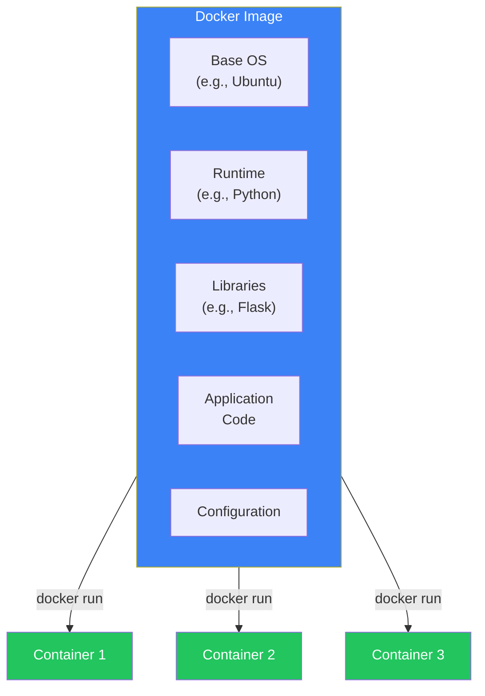
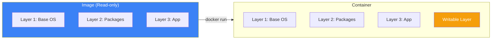
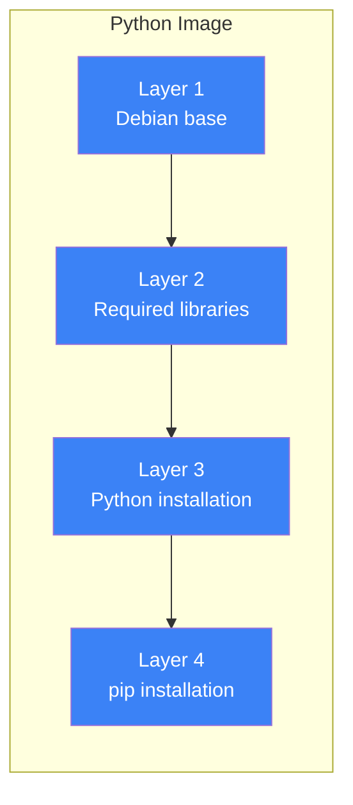
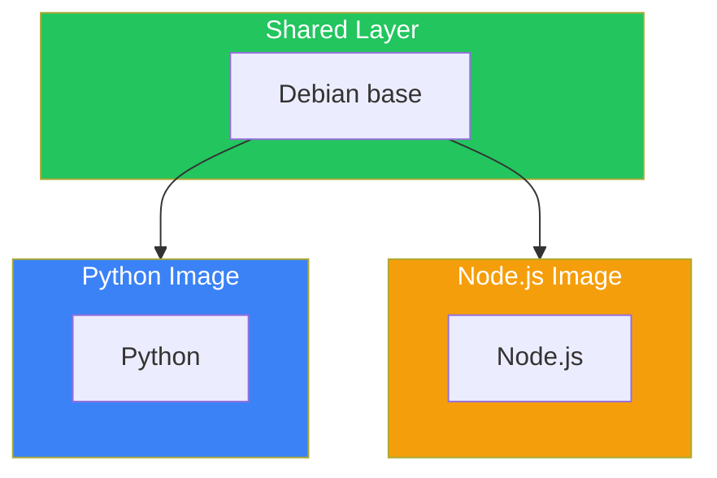
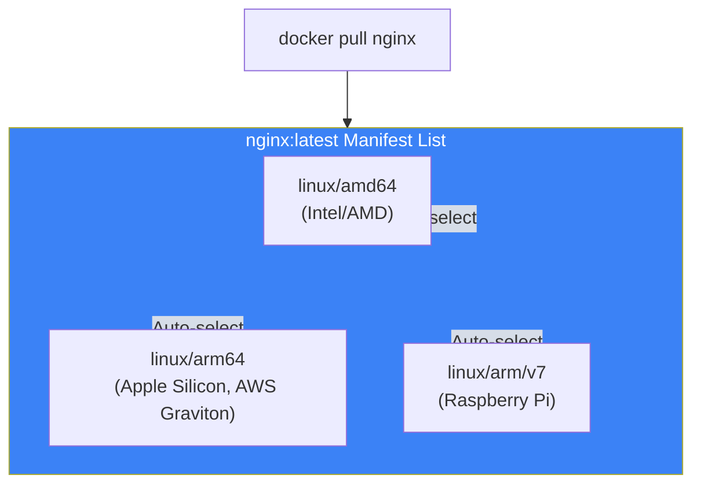

# Day 4: Understanding Docker Images

## What You'll Learn Today

- What Docker images are
- The layer structure of images
- Image naming and tags
- Pulling images from Docker Hub
- Image management commands

---

## What is a Docker Image?

A Docker image is a **read-only template for creating containers**. It contains everything needed to run an application.



### What's Included in an Image

| Element | Description |
|---------|-------------|
| Base OS | Minimal OS environment (Ubuntu, Alpine, etc.) |
| Runtime | Language execution environment (Python, Node.js, etc.) |
| Libraries | Packages needed by the app |
| Application | The actual code |
| Configuration | Environment variables, config files |

---

## The Relationship Between Images and Containers

Images and containers are similar to the relationship between a class (blueprint) and an instance (object).



- **Image**: Read-only, can be shared by multiple containers
- **Container**: Adds a writable layer on top of the image

---

## Image Naming Conventions

### Full Image Name Structure

```
[registry/][username/]image-name[:tag]
```

| Part | Description | Example |
|------|-------------|---------|
| Registry | Where the image is stored | docker.io, ghcr.io |
| Username | Image owner | nginx, myuser |
| Image name | Name of the image | nginx, python |
| Tag | Version or variant | latest, 3.11, alpine |

### Examples

```bash
# Official image (no username)
nginx
nginx:latest
nginx:1.25

# User's image
myuser/myapp:v1.0

# Different registry
ghcr.io/owner/image:tag
```

### About Tags

Tags identify versions or variants of an image.

```bash
# Same image name, different versions via tags
python:3.11
python:3.10
python:3.11-slim    # Lightweight version
python:3.11-alpine  # Alpine Linux based
```

**Important**: The `latest` tag doesn't always mean "most recent." In production, specify explicit versions.

---

## Image Layer Structure

Docker images consist of multiple **layers**. This enables efficient storage and fast builds.



### Layer Characteristics

1. **Read-only**: Each layer is immutable
2. **Shareable**: Same layers are shared across multiple images
3. **Cached**: Unchanged layers are reused during builds

### Layer Sharing Example



The same base layer is downloaded only once and shared on disk.

---

## Pulling Images: docker pull

Pull images from Docker Hub or other registries.

### Basic Usage

```bash
# Pull latest version
docker pull nginx

# Specify a tag
docker pull nginx:1.25

# Pull from a specific registry
docker pull ghcr.io/owner/image:tag
```

### Understanding Pull Output

```bash
$ docker pull nginx:1.25
1.25: Pulling from library/nginx
a2abf6c4d29d: Pull complete
a9edb18cadd1: Pull complete
589b7251471a: Pull complete
186b1aaa4aa6: Pull complete
b4df32aa5a72: Pull complete
a0bcbecc962e: Pull complete
Digest: sha256:0d17b565c37bcbd895e9d92315a05c1c3c9a29f762b011a10c54a66cd53c9b31
Status: Downloaded newer image for nginx:1.25
docker.io/library/nginx:1.25
```

| Item | Description |
|------|-------------|
| `a2abf6c4d29d: Pull complete` | Download status for each layer |
| `Digest` | Unique identifier for the image (SHA256) |
| `Status` | Download result |

---

## Listing Images: docker images

List images available locally.

```bash
$ docker images
REPOSITORY   TAG       IMAGE ID       CREATED       SIZE
nginx        1.25      a6bd71f48f68   2 weeks ago   187MB
nginx        latest    a6bd71f48f68   2 weeks ago   187MB
python       3.11      22140f8f7b81   3 weeks ago   1.01GB
ubuntu       22.04     3b418d7b466a   4 weeks ago   77.8MB
```

### Understanding the Output Columns

| Column | Description |
|--------|-------------|
| REPOSITORY | Image name |
| TAG | Tag |
| IMAGE ID | Unique image identifier |
| CREATED | When the image was created |
| SIZE | Image size |

### Filtering

```bash
# Show only specific images
docker images nginx

# Show dangling images (no tag)
docker images -f dangling=true
```

---

## Image Details: docker inspect

Get detailed image information in JSON format.

```bash
docker inspect nginx:1.25
```

### Useful Examples

```bash
# Check image layers
docker inspect nginx:1.25 | grep -A 100 "Layers"

# Check environment variables
docker inspect -f '{{json .Config.Env}}' nginx:1.25 | jq

# Check CMD (default command)
docker inspect -f '{{json .Config.Cmd}}' nginx:1.25
```

---

## Image History: docker history

See how an image was built.

```bash
$ docker history nginx:1.25
IMAGE          CREATED       CREATED BY                                      SIZE
a6bd71f48f68   2 weeks ago   CMD ["nginx" "-g" "daemon off;"]                0B
<missing>      2 weeks ago   STOPSIGNAL SIGQUIT                              0B
<missing>      2 weeks ago   EXPOSE map[80/tcp:{}]                           0B
<missing>      2 weeks ago   ENTRYPOINT ["/docker-entrypoint.sh"]            0B
<missing>      2 weeks ago   COPY 30-tune-worker-processes.sh ... 4.62kB     4.62kB
...
```

Each line corresponds to a Dockerfile instruction.

---

## Removing Images: docker rmi

```bash
# Remove an image
docker rmi nginx:1.25

# Remove by image ID
docker rmi a6bd71f48f68

# Force removal
docker rmi -f nginx:1.25
```

### Bulk Remove Unused Images

```bash
# Remove dangling images
docker image prune

# Remove all unused images
docker image prune -a
```

---

## Exploring Docker Hub

[Docker Hub](https://hub.docker.com/) is Docker's official image registry.

### Official Images

Highly reliable images managed and verified by Docker.

```bash
# Official image examples
docker pull nginx
docker pull python
docker pull postgres
docker pull redis
```

### Searching for Images

```bash
# Search via CLI
docker search python

# Example results
NAME                  DESCRIPTION                                     STARS
python                Python is an interpreted, interactive...        9280
pypy                  PyPy is a fast, compliant alternative...        365
```

### Tips for Choosing Good Images

| Point | Description |
|-------|-------------|
| Official Image | Has "Official Image" badge |
| Star count | Used by many people |
| Last updated | Recently updated |
| Documentation | Has comprehensive README |

---

## Multi-Architecture Images

Modern images support multiple CPU architectures.



`docker pull` automatically selects the appropriate architecture for your environment.

---

## Understanding Image Size

### Why Size Matters

- **Download time**: Larger images take longer to pull
- **Storage**: Consumes disk space
- **Security**: Larger images have more attack surface

### Size Comparison

```bash
# Same language, big difference
python:3.11        # ~1GB
python:3.11-slim   # ~150MB
python:3.11-alpine # ~50MB
```

### Alpine-Based Images

Alpine Linux-based images are very lightweight.

```bash
# Comparison
ubuntu:22.04  # ~78MB
alpine:3.19   # ~7MB
```

**Note**: Alpine is lightweight but uses musl instead of glibc, which may cause compatibility issues with some applications.

---

## Hands-On: Trying Various Images

### Step 1: Compare Different Python Images

```bash
# Pull three variants
docker pull python:3.11
docker pull python:3.11-slim
docker pull python:3.11-alpine

# Compare sizes
docker images python
```

### Step 2: Explore Inside the Images

```bash
# Start a shell in each image to explore
docker run -it python:3.11 bash
docker run -it python:3.11-slim bash
docker run -it python:3.11-alpine sh  # Alpine doesn't have bash
```

### Step 3: Compare Layer Differences

```bash
docker history python:3.11
docker history python:3.11-alpine
```

---

## Summary

| Command | Description |
|---------|-------------|
| `docker pull` | Pull image from registry |
| `docker images` | List local images |
| `docker inspect` | Show image details |
| `docker history` | Show image build history |
| `docker rmi` | Remove an image |
| `docker image prune` | Remove unused images |

### Key Points

1. Images are read-only and serve as blueprints for containers
2. Images are composed of layers that are efficiently shared
3. Use tags for versioning; prefer explicit tags over `latest`
4. Official images are highly reliable
5. Alpine-based images are lightweight but watch for compatibility

---

## Practice Problems

### Problem 1: Pulling Images
Pull the following images and compare their sizes:
- `node:20`
- `node:20-slim`
- `node:20-alpine`

### Problem 2: Image Investigation
Pull the `redis:latest` image and find out:
- Image size
- Number of layers (using `docker history`)
- Default command (using `docker inspect`)

### Challenge Problem
Search Docker Hub for the official PostgreSQL image and research the available tag types (regular, Alpine, etc.). Consider what use cases each tag is suited for.

---

## References

- [Docker Hub](https://hub.docker.com/)
- [Docker Images Overview](https://docs.docker.com/get-started/docker-concepts/the-basics/what-is-an-image/)
- [Dockerfile Best Practices](https://docs.docker.com/develop/develop-images/dockerfile_best-practices/)

---

**Next Up**: In Day 5, we'll learn about "Creating Images with Dockerfiles." You'll master how to containerize your own applications.
