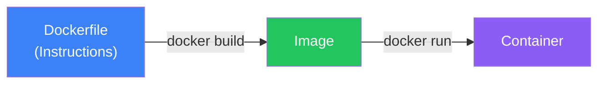
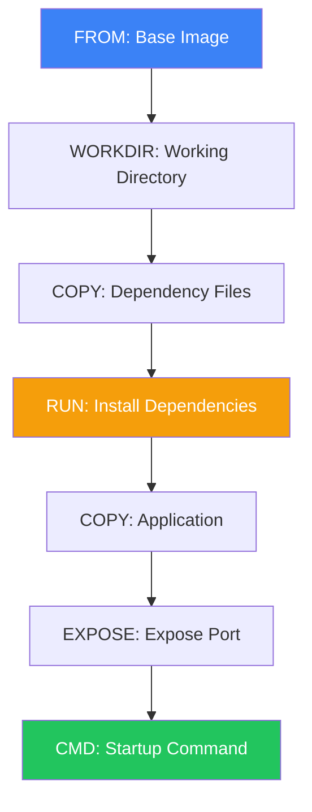
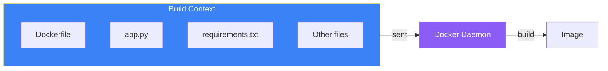

# Day 5: Creating Images with Dockerfiles

## What You'll Learn Today

- What a Dockerfile is
- Basic Dockerfile instructions
- Building images with docker build
- Understanding build context
- Creating practical Dockerfiles

---

## What is a Dockerfile?

A Dockerfile is a **text file containing instructions for building a Docker image**. Like a recipe, it starts with a base image and sequentially describes application setup, dependency installation, and startup commands.



### Why Use Dockerfiles?

| Benefit | Description |
|---------|-------------|
| Reproducibility | Same image can be created from the same Dockerfile every time |
| Version control | Track change history with Git |
| Automation | Integrate into CI/CD pipelines |
| Documentation | Image composition is clearly described |

---

## Basic Dockerfile Structure

```dockerfile
# Specify base image
FROM python:3.11-slim

# Add metadata
LABEL maintainer="your@email.com"

# Set working directory
WORKDIR /app

# Copy files
COPY requirements.txt .

# Run commands
RUN pip install -r requirements.txt

# Copy application
COPY . .

# Expose port
EXPOSE 8000

# Container startup command
CMD ["python", "app.py"]
```

---

## Key Instructions

### FROM - Specify Base Image

Every Dockerfile begins with `FROM`.

```dockerfile
# Use official Python image
FROM python:3.11

# Use slim version
FROM python:3.11-slim

# Use ultra-lightweight Alpine version
FROM python:3.11-alpine

# Pin specific version
FROM python:3.11.7-slim-bookworm
```

### WORKDIR - Set Working Directory

```dockerfile
# Create and move to working directory
WORKDIR /app

# All subsequent instructions run in /app
```

### COPY - Copy Files

Copy files from the host into the image.

```dockerfile
# Copy single file
COPY requirements.txt .

# Copy multiple files
COPY package.json package-lock.json ./

# Copy directory
COPY src/ ./src/

# Copy everything
COPY . .
```

### ADD - Advanced Copy

Similar to `COPY` but with additional features.

```dockerfile
# Download from URL
ADD https://example.com/file.tar.gz /app/

# Auto-extract tar files
ADD archive.tar.gz /app/
```

**Recommendation**: Use `COPY` normally. Use `ADD` only when special features are needed.

### RUN - Execute Commands

Execute commands during image build.

```dockerfile
# Install packages
RUN apt-get update && apt-get install -y curl

# Install Python packages
RUN pip install --no-cache-dir -r requirements.txt

# Combine multiple commands in one RUN (reduces layers)
RUN apt-get update && \
    apt-get install -y --no-install-recommends curl && \
    rm -rf /var/lib/apt/lists/*
```

### CMD - Default Command

Specify the default command when the container starts.

```dockerfile
# exec form (recommended)
CMD ["python", "app.py"]

# shell form
CMD python app.py
```

### ENTRYPOINT - Entry Point

Useful when using the container as a command.

```dockerfile
ENTRYPOINT ["python"]
CMD ["app.py"]
```

```bash
# Run app.py
docker run myapp

# Run different script
docker run myapp other.py
```

### ENV - Environment Variables

```dockerfile
ENV APP_ENV=production
ENV PORT=8000

# Multiple at once
ENV APP_ENV=production \
    PORT=8000
```

### EXPOSE - Expose Ports

```dockerfile
# Expose port 8000 (for documentation)
EXPOSE 8000

# Multiple ports
EXPOSE 80 443
```

**Note**: `EXPOSE` doesn't actually open ports. You need to specify with `docker run -p`.

### ARG - Build-time Arguments

```dockerfile
ARG PYTHON_VERSION=3.11
FROM python:${PYTHON_VERSION}

ARG APP_ENV=production
ENV APP_ENV=${APP_ENV}
```

```bash
# Pass arguments at build time
docker build --build-arg PYTHON_VERSION=3.10 .
```

---

## Instruction Flow



---

## The docker build Command

### Basic Syntax

```bash
docker build [options] path
```

### Basic Usage

```bash
# Build from Dockerfile in current directory
docker build .

# Build with a tag
docker build -t myapp:v1.0 .

# Specify a different Dockerfile
docker build -f Dockerfile.prod -t myapp:prod .
```

### Build Context

The final argument (`.`) in `docker build` is the **build context**.



All files within the build context are sent to the Docker daemon.

### .dockerignore

Exclude unnecessary files from the build context.

```
# .dockerignore
node_modules/
.git/
*.log
.env
__pycache__/
.pytest_cache/
*.pyc
```

---

## Hands-On: Containerize a Python App

### Step 1: Create the Application

```bash
# Create project directory
mkdir myapp && cd myapp
```

**app.py**
```python
from flask import Flask

app = Flask(__name__)

@app.route('/')
def hello():
    return 'Hello from Docker!'

@app.route('/health')
def health():
    return 'OK'

if __name__ == '__main__':
    app.run(host='0.0.0.0', port=8000)
```

**requirements.txt**
```
flask==3.0.0
```

### Step 2: Create the Dockerfile

**Dockerfile**
```dockerfile
# Base image
FROM python:3.11-slim

# Working directory
WORKDIR /app

# Copy dependencies first (cache optimization)
COPY requirements.txt .

# Install dependencies
RUN pip install --no-cache-dir -r requirements.txt

# Copy application
COPY app.py .

# Expose port
EXPOSE 8000

# Startup command
CMD ["python", "app.py"]
```

### Step 3: Build the Image

```bash
docker build -t myapp:v1.0 .
```

Example output:
```
[+] Building 15.2s (10/10) FINISHED
 => [internal] load build definition from Dockerfile
 => [internal] load .dockerignore
 => [internal] load metadata for docker.io/library/python:3.11-slim
 => [1/5] FROM docker.io/library/python:3.11-slim
 => [2/5] WORKDIR /app
 => [3/5] COPY requirements.txt .
 => [4/5] RUN pip install --no-cache-dir -r requirements.txt
 => [5/5] COPY app.py .
 => exporting to image
 => => naming to docker.io/library/myapp:v1.0
```

### Step 4: Run the Container

```bash
docker run -d -p 8000:8000 --name myapp myapp:v1.0
```

### Step 5: Verify

```bash
# Check with browser or curl
curl http://localhost:8000
# Hello from Docker!

curl http://localhost:8000/health
# OK
```

### Step 6: Cleanup

```bash
docker stop myapp
docker rm myapp
```

---

## Build Cache

Docker caches each layer. Unchanged layers are reused.

```mermaid
flowchart TB
    subgraph FirstBuild["First Build"]
        F1["FROM python:3.11-slim"] --> F2["WORKDIR /app"]
        F2 --> F3["COPY requirements.txt"]
        F3 --> F4["RUN pip install"]
        F4 --> F5["COPY app.py"]
    end

    subgraph SecondBuild["Second Build After app.py Change"]
        S1["FROM (cached)"] --> S2["WORKDIR (cached)"]
        S2 --> S3["COPY req (cached)"]
        S3 --> S4["RUN pip (cached)"]
        S4 --> S5["COPY app.py (re-run)"]
    end

    style F4 fill:#f59e0b,color:#fff
    style S4 fill:#22c55e,color:#fff
    style S5 fill:#f59e0b,color:#fff
```



**Important**: Place less frequently changed items at the top and more frequently changed items at the bottom to maximize cache utilization.

---

## Hands-On: Containerize a Node.js App

### package.json
```json
{
  "name": "node-docker",
  "version": "1.0.0",
  "main": "index.js",
  "scripts": {
    "start": "node index.js"
  },
  "dependencies": {
    "express": "^4.18.2"
  }
}
```

### index.js
```javascript
const express = require('express');
const app = express();
const port = 3000;

app.get('/', (req, res) => {
  res.send('Hello from Node.js in Docker!');
});

app.listen(port, '0.0.0.0', () => {
  console.log(`App listening on port ${port}`);
});
```

### Dockerfile
```dockerfile
FROM node:20-slim

WORKDIR /app

# Copy package.json and package-lock.json
COPY package*.json ./

# Install dependencies
RUN npm ci --only=production

# Copy application
COPY index.js .

EXPOSE 3000

CMD ["npm", "start"]
```

### Build and Run
```bash
docker build -t node-app:v1.0 .
docker run -d -p 3000:3000 --name node-app node-app:v1.0
curl http://localhost:3000
```

---

## Summary

| Instruction | Description |
|-------------|-------------|
| `FROM` | Specify base image |
| `WORKDIR` | Set working directory |
| `COPY` | Copy files into image |
| `RUN` | Execute commands at build time |
| `ENV` | Set environment variables |
| `EXPOSE` | Declare exposed ports |
| `CMD` | Specify default startup command |
| `ENTRYPOINT` | Set entry point |

### Key Points

1. `FROM` must always be first
2. Place less frequently changed items at the top to leverage caching
3. Use `.dockerignore` to exclude unnecessary files
4. Combine `RUN` commands to reduce layers
5. Consider `slim` or `alpine` bases for production

---

## Practice Problems

### Problem 1: Create a Dockerfile
Create a Dockerfile with these requirements:
- Python 3.11-slim base
- `/app` as working directory
- Copy `requirements.txt` and install packages
- Copy all files
- Expose port 5000
- Start with `python main.py`

### Problem 2: Understanding Instructions
Explain the difference between `COPY` and `ADD`. When should you use `ADD`?

### Challenge Problem
Create an Nginx container that serves static HTML:

1. Create an `index.html` file (content is up to you)
2. Use `nginx:alpine` as the base in your Dockerfile
3. Copy `index.html` to `/usr/share/nginx/html/`
4. Build and run, verify in browser

---

## References

- [Dockerfile Reference](https://docs.docker.com/reference/dockerfile/)
- [Dockerfile Best Practices](https://docs.docker.com/develop/develop-images/dockerfile_best-practices/)
- [docker build Reference](https://docs.docker.com/reference/cli/docker/image/build/)

---

**Next Up**: In Day 6, we'll learn about "Containers and Data Persistence." You'll master how to persist container data using volumes and bind mounts.
