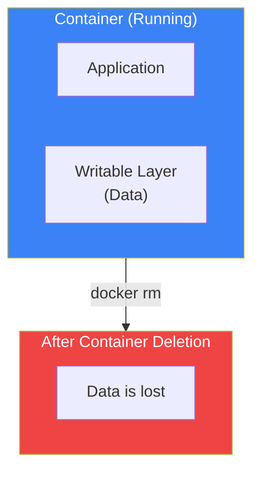
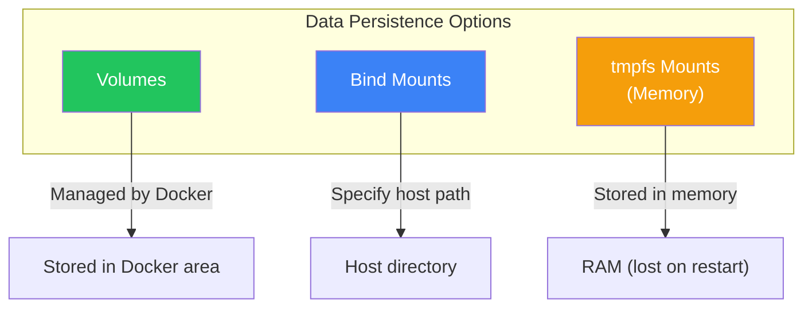
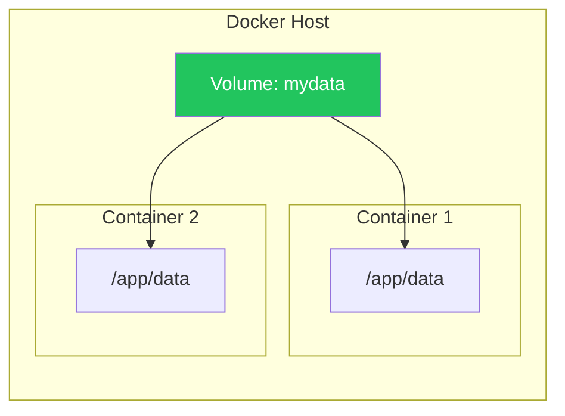
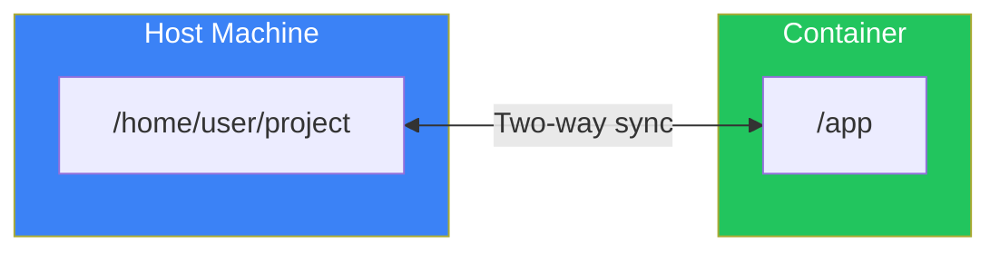
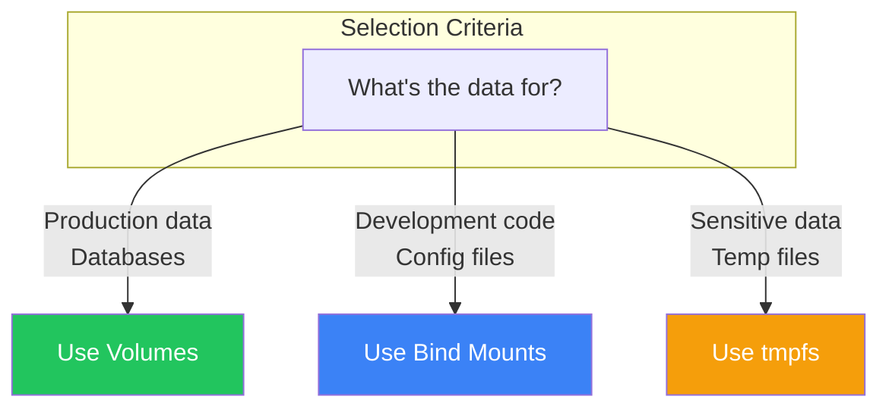

# Day 6: Containers and Data Persistence

## What You'll Learn Today

- The problem of data loss in containers
- Using Volumes
- Using Bind Mounts
- Data management best practices

---

## Container Data is Ephemeral by Default

When you delete a container, its data is deleted along with it. This is by design.



### Experiment: Confirm Data Loss

```bash
# Create a file in a container
docker run -it --name test-data ubuntu bash
root@abc123:/# echo "Important data" > /data.txt
root@abc123:/# exit

# Delete the container
docker rm test-data

# Start a new container with the same image
docker run -it ubuntu bash
root@def456:/# cat /data.txt
cat: /data.txt: No such file or directory
```

The data is gone.

---

## Data Persistence Options

There are three main ways to persist data in Docker.



| Method | Description | Use Case |
|--------|-------------|----------|
| **Volumes** | Storage managed by Docker | Databases, persistent data |
| **Bind Mounts** | Mount host directory | Code sharing during development |
| **tmpfs** | Temporary storage in memory | Sensitive data, temporary files |

---

## Volumes

Volumes are Docker's recommended method for data persistence.

### Volume Characteristics

- Fully managed by Docker
- Isolated from host filesystem
- Easy to backup and migrate
- Can be shared by multiple containers

### Creating a Volume

```bash
# Create a volume
docker volume create mydata

# List volumes
docker volume ls
```

Output:
```
DRIVER    VOLUME NAME
local     mydata
```

### Inspect a Volume

```bash
docker volume inspect mydata
```

Output:
```json
[
    {
        "CreatedAt": "2025-01-21T10:00:00Z",
        "Driver": "local",
        "Labels": {},
        "Mountpoint": "/var/lib/docker/volumes/mydata/_data",
        "Name": "mydata",
        "Options": {},
        "Scope": "local"
    }
]
```

### Mount a Volume to a Container

```bash
# -v option (short form)
docker run -d -v mydata:/app/data --name app1 nginx

# --mount option (verbose form)
docker run -d \
  --mount type=volume,source=mydata,target=/app/data \
  --name app2 nginx
```



### Hands-On: Persist Data with Volumes

```bash
# Create a volume
docker volume create testdata

# Write data in a container
docker run -it -v testdata:/data --name writer ubuntu bash
root@abc123:/# echo "Persisted data" > /data/message.txt
root@abc123:/# exit

# Delete the container
docker rm writer

# Verify data in a new container
docker run -it -v testdata:/data --name reader ubuntu bash
root@def456:/# cat /data/message.txt
Persisted data
```

The data remains.

---

## Bind Mounts

Mount a host machine directory into the container.

### Bind Mount Characteristics

- Specify host path directly
- Ideal for code sharing during development
- Host and container reference the same files
- Good performance (especially on Linux)

### Using Bind Mounts

```bash
# -v option (short form)
docker run -d -v /path/on/host:/path/in/container nginx

# --mount option (verbose form)
docker run -d \
  --mount type=bind,source=/path/on/host,target=/path/in/container \
  nginx
```

### Development Environment Example

```bash
# Mount current directory into container
docker run -d \
  -v $(pwd):/app \
  -w /app \
  -p 3000:3000 \
  node:20 npm start
```



### Hands-On: Set Up a Development Environment

```bash
# Create project directory
mkdir myproject && cd myproject

# Create index.html
echo '<h1>Hello from Bind Mount!</h1>' > index.html

# Mount with Nginx container
docker run -d \
  -v $(pwd):/usr/share/nginx/html:ro \
  -p 8080:80 \
  --name web nginx

# Verify in browser
curl http://localhost:8080
```

Edit the file and the changes are immediately reflected in the container:

```bash
# Update file
echo '<h1>Updated Content!</h1>' > index.html

# Changes are reflected
curl http://localhost:8080
```

### Read-Only Mount

```bash
# Add :ro for read-only
docker run -d -v $(pwd):/app:ro nginx
```

---

## Volumes vs Bind Mounts

| Feature | Volumes | Bind Mounts |
|---------|---------|-------------|
| Managed by | Docker | User |
| Location | Docker area | Any host path |
| Backup | Possible with Docker commands | Manual |
| Multi-container sharing | Easy | Possible |
| Production | Recommended | Not recommended |
| Development | Usable | Recommended |



---

## Volume Management Commands

### List Volumes

```bash
docker volume ls
```

### Inspect Volume

```bash
docker volume inspect volume-name
```

### Remove Volume

```bash
# Remove a single volume
docker volume rm mydata

# Remove all unused volumes
docker volume prune
```

### Backup a Volume

```bash
# Backup volume contents to a tar file
docker run --rm \
  -v mydata:/data \
  -v $(pwd):/backup \
  ubuntu tar cvf /backup/mydata-backup.tar /data
```

### Restore a Volume

```bash
# Restore from tar file to volume
docker run --rm \
  -v mydata:/data \
  -v $(pwd):/backup \
  ubuntu bash -c "cd / && tar xvf /backup/mydata-backup.tar"
```

---

## Hands-On: Persist MySQL Data

### Step 1: Create Volume

```bash
docker volume create mysql-data
```

### Step 2: Start MySQL Container

```bash
docker run -d \
  --name mysql \
  -e MYSQL_ROOT_PASSWORD=mypassword \
  -e MYSQL_DATABASE=mydb \
  -v mysql-data:/var/lib/mysql \
  -p 3306:3306 \
  mysql:8
```

### Step 3: Create Data

```bash
# Connect to MySQL
docker exec -it mysql mysql -uroot -pmypassword mydb

# Create table and data
mysql> CREATE TABLE users (id INT PRIMARY KEY, name VARCHAR(100));
mysql> INSERT INTO users VALUES (1, 'Alice'), (2, 'Bob');
mysql> SELECT * FROM users;
mysql> exit
```

### Step 4: Delete and Recreate Container

```bash
# Stop and delete container
docker stop mysql
docker rm mysql

# Start new container with same volume
docker run -d \
  --name mysql-new \
  -e MYSQL_ROOT_PASSWORD=mypassword \
  -v mysql-data:/var/lib/mysql \
  mysql:8

# Verify data remains
docker exec -it mysql-new mysql -uroot -pmypassword mydb -e "SELECT * FROM users"
```

The data persists.

---

## Anonymous Volumes

Volumes can be created without names.

```bash
# Anonymous volume is auto-created
docker run -d -v /data nginx
```

The `VOLUME` instruction in a Dockerfile also creates anonymous volumes:

```dockerfile
VOLUME /var/lib/mysql
```

**Note**: Anonymous volumes are difficult to manage. Named volumes are recommended for production.

---

## Summary

| Command | Description |
|---------|-------------|
| `docker volume create` | Create a volume |
| `docker volume ls` | List volumes |
| `docker volume inspect` | Show volume details |
| `docker volume rm` | Remove a volume |
| `docker volume prune` | Remove unused volumes |
| `-v name:/path` | Mount a volume |
| `-v /host:/container` | Bind mount |

### Key Points

1. Container data is ephemeral by default
2. Volumes are Docker's recommended persistence method
3. Bind mounts are ideal for development code sharing
4. Use named volumes in production
5. Volumes can be shared by multiple containers

---

## Practice Problems

### Problem 1: Volume Basics
Execute the following:
1. Create a volume named `practice-vol`
2. Start an Ubuntu container with the volume mounted at `/data`
3. Write text to `/data/test.txt`
4. Delete the container
5. Mount the same volume in a new container and verify the data remains

### Problem 2: Using Bind Mounts
Create an HTML file and bind mount it to an Nginx container. Edit the file and verify that changes are immediately reflected.

### Challenge Problem
Create a configuration to persist PostgreSQL container data:
- A volume for data
- A bind mount for initialization scripts (`/docker-entrypoint-initdb.d/`)
- Environment variables for username and password

---

## References

- [Docker Volumes Overview](https://docs.docker.com/engine/storage/volumes/)
- [Bind Mounts](https://docs.docker.com/engine/storage/bind-mounts/)
- [Data Management Best Practices](https://docs.docker.com/develop/develop-images/dockerfile_best-practices/#volume)

---

**Next Up**: In Day 7, we'll learn about "Docker Networking." You'll understand how containers communicate and how port mapping works.
