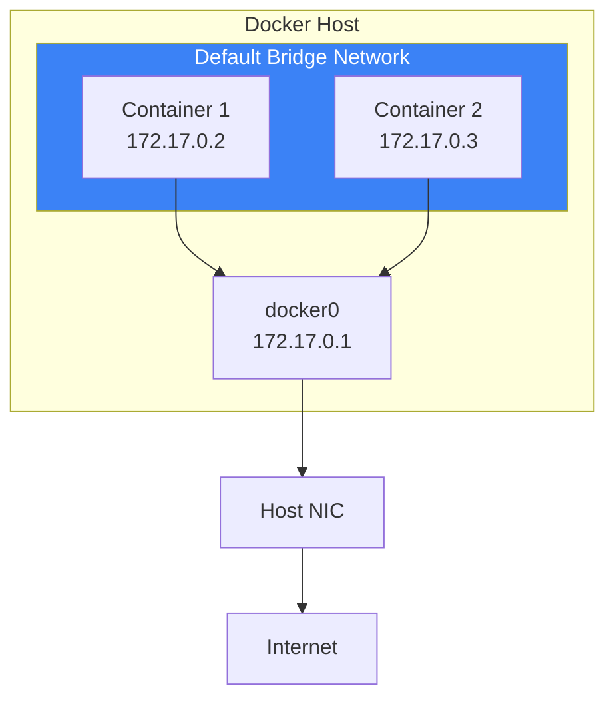
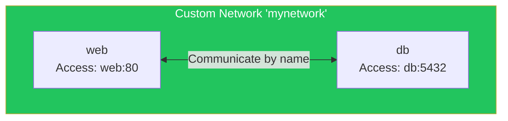
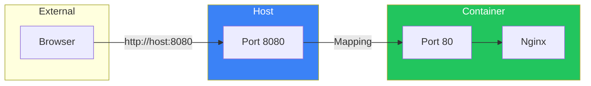
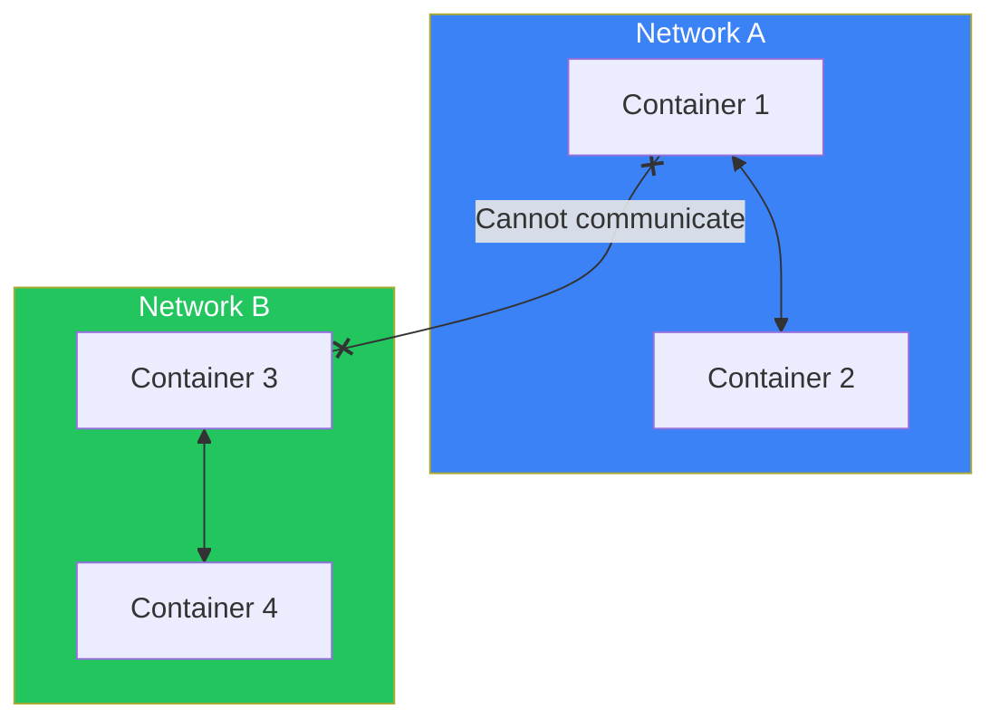
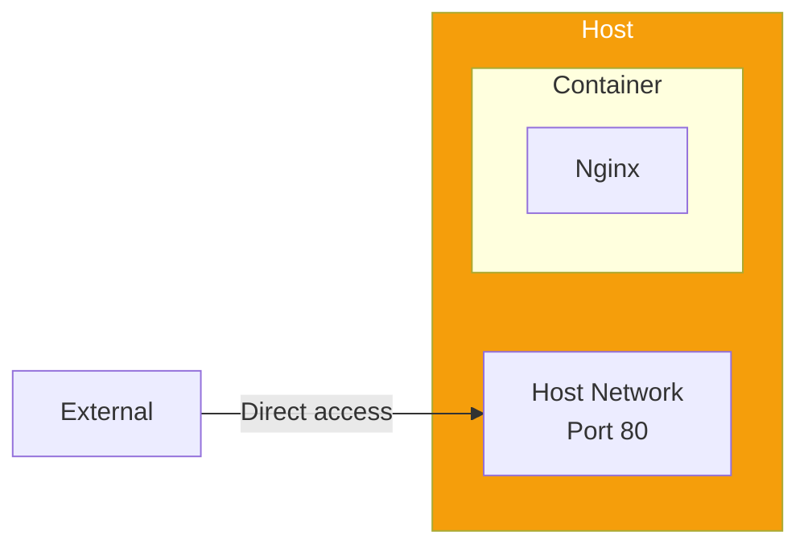
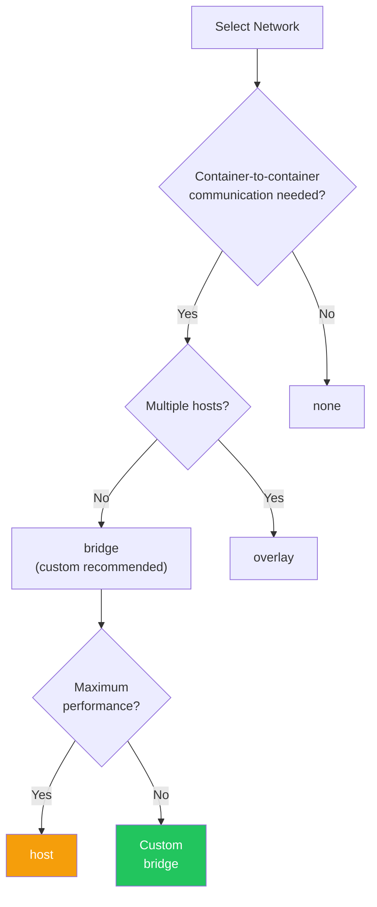

# Day 7: Docker Networking

## What You'll Learn Today

- Docker network fundamentals
- Bridge networks
- Port mapping
- Container-to-container communication
- Creating custom networks

---

## Docker Networking Overview

Docker has its own networking capabilities. Containers connect to virtual networks and can communicate with other containers, the host, and the outside world.



### Network Drivers

Docker has multiple network drivers.

| Driver | Description | Use Case |
|--------|-------------|----------|
| **bridge** | Default. Connects via virtual bridge | Container communication on single host |
| **host** | Uses host's network directly | Maximum performance needed |
| **none** | No networking | Completely isolated containers |
| **overlay** | Network across multiple hosts | Swarm mode |

---

## Viewing Networks

### List Existing Networks

```bash
docker network ls
```

Output:
```
NETWORK ID     NAME      DRIVER    SCOPE
abc123def456   bridge    bridge    local
def456ghi789   host      host      local
ghi789jkl012   none      null      local
```

### Network Details

```bash
docker network inspect bridge
```

You can see container IP addresses and configuration.

---

## Bridge Networks

### Default Bridge Network

All containers connect to the `bridge` network by default.

```bash
# Start a container
docker run -d --name web nginx

# Check IP address
docker inspect web | grep IPAddress
```

### Default Bridge Limitations

| Limitation | Description |
|------------|-------------|
| No name resolution | Can't access by container name |
| All containers share network | No isolation |
| Legacy feature | New features not added |

---

## Custom Bridge Networks

Custom bridge networks are recommended for production.

### Creating a Custom Network

```bash
docker network create mynetwork
```

### Custom Network Benefits



| Benefit | Description |
|---------|-------------|
| **DNS resolution** | Communicate by container name |
| **Isolation** | Different networks can't communicate |
| **Dynamic connect/disconnect** | Change networks without restart |
| **Environment variable sharing** | Communicate without `--link` |

### Starting Containers on Custom Network

```bash
# Create network
docker network create app-network

# Start containers on the network
docker run -d --name web --network app-network nginx
docker run -d --name db --network app-network postgres:16

# Access db from web container
docker exec web ping db
```

---

## Port Mapping (Port Publishing)

Expose container ports to the host for external access.

### Basic Syntax

```bash
# host-port:container-port
docker run -d -p 8080:80 nginx

# Use random host port
docker run -d -p 80 nginx

# Bind to specific interface
docker run -d -p 127.0.0.1:8080:80 nginx
```



### Checking Published Ports

```bash
# Check ports of running containers
docker ps

# Check port mapping for specific container
docker port container-name
```

### Publishing Multiple Ports

```bash
docker run -d \
  -p 80:80 \
  -p 443:443 \
  nginx
```

---

## Container-to-Container Communication

### Within the Same Network

Containers in the same custom network can communicate by container name.

```bash
# Create network
docker network create backend

# Start Redis container
docker run -d --name redis --network backend redis:7

# Start app container
docker run -d --name app --network backend python:3.11 sleep infinity

# Connect from app to redis
docker exec app ping redis
```

### Between Different Networks

Containers on different networks cannot communicate directly.



### Connecting Containers to Multiple Networks

```bash
# Connect existing container to additional network
docker network connect another-network container-name

# Disconnect from network
docker network disconnect another-network container-name
```

---

## Host Network

Container uses the host's network directly.

```bash
docker run -d --network host nginx
```



| Feature | Description |
|---------|-------------|
| Performance | Fast, no network translation |
| No port mapping needed | Uses host ports directly |
| No isolation | Depends on host network config |
| Linux only | Limited on macOS/Windows |

---

## None Network

Completely disable networking.

```bash
docker run -d --network none nginx
```

Use when you need a completely isolated container.

---

## Hands-On: Web App and Database

Build a typical web application configuration.

### Step 1: Create Dedicated Network

```bash
docker network create webapp-network
```

### Step 2: Start Database Container

```bash
docker run -d \
  --name db \
  --network webapp-network \
  -e POSTGRES_USER=app \
  -e POSTGRES_PASSWORD=secret \
  -e POSTGRES_DB=myapp \
  postgres:16
```

### Step 3: Start Web App Container

```bash
# Simple test with Nginx
docker run -d \
  --name web \
  --network webapp-network \
  -p 8080:80 \
  -e DATABASE_HOST=db \
  -e DATABASE_PORT=5432 \
  nginx
```

### Step 4: Verify Connection

```bash
# Verify web can connect to db
docker exec web apt-get update && docker exec web apt-get install -y postgresql-client
docker exec web pg_isready -h db -U app
```

### Step 5: Cleanup

```bash
docker stop web db
docker rm web db
docker network rm webapp-network
```

---

## Network Management Commands

### List

```bash
docker network ls
```

### Create

```bash
# Basic creation
docker network create mynet

# Specify subnet
docker network create --subnet=172.20.0.0/16 mynet

# Specify IP range
docker network create \
  --subnet=172.20.0.0/16 \
  --ip-range=172.20.240.0/20 \
  mynet
```

### Inspect

```bash
docker network inspect mynet
```

### Remove

```bash
# Remove single network
docker network rm mynet

# Remove all unused networks
docker network prune
```

### Connect/Disconnect Containers

```bash
# Connect
docker network connect mynet container-name

# Disconnect
docker network disconnect mynet container-name
```

---

## Network Selection Guide



---

## Summary

| Command | Description |
|---------|-------------|
| `docker network ls` | List networks |
| `docker network create` | Create network |
| `docker network inspect` | Show network details |
| `docker network rm` | Remove network |
| `docker network connect` | Connect container to network |
| `docker network disconnect` | Disconnect container from network |
| `-p host:container` | Port mapping |
| `--network name` | Specify network |

### Key Points

1. Custom bridge networks enable name resolution
2. Prefer custom networks over default bridge
3. Use `-p` to map to host ports for external access
4. Same network containers communicate by name
5. Different networks are isolated

---

## Practice Problems

### Problem 1: Create and Connect Networks
Execute the following:
1. Create a network named `myapp-net`
2. Start a `redis` container on that network
3. Start an `app` container on the same network
4. Ping `redis` from `app` to verify communication

### Problem 2: Port Mapping
Start an Nginx container with these requirements:
- Map host port 3000 to container port 80
- Only accessible from localhost

### Challenge Problem
Build the following configuration:
- Two networks: `frontend-net` and `backend-net`
- `web` container connected to both networks
- `api` container on `backend-net` only
- `db` container on `backend-net` only
- Only `web`'s port 80 accessible from outside

---

## References

- [Docker Network Overview](https://docs.docker.com/engine/network/)
- [Bridge Networks](https://docs.docker.com/engine/network/drivers/bridge/)
- [Container-to-Container Communication](https://docs.docker.com/engine/network/tutorials/standalone/)

---

**Next Up**: In Day 8, we'll learn about "Managing Multiple Containers with Docker Compose." You'll master how to define and manage multiple containers with a single configuration file.
